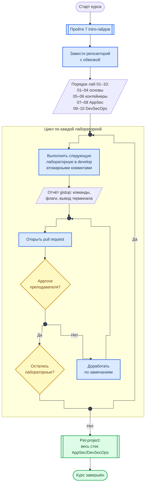

<div align="center">
<a href="https://github.com/geminishkv/course_labs">

</a>
</div>

<div align="center">


</div>

Практический курс по прикладной безопасности приложений: от `Git` до полноценного DevSecOps-конвейера.

**Что изучаем:**

* **Инфраструктура:** `Git`, `CI/CD`, `Docker`, `Docker Compose`, `GitHub Actions`, `YAML`
* **Языки:** `Python`, `Shell` (`Java` и `Go` — в контексте SCA и анализа зависимостей)
* **AppSec инструменты:** `Semgrep`, `Checkov`, `Bandit`, `OWASP Dependency-Check`, `Trivy`, `Docker Bench`, `OWASP ZAP`, `Gitleaks`, `TruffleHog`, `Hadolint`
* **Стандарты:** OWASP Top 10, CIS Docker Benchmark, CVSS, ISO 27005, NIST SP 800-30, PCI DSS, ГОСТ 57580
* **Анализ рисков:** оценка, приоритизация, стратегии снижения рисков ИБ

**Как устроен курс:**

* 7 intro-руководств + 10 лабораторных работ + итоговый pet-project + 7 тестов (5 базовых + 2 лекционных)
* Каждая лабораторная — отдельный репозиторий с исходным кодом и отчётом в формате `gistup`
* Все работы выполняются в ветке `develop` → `pull request` → [approve](https://docs.github.com/en/pull-requests/collaborating-with-pull-requests/proposing-changes-to-your-work-with-pull-requests/requesting-a-pull-request-review) от [geminishkv](https://github.com/geminishkv)
* Прогрессия: `Git` → `Linux` → `Nmap` → `Risk Analysis` → `Docker` → `CIS Benchmark` → `SAST/SCA` → `DAST` → `CI/CD` → `Итоговый Risk Analysis` → `Pet-project`

**Замечания:**

* Лабораторные обязательны для всех — вне зависимости от уровня подготовки
* Каждая работа разбивается на атомарные коммиты для трекинга изменений
* Отчёт сдаётся индивидуально с защитой: каждая команда — с описанием флагов и выводом из терминала
* В отчётах — вывод из консоли, не скриншоты
* Часть инструментов требует установки дополнительных `open-source` пакетов

### Этапы

1. Выполнить подготовительные инструкции:
    * [Подготовка рабочего окружения](labs/intro/vmbox_tutorial.md) — VirtualBox, установка Linux, что учесть на Windows
    * [Настройка Git, GPG и GitHub CLI](labs/intro/git_setup.md) — git config, SSH, GnuPG, gh
    * [Оформление отчётов gistup](labs/intro/gistup_guide.md) — формат, структура, правила
    * [Введение в сети и TCP/IP](labs/intro/networking_basics.md) — OSI, порты, DNS, HTTP
    * [Основы Docker](labs/intro/docker_basics.md) — VM vs Container, Dockerfile, Compose
    * [Введение в CI/CD](labs/intro/cicd_basics.md) — GitHub Actions, workflow, секреты
    * [Установка AppSec-инструментов](labs/intro/appsec_tools_setup.md) — Semgrep, Trivy, ZAP, Gitleaks, Checkov
2. Каждый репозиторий должен содержать `.gitignore`, `CODE_OF_CONDUCT`, `CONTRIBUTING`, `LICENSE`, `NOTICE`, `SECURITY`
3. Выполнить лабораторные работы по порядку:

-  [ ] lab01 — [Git: окружение и первый коммит](labs/basic/lab01/README.md)
-  [ ] lab02 — [Linux: права доступа и процессы](labs/basic/lab02/README.md)
-  [ ] lab03 — [Nmap: сканирование сети и NSE](labs/basic/lab03/README.md)
-  [ ] lab04 — [Анализ и снижение рисков ИБ](labs/basic/lab04/README.md)
-  [ ] lab05 — [Docker: образы и контейнеры](labs/basic/lab05/README.md)
-  [ ] lab06 — [Docker CIS Benchmark и Trivy](labs/basic/lab06/README.md)
-  [ ] lab07 — [SAST, SCA и поиск секретов](labs/basic/lab07/README.md)
-  [ ] lab08 — [DAST: OWASP ZAP](labs/basic/lab08/README.md)
-  [ ] lab09 — [DevSecOps CI/CD на GitHub Actions](labs/basic/lab09/README.md)
-  [ ] lab10 — [Итоговая оценка рисков ИБ](labs/basic/lab10/README.md)

4. Реализовать итоговую работу:

-  [ ] pet_project — [Индивидуальный проект: полный стек AppSec/DevSecOps](labs/pet_project/README.md)

***

### Карта



***

### Формализованные требования

- Единый стиль кода
- Все функции по работе с деревом должны находиться в пространстве имен
- Оформление `README.md` в соответствии с содержанием проекта
- Оформление `.gitignore` в соответствии с содержанием проекта
- Оформление `.dockerignore` в соответствии с содержанием проекта
- Использовать подходящий тип `LICENSE` для проекта и `NOTICE`
- Создать и использовать скрипты для автоматизации сборки проекта, примеров, тестов, пакетирования
- Обеспечить непрерывный процесс сборки проекта с использованием сервиса `GitHub Actions`
- Написать документацию к проекту с использованием инструмента **doxygen**
- Обеспечить размещение пакета проекта на сервисе `GitHub Release` при успешном слияние ветки `develop`
- Рефакторинг и поддержка лабораторных работ в процессной деятельности
- Все команды выполняться строго из `терминала/ консоли` без использования `WebUI` за исключениям работы с токенами, ключами и специфичными настройками

***

### Tutorial

* Подготовка окружения

```bash
$ uv sync --frozen            # .venv из uv.lock (pyproject.toml — единственный источник версий)
$ uv run mkdocs serve --livereload
# or
$ uv run mkdocs serve -a 0.0.0.0:8000   # открыть с телефона по IP ноутбука
```

* Проверки как в CI (каждая команда запускается локально теми же версиями, что в `uv.lock` / `package-lock.json`)

```bash
$ uv run mkdocs build --strict                          # сборка с предупреждениями как ошибками
$ uv run --frozen --only-group lint yamllint --no-warnings .github/workflows mkdocs.yml
$ .github/scripts/pip-audit.sh                          # pip-audit по экспорту лока
$ .github/scripts/sbom.sh                               # CycloneDX SBOM рантайм-набора (как на шаге релиза)
$ uv run --frozen --only-group sast bandit -r labs -ll  # + исключения см. ci.yml
$ npm ci && npx stylelint "docs/stylesheets/**/*.css" && npx eslint docs/javascripts/
$ npx markdownlint-cli2 "docs/**/*.md" "labs/**/*.md" README.md
```

* Схемы — блоки кода `mermaid` прямо в Markdown: сайт рендерит их через Material, GitHub — сам. Оформление по ГОСТ 19.701-90: `flowchart TB`, ортогональные линии, развилки и слияния через точку. Проверка синтаксиса локально (скопируйте блок в файл `.mmd`):

```bash
$ npx --yes @mermaid-js/mermaid-cli@11.17.0 -i schema.mmd -o /tmp/schema.svg
```

* Mermaid на сайте свой: CSP (`script-src`: `'self'`, Telegram, Метрика) не пускает unpkg, поэтому Material не может взять его оттуда. Файл `docs/artifacts/vendor/mermaid/11.17.2/mermaid.min.js` (npm `mermaid@11.17.2`, MIT, sha256 `581ed7d74bd9048d0e3a91363927d72ef22942d7722546b27f7cc29e35390eb8`) подключается из `overrides/main.html` только на страницах со схемами. Обновление: положить `dist/mermaid.min.js` новой версии в каталог с её номером, сверить sha256 с опубликованным пакетом и поменять путь в `main.html`.

* Очистка локального репозитория

```bash
$ rm -rf __pycache__ scripts/__pycache__
$ rm -rf .venv
$ lsof -i :8000
$ kill <PID>
```

* Release — версия в `pyproject.toml` и `package.json`, запись в `RELEASE_NOTES.md`, подписанный тег;
  `release-from-notes.yml` по тегу собирает релиз из записи и прикладывает SBOM

```bash
$ git tag -s vX.Y.Z -m "vX.Y.Z"
$ git push origin vX.Y.Z

$ git tag -d vX.Y.Z                    # удалить локальный тег
$ git push --delete origin vX.Y.Z      # удалить тот же тег на GitHub
```

***

### Архитектура сайта

**Контент.** Исходники лаб, intro и тестов живут в `labs/`, страницы сайта в `docs/` подключают их через
`include-markdown`; `docs/glossary.md` не страница, а список аббревиатур, который `pymdownx.snippets`
дописывает к каждой странице (тултипы). `docs/overrides/` и `glossary.md` исключены из сборки (`exclude_docs`).
`docs/materials/index.md` собирает материалы в карточки разделов, лабы ссылаются на них из See-also.

**Шаблоны.** `overrides/main.html` — общий `<head>` (CSP-meta, `fonts.css`, JSON-LD; Метрики в шаблоне нет,
её после согласия подключает `banners.js`) и свой Mermaid на страницах со схемами. `partials/copyright.html` —
строка футера со ссылкой на уведомление об ответственности в политике конфиденциальности. `overrides/home.html` —
главная без сайдбаров (`hide: [navigation, toc]`), подключает `home.css`. `partials/header.html` — шапка
в стиле gpages поверх Material 9.7.x: логотип с кольцом, пилюли разделов с активным состоянием, штатный
поиск и бургер; ссылки от корня сайта, потому что instant navigation не подменяет шапку.

**Навигация.** Одно меню: пилюли шапки переключают разделы, левый сайдбар (`navigation.tabs`) показывает
только текущий раздел, панель табов Material не рендерится; в шторке на телефоне всё дерево. Страницы без
раздела («О проекте», релизы, политики) идут во всю ширину.

**CSS.** Порядок каскада задан `extra_css`: `fonts.css` (Roboto, Roboto Mono, Unbounded из `artifacts/fonts/`,
woff2 по unicode-range, OFL; внешних шрифтов нет, `font-src 'self'`) → `tokens.css` (палитра gpages, `--ink-*`, токены Material) →
`header.css` → `sidebar.css` → `typeset.css` (типографика, код, списки, сетка 88rem; грузится после `header.css`,
поэтому шапка снимает кап `.md-grid` селектором из обоих классов) → `components.css`
(hero, нумерованные заголовки, таблицы, карточки лаб, футер) → `banners.css`. `home.css` подключается
только главной (`css_files` плагина minify → `home.min.css`) и может переопределять токены на `body`.
Адаптив главной ярусами 1600 / 1220 / 960 / 700 px; всё в rem, чтобы масштабироваться с корневым шрифтом
Material. `!important` только в print. Значения `@property` не нулевые (`360deg`): минификатор превращает
`0deg` в `0` и молча отбрасывает регистрацию.

**JS.** Четыре модуля без зависимостей: `header.js` (стекло шапки при скролле), `typewriter-target.js`
(hero, уважает `prefers-reduced-motion`), `banners.js` (карточка согласия, класс `ata-consent`, чтобы
антибаннеры не резали; Метрика грузится только после «Принять», выбор хранится 180 дней в `ata_consent`,
сменить его можно со страницы политики; текст уведомления об ответственности — раздел `privacy.md#notice`,
а не плашка поверх страницы), `effects.js` (появление hero и карточек лаб, живой конвейер, имена
landmark-навигаций, которые Material оставляет безымянными). Интерактивные элементы на тач-экранах не меньше 44 px.
Статистику репозитория в шторке рисует сам Material. Всё подписано на `document$` для instant navigation.

**Сборка и зависимости.** `pyproject.toml` + `uv.lock` (хэши), группы инструментов CI (`lint`, `audit`,
`sast`, `sbom`). `hooks.py` считает цифры hero из дерева `docs/` и дописывает sitemap. CI ставит всё через
`uv sync --frozen`, сканеры из лока, hadolint с проверкой sha256. Dependabot: actions / npm / uv, cooldown 7 дней.
Релиз (`release-from-notes.yml`, тег `v*.*.*`) берёт текст из `RELEASE_NOTES.md` и прикладывает CycloneDX SBOM
рантайм-набора из лока (`.github/scripts/sbom.sh`).

***

### Структура

```
├── docs/                              # MkDocs source (обёртки + материалы)
│   ├── index.md                       # Главная: hero, бейджи, о курсе, конвейер лаб с материалами, требования, материалы
│   ├── about.md                       # О проекте
│   ├── privacy.md                     # Политика конфиденциальности
│   ├── Security.md                    # Политика безопасности
│   ├── RELEASE_NOTES.md               # Релизы
│   ├── glossary.md                    # 40 аббревиатур AppSec (тултипы через snippets)
│   ├── robots.txt                     # Robots + AI-bot blocking
│   ├── llms.txt                       # Описание для AI-поисковиков
│   ├── turbo-feed.xml                 # Яндекс.Турбо RSS
│   ├── CNAME                          # course.geminishkv.tech
│   ├── _headers                       # HTTP-заголовки безопасности для хостинга с поддержкой _headers
│   ├── labs/
│   │   ├── intro/                     # 7 docs-обёрток intro
│   │   ├── basic/lab01-10.md          # 10 docs-обёрток лабораторных
│   │   ├── pet_project.md             # Итоговый проект
│   │   └── tests/
│   │       ├── basic/                 # 5 вариантов базовых тестов
│   │       └── lectures/              # 2 варианта теста Fintech
│   ├── materials/
│   │   ├── index.md                   # Индекс материалов: карточки разделов
│   │   ├── lectures/fintech_ru.md     # Лекция Fintech по-русски
│   │   ├── examples/                  # 5 кейсов ИБ
│   │   ├── OWASPTOP10/               # 7 OWASP материалов
│   │   ├── cheatsheet/               # 9 шпаргалок
│   │   ├── ports.md                   # Справочник портов
│   │   ├── appsec_tt.md              # 29 классов инструментов
│   │   ├── licenses.md               # 32 карточки лицензий
│   │   ├── APPENDIX.md               # Команды и утилиты
│   │   └── troubleshooting.md        # FAQ (56 карточек)
│   ├── stylesheets/                   # fonts → tokens → header → sidebar → typeset → components → banners; home.css только на главной
│   ├── javascripts/                   # header (стекло), typewriter-target, banners (согласие на Метрику), effects (fade-in, конвейер, landmarks)
│   ├── overrides/                     # main.html (head: CSP, шрифты, JSON-LD; Mermaid на страницах со схемами), home.html, 404.html, partials/header.html, partials/copyright.html
│   └── artifacts/
│       ├── assets/                    # логотипы (SVG, PNG 512), favicon (ICO, PNG 16/32, apple-touch-icon)
│       ├── vendor/mermaid/11.17.2/    # Mermaid для схем (MIT), грузится только на страницах со схемами
│       ├── exmpls/                    # иллюстрация к кейсу анализа рисков
│       └── fonts/                     # Roboto, Roboto Mono, Unbounded (woff2 + OFL)
├── labs/
│   ├── intro/                         # 7 intro-руководств (исходники; Linux, macOS и Windows)
│   ├── basic/lab01-10/               # 10 лабораторных (README + код; у части — docker-compose)
│   ├── pet_project/                   # Итоговый проект
│   └── tests/
│       ├── basic/                     # 5 базовых тестов (исходники)
│       └── lectures/ru_fintech/       # 2 варианта теста Fintech (исходники)
├── .github/
│   ├── workflows/ci.yml               # yamllint + markdownlint, eslint + stylelint → pip-audit → bandit / hadolint → build (на PR — артефакт site-preview) → deploy
│   ├── workflows/release-from-notes.yml # релиз из RELEASE_NOTES.md по тегу v*.*.* + CycloneDX SBOM
│   ├── scripts/pip-audit.sh           # аудит экспорта лока, одинаково в CI и локально
│   ├── scripts/sbom.sh                # SBOM рантайм-набора из лока (шаг релиза)
│   ├── dependabot.yml                 # actions / npm / uv, cooldown 7 дней
│   └── CODEOWNERS                     # ревью workflow и конфигов CI
├── hooks.py                           # цифры hero при сборке + sitemap (priority, changefreq)
├── mkdocs.yml
├── pyproject.toml                     # зависимости сайта и группы инструментов CI
├── uv.lock                            # лок с хэшами, ставится через uv sync --frozen
├── package.json / package-lock.json   # линтеры docs: stylelint, eslint, markdownlint-cli2
├── eslint.config.js, stylelint.config.cjs, .markdownlint.yaml, .yamllint   # конфиги линтеров
├── .gitattributes                     # jar / war / ear / class — binary в diff и merge
├── .gitleaksignore                    # fingerprint учебного токена лабы 07 для pre-commit с gitleaks
├── CODE_OF_CONDUCT.md, CONTRIBUTING.md, LICENSE.md, NOTICE.md, SECURITY.md
└── RELEASE_NOTES.md
```
