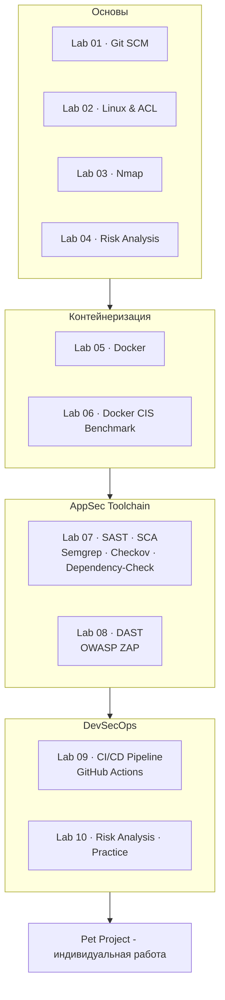

<div align="center">
<a href="https://github.com/geminishkv/course_labs">

</a>
</div>

<div align="center">


</div>

<br>Салют :wave:,</br>
Отмечу основные моменты:

*  Цель - сформировать навыки работы с `git`, `CI`, `CD`, `docker`, `packages`, `appsec toolchain`, `yml`, etc. 
*  *Часть работ базируется на на `Go`, `Python`, `JAVA`, `Shell` и и.д.
*  Рассматриваются инструменты `SAST`, `SCA`, `Container Security`, `DAST`, `Secret Detection`, etc. 
*  Работы направлены на углубление и изучение материалов анализа рисков и оценки защищенности приложений, которые необходимы для итерационной разработки, также дают дополнительно возможности для изучения паттернов программирования, прототипирования
*  Каждый мини проект должен будет собран по формату из представленных лабораторных работ и размещен на сервисе `GitHub`, с формирование соответствующего отчета в виде `gistup` для демонстрации выполненной работы и скриншотами результатов (**где это требуется**). 
*  Для каждой лабораторной работы следует создавать собственный репозиторий (возможно использование `fork` с родительского), в котором необходимо разместить исходный код проекта, далее составить отчет к нему в формате `gistup`. 
*  Все лабораторные работы должны быть выполнены в ветке develop и необходимо cделать [approve](https://docs.github.com/en/pull-requests/collaborating-with-pull-requests/proposing-changes-to-your-work-with-pull-requests/requesting-a-pull-request-review) по `pull request` на [geminishkv](https://github.com/geminishkv), тем самым будет финально подтверждаться согласование изменений и правок, которые были внесены удаленно 


**Замечание:** 
* Лабораторные работы - обязательны к прохождению, сдаче и итерационной разработке, при любом уровне подготовки
* Необходимо скопировать этапы реализации и отмечать у себя именно те, которые были сделаны
* Каждая работа изначально должна итерационно разбиваться на коммиты изменений для их отслеживания
* Каждый отчет сдается индивидуально с защитой, каждая используемая команда должна иметь описание (пояснение) в отчете `gistup` и содержать вывод из терминала с пояснением команды в консоли
* В лабораторных рассматривается также использование инструментов требующих установки дополнительных пакетов open-source
* Для всех отчетов следует избегать скриншотов и делать со вставками вывода из консоли и описания используемых команд, флагов и что они означают для понимания принципа их работы

<div align="center"><h2>Stay tuned ;)</h3></div> 

### Этапы
    
1. Ознакомление с учебными материалами по [лекциям](artifacts/ppt/)
2. Ознакомиться с [примерами](artifacts/exmpls/)
3. Каждый репозиторий должен содержать `.gitignore`, `code of condact`, `contributing`, `license`, `notice`, `security` и должен быть адаптирован под конкретную лабораторную работу, проект.
    * **Обратите внимание**, что тип лицензий должен быть подобран правильно при переиспользовании материалов проекта и следует ознакомиться с ними дополнительно.
    * Пример отчета [тут](https://gist.github.com/MishaBary/21ab63f83292a86268e039d484a86411)
4. Выполнить следующие работы порядково:

-  [ ] lab01 - [Лабораторная работа посвящена изучению **gitscm** и подготовительными материалами для последующих работ](labs/lab01/README.md)
    -  Материалы для работы [тут](labs/lab01/)
-  [ ] lab02 - [Лабораторная работа посвящена изучению работы *nix, контролей прав доступа, оперированию процессов](labs/lab02/README.md)
    -  Материалы для работы [тут](labs/lab02/)
-  [ ] lab03 - [Лабораторная работа посвящена изучению **nmap** и анализа выявленных уязвимостей](labs/lab03/README.md)
    -  Материалы для работы [тут](labs/lab03/)
-  [ ] lab04 - [Данная лабораторная работа посвящена практическому **анализу и определению мер** снижения рисков ИБ](labs/lab04/README.md)
-  [ ] lab05 - [Данная лабораторная работа посвящена изучению **Docker** и как с ним работать](labs/lab05/README.md)
    -  Материалы для работы [тут](labs/lab05/)
-  [ ] lab06 - [Данная лабораторная работа посвящена изучению **Docker CIS Benchmark** для выявления уязвимостей, проверки Docker-host и как с ним работать](labs/lab06/README.md)
    -  Материалы для работы [тут](labs/lab06/)
-  [ ] lab07 - [Данная лабораторная работа посвящена изучению SAST, SCA для выявления уязвимостей и как с ним работать на примере Semgrep, Checkov, Dependency Check](labs/lab07/README.md)
    -  Материалы для работы [тут](labs/lab07/)
-  [ ] lab 08 - [Данная лабораторная работа посвящена изучению DAST OWASP ZAP и ручного тестирования уязвимого приложения](labs/lab08/README.md)
    -  Материалы для работы [тут](labs/lab08/)
-  [ ] lab 09 - [Данная лабораторная работа посвящена построению DevSecOps CI/CD конвейера на GitHub Actions и встраиванию инструментов безопасности](labs/lab09/README.md)
    -  Материалы для работы [тут](labs/lab09/)
-  [ ] lab 10 - [Данная лабораторная работа посвящена оценке анализов рисков ИБ и отработке практических знаний](labs/lab10/README.md)

5. Реализовать итоговую работу и составить отчет

-  [ ] pet_project - [Индивидуальный проект: тема согласовывается с преподавателем, применяется весь стек AppSec/DevSecOps инструментов](labs/pet_project/README.md)

***

### Карта



***

### Формализованные требования 

- Единый стиль кода
- Все функции по работе с деревом должны находиться в пространстве имен
- Оформление `README.md` в соответствии с содержанием проекта
- Оформление `.gitignore` в соответствии с содержанием проекта
- Оформление `.dockerignore` в соответствии с содержанием проекта
- Использовать подходящий тип `LICENSE` для проекта и `NOTICE`
- Создать и использовать скрипты для автоматизации сборки проекта, примеров, тестов, пакетирования
- Обеспечить непрерывный процесс сборки проекта с использованием сервиса `GitHub Actions`
- Написать документацию к проекту с использованием инструмента **doxygen**
- Обеспечить размещение пакета проекта на сервисе `GitHub Release` при успешном слияние ветки `develop`
- Рефакторинг и поддержка лабораторных работ в процессной деятельности
- Все команды выполняться строго из `терминала/ консоли` без использования `WebUI` за исключениям работы с токенами, ключами и специфичными настройками

***

### Tutorial

* Подготовка окружения

```bash
$ python3 -m venv .venv
$ source .venv/bin/activate
$ pip install -r requirements.txt
$ python -m mkdocs serve --livereload
# or
$ mkdocs serve -a 127.0.0.1:8001 # прямое обозначение адреса
```

* Очистка локального репозитория

```bash
$ rm -rf __pycache__ scripts/__pycache__  # etc.
$ rm -rf .venv
$ lsof -i :8000
$ kill <PID>
```

* Release

```bash
$ git tag -a v1.0.0 -m "v1.0.0"
$ git push origin v1.0.0

$ git tag -d v0.1.0                    # удалить локальный тег
$ git push origin :refs/tags/v0.1.0   # удалить тот же тег на GitHub
```

***

### Структура репозитория

```
├── assets
│   └── logotype
│       ├── logo.jpg
│       └── logo2.jpg
├── CODE_OF_CONDUCT.md
├── CONTRIBUTING.md
├── docs
│   ├── about.md
│   ├── APPENDIX.md
│   ├── appsec_tt.md
│   ├── artifacts
│   │   ├── assets
│   │   │   ├── favicon.ico
│   │   │   ├── logo.png
│   │   │   └── logotypemd.jpg
│   │   ├── cheatsheet
│   │   │   ├── CHEATSHEET_DOCKER.md
│   │   │   ├── CHEATSHEET_DOCKERIGNORE.md
│   │   │   ├── CHEATSHEET_GH_CLI.md
│   │   │   ├── CHEATSHEET_GIT.md
│   │   │   └── CHEATSHEET_GITIGNORE.md
│   │   ├── exmpls
│   │   │   ├── risk-analysis.png
│   │   │   ├── table1.png
│   │   │   └── transaction.png
│   │   ├── owasp
│   │   │   ├── Authentication.pdf
│   │   │   ├── Authorization.pdf
│   │   │   ├── Client-side_Attacks.pdf
│   │   │   ├── Command_Execution.pdf
│   │   │   ├── Information_Disclosure.pdf
│   │   │   ├── Logical_Attacks.pdf
│   │   │   └── OWASP_Top_10_CICD_Risks.pdf
│   │   └── ppt
│   │       └── Лекция_Управление Рисками ИБ_intro.pdf
│   ├── channel.md
│   ├── index.md
│   ├── javascripts
│   │   ├── custom-title.js
│   │   └── typewriter-target.js
│   ├── labs
│   │   ├── lab01.md
│   │   ├── lab02.md
│   │   ├── lab03.md
│   │   ├── lab04.md
│   │   ├── lab05.md
│   │   ├── lab06.md
│   │   ├── lab07.md
│   │   ├── lab08.md
│   │   ├── lab09.md
│   │   ├── lab10.md
│   │   └── pet_project.md
│   ├── licenses.md
│   ├── materials
│   │   ├── examples
│   │   │   ├── exmpl.md
│   │   │   ├── Multisignature.md
│   │   │   ├── PrintNightmare.md
│   │   │   └── RA.md
│   │   └── OWASPTOP10
│   │       ├── Authentication.md
│   │       ├── Authorization.md
│   │       ├── Client-side Attacks.md
│   │       ├── Command Execution.md
│   │       ├── Information Disclosure.md
│   │       ├── Logical Attacks.md
│   │       └── OWASP_Top_10_CICD_Risks.md
│   ├── RELEASE_NOTES.md
│   ├── robots.txt
│   ├── Security.md
│   └── stylesheets
│       ├── burger.css
│       ├── clipboard.css
│       ├── footer.css
│       ├── header.css
│       ├── layout.css
│       ├── mobile-logo.css
│       ├── search.css
│       ├── sidebar.css
│       ├── tools-overlay.css
│       └── typeset.css
├── eslint.config.js
├── labs
│   ├── lab01
│   │   ├── README.md
│   │   └── typersteel.py
│   ├── lab02
│   │   ├── exmpl_hello.py
│   │   ├── pygamesteel.py
│   │   └── README.md
│   ├── lab03
│   │   ├── exmp_targets.txt
│   │   └── README.md
│   ├── lab04
│   │   └── README.md
│   ├── lab05
│   │   ├── client
│   │   │   ├── client.py
│   │   │   ├── Dockerfile
│   │   │   └── requirements.txt
│   │   ├── docker-compose.yml
│   │   ├── README.md
│   │   ├── server
│   │   │   ├── app.py
│   │   │   ├── Dockerfile
│   │   │   └── requirements.txt
│   │   └── source
│   │       ├── Dockerfile
│   │       ├── hello.py
│   │       ├── image.tar
│   │       └── requirements.txt
│   ├── lab06
│   │   ├── audit_reports
│   │   ├── audit.sh
│   │   ├── config
│   │   │   └── nginx.conf
│   │   ├── docker-compose.yml
│   │   ├── README.md
│   │   └── vulnerable-app.yml
│   ├── lab07
│   │   ├── cheat_check_yuorself.sh
│   │   ├── docker-compose.yml
│   │   ├── README.md
│   │   ├── sast
│   │   │   ├── checkov-config.yaml
│   │   │   └── semgrep-rules.yml
│   │   ├── sca
│   │   │   ├── dependency-check.sh
│   │   │   └── pom.xml
│   │   └── vulnerable-app
│   │       ├── app.py
│   │       ├── config.yaml
│   │       ├── Dockerfile
│   │       └── requirements.txt
│   ├── lab08
│   │   ├── dast
│   │   │   ├── convert_reports.py
│   │   │   ├── reports
│   │   │   ├── zap_scan.sh
│   │   │   └── zap-baseline.conf
│   │   ├── docker-compose.yml
│   │   ├── README.md
│   │   ├── requirements.txt
│   │   └── vulnerable-app
│   │       ├── app.py
│   │       ├── Dockerfile
│   │       ├── files
│   │       │   └── secret.txt
│   │       └── requirements.txt
│   ├── lab09
│   │   └── README.md
│   ├── lab10
│   │   └── README.md
│   └── pet_project
│       └── README.md
├── LICENSE.md
├── mkdocs.yml
├── mypy.ini
├── NOTICE.md
├── README.md
├── RELEASE_NOTES.md
├── requirements.txt
├── ruff.toml
├──  scripts
│   └── generate_sitemap.py
├── SECURITY.md
├── sitemap.xml
└── stylelint.config.cjs
```

***

Copyright (c) 2026 Elijah S Shmakov


