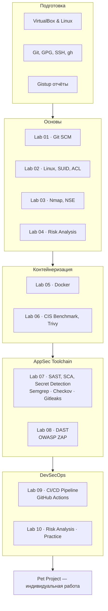

<div align="center">
<a href="https://github.com/geminishkv/course_labs">

</a>
</div>

<div align="center">


</div>

Практический курс по прикладной безопасности приложений: от `Git` до полноценного DevSecOps-конвейера.

**Что изучаем:**

* **Инфраструктура:** `Git`, `CI/CD`, `Docker`, `Docker Compose`, `GitHub Actions`, `YAML`
* **Языки:** `Python`, `Shell` (`Java` и `Go` — в контексте SCA и анализа зависимостей)
* **AppSec инструменты:** `Semgrep`, `Checkov`, `OWASP Dependency-Check`, `Trivy`, `OWASP ZAP`, `Gitleaks`
* **Стандарты:** OWASP Top 10, CIS Benchmarks, CVSS, ISO 27005
* **Анализ рисков:** оценка, приоритизация, стратегии снижения рисков ИБ

**Как устроен курс:**

* 10 лабораторных работ + итоговый pet-project
* Каждая лабораторная — отдельный репозиторий с исходным кодом и отчётом в формате `gistup`
* Все работы выполняются в ветке `develop` → `pull request` → [approve](https://docs.github.com/en/pull-requests/collaborating-with-pull-requests/proposing-changes-to-your-work-with-pull-requests/requesting-a-pull-request-review) от [geminishkv](https://github.com/geminishkv)
* Прогрессия: `Git` → `Linux` → `Nmap` → `Docker` → `CIS Benchmark` → `SAST/SCA` → `DAST` → `Secret Detection` → `CI/CD` → `Risk Analysis`

**Замечания:**

* Лабораторные обязательны для всех — вне зависимости от уровня подготовки
* Каждая работа разбивается на атомарные коммиты для трекинга изменений
* Отчёт сдаётся индивидуально с защитой: каждая команда — с описанием флагов и выводом из терминала
* В отчётах — вывод из консоли, не скриншоты
* Часть инструментов требует установки дополнительных `open-source` пакетов 

### Этапы

1. Выполнить подготовительные инструкции:
    * [Подготовка рабочего окружения](labs/intro/vmbox_tutorial.md) — VirtualBox, установка Linux
    * [Настройка Git, GPG и GitHub CLI](labs/intro/git_setup.md) — git config, SSH, GnuPG, gh
    * [Оформление отчётов Gistup](labs/intro/gistup_guide.md) — формат, структура, правила
2. Каждый репозиторий должен содержать `.gitignore`, `CODE_OF_CONDUCT`, `CONTRIBUTING`, `LICENSE`, `NOTICE`, `SECURITY`
3. Выполнить лабораторные работы по порядку:

-  [ ] lab01 — [GitSCM — подготовка рабочего окружения](labs/basic/lab01/README.md)
-  [ ] lab02 — [*nix — права доступа, SUID, ACL, процессы](labs/basic/lab02/README.md)
-  [ ] lab03 — [Nmap — сканирование сети, NSE и защита результатов](labs/basic/lab03/README.md)
-  [ ] lab04 — [Анализ и определение мер снижения рисков ИБ](labs/basic/lab04/README.md)
-  [ ] lab05 — [Docker — контейнеризация приложений](labs/basic/lab05/README.md)
-  [ ] lab06 — [Docker CIS Benchmark и Trivy](labs/basic/lab06/README.md)
-  [ ] lab07 — [SAST, SCA и Secret Detection](labs/basic/lab07/README.md)
-  [ ] lab08 — [DAST — OWASP ZAP и ручное тестирование](labs/basic/lab08/README.md)
-  [ ] lab09 — [DevSecOps CI/CD конвейер на GitHub Actions](labs/basic/lab09/README.md)
-  [ ] lab10 — [Оценка анализа рисков ИБ — практика](labs/basic/lab10/README.md)

4. Реализовать итоговую работу:

-  [ ] pet_project — [Индивидуальный проект: полный стек AppSec/DevSecOps](labs/pet_project/README.md)

***

### Карта



***

### Формализованные требования 

- Единый стиль кода
- Все функции по работе с деревом должны находиться в пространстве имен
- Оформление `README.md` в соответствии с содержанием проекта
- Оформление `.gitignore` в соответствии с содержанием проекта
- Оформление `.dockerignore` в соответствии с содержанием проекта
- Использовать подходящий тип `LICENSE` для проекта и `NOTICE`
- Создать и использовать скрипты для автоматизации сборки проекта, примеров, тестов, пакетирования
- Обеспечить непрерывный процесс сборки проекта с использованием сервиса `GitHub Actions`
- Написать документацию к проекту с использованием инструмента **doxygen**
- Обеспечить размещение пакета проекта на сервисе `GitHub Release` при успешном слияние ветки `develop`
- Рефакторинг и поддержка лабораторных работ в процессной деятельности
- Все команды выполняться строго из `терминала/ консоли` без использования `WebUI` за исключениям работы с токенами, ключами и специфичными настройками

***

### Tutorial

* Подготовка окружения

```bash
$ python3 -m venv .venv
$ source .venv/bin/activate
$ pip install -r requirements.txt
$ python -m mkdocs serve --livereload
# or
$ mkdocs serve -a 127.0.0.1:8001 # прямое обозначение адреса
```

* Очистка локального репозитория

```bash
$ rm -rf __pycache__ scripts/__pycache__  # etc.
$ rm -rf .venv
$ lsof -i :8000
$ kill <PID>
```

* Release

```bash
$ git tag -a v1.0.0 -m "v1.0.0"
$ git push origin v1.0.0

$ git tag -d v0.1.0                    # удалить локальный тег
$ git push origin :refs/tags/v0.1.0   # удалить тот же тег на GitHub
```

***

### Структура

```
├── docs/                          # MkDocs source
│   ├── index.md                   # Главная
│   ├── licenses.md                # 41 лицензия
│   ├── appsec_tt.md               # 29 классов инструментов
│   ├── APPENDIX.md                # Команды и утилиты
│   ├── troubleshooting.md         # FAQ
│   ├── glossary.md                # 39 аббревиатур
│   ├── labs/
│   │   ├── intro/                 # vmbox, git_setup, gistup
│   │   ├── basic/                 # lab01-10
│   │   └── pet_project.md
│   ├── materials/                 # Примеры, OWASP Top 10
│   ├── artifacts/                 # CheatSheets, PDF, assets
│   ├── stylesheets/               # CSS (tokens, layout, ...)
│   ├── javascripts/               # JS
│   └── overrides/                 # main.html, 404.html
├── labs/
│   ├── intro/                     # vmbox, git_setup, gistup
│   ├── basic/                     # lab01-10
│   └── pet_project/
├── .github/workflows/
│   ├── ci.yml                     # Lint → Audit → Build → Deploy
│   └── release-from-notes.yml
├── hooks.py                       # Sitemap enrichment
├── mkdocs.yml
├── requirements.txt
└── RELEASE_NOTES.md
```

<!-- legacy tree below kept for reference -->
<!-- ```
├── assets
│   └── logotype
│       ├── logo.jpg
│       └── logo2.jpg
├── CODE_OF_CONDUCT.md
├── CONTRIBUTING.md
├── docs
│   ├── about.md
│   ├── APPENDIX.md
│   ├── appsec_tt.md
│   ├── artifacts
│   │   ├── assets
│   │   │   ├── favicon.ico
│   │   │   ├── logo.png
│   │   │   └── logotypemd.jpg
│   │   ├── cheatsheet
│   │   │   ├── CHEATSHEET_DOCKER.md
│   │   │   ├── CHEATSHEET_DOCKERIGNORE.md
│   │   │   ├── CHEATSHEET_GH_CLI.md
│   │   │   ├── CHEATSHEET_GIT.md
│   │   │   └── CHEATSHEET_GITIGNORE.md
│   │   ├── exmpls
│   │   │   ├── risk-analysis.png
│   │   │   ├── table1.png
│   │   │   └── transaction.png
│   │   ├── owasp
│   │   │   ├── Authentication.pdf
│   │   │   ├── Authorization.pdf
│   │   │   ├── Client-side_Attacks.pdf
│   │   │   ├── Command_Execution.pdf
│   │   │   ├── Information_Disclosure.pdf
│   │   │   ├── Logical_Attacks.pdf
│   │   │   └── OWASP_Top_10_CICD_Risks.pdf
│   │   └── ppt
│   │       └── Лекция_Управление Рисками ИБ_intro.pdf
│   ├── channel.md
│   ├── index.md
│   ├── javascripts
│   │   ├── custom-title.js
│   │   └── typewriter-target.js
│   ├── labs
│   │   ├── lab01.md
│   │   ├── lab02.md
│   │   ├── lab03.md
│   │   ├── lab04.md
│   │   ├── lab05.md
│   │   ├── lab06.md
│   │   ├── lab07.md
│   │   ├── lab08.md
│   │   ├── lab09.md
│   │   ├── lab10.md
│   │   └── pet_project.md
│   ├── licenses.md
│   ├── materials
│   │   ├── examples
│   │   │   ├── exmpl.md
│   │   │   ├── Multisignature.md
│   │   │   ├── PrintNightmare.md
│   │   │   └── RA.md
│   │   └── OWASPTOP10
│   │       ├── Authentication.md
│   │       ├── Authorization.md
│   │       ├── Client-side Attacks.md
│   │       ├── Command Execution.md
│   │       ├── Information Disclosure.md
│   │       ├── Logical Attacks.md
│   │       └── OWASP_Top_10_CICD_Risks.md
│   ├── RELEASE_NOTES.md
│   ├── robots.txt
│   ├── Security.md
│   └── stylesheets
│       ├── burger.css
│       ├── clipboard.css
│       ├── footer.css
│       ├── header.css
│       ├── layout.css
│       ├── mobile-logo.css
│       ├── search.css
│       ├── sidebar.css
│       ├── tools-overlay.css
│       └── typeset.css
├── eslint.config.js
├── labs
│   ├── lab01
│   │   ├── README.md
│   │   └── typersteel.py
│   ├── lab02
│   │   ├── exmpl_hello.py
│   │   ├── pygamesteel.py
│   │   └── README.md
│   ├── lab03
│   │   ├── exmp_targets.txt
│   │   └── README.md
│   ├── lab04
│   │   └── README.md
│   ├── lab05
│   │   ├── client
│   │   │   ├── client.py
│   │   │   ├── Dockerfile
│   │   │   └── requirements.txt
│   │   ├── docker-compose.yml
│   │   ├── README.md
│   │   ├── server
│   │   │   ├── app.py
│   │   │   ├── Dockerfile
│   │   │   └── requirements.txt
│   │   └── source
│   │       ├── Dockerfile
│   │       ├── hello.py
│   │       ├── image.tar
│   │       └── requirements.txt
│   ├── lab06
│   │   ├── audit_reports
│   │   ├── audit.sh
│   │   ├── config
│   │   │   └── nginx.conf
│   │   ├── docker-compose.yml
│   │   ├── README.md
│   │   └── vulnerable-app.yml
│   ├── lab07
│   │   ├── cheat_check_yuorself.sh
│   │   ├── docker-compose.yml
│   │   ├── README.md
│   │   ├── sast
│   │   │   ├── checkov-config.yaml
│   │   │   └── semgrep-rules.yml
│   │   ├── sca
│   │   │   ├── dependency-check.sh
│   │   │   └── pom.xml
│   │   └── vulnerable-app
│   │       ├── app.py
│   │       ├── config.yaml
│   │       ├── Dockerfile
│   │       └── requirements.txt
│   ├── lab08
│   │   ├── dast
│   │   │   ├── convert_reports.py
│   │   │   ├── reports
│   │   │   ├── zap_scan.sh
│   │   │   └── zap-baseline.conf
│   │   ├── docker-compose.yml
│   │   ├── README.md
│   │   ├── requirements.txt
│   │   └── vulnerable-app
│   │       ├── app.py
│   │       ├── Dockerfile
│   │       ├── files
│   │       │   └── secret.txt
│   │       └── requirements.txt
│   ├── lab09
│   │   └── README.md
│   ├── lab10
│   │   └── README.md
│   └── pet_project
│       └── README.md
├── LICENSE.md
├── mkdocs.yml
├── mypy.ini
├── NOTICE.md
├── README.md
├── RELEASE_NOTES.md
├── requirements.txt
├── ruff.toml
├──  scripts
│   └── generate_sitemap.py
├── SECURITY.md
├── sitemap.xml
└── stylelint.config.cjs
``` -->
