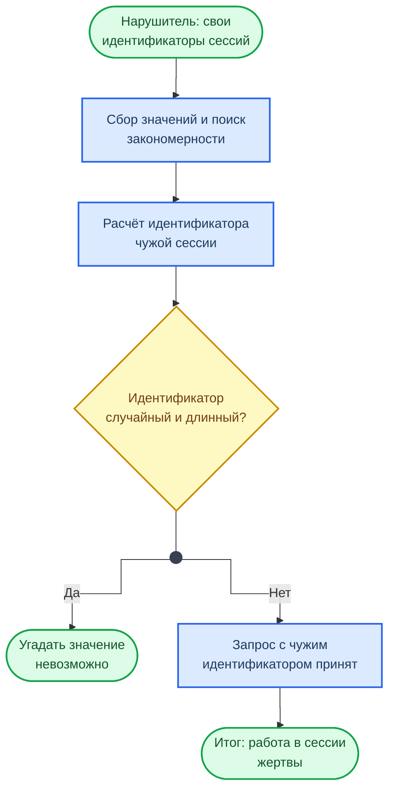
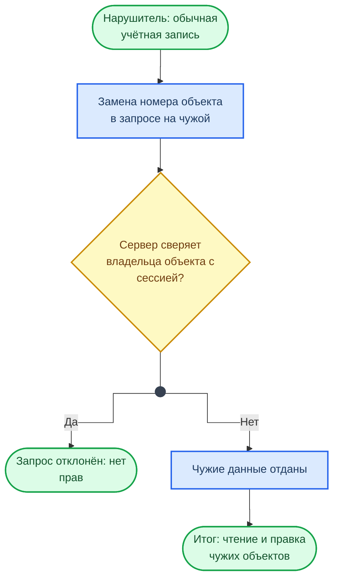
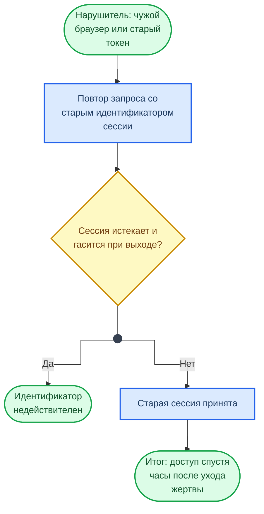
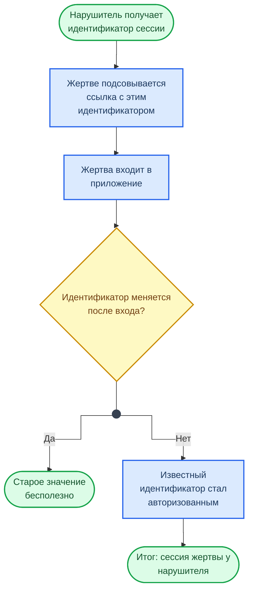

<div class="hero-section hero-section--compact">
  <div class="hero-content">
    <h1 class="hero-title">OWASP — Authorization</h1>
    <p class="hero-sub">Нарушения авторизации · OWASP Top 10</p>
  </div>
</div>

## О документе

Нарушения контроля доступа (Broken Access Control) — наиболее распространённая уязвимость по данным OWASP, занимающая первое место в OWASP Top 10 2021. Уязвимость возникает, когда пользователь может выполнять действия или получать доступ к ресурсам, выходящим за рамки его полномочий.

Основные классы нарушений: IDOR (Insecure Direct Object Reference) — прямой доступ к чужим ресурсам через предсказуемые идентификаторы, вертикальная эскалация привилегий — выполнение функций администратора от имени обычного пользователя, и обход ограничений путём манипуляции HTTP-методами или параметрами запроса.

Материал применяется в [лабораторной работе №8 (DAST с OWASP ZAP)](../../labs/basic/lab08.md) при анализе контроля доступа в уязвимом приложении. Связанные материалы: [Authentication](Authentication.md), [аналитические кейсы ИБ](../examples/exmpl.md), [классификация AppSec-инструментов](../appsec_tt.md).

***

## Как читать схемы на странице

У каждого класса атак есть схема хода атаки. Она читается сверху вниз: с чего начинает нарушитель, какое место приложения он использует и к чему это приводит. Ромб — место, где атаку останавливает защита: ветка «Да» показывает, что происходит при работающей защите, ветка «Нет» — итог при её отсутствии. Схемы описывают ход атаки без полезных нагрузок: примеры и меры защиты разобраны в тексте разделов. Обозначения фигур — в справочнике [Схемы курса](../diagrams_legend.md).

## Содержание документа

Данный раздел посвящен атакам, направленным на методы, которые используются Web-сервером для определения того, имеет ли пользователь, служба или приложение необходимые для совершения действия разрешения. Многие Web-сайты разрешают только определённым пользователям получать доступ к некоторому содержимому или функциям приложения. Доступ другим пользователям должен быть ограничен. Используя различные техники, злоумышленник может повысить свои привилегии и получить доступ к защищённым ресурсам.

### Предсказуемое значение идентификатора сессии (Credential/Session Prediction)

Предсказуемое значение идентификатора сессии позволяет перехватывать сессии других пользователей. Подобные атаки выполняются путем предсказания или угадывания уникального идентификатора сессии пользователя. Эта атака, так же как и перехват сессии (Session Hijacking), в случае успеха позволяет злоумышленнику послать запрос Web-серверу с правами скомпрометированного пользователя.

Как происходит атака и где её останавливает защита:



Дизайн многих серверов предполагает аутентификацию пользователя при первом обращении и дальнейшее отслеживание его сессии. Для этого пользователь указывает комбинацию имени и пароля. Вместо повторной передачи имени пользователя и пароля при каждой транзакции, Web-сервер генерирует уникальный идентификатор, который присваивается сессии пользователя. Последующие запросы пользователя к серверу содержат идентификатор сессии как доказательство того, что аутентификация была успешно пройдена. Если атакующий может предсказать или угадать значение идентификатора другого пользователя, это может быть использовано для проведения атаки.

!!! example "Пример: предсказуемая генерация Session ID"

    Многие серверы генерируют идентификаторы сессий, используя алгоритмы собственной разработки. Подобные алгоритмы могут просто увеличивать значение идентификатора для каждого запроса пользователя. Другой распространенный вариант -- использование функции от текущего времени или других специфичных для компьютера данных.

    Идентификатор сессии сохраняется в cookie, скрытых полях форм или URL. Если атакующий имеет возможность определить алгоритм, используемый для генерации идентификатора сессии, он может выполнить следующие действия:

    1. Подключиться к серверу, используя текущий идентификатор сессии
    2. Вычислить или подобрать следующий идентификатор сессии
    3. Присвоить полученное значение идентификатора cookie/скрытому полю формы/URL

!!! warning "Внимание"

    Инкрементальные или основанные на времени идентификаторы сессий легко предсказуемы. Всегда используйте криптографически стойкий генератор случайных чисел.

=== "Уязвимый код"

    ```javascript
    // Инкрементальный Session ID — легко предсказать следующее значение
    let sessionCounter = 1000;

    app.post("/login", (req, res) => {
      const { username, password } = req.body;

      if (authenticate(username, password)) {
        sessionCounter++;
        const sessionId = `sess-${sessionCounter}`; // sess-1001, sess-1002, ...
        sessions[sessionId] = { username };
        res.cookie("sessionId", sessionId);
        res.json({ message: "Logged in" });
      }
    });
    ```

=== "Защищённый код"

    ```javascript
    import crypto from "node:crypto";

    app.post("/login", (req, res) => {
      const { username, password } = req.body;

      if (authenticate(username, password)) {
        // Криптографически стойкий случайный идентификатор — 128 бит энтропии
        const sessionId = crypto.randomUUID();
        sessions[sessionId] = { username, createdAt: Date.now() };
        res.cookie("sessionId", sessionId, {
          httpOnly: true,
          secure: true,
          sameSite: "strict",
        });
        res.json({ message: "Logged in" });
      }
    });
    ```

!!! info "Ссылки"

    - [OWASP Session Management Cheat Sheet](https://cheatsheetseries.owasp.org/cheatsheets/Session_Management_Cheat_Sheet.html)
    - [OWASP Testing Guide — Session Management](https://owasp.org/www-project-web-security-testing-guide/latest/4-Web_Application_Security_Testing/06-Session_Management_Testing/)

### Недостаточная авторизация (Insufficient Authorization)

Недостаточная авторизация возникает, когда Web-сервер позволяет атакующему получать доступ к важной информации или функциям, доступ к которым должен быть ограничен. То, что пользователь прошел аутентификацию не означает, что он должен получить доступ ко всем функциям и содержимому сервера. Кроме аутентификации должно быть реализовано разграничение доступа.

Как происходит атака и где её останавливает защита:



Процедура авторизации определяет, какие действия может совершать пользователь, служба или приложение. Правильно построенные правила доступа должны ограничивать действия пользователя согласно политике безопасности. Доступ к важным ресурсам сайта должен быть разрешён только администраторам.

!!! example "Пример: IDOR и манипуляция ролями"

    В прошлом многие Web-серверы сохраняли важные ресурсы в «скрытых» директориях, таких как `/admin` или `/log`. Если атакующий запрашивал эти ресурсы напрямую, он получал к ним доступ и мог перенастроить сервер, получить доступ к важной информации либо полностью скомпрометировать систему.

    Некоторые серверы, после аутентификации, сохраняют в cookie или скрытых полях идентификатор «роли» пользователя в рамках Web-приложения. Если разграничение доступа основывается на проверке данного параметра без верификации принадлежности к роли при каждом запросе, злоумышленник может повысить свои привилегии, просто модифицировав значение cookie.

    К примеру, значение cookie:

    ```
    SessionId=12345678;Role=User
    ```

    Заменяется на:

    ```
    SessionId=12345678;Role=Admin
    ```

!!! warning "Внимание"

    Никогда не доверяйте данным, поступающим от клиента (cookie, hidden fields, query params), для принятия решений об авторизации. Роль и привилегии должны определяться на стороне сервера.

=== "Уязвимый код"

    ```javascript
    // IDOR — любой авторизованный пользователь может прочитать чужой профиль
    app.get("/api/users/:id", authenticateToken, (req, res) => {
      // Нет проверки: совпадает ли :id с текущим пользователем
      const user = db.users.findById(req.params.id);
      if (!user) return res.status(404).json({ error: "Not found" });
      res.json(user); // Утечка данных другого пользователя
    });
    ```

=== "Защищённый код"

    ```javascript
    // Проверка владения ресурсом (ownership check)
    app.get("/api/users/:id", authenticateToken, (req, res) => {
      // req.user заполняется middleware из JWT / сессии на сервере
      if (req.params.id !== req.user.id && req.user.role !== "admin") {
        return res.status(403).json({ error: "Forbidden" });
      }

      const user = db.users.findById(req.params.id);
      if (!user) return res.status(404).json({ error: "Not found" });
      res.json(user);
    });
    ```

!!! info "Ссылки"

    - [OWASP Broken Access Control](https://owasp.org/Top10/A01_2021-Broken_Access_Control/)
    - [OWASP Authorization Cheat Sheet](https://cheatsheetseries.owasp.org/cheatsheets/Authorization_Cheat_Sheet.html)
    - [OWASP IDOR Prevention](https://cheatsheetseries.owasp.org/cheatsheets/Insecure_Direct_Object_Reference_Prevention_Cheat_Sheet.html)

### Отсутствие таймаута сессии (Insufficient Session Expiration)

В случае если для идентификатора сессии или учётных данных не предусмотрен таймаут или его значение слишком велико, злоумышленник может воспользоваться старыми данными для авторизации. Это повышает уязвимость сервера для атак, связанных с кражей идентификационных данных.

Как происходит атака и где её останавливает защита:



Поскольку протокол HTTP не предусматривает контроль сессии, Web-серверы обычно используют идентификаторы сессии для определения запросов пользователя. Таким образом, конфиденциальность каждого идентификатора должна быть обеспечена, чтобы предотвратить множественный доступ пользователей с одной учётной записью. Похищенный идентификатор может использоваться для доступа к данным пользователя или осуществления мошеннических транзакций.

Отсутствие таймаута сессии увеличивает вероятность успеха различных атак. К примеру, злоумышленник может получить идентификатор сессии, используя сетевой анализатор или уязвимость типа межсайтовое выполнение сценариев. Хотя таймаут не поможет в случае, если идентификатор будет использован немедленно, ограничение времени действия поможет в случае более поздних попыток использования идентификатора.

В другой ситуации, если пользователь получает доступ к серверу с публичного компьютера (библиотека, Internet-кафе и т.д.) отсутствие таймаута сессии может позволить злоумышленнику воспользоваться историей браузера для просмотра страниц пользователя. Большое значение таймаута увеличивает шансы подбора действующего идентификатора.

!!! example "Пример"

    При использовании публичного компьютера, когда несколько пользователей имеют неограниченный физический доступ к машине, отсутствие таймаута сессии позволяет злоумышленнику просматривать страницы, посещенные другим пользователем. Если функция выхода из системы просто перенаправляет на основную страницу Web-сервера, а не завершает сессию, страницы, посещенные пользователем, могут быть просмотрены злоумышленником. Поскольку идентификатор сессии не был отмечен как недействительный, атакующий получит доступ к страницам сервера без повторной аутентификации.

=== "Уязвимый код"

    ```javascript
    import session from "express-session";

    app.use(
      session({
        secret: "keyboard-cat",
        resave: false,
        saveUninitialized: true,
        // Нет maxAge — сессия живёт бесконечно
        // Нет rolling — таймер не сбрасывается при активности
      })
    );

    // «Выход» просто редиректит, но не уничтожает сессию
    app.get("/logout", (req, res) => {
      res.redirect("/");
    });
    ```

=== "Защищённый код"

    ```javascript
    import session from "express-session";

    app.use(
      session({
        secret: process.env.SESSION_SECRET,
        resave: false,
        saveUninitialized: false,
        rolling: true, // Сброс таймера при каждом запросе
        cookie: {
          maxAge: 15 * 60 * 1000, // 15 минут неактивности
          httpOnly: true,
          secure: true,
          sameSite: "strict",
        },
      })
    );

    // Полноценный logout: уничтожение сессии на сервере
    app.post("/logout", (req, res) => {
      req.session.destroy((err) => {
        if (err) return res.status(500).json({ error: "Logout failed" });
        res.clearCookie("connect.sid");
        res.json({ message: "Logged out" });
      });
    });
    ```

!!! info "Ссылки"

    - [OWASP Session Management Cheat Sheet](https://cheatsheetseries.owasp.org/cheatsheets/Session_Management_Cheat_Sheet.html)

### Фиксация сессии (Session Fixation)

Используя данный класс атак, злоумышленник присваивает идентификатору сессии пользователя заданное значение. В зависимости от функциональных возможностей сервера, существует несколько способов «зафиксировать» значение идентификатора сессии. Для этого могут использоваться атаки типа межсайтовое выполнение сценариев или подготовка сайта с помощью предварительного HTTP-запроса. После фиксации значения идентификатора сессии атакующий ожидает момента, когда пользователь войдет в систему. После входа пользователя, злоумышленник использует идентификатор сессии для получения доступа к системе от имени пользователя.

Как происходит атака и где её останавливает защита:



Можно выделить два типа систем управления сессиями на основе идентификаторов:

- **«Разрешающий»** -- позволяет браузеру указывать любой идентификатор
- **«Строгий»** -- обрабатывает только идентификаторы, сгенерированные сервером

Если используются «разрешающие» системы, злоумышленник может выбрать любой идентификатор сессии. В случае со «строгими» серверами злоумышленнику приходится поддерживать «сессию-заглушку» и периодически соединяться с сервером для избежания закрытия сессии по таймауту.

Без наличия активной защиты от фиксации сессии, эта атака может быть использована против любого сервера, аутентифицирующего пользователей с помощью идентификатора сессии. Большинство Web-серверов сохраняет ID в cookie, но это значение также может присутствовать в URL или скрытом поле формы.

В отличие от кражи идентификатора, фиксация сессии предоставляет злоумышленнику гораздо больший простор для творчества, поскольку активная фаза атаки происходит до входа пользователя в систему.

!!! example "Пример: этапы атаки Session Fixation"

    Атаки, направленные на фиксацию сессии обычно проходят в три этапа:

    **1) Установление сессии.** Злоумышленник устанавливает сессию-заглушку на атакуемом сервере и получает от сервера идентификатор или выбирает произвольный идентификатор. В некоторых случаях сессия-заглушка должна поддерживаться в активном состоянии путем периодических обращений к серверу.

    **2) Фиксация сессии.** Злоумышленник передаёт значение идентификатора сессии-заглушки браузеру пользователя и фиксирует его идентификатор сессии. Это можно сделать, например, установив значение cookie в браузере с помощью XSS.

    **3) Подключение к сессии.** Атакующий ожидает аутентификации пользователя на сервере. После того, как пользователь зашел на сайт, злоумышленник подключается к серверу, используя зафиксированный идентификатор, и получает доступ к сессии пользователя.

!!! warning "Техники фиксации cookie"

    Для фиксации ID сессии могут быть использованы различные техники:

    - **Установка значения cookie с помощью языков сценариев на стороне клиента.** Если уязвимость типа XSS присутствует на любом сервере в домене, злоумышленник получает возможность установить значение cookie на стороне клиента.

        ```
        http://example/<script>document.cookie="sessionid=1234;%20domain=.example.dom";</script>.idc
        ```

    - **Установка значения cookie с помощью тега META.** Техника похожа на предыдущую, но может быть использована, когда предприняты меры против внедрения тегов сценариев.

        ```
        http://example/<meta%20http-equiv=SetCookie%20content="sessionid=1234;%20domain=.example.dom">.idc
        ```

    - **Установка cookie с использованием заголовка ответа HTTP.** Злоумышленник использует атакуемый сервер или любой сервер в домене для того, чтобы установить cookie с идентификатором сессии. Это может быть реализовано различными методами: взлом сервера в домене, подмена значений в кэше DNS-сервера, установка ложного Web-сервера в домене, использование атаки типа расщепление HTTP-ответа (response splitting).

    > Фиксация сессии на продолжительный промежуток времени может быть осуществлена с использованием постоянных cookie (например, со сроком действия 10 лет), которые сохраняются даже после перезагрузки компьютера.

=== "Уязвимый код"

    ```javascript
    import session from "express-session";

    app.use(session({ secret: "s3cret", resave: false, saveUninitialized: true }));

    app.post("/login", (req, res) => {
      const { username, password } = req.body;

      if (authenticate(username, password)) {
        // Session ID НЕ меняется после логина — атакующий знает его заранее
        req.session.user = username;
        req.session.authenticated = true;
        res.json({ message: "Welcome" });
      } else {
        res.status(401).json({ error: "Invalid credentials" });
      }
    });
    ```

=== "Защищённый код"

    ```javascript
    import session from "express-session";

    app.use(
      session({
        secret: process.env.SESSION_SECRET,
        resave: false,
        saveUninitialized: false, // Не создавать сессию до аутентификации
        cookie: { httpOnly: true, secure: true, sameSite: "strict" },
      })
    );

    app.post("/login", (req, res) => {
      const { username, password } = req.body;

      if (authenticate(username, password)) {
        // Регенерация Session ID — старый идентификатор становится недействительным
        req.session.regenerate((err) => {
          if (err) return res.status(500).json({ error: "Session error" });
          req.session.user = username;
          req.session.authenticated = true;
          res.json({ message: "Welcome" });
        });
      } else {
        res.status(401).json({ error: "Invalid credentials" });
      }
    });
    ```

!!! info "Ссылки"

    - [OWASP Session Fixation](https://web.archive.org/web/20260905051457/https://owasp.org/www-community/attacks/Session_fixation)
    - [OWASP Session Management Cheat Sheet](https://cheatsheetseries.owasp.org/cheatsheets/Session_Management_Cheat_Sheet.html)
    - [CWE-384: Session Fixation](https://cwe.mitre.org/data/definitions/384.html)
