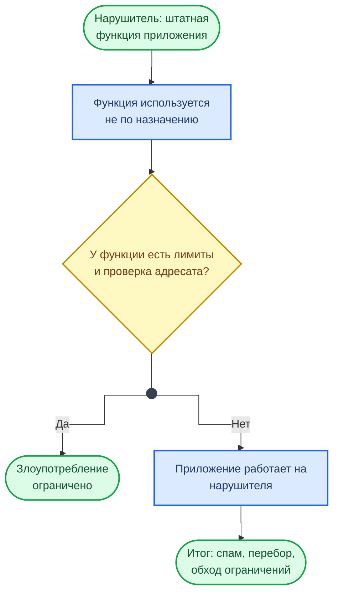
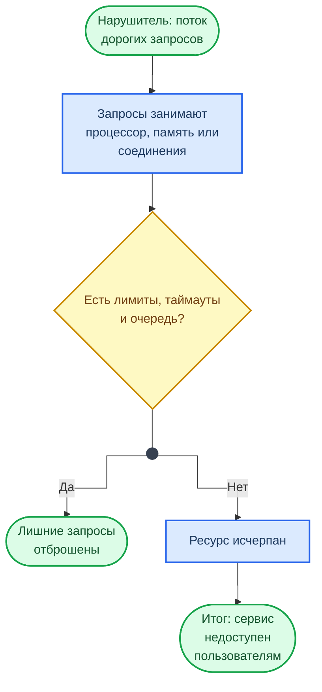
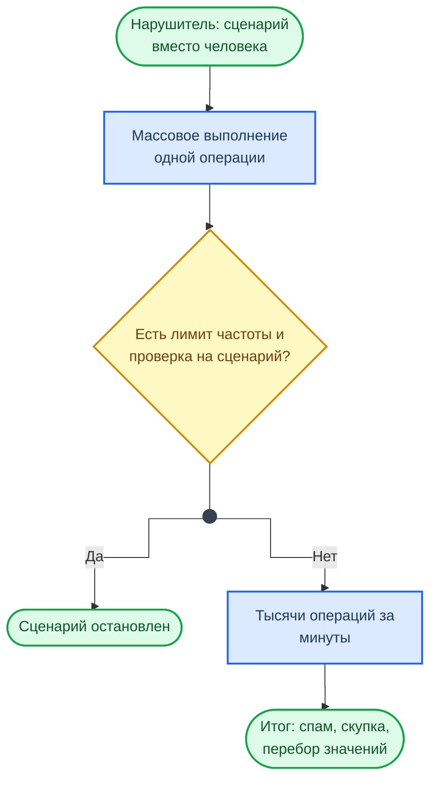
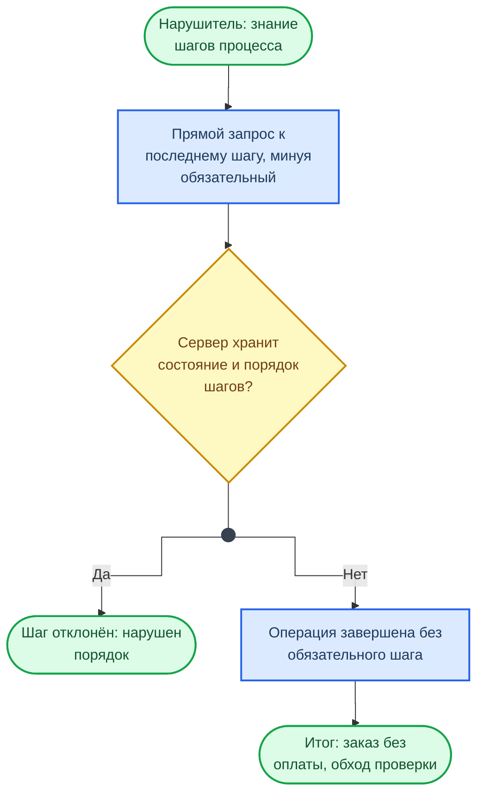
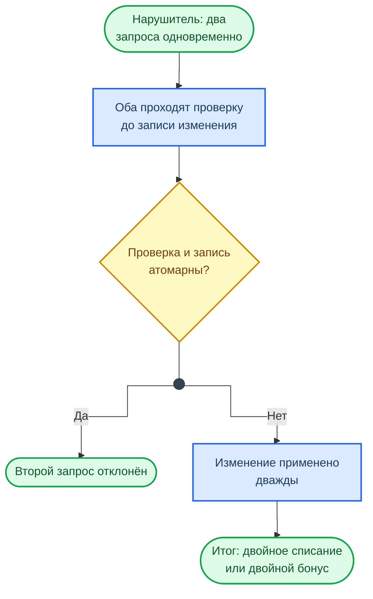

<div class="hero-section hero-section--compact">
  <div class="hero-content">
    <h1 class="hero-title">OWASP — Logical Attacks</h1>
    <p class="hero-sub">Атаки на логику приложения · OWASP Top 10</p>
  </div>
</div>

## О документе

Атаки на бизнес-логику эксплуатируют не технические уязвимости кода, а ошибки в проектировании самого приложения. Сканеры уязвимостей и статические анализаторы не способны их обнаружить — требуется ручное тестирование с пониманием бизнес-процессов. Типичные примеры: обход платёжного потока (переход к шагу подтверждения без оплаты), применение скидки несколько раз, изменение суммы заказа в скрытых полях формы.

Race condition — особая разновидность логических атак: одновременная отправка нескольких запросов на списание баланса или активацию промокода позволяет обойти проверки на уровне приложения, если они не защищены транзакциями БД или распределёнными блокировками.

Материал соотносится с [аналитическими кейсами ИБ](../examples/exmpl.md) и [Risk Analysis](../examples/RA.md), где рассматривается оценка бизнес-рисков. Также применим при работе над [лабораторной работой №4](../../labs/basic/lab04.md) по анализу рисков ИБ.

***

## Как читать схемы на странице

У каждого класса атак есть схема хода атаки. Она читается сверху вниз: с чего начинает нарушитель, какое место приложения он использует и к чему это приводит. Ромб — место, где атаку останавливает защита: ветка «Да» показывает, что происходит при работающей защите, ветка «Нет» — итог при её отсутствии. Схемы описывают ход атаки без полезных нагрузок: примеры и меры защиты разобраны в тексте разделов. Обозначения фигур — в справочнике [Схемы курса](../diagrams_legend.md).

## Содержание документа

Атаки данного класса направлены на эксплуатацию функций приложения или логики его функционирования. Логика приложения представляет собой ожидаемый процесс функционирования программы при выполнении определённых действий. В качестве примеров можно привести восстановление паролей, регистрацию учётных записей, аукционные торги, транзакции в системах электронной коммерции. Приложение может требовать от пользователя корректного выполнения нескольких последовательных действий для выполнения определённой задачи. Злоумышленник может обойти или использовать эти механизмы в своих целях.

### Злоупотребление функциональными возможностями (Abuse of Functionality)

Данные атаки направлены на использование функций Web-приложения с целью обхода механизмов разграничения доступа. Некоторые механизмы Web-приложения, включая функции обеспечения безопасности, могут быть использованы для этих целей. Наличие уязвимости в одном из, возможно, второстепенных компонентов приложения может привести к компрометации всего приложения.

Как происходит атака и где её останавливает защита:



Злоупотребление функциональными возможностями очень часто используется совместно с другими атаками, такими как обратный путь в директориях и т.д. К примеру, при наличии уязвимости типа межсайтовое выполнение сценариев в HTML-чате злоумышленник может использовать функции чата для рассылки URL, эксплуатирующего уязвимость, всем текущим пользователям.

!!! example "Типичные сценарии"

    - Использование функций поиска для получения доступа к файлам за пределами корневой директории Web-сервера
    - Использование функции загрузки файлов на сервер для перезаписи файлов конфигурации или внедрения серверных сценариев
    - Реализация отказа в обслуживании путем использования функции блокировки учётной записи при многократном вводе неправильного пароля

#### Модификация цены в скрытых полях формы

Уязвимость в функции покупки приложения CyberOffice позволяла модифицировать значение цены, передаваемой пользователю в скрытом поле HTML-формы. Страница подтверждения заказа загружалась злоумышленником, модифицировалась на клиенте и передавалась серверу уже с модифицированным значением цены.

=== "Уязвимый код"

    ```javascript
    // Сервер доверяет цене из формы
    app.post("/api/order", (req, res) => {
      const { productId, price, quantity } = req.body;

      // Цена приходит от клиента — можно подменить
      const total = price * quantity;
      db.query("INSERT INTO orders (product_id, total) VALUES (?, ?)",
        [productId, total]);

      res.json({ success: true, total });
    });
    ```

=== "Защищённый код"

    ```javascript
    // Сервер берёт цену из БД, игнорируя клиентское значение
    app.post("/api/order", async (req, res) => {
      const { productId, quantity } = req.body;

      const product = await db.query(
        "SELECT price FROM products WHERE id = ?", [productId]
      );
      if (!product) return res.status(404).json({ error: "Product not found" });

      const total = product.price * quantity;
      await db.query("INSERT INTO orders (product_id, total) VALUES (?, ?)",
        [productId, total]);

      res.json({ success: true, total });
    });
    ```

!!! warning "Правило"

    Никогда не доверяйте данным с клиента для критичных вычислений — цена, скидка, итог должны рассчитываться на сервере.

### Отказ в обслуживании (Denial of Service)

Данный класс атак направлен на нарушение доступности Web-сервера. Обычно атаки, направленные на отказ в обслуживании, реализуются на сетевом уровне, однако они могут быть направлены и на прикладной уровень. Используя функции Web-приложения, злоумышленник может исчерпать критичные ресурсы системы или воспользоваться уязвимостью, приводящей к прекращению функционирования системы.

Как происходит атака и где её останавливает защита:



Обычно DoS-атаки направлены на исчерпание критичных системных ресурсов, таких как вычислительные мощности, оперативная память, дисковое пространство или пропускная способность каналов связи. В отличие от атак на сетевом уровне, требующих значительных ресурсов злоумышленника, атаки на прикладном уровне обычно легче реализовать.

!!! example "Сценарии DoS на прикладном уровне"

    **Исчерпание ресурсов сервера.** Предположим, что сервер генерирует отчёты, запрашивая все записи из БД. Каждый отчёт загружает процессор СУБД на 60%. Злоумышленник посылает десять одновременных запросов — загрузка процессора достигает максимума, легитимные пользователи получают отказ.

    **DoS через третьих лиц.** Злоумышленник размещает на популярном форуме тег `` со ссылкой на атакуемый ресурс. При заходе на форум пользователи автоматически генерируют запросы к жертве.

    **Атаки на СУБД.** SQL-инъекция используется для удаления данных из таблиц, что приводит к отказу приложения.

=== "Уязвимый код"

    ```javascript
    // Эндпоинт без rate limiting — можно забить запросами
    app.get("/api/report", async (req, res) => {
      const rows = await db.query("SELECT * FROM records"); // тяжёлый запрос
      const pdf = generatePDF(rows);
      res.send(pdf);
    });
    ```

=== "Защищённый код"

    ```javascript
    import rateLimit from "express-rate-limit";

    const reportLimiter = rateLimit({
      windowMs: 60 * 1000,   // 1 минута
      max: 3,                // максимум 3 запроса
      message: { error: "Too many requests, try again later" },
    });

    app.get("/api/report", reportLimiter, async (req, res) => {
      const rows = await db.query(
        "SELECT * FROM records WHERE user_id = ? LIMIT 1000",
        [req.user.id]
      );
      const pdf = generatePDF(rows);
      res.send(pdf);
    });
    ```

### Недостаточное противодействие автоматизации (Insufficient Anti-automation)

Недостаточное противодействие автоматизации возникает, когда сервер позволяет автоматически выполнять операции, которые должны проводиться вручную. Для некоторых функций приложения необходимо реализовывать защиту от автоматических атак.

Как происходит атака и где её останавливает защита:



Автоматизированные программы могут варьироваться от безобидных роботов поисковых систем до систем автоматизированного поиска уязвимостей и регистрации учётных записей. Подобные роботы генерируют тысячи запросов в минуту, что может привести к падению производительности всего приложения.

Противодействие автоматизации заключается в ограничении возможностей подобных утилит. Например, файл `robots.txt` может предотвращать индексирование некоторых частей сервера, а дополнительные средства идентификации предотвращать автоматическую регистрацию сотен учётных записей системы электронной почты.

=== "Уязвимый код"

    ```javascript
    // Регистрация без ограничений — бот создаст 10 000 аккаунтов
    app.post("/api/register", async (req, res) => {
      const { email, password } = req.body;
      await db.query("INSERT INTO users (email, password) VALUES (?, ?)",
        [email, hashPassword(password)]);
      res.json({ success: true });
    });
    ```

=== "Защищённый код"

    ```javascript
    import rateLimit from "express-rate-limit";

    const registerLimiter = rateLimit({
      windowMs: 15 * 60 * 1000, // 15 минут
      max: 5,                   // 5 попыток с одного IP
      message: { error: "Too many registrations" },
    });

    app.post("/api/register", registerLimiter, async (req, res) => {
      const { email, password, captchaToken } = req.body;

      // Проверка CAPTCHA (например, hCaptcha / Turnstile)
      const captchaValid = await verifyCaptcha(captchaToken);
      if (!captchaValid) {
        return res.status(400).json({ error: "CAPTCHA verification failed" });
      }

      await db.query("INSERT INTO users (email, password) VALUES (?, ?)",
        [email, hashPassword(password)]);
      res.json({ success: true });
    });
    ```

!!! info "Ссылки"

    - [OWASP Automated Threats to Web Applications](https://owasp.org/www-project-automated-threats-to-web-applications/)
    - [Cloudflare Turnstile — CAPTCHA alternative](https://developers.cloudflare.com/turnstile/)

### Недостаточная проверка процесса (Insufficient Process Validation)

Уязвимости этого класса возникают, когда сервер недостаточно проверяет последовательность выполнения операций приложения. Если состояние сессии пользователя и приложения должным образом не контролируется, приложение может быть уязвимо для мошеннических действий.

Как происходит атака и где её останавливает защита:



В процессе доступа к некоторым функциям приложения ожидается, что пользователь выполнит ряд действий в определённом порядке. Если некоторые действия выполняются неверно или в неправильном порядке, возникает ошибка, приводящая к нарушению целостности. Примерами подобных функций выступают переводы, восстановление паролей, подтверждение покупки, создание учётной записи и т.д.

Для обеспечения корректной работы подобных функций Web-приложение должно четко отслеживать состояние сессии пользователя и её соответствие текущим операциям. В большинстве случаев это осуществляется путем сохранения состояния сессии в cookie или скрытом поле формы HTML. Но поскольку эти значения могут быть модифицированы пользователем, обязательно должна проводиться проверка этих значений на сервере.

!!! example "Пример: обход скидки"

    Система электронной торговли предлагает скидку на продукт B при покупке продукта A. Пользователь добавляет оба товара, получает скидку, затем удаляет продукт A из заказа через модификацию формы. Если сервер не пересчитает цену, покупка B проходит по заниженной цене.

=== "Уязвимый код"

    ```javascript
    // Сервер не проверяет, что шаги выполнены последовательно
    app.post("/api/checkout/confirm", async (req, res) => {
      const { orderId } = req.body;
      const order = await db.query("SELECT * FROM orders WHERE id = ?", [orderId]);

      // Сразу финализируем — нет проверки, что оплата пройдена
      await db.query("UPDATE orders SET status = 'confirmed' WHERE id = ?",
        [orderId]);
      res.json({ success: true });
    });
    ```

=== "Защищённый код"

    ```javascript
    // Конечный автомат: каждый шаг проверяет предыдущее состояние
    const VALID_TRANSITIONS = {
      cart:      "payment_pending",
      payment_pending: "payment_complete",
      payment_complete: "confirmed",
    };

    app.post("/api/checkout/confirm", async (req, res) => {
      const { orderId } = req.body;
      const order = await db.query("SELECT * FROM orders WHERE id = ? AND user_id = ?",
        [orderId, req.user.id]);

      if (!order) return res.status(404).json({ error: "Order not found" });

      const expectedStatus = VALID_TRANSITIONS[order.status];
      if (expectedStatus !== "confirmed") {
        return res.status(400).json({
          error: `Cannot confirm order in status "${order.status}"`,
        });
      }

      // Пересчитываем итог на сервере
      const items = await db.query(
        "SELECT p.price, oi.quantity FROM order_items oi JOIN products p ON p.id = oi.product_id WHERE oi.order_id = ?",
        [orderId]
      );
      const total = items.reduce((sum, i) => sum + i.price * i.quantity, 0);

      await db.query(
        "UPDATE orders SET status = 'confirmed', total = ? WHERE id = ?",
        [total, orderId]
      );
      res.json({ success: true, total });
    });
    ```

!!! warning "Правило"

    Реализуйте конечный автомат (state machine) для многошаговых процессов. Каждый переход должен проверяться на сервере — клиентские данные о текущем шаге не являются доверенными.

***

### Race Condition (состояние гонки)

Race condition возникает, когда несколько параллельных запросов одновременно обращаются к общему ресурсу (баланс, промокод, инвентарь), и проверка условия и выполнение действия не атомарны. Атакующий отправляет множество запросов одновременно, эксплуатируя окно между проверкой и записью (TOCTOU — Time of Check to Time of Use).

Как происходит атака и где её останавливает защита:



!!! example "Пример: двойное списание промокода"

    Промокод даёт скидку 50% и может быть использован один раз. Атакующий отправляет 10 параллельных запросов на применение промокода. Все 10 проходят проверку `is_used = false` до того, как первый запрос обновит флаг — скидка применяется многократно.

=== "Уязвимый код"

    ```javascript
    app.post("/api/promo/apply", async (req, res) => {
      const { code, orderId } = req.body;

      // Проверяем — промокод ещё не использован
      const promo = await db.query(
        "SELECT * FROM promos WHERE code = ? AND is_used = false", [code]
      );
      if (!promo) return res.status(400).json({ error: "Invalid promo" });

      // Между SELECT и UPDATE — окно для race condition
      await db.query("UPDATE promos SET is_used = true WHERE code = ?", [code]);
      await db.query("UPDATE orders SET discount = 50 WHERE id = ?", [orderId]);

      res.json({ success: true, discount: 50 });
    });
    ```

=== "Защищённый код"

    ```javascript
    app.post("/api/promo/apply", async (req, res) => {
      const { code, orderId } = req.body;

      // Атомарная операция: UPDATE возвращает affected rows
      const result = await db.query(
        "UPDATE promos SET is_used = true WHERE code = ? AND is_used = false",
        [code]
      );

      // Если affected rows = 0 — промокод уже использован или не существует
      if (result.affectedRows === 0) {
        return res.status(400).json({ error: "Promo already used or invalid" });
      }

      await db.query("UPDATE orders SET discount = 50 WHERE id = ?", [orderId]);
      res.json({ success: true, discount: 50 });
    });
    ```

!!! info "Ссылки"

    - [OWASP Race Condition](https://cwe.mitre.org/data/definitions/362.html)
    - [PortSwigger — Race Conditions](https://portswigger.net/web-security/race-conditions)
