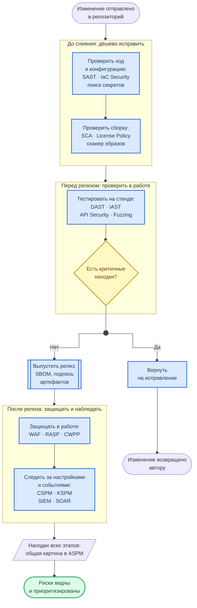

  

    <h1 class="hero-title">Application Security Toolchain</h1>
    
Аббревиатуры и классы инструментов AppSec / DevSecOps

  

Класс инструмента отвечает на вопрос «что именно проверяем и когда». Ни один класс не закрывает всё: в каждой карточке есть строка **«Не видит»** — по ней и подбирают сочетание инструментов. Строка «В курсе» показывает, в какой лабораторной класс встречается на практике.

## Какой класс на каком этапе

Схема показывает путь изменения от репозитория до эксплуатации и то, какие классы инструментов работают на каждом этапе.

**Как читать схему:**

- Три рамки — три момента проверки. Чем раньше найдена ошибка, тем дешевле её исправить, поэтому основная масса сканеров стоит до слияния.
- До слияния проверяется то, что можно прочитать: код, конфигурация, зависимости, образ. Перед релизом — то, что видно только в работе.
- Ромб — порог качества (quality gate): критичная находка возвращает изменение автору, и после исправления оно проходит тот же путь сверху.
- После релиза средства защиты уязвимость не устраняют, а выигрывают время; находки всех этапов сводятся в одну картину, иначе ими невозможно управлять.

Обозначения — в материале [Как читать схемы курса](diagrams_legend.md).

## Анализ кода (Code Analysis)

Инструменты, работающие с исходным кодом и байткодом — до запуска приложения. Встраиваются в IDE, pre-commit hooks и ранние стадии CI/CD.

  

  

    SAST
    Static Application Security Testing
  

  Static AST
  <dl class="lab-card-facts">
    <dt>Что делает</dt><dd>Статический анализ исходного кода без запуска приложения. Обнаруживает инъекции, XSS, hardcoded secrets, небезопасные вызовы. Высокий false positive rate — требует тюнинга правил.</dd>
    <dt>Этап</dt><dd>Код и pull request.</dd>
    <dt>Не видит</dt><dd>Ошибок конфигурации и логики, которые проявляются только при запуске. Даёт много ложных срабатываний.</dd>
    <dt>Инструменты</dt><dd>Semgrep · Checkov · Bandit · SonarQube</dd>
    <dt>В курсе</dt><dd>Лаб. 07 (Semgrep, Checkov), Лаб. 09.</dd>
  </dl>
  

  

  

    SCS
    Secure Code Standards
  

  Secure Coding
  <dl class="lab-card-facts">
    <dt>Что делает</dt><dd>Правила и практики безопасной разработки: OWASP Secure Coding Practices, CERT, CWE Top 25. Ложатся в основу профилей SAST и code review.</dd>
    <dt>Этап</dt><dd>До написания кода: стандарт, по которому пишут и проверяют.</dd>
    <dt>Не видит</dt><dd>Сам ничего не проверяет — работает только как основа правил SAST и ревью.</dd>
    <dt>Инструменты</dt><dd>OWASP · CERT · CWE</dd>
  </dl>
  

  

  

    SCM
    Source Code Management
  

  Source Control
  <dl class="lab-card-facts">
    <dt>Что делает</dt><dd>Управление версиями исходного кода. Базовая точка интеграции AppSec: pre-commit hooks, PR-checks, секрет-сканеры, branch protection.</dd>
    <dt>Этап</dt><dd>Весь цикл: точка, куда подключаются проверки.</dd>
    <dt>Не видит</dt><dd>Защищает процесс, а не код: уязвимость пройдёт, если проверки не подключены.</dd>
    <dt>Инструменты</dt><dd>Git · GitHub · GitLab · Bitbucket</dd>
    <dt>В курсе</dt><dd>Лаб. 01, Лаб. 09.</dd>
  </dl>
  

***

## Тестирование приложений (Application Testing)

Инструменты, работающие с запущенным приложением — от «чёрного ящика» до агентного анализа внутри процесса.

  

  

    DAST
    Dynamic Application Security Testing
  

  Dynamic AST
  <dl class="lab-card-facts">
    <dt>Что делает</dt><dd>Тестирование «чёрным ящиком»: имитирует реальные атаки на запущенное приложение. Находит то, что SAST не видит: IDOR, broken auth, misconfigured CORS.</dd>
    <dt>Этап</dt><dd>Тест: запущенное приложение на стенде.</dd>
    <dt>Не видит</dt><dd>Того, до чего не дошёл краулер, и строки кода, где сидит ошибка.</dd>
    <dt>Инструменты</dt><dd>OWASP ZAP · Burp Suite · Nuclei</dd>
    <dt>В курсе</dt><dd>Лаб. 08 (OWASP ZAP), Лаб. 09.</dd>
  </dl>
  

  

  

    IAST
    Interactive Application Security Testing
  

  Interactive AST
  <dl class="lab-card-facts">
    <dt>Что делает</dt><dd>Агент внутри приложения отслеживает реальные потоки данных и вызовы. Комбинирует SAST и DAST, значительно снижает false positive rate.</dd>
    <dt>Этап</dt><dd>Тест: вместе с функциональными тестами.</dd>
    <dt>Не видит</dt><dd>Путей, которые тесты не прошли; агент нужен под конкретный язык.</dd>
    <dt>Инструменты</dt><dd>Contrast Security · Hdiv · Seeker</dd>
  </dl>
  

  

  

    MAST
    Mobile Application Security Testing
  

  Mobile AST
  <dl class="lab-card-facts">
    <dt>Что делает</dt><dd>Анализ мобильных приложений: реверс APK/IPA, проверка хранения данных, сетевых вызовов, криптографии, jailbreak/root detection.</dd>
    <dt>Этап</dt><dd>Сборка и тест мобильного приложения.</dd>
    <dt>Не видит</dt><dd>Серверной части, с которой приложение общается.</dd>
    <dt>Инструменты</dt><dd>MobSF · QARK · Objection</dd>
  </dl>
  

  

  

    RASP
    Runtime Application Self-Protection
  

  Runtime Protection
  <dl class="lab-card-facts">
    <dt>Что делает</dt><dd>Самозащита приложения в рантайме: перехватывает SQL-инъекции, path traversal, command injection внутри процесса и блокирует атаки в реальном времени.</dd>
    <dt>Этап</dt><dd>Эксплуатация.</dd>
    <dt>Не видит</dt><dd>Не исправляет уязвимость, а прикрывает её; добавляет нагрузку на приложение.</dd>
    <dt>Инструменты</dt><dd>Sqreen · OpenRASP · Contrast Protect</dd>
  </dl>
  

  

  

    API Security
    API Security Testing
  

  API AST
  <dl class="lab-card-facts">
    <dt>Что делает</dt><dd>Специализированное тестирование API: BOLA, broken auth, mass assignment, rate limiting. Работает с OpenAPI/Swagger спецификациями.</dd>
    <dt>Этап</dt><dd>Тест: по спецификации API.</dd>
    <dt>Не видит</dt><dd>Методов, которых нет в спецификации: без актуального OpenAPI покрытие неполное.</dd>
    <dt>Инструменты</dt><dd>OWASP API Top 10 · Postman · 42Crunch</dd>
  </dl>
  

  

  

    Fuzzing
    Fuzz Testing
  

  Fuzzing / Fault Injection
  <dl class="lab-card-facts">
    <dt>Что делает</dt><dd>Автоматическая генерация случайных или мутированных входных данных для обнаружения crash, memory corruption, assertion failures.</dd>
    <dt>Этап</dt><dd>Тест: долгие прогоны вне основного конвейера.</dd>
    <dt>Не видит</dt><dd>Логических ошибок: находит падения и порчу памяти, а не неправильное поведение.</dd>
    <dt>Инструменты</dt><dd>AFL++ · libFuzzer · Atheris · OSS-Fuzz</dd>
  </dl>
  

***

## Анализ зависимостей и цепочки поставок (Supply Chain)

Проверка сторонних компонентов, лицензий и формирование инвентаря ПО — ключевая часть управления рисками supply chain.

  

  

    SCA
    Software Composition Analysis
  

  SCA / OSA
  <dl class="lab-card-facts">
    <dt>Что делает</dt><dd>Анализ зависимостей на CVE, проблемы лицензирования и риски цепочки поставок. Основа для управления third-party рисками.</dd>
    <dt>Этап</dt><dd>Сборка: на каждый pull request.</dd>
    <dt>Не видит</dt><dd>Уязвимостей, которых ещё нет в базах, и того, достижим ли уязвимый код в вашем приложении.</dd>
    <dt>Инструменты</dt><dd>Trivy · OWASP DC · Snyk · pip-audit</dd>
    <dt>В курсе</dt><dd>Лаб. 06 (Trivy), Лаб. 07 (Dependency-Check), Лаб. 09.</dd>
  </dl>
  

  

  

    OSA
    Open Source Analysis
  

  SCA / OSA
  <dl class="lab-card-facts">
    <dt>Что делает</dt><dd>Фокус на OSS-компонентах: безопасность, качество сопровождения (maintainer activity), совместимость лицензий, соответствие внутренней OSS-политике.</dd>
    <dt>Этап</dt><dd>Выбор зависимости, до её добавления в проект.</dd>
    <dt>Не видит</dt><dd>Прямых доказательств: оценки репутации и сопровождения косвенные.</dd>
    <dt>Инструменты</dt><dd>Scorecard · deps.dev · Socket</dd>
  </dl>
  

  

  

    SBOM
    Software Bill of Materials
  

  SBOM / Inventory
  <dl class="lab-card-facts">
    <dt>Что делает</dt><dd>Структурированный перечень всех компонентов продукта (CycloneDX, SPDX). Регуляторное требование: EO 14028 (US), NIS2 (EU).</dd>
    <dt>Этап</dt><dd>Релиз.</dd>
    <dt>Не видит</dt><dd>Это перечень, а не проверка: без сопоставления с базами уязвимостей он ничего не находит.</dd>
    <dt>Инструменты</dt><dd>Syft · cdxgen · SPDX Tools</dd>
  </dl>
  

  

  

    License Policy
    License / Governance
  

  Governance
  <dl class="lab-card-facts">
    <dt>Что делает</dt><dd>Политики лицензионного комплаенса: запрет AGPL в SaaS, проверка совместимости GPL + proprietary, автоматизация в CI.</dd>
    <dt>Этап</dt><dd>Сборка.</dd>
    <dt>Не видит</dt><dd>Лицензия определяется по метаданным пакета, а они бывают неверны или неполны.</dd>
    <dt>Инструменты</dt><dd>FOSSA · Snyk License · ScanCode</dd>
    <dt>В курсе</dt><dd>Материал «Лицензии ПО».</dd>
  </dl>
  

***

## Контейнеры и инфраструктура (Container & Infra Security)

Безопасность контейнерных образов, Docker-хостов, IaC-конфигураций и сетевой инфраструктуры.

  

  

    CIS
    Container Image Scanner
  

  Container Security
  <dl class="lab-card-facts">
    <dt>Что делает</dt><dd>Сканирование образов на CVE (OS-пакеты + языковые зависимости), утечки секретов, root-пользователь, лишние capabilities.</dd>
    <dt>Этап</dt><dd>Сборка образа и хранение в реестре. Не путать с CIS Benchmarks — стандартами безопасной настройки.</dd>
    <dt>Не видит</dt><dd>Того, как контейнер запущен: привилегии, монтирования и сеть в образе не записаны.</dd>
    <dt>Инструменты</dt><dd>Trivy · Grype · Docker Scout · Dockle</dd>
    <dt>В курсе</dt><dd>Лаб. 06 (Trivy).</dd>
  </dl>
  

  

  

    BCA
    Bytecode and Container Analysis
  

  Binary / Container
  <dl class="lab-card-facts">
    <dt>Что делает</dt><dd>Анализ бинарного кода и контейнерных слоёв: вредоносный контент, плохие практики упаковки, встроенные бэкдоры в base images.</dd>
    <dt>Этап</dt><dd>Сборка и приёмка чужих образов.</dd>
    <dt>Не видит</dt><dd>Результат зависит от эксперта: автоматической оценки почти нет.</dd>
    <dt>Инструменты</dt><dd>Dive · Anchore · Clair</dd>
  </dl>
  

  

  

    IaC Security
    Infrastructure as Code Security
  

  IaC Scanning
  <dl class="lab-card-facts">
    <dt>Что делает</dt><dd>Проверка Terraform, CloudFormation, Kubernetes YAML, Dockerfiles на мисконфигурации ещё до деплоя: открытые порты, публичные S3, отсутствие шифрования.</dd>
    <dt>Этап</dt><dd>Код и pull request.</dd>
    <dt>Не видит</dt><dd>Того, что реально развёрнуто: проверяется описание, а конфигурация со временем расходится с ним.</dd>
    <dt>Инструменты</dt><dd>Checkov · tfsec · KICS · Hadolint</dd>
    <dt>В курсе</dt><dd>Лаб. 07 (Checkov).</dd>
  </dl>
  

  

  

    NVS
    Network Vulnerability Scanner
  

  Infra / Network
  <dl class="lab-card-facts">
    <dt>Что делает</dt><dd>Сканирование хостов и сервисов: открытые порты, уязвимые версии, небезопасные конфигурации на уровне сети (L3/L4).</dd>
    <dt>Этап</dt><dd>Приёмка стенда и эксплуатация.</dd>
    <dt>Не видит</dt><dd>Кода и логики сервиса: видит сеть снаружи — порт, сервис, версию.</dd>
    <dt>Инструменты</dt><dd>Nmap · Nessus · OpenVAS · Qualys</dd>
    <dt>В курсе</dt><dd>Лаб. 03 (Nmap), справочник «Порты и протоколы».</dd>
  </dl>
  

  

  

    SM
    Secret Management
  

  Secret Management
  <dl class="lab-card-facts">
    <dt>Что делает</dt><dd>Хранение, ротация и выдача секретов (токены, ключи, сертификаты). Интеграция с CI/CD: секреты не хранятся в коде, не хардкодятся в конфигах.</dd>
    <dt>Этап</dt><dd>Весь цикл.</dd>
    <dt>Не видит</dt><dd>Хранилище не поможет, если секрет уже попал в Git, — это находят сканеры секретов.</dd>
    <dt>Инструменты</dt><dd>Vault · AWS SM · Gitleaks · TruffleHog</dd>
    <dt>В курсе</dt><dd>Лаб. 07 (Gitleaks, TruffleHog), Лаб. 09 (секреты репозитория).</dd>
  </dl>
  

***

## Облачная безопасность (Cloud Security)

Управление безопасностью облачных конфигураций, рабочих нагрузок и cloud-native приложений.

  

  

    CSPM
    Cloud Security Posture Management
  

  Cloud Posture
  <dl class="lab-card-facts">
    <dt>Что делает</dt><dd>Непрерывный аудит конфигураций облака: IAM, сети, хранилища, политики. Отклонения от CIS Benchmarks, NIST и внутренних требований.</dd>
    <dt>Этап</dt><dd>Эксплуатация облака, непрерывно.</dd>
    <dt>Не видит</dt><dd>Того, что происходит внутри нагрузок: проверяет настройки, а не поведение.</dd>
    <dt>Инструменты</dt><dd>Prowler · ScoutSuite · Prisma Cloud</dd>
  </dl>
  

  

  

    CWPP
    Cloud Workload Protection Platform
  

  Workload Protection
  <dl class="lab-card-facts">
    <dt>Что делает</dt><dd>Защита рабочих нагрузок в рантайме: мониторинг процессов, сетевых соединений, файловой активности. Детектирование криптомайнеров, шеллов, lateral movement.</dd>
    <dt>Этап</dt><dd>Эксплуатация.</dd>
    <dt>Не видит</dt><dd>Работает по факту: реагирует на уже идущую атаку и требует агента на каждом узле.</dd>
    <dt>Инструменты</dt><dd>Falco · Sysdig · Aqua · Wiz</dd>
  </dl>
  

  

  

    CNAPP
    Cloud-Native Application Protection Platform
  

  Cloud Platform
  <dl class="lab-card-facts">
    <dt>Что делает</dt><dd>Объединяет CSPM + CWPP + контейнерную безопасность. Сквозное представление рисков: от кода до production-нагрузок в одной консоли.</dd>
    <dt>Этап</dt><dd>Весь цикл, как единая платформа.</dd>
    <dt>Не видит</dt><dd>Ничего нового по сравнению с составляющими; дорого и привязывает к поставщику.</dd>
    <dt>Инструменты</dt><dd>Wiz · Prisma Cloud · Orca · Lacework</dd>
  </dl>
  

  

  

    KSPM
    Kubernetes Security Posture Management
  

  K8s Security
  <dl class="lab-card-facts">
    <dt>Что делает</dt><dd>Аудит конфигураций Kubernetes: RBAC, Network Policies, Pod Security Standards, проверка по CIS Kubernetes Benchmark.</dd>
    <dt>Этап</dt><dd>Эксплуатация кластера.</dd>
    <dt>Не видит</dt><dd>Образов и кода приложений: смотрит только конфигурацию кластера.</dd>
    <dt>Инструменты</dt><dd>kube-bench · Kubescape · Polaris</dd>
  </dl>
  

***

## Управление и оркестрация (Management & Orchestration)

Инструменты консолидации, приоритизации и управления уязвимостями из всех источников.

  

  

    ASPM
    Application Security Posture Management
  

  AppSec Management
  <dl class="lab-card-facts">
    <dt>Что делает</dt><dd>Консолидация SAST, DAST, SCA, секрет-сканеров в единую картину. Приоритизация рисков, привязка к бизнес-контексту, трекинг устранения.</dd>
    <dt>Этап</dt><dd>Весь цикл.</dd>
    <dt>Не видит</dt><dd>Сам ничего не сканирует: картина не лучше подключённых к нему сканеров.</dd>
    <dt>Инструменты</dt><dd>DefectDojo · Kondukto · ArmorCode</dd>
    <dt>В курсе</dt><dd>Лаб. 10: находки сканеров сводятся в общую оценку рисков вручную.</dd>
  </dl>
  

  

  

    VDP
    Vulnerability Disclosure Program
  

  Bug Bounty / VDP
  <dl class="lab-card-facts">
    <dt>Что делает</dt><dd>Программа ответственного раскрытия уязвимостей: security.txt, bug bounty, triage и коммуникация с исследователями.</dd>
    <dt>Этап</dt><dd>Эксплуатация.</dd>
    <dt>Не видит</dt><dd>Находит только то, что заинтересовало исследователей, и требует людей на разбор сообщений.</dd>
    <dt>Инструменты</dt><dd>HackerOne · Bugcrowd · Intigriti</dd>
    <dt>В курсе</dt><dd>Файл SECURITY в каждом репозитории лабораторных.</dd>
  </dl>
  

***

## Мониторинг и реагирование (Monitoring & Response)

Сбор событий, корреляция, автоматизация реагирования — операционная безопасность.

  

  

    SIEM
    Security Information and Event Management
  

  Monitoring / Analytics
  <dl class="lab-card-facts">
    <dt>Что делает</dt><dd>Централизованный сбор и корреляция событий из CI/CD, приложений, WAF, контейнеров. Основа detection engineering и threat hunting.</dd>
    <dt>Этап</dt><dd>Эксплуатация.</dd>
    <dt>Не видит</dt><dd>Без правил корреляции это дорогой архив логов, который никто не читает.</dd>
    <dt>Инструменты</dt><dd>ELK · Splunk · Wazuh · QRadar</dd>
  </dl>
  

  

  

    SOAR
    Security Orchestration, Automation and Response
  

  Automation / Response
  <dl class="lab-card-facts">
    <dt>Что делает</dt><dd>Оркестрация реакций на инциденты: обработка алертов, создание тикетов, блокировка артефактов, запуск playbooks. Снижает MTTR.</dd>
    <dt>Этап</dt><dd>Эксплуатация.</dd>
    <dt>Не видит</dt><dd>Автоматизирует только описанные заранее сценарии.</dd>
    <dt>Инструменты</dt><dd>XSOAR · Shuffle · Tines · TheHive</dd>
  </dl>
  

  

  

    WAF
    Web Application Firewall
  

  Perimeter Defense
  <dl class="lab-card-facts">
    <dt>Что делает</dt><dd>Фильтрация HTTP-трафика на уровне приложения: блокировка SQL-инъекций, XSS, path traversal на периметре до достижения бэкенда.</dd>
    <dt>Этап</dt><dd>Эксплуатация: периметр.</dd>
    <dt>Не видит</dt><dd>Фильтр по сигнатурам обходится и не заменяет исправление кода.</dd>
    <dt>Инструменты</dt><dd>ModSecurity · Cloudflare WAF · AWS WAF</dd>
  </dl>
  

***

## AI/ML безопасность

Безопасность моделей машинного обучения, LLM и ML-пайплайнов — относительно новое направление.

  

  

    MLSecOps
    Machine Learning Security Operations
  

  ML / AI Security
  <dl class="lab-card-facts">
    <dt>Что делает</dt><dd>Защита ML-моделей: adversarial attacks, data poisoning, model extraction, prompt injection. Безопасность артефактов и ML supply chain.</dd>
    <dt>Этап</dt><dd>Весь цикл ML-модели.</dd>
    <dt>Не видит</dt><dd>Область молодая: инструменты незрелые, общепринятых метрик нет.</dd>
    <dt>Инструменты</dt><dd>OWASP ML Top 10 · Garak · Rebuff</dd>
  </dl>
  

  

  

    LLM Security
    Large Language Model Security
  

  LLM / GenAI
  <dl class="lab-card-facts">
    <dt>Что делает</dt><dd>Специфика LLM: prompt injection, jailbreaking, data leakage, insecure output handling. OWASP LLM Top 10 — фреймворк для оценки.</dd>
    <dt>Этап</dt><dd>Разработка и эксплуатация функций на LLM.</dd>
    <dt>Не видит</dt><dd>Полной защиты от внедрения инструкций нет — нужны ограничения прав на стороне приложения.</dd>
    <dt>Инструменты</dt><dd>OWASP LLM Top 10 · NeMo Guardrails</dd>
  </dl>
  

