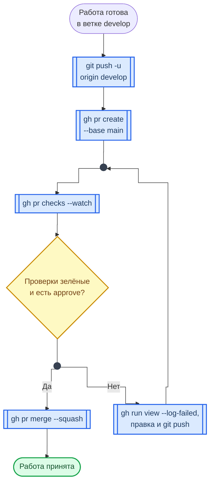

---
hide:
  - toc
title: "CheatSheet: GitHub CLI | Курс AppSec"
description: "GitHub CLI шпаргалка с пояснениями: цикл сдачи работы через pull request, аутентификация и права токена, запуски Actions и разбор упавших шагов, секреты репозитория, релизы, gist и gh api."
keywords: "GitHub CLI, gh, cheatsheet, шпаргалка, pull request, issues, releases, DevOps, AppSec, DevSecOps, аутентификация, Шмаков Илья, Elijah Shmakov, geminishkv, AppSecTA"
---

<div class="hero-section hero-section--compact">
  <div class="hero-content">
    <h1 class="hero-title">GitHub CLI</h1>
    <p class="hero-sub">Команды gh и где они нужны в курсе</p>
  </div>
</div>

`gh` делает из терминала то, ради чего обычно открывают сайт GitHub: репозитории, pull request, запуски Actions, секреты, релизы и gist. В курсе это требование, а не удобство: команды выполняются из терминала, а их вывод идёт в отчёт.

## Цикл сдачи работы

Схема показывает путь лабораторной от готовой ветки до принятого pull request и то, какая команда `gh` отвечает за каждый шаг.



**Как читать схему:**

- Работа ведётся в `develop`, pull request открывается в `main` — так его видит преподаватель.
- `gh pr checks --watch` показывает статусы проверок в реальном времени и не даёт забыть про красный конвейер.
- Ромб один: пока проверки красные или нет approve, правки пушатся в ту же ветку — новый pull request не нужен, существующий обновится сам.
- При красном конвейере первым делом `gh run view --log-failed`: он печатает только упавшие шаги, а не весь лог.

Обозначения — в материале [Как читать схемы курса](../diagrams_legend.md).

## Аутентификация

`gh auth login` открывает браузер и сохраняет токен в системном хранилище ключей, а не в файле. Выбирайте протокол SSH: ключ уже настроен во вводном руководстве. Прав у токена должно быть столько, сколько нужно; недостающее право добавляется отдельно через `gh auth refresh -s`.

```bash
gh auth login                                 # Авторизоваться в GitHub
gh auth status                                # Кто авторизован, каким протоколом и с какими правами токена
gh auth refresh                               # Обновить токен
gh auth refresh -s delete_repo                # Добавить токену одно право (scope)
gh auth setup-git                             # Научить git брать учётные данные у gh
gh auth logout                                # Выйти из аккаунта
```

!!! warning "Правило"
    `gh auth token` печатает токен открытым текстом. Его вывод не должен попадать в отчёт, в gist и в лог CI. В GitHub Actions `gh` берёт токен из переменной `GH_TOKEN`, в которую кладут `secrets.GITHUB_TOKEN`.

## Репозитории

Самая полезная форма для лабораторных — создать репозиторий из уже существующего каталога: одна команда заводит его на GitHub, прописывает `origin` и отправляет ветку.

```bash
gh repo create <name> --public --source=. --remote=origin --push   # Репозиторий из текущего каталога
gh repo create <name>                         # Создать публичный репозиторий
gh repo create <name> --private               # Создать приватный репозиторий
gh repo clone <user>/<repo>                   # Клонировать репозиторий
gh repo fork <user>/<repo>                    # Создать fork репозитория
gh repo view                                  # Информация о текущем репозитории
gh repo view --web                            # Открыть репозиторий в браузере
gh repo list <user>                           # Список репозиториев пользователя
gh repo delete <user>/<repo>                  # Удалить репозиторий (нужно право delete_repo и подтверждение)
```

## Pull Requests

`--fill` берёт заголовок и описание из коммитов — при атомарных коммитах с внятными сообщениями pull request оформляется одной командой. `gh pr checkout` нужен ревьюеру: он забирает чужую ветку локально, чтобы запустить код, а не читать diff на глаз.

```bash
gh pr create --base main --head develop --fill   # PR из develop в main, текст из коммитов
gh pr create --title "Title" --body "Body"    # PR из текущей ветки с явным текстом
gh pr create \
  --title "Title" \
  --body "Description" \
  --base main \
  --head develop \
  --assignee "@me" \
  --draft                                     # Черновой PR с параметрами
gh pr status                                  # Мои PR и PR, ждущие моего ревью
gh pr checks                                  # Статусы проверок текущего PR
gh pr checks --watch                          # То же в реальном времени
gh pr list                                    # Список открытых PR
gh pr list --state all                        # Все PR (открытые + закрытые + merged)
gh pr view <number>                           # Просмотр PR
gh pr view --web                              # Открыть PR в браузере
gh pr diff <number>                           # Показать diff PR
gh pr checkout <number>                       # Переключиться на ветку PR
gh pr review <number> --approve               # Одобрить PR
gh pr review <number> --request-changes -b "" # Запросить изменения
gh pr ready <number>                          # Перевести черновик в готовый к ревью
gh pr close <number>                          # Закрыть PR без слияния
```

Способ слияния определяет, что останется в истории `main`.

<div class="lab-grid" style="grid-template-columns: repeat(auto-fill, minmax(min(15rem, 100%), 1fr));">

  <div class="lab-card" style="flex-direction: column; align-items: flex-start; gap: 0.5rem;">
  <div style="display:flex; align-items:baseline; gap:0.6rem; width:100%;">
    <span class="lab-card-num" style="font-size:0.9rem; width:auto;">--squash</span>
  </div>
  <dl class="lab-card-facts">
    <dt>В main</dt><dd>Один коммит на весь pull request.</dd>
    <dt>История</dt><dd>Чистая, но мелкие шаги ветки в неё не попадают.</dd>
    <dt>Когда</dt><dd>Лабораторная сдана, промежуточные коммиты больше не нужны.</dd>
  </dl>
  </div>

  <div class="lab-card" style="flex-direction: column; align-items: flex-start; gap: 0.5rem;">
  <div style="display:flex; align-items:baseline; gap:0.6rem; width:100%;">
    <span class="lab-card-num" style="font-size:0.9rem; width:auto;">--merge</span>
  </div>
  <dl class="lab-card-facts">
    <dt>В main</dt><dd>Все коммиты ветки и отдельный коммит слияния.</dd>
    <dt>История</dt><dd>Полная, видно, где ветка началась и закончилась.</dd>
    <dt>Когда</dt><dd>Атомарные коммиты ветки важны сами по себе.</dd>
  </dl>
  </div>

  <div class="lab-card" style="flex-direction: column; align-items: flex-start; gap: 0.5rem;">
  <div style="display:flex; align-items:baseline; gap:0.6rem; width:100%;">
    <span class="lab-card-num" style="font-size:0.9rem; width:auto;">--rebase</span>
  </div>
  <dl class="lab-card-facts">
    <dt>В main</dt><dd>Коммиты ветки по одному, без коммита слияния.</dd>
    <dt>История</dt><dd>Прямая линия; хеши коммитов меняются.</dd>
    <dt>Когда</dt><dd>Нужна линейная история без потери шагов.</dd>
  </dl>
  </div>

</div>

```bash
gh pr merge <number> --squash                 # Слить PR одним коммитом
gh pr merge <number> --merge                  # Слить PR через merge commit
gh pr merge <number> --rebase                 # Слить PR через rebase
gh pr merge <number> --squash --delete-branch # Слить и удалить ветку
```

## Issues

```bash
gh issue list                                 # Список открытых issues
gh issue list --assignee "@me"                # Только назначенные на тебя
gh issue create --title "Bug" --body "Desc"   # Создать issue
gh issue view <number>                        # Просмотр issue
gh issue close <number>                       # Закрыть issue
gh issue reopen <number>                      # Переоткрыть issue
```

## Actions и workflows

Основной инструмент [Лаб. 09](../../labs/basic/lab09.md). Порядок при красном конвейере: найти запуск, посмотреть только упавшие шаги, исправить, перезапустить упавшее. `gh workflow run` работает только для workflow с триггером `workflow_dispatch`.

```bash
gh workflow list                              # Список workflows
gh workflow run <workflow.yml>                # Запустить workflow вручную (нужен workflow_dispatch)
gh run list                                   # Список запусков
gh run list --workflow <workflow.yml> --limit 5   # Последние пять запусков одного workflow
gh run view <run-id>                          # Сводка запуска: jobs и их статусы
gh run view <run-id> --log-failed             # Лог только упавших шагов
gh run watch <run-id>                         # Следить за запуском в реальном времени
gh run rerun <run-id> --failed                # Перезапустить только упавшие jobs
gh run download <run-id>                      # Скачать артефакты запуска (отчёты сканеров)
```

## Секреты и переменные

Секреты репозитория для workflow заводятся отсюда же. Без флага `--body` команда сама спросит значение и не покажет его на экране — это правильный способ.

```bash
gh secret set NVD_API_KEY                     # Завести секрет, значение вводится скрыто
gh secret set NVD_API_KEY < key.txt           # Или взять значение из файла
gh secret list                                # Имена секретов (значения не показываются никогда)
gh secret delete NVD_API_KEY                  # Удалить секрет
gh variable set IMAGE_NAME --body "app"       # Несекретная переменная
gh variable list                              # Список переменных
```

!!! warning "Правило"
    `gh secret set NAME --body "значение"` оставляет секрет в истории командной оболочки. Значение вводится в ответ на запрос или читается из файла, который потом удаляется. В отчёт идут только имена секретов.

## Releases

Релиз привязывается к тегу. Тег создаётся и подписывается в Git (`git tag -s`), а `--verify-tag` не даст `gh` молча создать неподписанный тег, если вы забыли его отправить.

```bash
gh release list                               # Список релизов
gh release create <tag> --title "v1.0.0" --verify-tag   # Релиз по уже существующему тегу
gh release create <tag> --notes-file RELEASE_NOTES.md   # Текст релиза из файла
gh release create <tag> \
  --title "v1.0.0" \
  --notes "Release notes" \
  --target main \
  ./dist/*.tar.gz                             # Релиз с файлами
gh release view <tag>                         # Просмотр релиза
gh release delete <tag>                       # Удалить релиз
```

## Gist

В gist сдаются отчёты по лабораторным, формат — в руководстве [Оформление отчётов gistup](../guides/gistup_guide.md). Секретный gist не приватный: он не виден в списках и поиске, но открывается любому, у кого есть ссылка. Токены и пароли в отчёте недопустимы в любом gist.

```bash
gh gist create <file>                         # Создать секретный gist из файла
gh gist create <file> --public                # Публичный gist
gh gist create <file> --desc "Lab 01: Git"    # С описанием
gh gist list                                  # Список своих gist
gh gist view <id> --web                       # Открыть gist в браузере
gh gist edit <id>                             # Редактировать gist
```

## API

`gh api` обращается к GitHub REST API с уже готовой авторизацией. В курсе он нужен, чтобы закреплять actions по хешу коммита, а не по тегу: тег можно переставить, хеш — нет.

```bash
gh api repos/<owner>/<repo>/git/ref/tags/<tag> --jq .object.sha   # Хеш коммита, на который указывает тег
gh api repos/<owner>/<repo>/git/tags/<sha> --jq .object.sha       # Если тег аннотированный: разыменовать ещё раз
gh api rate_limit --jq .resources.core                            # Сколько запросов к API осталось
gh browse                                     # Открыть текущий репозиторий в браузере
```
