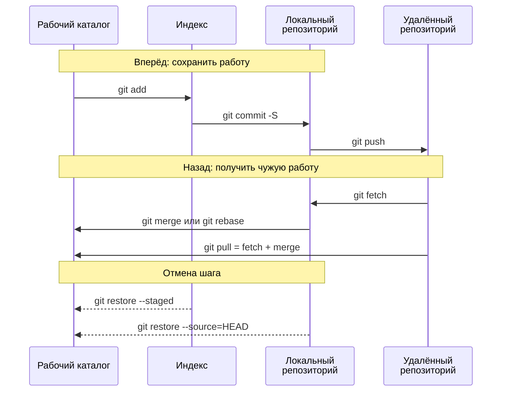

---
hide:
  - toc
title: "CheatSheet: команды Git | Курс AppSec"
description: "Git шпаргалка с пояснениями: где живут изменения, ежедневный цикл, отмена и reset, ветки, merge и rebase, конфликты, cherry-pick, подпись коммитов, reflog и что делать, если в коммит попал секрет."
keywords: "Git, SCM, cheatsheet, шпаргалка, коммит, ветка, rebase, stash, cherry-pick, merge, remote, reflog, reset, подпись коммитов, AppSec, лабораторные работы, Шмаков Илья, Elijah Shmakov, geminishkv, AppSecTA"
---

<div class="hero-section hero-section--compact">
  <div class="hero-content">
    <h1 class="hero-title">Git SCM</h1>
    <p class="hero-sub">Команды, флаги и когда какая нужна</p>
  </div>
</div>

Шпаргалка устроена по задачам, а не по алфавиту: перед каждым блоком сказано, когда он нужен и на чём обычно ошибаются. Команды в блоках можно копировать как есть, в угловых скобках — то, что подставляете сами.

## Где живут изменения

Схема показывает четыре места, через которые проходит любая правка, и команды, которые двигают её между ними. Почти все вопросы «куда делись мои изменения» решаются ответом на вопрос, в каком из четырёх мест они сейчас лежат.



**Как читать схему:**

- Время идёт сверху вниз, стрелка — одна команда: откуда она берёт изменения и куда кладёт.
- `git add` не сохраняет работу, а только готовит её к коммиту. Сохраняет `git commit`, а делится с другими `git push`.
- `git fetch` безопасен всегда: он обновляет сведения об удалённом репозитории и не трогает ваши файлы. `git pull` — это `fetch` и сразу `merge`, поэтому конфликты появляются именно на нём.
- Пунктирные стрелки — отмена: `git restore --staged` убирает файл из индекса, `git restore --source=HEAD` возвращает файл к последнему коммиту и стирает правки в нём.

Обозначения — в материале [Как читать схемы курса](../diagrams_legend.md).

## Инициализация и подключение

Нужно один раз на репозиторий. `origin` — просто общепринятое имя удалённого репозитория, а не особое слово. Адрес лучше брать SSH-вариантом (`git@github.com:…`): ключ настроен во вводном руководстве, и пароль при каждом `push` не понадобится.

```bash
git init                                      # Инициализация пустого локального репозитория
git remote add origin <URL>                   # Привязать удалённый репозиторий
git remote -v                                 # Показать подключённые удалённые репозитории
git remote show origin                        # Подробная информация о remote
git remote set-url origin <NEW_URL>           # Сменить URL удалённого репозитория
git clone <URL>                               # Клонировать репозиторий
```

## Ежедневный цикл

Порядок всегда один: посмотреть состояние, забрать чужие изменения, добавить свои, закоммитить, отправить. `git status` перед `add` и перед `commit` — привычка, которая спасает от коммита лишних файлов. Флаг `-S` подписывает коммит ключом GPG: в курсе принимаются только подписанные коммиты, на GitHub у них стоит отметка Verified.

```bash
git status                                    # Состояние рабочей директории и индекса
git pull origin <branch>                      # Получить изменения из удалённой ветки
git add <file>                                # Добавить конкретный файл в индекс
git add .                                     # Добавить все изменения в индекс
git commit -S -m "message"                    # Подписанный коммит с сообщением
git push origin <branch>                      # Отправить изменения в удалённый репозиторий
git push --set-upstream origin <branch>       # Связать локальную ветку с удалённой (первый push ветки)
```

!!! warning "Правило"
    `git add .` добавляет всё подряд, включая `.env`, ключи и дампы. Сначала `.gitignore`, потом `git status`, и только потом `git add`. Что писать в `.gitignore` — в [шпаргалке .gitignore](CHEATSHEET_GITIGNORE.md).

## Посмотреть, что изменилось

Прежде чем коммитить или откатывать, стоит увидеть разницу. `git diff` без аргументов показывает то, что ещё не в индексе; с `--staged` — то, что уйдёт в следующий коммит.

```bash
git diff                                      # Правки в рабочем каталоге, которых ещё нет в индексе
git diff --staged                             # Правки в индексе: именно это попадёт в коммит
git diff <branch-a>..<branch-b>               # Разница между двумя ветками
git show HEAD                                 # Последний коммит: автор, сообщение, diff
git log --oneline --graph --decorate --all    # Граф истории коммитов
git log -p <file>                             # История файла вместе с правками
git log -S "<строка>"                         # Коммиты, где эта строка появилась или исчезла
git blame <file>                              # Кто и каким коммитом менял каждую строку
tree -I "dir1|dir2"                           # Дерево проекта с исключением каталогов (не git, отдельная утилита)
```

## Индекс и отмена

Самое частое место потери работы. У `git reset` три режима, и отличаются они тем, что остаётся после отмены коммита.

<div class="lab-grid" style="grid-template-columns: repeat(auto-fill, minmax(min(15rem, 100%), 1fr));">

  <div class="lab-card" style="flex-direction: column; align-items: flex-start; gap: 0.5rem;">
  <div style="display:flex; align-items:baseline; gap:0.6rem; width:100%;">
    <span class="lab-card-num" style="font-size:0.9rem; width:auto;">--soft</span>
  </div>
  <dl class="lab-card-facts">
    <dt>Коммит</dt><dd>Отменён.</dd>
    <dt>Индекс</dt><dd>Правки остаются в индексе.</dd>
    <dt>Файлы</dt><dd>Не тронуты.</dd>
    <dt>Когда</dt><dd>Переписать сообщение или склеить коммиты.</dd>
  </dl>
  </div>

  <div class="lab-card" style="flex-direction: column; align-items: flex-start; gap: 0.5rem;">
  <div style="display:flex; align-items:baseline; gap:0.6rem; width:100%;">
    <span class="lab-card-num" style="font-size:0.9rem; width:auto;">--mixed</span>
  </div>
  <dl class="lab-card-facts">
    <dt>Коммит</dt><dd>Отменён.</dd>
    <dt>Индекс</dt><dd>Очищен.</dd>
    <dt>Файлы</dt><dd>Не тронуты. Режим по умолчанию.</dd>
    <dt>Когда</dt><dd>Разбить один коммит на несколько.</dd>
  </dl>
  </div>

  <div class="lab-card" style="flex-direction: column; align-items: flex-start; gap: 0.5rem;">
  <div style="display:flex; align-items:baseline; gap:0.6rem; width:100%;">
    <span class="lab-card-num" style="font-size:0.9rem; width:auto;">--hard</span>
  </div>
  <dl class="lab-card-facts">
    <dt>Коммит</dt><dd>Отменён.</dd>
    <dt>Индекс</dt><dd>Очищен.</dd>
    <dt>Файлы</dt><dd>Правки стёрты без возможности вернуть.</dd>
    <dt>Когда</dt><dd>Выбросить эксперимент целиком.</dd>
  </dl>
  </div>

</div>

```bash
git add -i                                    # Интерактивное добавление в индекс
git add -p                                    # Добавить изменения по частям (hunk)
git restore --staged <file>                   # Убрать файл из индекса, правки остаются
git restore <file>                            # Вернуть файл к состоянию индекса (ОПАСНО: правки пропадут)
git reset                                     # Убрать все изменения из индекса (сохранить в рабочей директории)
git reset <file>                              # Убрать из индекса конкретный файл
git reset HEAD <file>                         # То же самое, старая запись
git reset --soft HEAD~                        # Отменить последний коммит, правки остаются в индексе
git reset HEAD~                               # Отменить последний коммит, правки остаются в файлах
git reset --hard HEAD~                        # Удалить последний коммит вместе с изменениями (ОПАСНО)
git reset --hard origin/<branch>              # Сбросить ветку до состояния удалённой (ОПАСНО)
git checkout -- <file>                        # Откатить файл до состояния в индексе, старая запись (ОПАСНО)
git clean -fdn                                # Показать, какие неотслеживаемые файлы будут удалены
git clean -df                                 # Удалить неотслеживаемые файлы и директории (ОПАСНО)
```

!!! warning "Правило"
    Команды с пометкой ОПАСНО стирают работу, которой ещё нет ни в одном коммите, — её не вернёт даже `reflog`. Перед ними — `git status` и `git stash`. Перед `git clean -df` — всегда сначала `git clean -fdn`.

## Ветки

Ветка — это указатель на коммит, создаётся мгновенно и ничего не копирует. В курсе работа идёт в `develop`, в `main` она попадает через pull request. `git switch` — современная замена `git checkout` для веток: делает только одно дело и не перепутает ветку с файлом.

```bash
git branch                                    # Список локальных веток
git branch -a                                 # Список всех веток (включая удалённые)
git branch <name>                             # Создать новую ветку
git switch <branch>                           # Переключиться на ветку
git switch -c <branch>                        # Создать ветку и переключиться
git checkout <branch>                         # Переключиться на ветку, старая запись
git checkout -b <branch>                      # Создать и переключиться, старая запись
git branch -m <old> <new>                     # Переименовать ветку
git branch -d <branch>                        # Удалить локальную ветку (только слитую; -D — любую)
git push origin --delete <branch>             # Удалить ветку на удалённом репозитории
git push origin <new-name>                    # Опубликовать переименованную ветку
git branch -u origin/<branch> <branch>        # Установить upstream для ветки
```

## Слияние и ребейз

`merge` соединяет две истории и оставляет след о слиянии. `rebase` переносит ваши коммиты поверх чужих и делает историю прямой, но создаёт новые коммиты вместо старых.

```bash
git fetch origin                              # Получить изменения без слияния
git fetch --all --prune                       # Получить все ветки и удалить устаревшие
git merge <branch>                            # Слить ветку в текущую
git merge --no-ff <branch>                    # Слить без fast-forward (сохранить историю)
git rebase <branch>                           # Переместить коммиты поверх указанной ветки
git pull --rebase origin <branch>             # Получить изменения через rebase
```

!!! warning "Правило"
    Не делайте `rebase` веткам, которые уже отправлены и которыми пользуется кто-то ещё: у коллег останутся старые коммиты, и история разойдётся. Свою личную ветку переписывать можно, отправляя результат через `git push --force-with-lease` — в отличие от `--force`, он откажет, если в удалённой ветке появились чужие коммиты.

## Конфликты

Конфликт — не ошибка, а вопрос: Git не знает, какую из двух правок одной строки оставить. В файле появляются маркеры `<<<<<<<`, `=======`, `>>>>>>>`: оставьте нужный вариант, удалите маркеры, добавьте файл в индекс и продолжите операцию. Если запутались — `--abort` возвращает всё как было до слияния.

```bash
git status                                    # Показать файлы с конфликтами
git diff --name-only --diff-filter=U          # Только список конфликтующих файлов
git checkout --ours <file>                    # Взять вариант текущей ветки целиком
git checkout --theirs <file>                  # Взять вариант вливаемой ветки целиком
git add <file>                                # Отметить конфликт в файле решённым
git merge --continue                          # Завершить слияние после решения конфликтов
git rebase --continue                         # Продолжить rebase после решения конфликта
git merge --abort                             # Отменить слияние и вернуться к состоянию до него
git rebase --abort                            # Отменить rebase целиком
```

## Исправить историю

Последний коммит исправляется через `--amend`, более старый — через `revert`. Разница принципиальная: `amend` и `reset` переписывают историю, `revert` добавляет новый коммит с обратными правками и поэтому безопасен для опубликованных веток.

```bash
git commit --amend -S -m "new message"        # Переписать сообщение последнего коммита
git commit --amend -S --no-edit               # Добавить забытый файл в последний коммит
git revert <commit>                           # Новый коммит, отменяющий правки указанного
git cherry-pick <commit>                      # Перенести один коммит из другой ветки в текущую
git cherry-pick -x <commit>                   # То же с пометкой, откуда коммит взят
git rebase -i HEAD~3                          # Склеить, переставить или переписать три последних коммита
git push --force-with-lease                   # Отправить переписанную личную ветку
```

## Временное хранилище

`stash` убирает незакоммиченные правки в карман и возвращает чистый рабочий каталог — удобно, когда нужно срочно переключиться на другую ветку.

```bash
git stash                                     # Сохранить изменения во временное хранилище
git stash -u                                  # То же вместе с неотслеживаемыми файлами
git stash list                                # Список сохранённых stash
git stash pop                                 # Восстановить последние сохранённые изменения и удалить их из stash
git stash apply                               # Восстановить, но оставить копию в stash
git stash drop                                # Удалить последний stash
```

## Подпись и теги

Подпись доказывает, что коммит сделал владелец ключа, а не тот, кто вписал чужое имя в `user.name`, — имя и почта в Git ничем не проверяются. Настройка ключа — во вводном руководстве [Настройка Git, GPG и GitHub CLI](../guides/git_setup.md).

```bash
git config --global commit.gpgsign true       # Подписывать все коммиты без флага -S
git log --show-signature -1                   # Проверить подпись последнего коммита
git verify-commit <commit>                    # Проверить подпись конкретного коммита
git tag -s v1.0.0 -m "v1.0.0"                 # Подписанный тег
git tag -v v1.0.0                             # Проверить подпись тега
git push origin v1.0.0                        # Отправить тег
git tag -d v1.0.0                             # Удалить локальный тег
git push --delete origin v1.0.0               # Удалить тег на удалённом репозитории
```

## Если всё сломалось

`reflog` — журнал всех перемещений `HEAD` за последние недели. Коммит, «потерянный» после `reset --hard`, неудачного `rebase` или удаления ветки, почти всегда находится там. Не находится только то, что ни разу не было закоммичено.

```bash
git reflog                                    # Журнал перемещений HEAD с хешами
git reset --hard <hash>                       # Вернуть ветку на найденный в reflog коммит
git branch <name> <hash>                      # Или создать на нём новую ветку и ничего не терять
git remote set-head origin -a                 # Обновить указатель HEAD удалённого репозитория
```

## Секрет попал в коммит

Удаление файла следующим коммитом не помогает: секрет остаётся в истории и достаётся одной командой. Порядок действий важнее самих команд.

```bash
# 1. Отозвать и перевыпустить секрет у того, кто его выдал. С этого шага начинают всегда:
#    после push секрет считается утёкшим, даже если репозиторий приватный.
# 2. Убрать секрет из истории (git filter-repo — отдельная утилита)
git filter-repo --path <file> --invert-paths  # Удалить файл из всей истории
git filter-repo --replace-text <rules.txt>    # Или заменить строку во всех коммитах
# 3. Переписанную историю отправить заново
git push --force-with-lease origin <branch>
# 4. Убедиться, что секрета больше нет
gitleaks git --no-banner                      # Сканирование всей истории
```

!!! warning "Правило"
    Сначала ротация, потом чистка истории. Чистка без ротации — это маскировка инцидента: копия репозитория с секретом могла уже разойтись. Поиск секретов и pre-commit-хук разобраны в [Лаб. 07](../../labs/basic/lab07.md).
