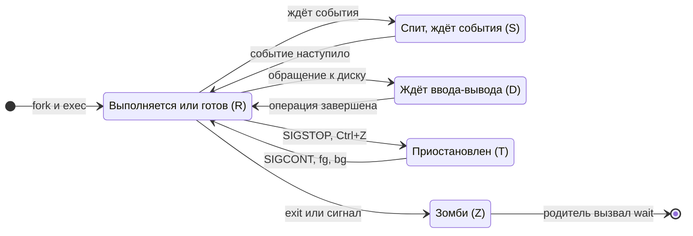

---
hide:
  - toc
title: "CheatSheet: Linux — права доступа и процессы | Курс AppSec"
description: "Шпаргалка по Linux с пояснениями: как читать ls -l, что значат r, w, x для файла и каталога, chmod, chown, umask, SUID, SGID и sticky bit, ACL, пользователи и группы, состояния процессов, сигналы и поиск по правам."
keywords: "Linux, права доступа, chmod, chown, umask, SUID, SGID, sticky bit, ACL, setfacl, процессы, сигналы, kill, ps, cheatsheet, шпаргалка, AppSec, Шмаков Илья, Elijah Shmakov, geminishkv, AppSecTA"
---

<div class="hero-section hero-section--compact">
  <div class="hero-content">
    <h1 class="hero-title">Linux: права и процессы</h1>
    <p class="hero-sub">Команды и когда какая нужна</p>
  </div>
</div>

Шпаргалка к [Лаб. 02](../../labs/basic/lab02.md): кто вы в системе, что вам разрешено и что сейчас запущено. Права доступа — основа всего остального в курсе: от того, под кем работает процесс в контейнере, до того, кто может прочитать файл с результатами сканирования.

## Кто я и где я

С этих команд начинается любая диагностика «почему нет доступа»: сначала выясняют, от чьего имени вы работаете и в какие группы входите.

```bash
whoami                                        # Имя текущего пользователя
id                                            # UID, GID и все группы
groups                                        # Только группы
pwd                                           # Текущий каталог
uname -a                                      # Ядро и архитектура
hostnamectl                                   # Имя машины и версия ОС
```

## Как читать ls -l

Строка `-rwxr-x--- 1 alice dev 4096 …` читается слева направо: тип объекта (`-` файл, `d` каталог, `l` ссылка), затем три тройки прав — владельца, группы и остальных, затем владелец и группа. Ядро применяет ровно одну тройку; порядок проверки — в схеме «Как ядро проверяет права» в Лаб. 02.

Одни и те же буквы значат разное для файла и для каталога — на этом ошибаются чаще всего.

<div class="lab-grid" style="grid-template-columns: repeat(auto-fill, minmax(min(15rem, 100%), 1fr));">

  <div class="lab-card" style="flex-direction: column; align-items: flex-start; gap: 0.5rem;">
  <div style="display:flex; align-items:baseline; gap:0.6rem; width:100%; flex-wrap:wrap;">
    <span class="lab-card-num" style="font-size:0.9rem; width:auto;">r</span>
    <span style="font-size:0.65rem; color:#888; font-family:var(--font-code);">read, 4</span>
  </div>
  <dl class="lab-card-facts">
    <dt>Файл</dt><dd>Прочитать содержимое.</dd>
    <dt>Каталог</dt><dd>Увидеть список имён в нём (<code>ls</code>).</dd>
  </dl>
  </div>

  <div class="lab-card" style="flex-direction: column; align-items: flex-start; gap: 0.5rem;">
  <div style="display:flex; align-items:baseline; gap:0.6rem; width:100%; flex-wrap:wrap;">
    <span class="lab-card-num" style="font-size:0.9rem; width:auto;">w</span>
    <span style="font-size:0.65rem; color:#888; font-family:var(--font-code);">write, 2</span>
  </div>
  <dl class="lab-card-facts">
    <dt>Файл</dt><dd>Изменить содержимое.</dd>
    <dt>Каталог</dt><dd>Создавать, переименовывать и удалять файлы в нём — даже чужие и даже те, что нельзя прочитать.</dd>
  </dl>
  </div>

  <div class="lab-card" style="flex-direction: column; align-items: flex-start; gap: 0.5rem;">
  <div style="display:flex; align-items:baseline; gap:0.6rem; width:100%; flex-wrap:wrap;">
    <span class="lab-card-num" style="font-size:0.9rem; width:auto;">x</span>
    <span style="font-size:0.65rem; color:#888; font-family:var(--font-code);">execute, 1</span>
  </div>
  <dl class="lab-card-facts">
    <dt>Файл</dt><dd>Запустить как программу.</dd>
    <dt>Каталог</dt><dd>Войти в него (<code>cd</code>) и обращаться к файлам по имени. Без <code>x</code> бесполезен и <code>r</code>.</dd>
  </dl>
  </div>

</div>

```bash
ls -l <file>                                  # Права, владелец, группа
ls -ld <dir>                                  # Права самого каталога, а не его содержимого
stat <file>                                   # То же подробно, с правами в восьмеричном виде
namei -l /path/to/file                        # Права каждого каталога на пути: где именно отказ
```

## Изменить права и владельца

Восьмеричная запись — сумма `r=4`, `w=2`, `x=1` для каждой тройки: `750` — это `rwxr-x---`. Символьная запись меняет только указанное и не трогает остальное, поэтому безопаснее для точечных правок.

```bash
chmod 640 <file>                              # rw-r-----: владелец читает и пишет, группа читает
chmod 750 <dir>                               # rwxr-x---: остальные не войдут в каталог
chmod u+x <file>                              # Добавить владельцу право запуска
chmod go-rwx <file>                           # Убрать всё у группы и остальных
chmod -R g+rX <dir>                           # Рекурсивно: чтение группе, x только каталогам
chown alice <file>                            # Сменить владельца (нужен root)
chown alice:dev <file>                        # Владельца и группу сразу
chgrp dev <file>                              # Только группу
umask                                         # Какие права снимаются с новых файлов
umask 027                                     # Новые файлы 640, каталоги 750
```

!!! warning "Правило"
    `chmod 777` — не решение проблемы с доступом, а её отключение: писать в файл сможет любой процесс в системе. Сначала `namei -l` и `id`, чтобы понять, какой тройки не хватает, и дать ровно её.

## Специальные биты

Три бита поверх обычных прав. Они не отменяют проверку доступа, а меняют то, от чьего имени работает программа, или то, кто может удалять файлы в каталоге.

<div class="lab-grid" style="grid-template-columns: repeat(auto-fill, minmax(min(19rem, 100%), 1fr));">

  <div class="lab-card" style="flex-direction: column; align-items: flex-start; gap: 0.5rem;">
  <div style="display:flex; align-items:baseline; gap:0.6rem; width:100%; flex-wrap:wrap;">
    <span class="lab-card-num" style="font-size:0.9rem; width:auto;">SUID</span>
    <span style="font-size:0.65rem; color:#888; font-family:var(--font-code);">chmod u+s, 4000</span>
  </div>
  <dl class="lab-card-facts">
    <dt>Что делает</dt><dd>Программа запускается с правами владельца файла, а не того, кто её запустил.</dd>
    <dt>Где нормально</dt><dd><code>passwd</code>, <code>sudo</code>, <code>mount</code> — им нужен root, чтобы сделать свою работу.</dd>
    <dt>Риск</dt><dd>SUID-файл с владельцем root и ошибкой внутри — готовое повышение привилегий. Каждый такой файл в системе должен быть объясним.</dd>
  </dl>
  </div>

  <div class="lab-card" style="flex-direction: column; align-items: flex-start; gap: 0.5rem;">
  <div style="display:flex; align-items:baseline; gap:0.6rem; width:100%; flex-wrap:wrap;">
    <span class="lab-card-num" style="font-size:0.9rem; width:auto;">SGID</span>
    <span style="font-size:0.65rem; color:#888; font-family:var(--font-code);">chmod g+s, 2000</span>
  </div>
  <dl class="lab-card-facts">
    <dt>Что делает</dt><dd>На файле: запуск с правами группы файла. На каталоге: новые файлы наследуют группу каталога.</dd>
    <dt>Где нормально</dt><dd>Общие каталоги команды: всё созданное сразу принадлежит общей группе.</dd>
    <dt>Риск</dt><dd>Тот же, что у SUID, только для группы: доступ к тому, что видит привилегированная группа.</dd>
  </dl>
  </div>

  <div class="lab-card" style="flex-direction: column; align-items: flex-start; gap: 0.5rem;">
  <div style="display:flex; align-items:baseline; gap:0.6rem; width:100%; flex-wrap:wrap;">
    <span class="lab-card-num" style="font-size:0.9rem; width:auto;">Sticky</span>
    <span style="font-size:0.65rem; color:#888; font-family:var(--font-code);">chmod +t, 1000</span>
  </div>
  <dl class="lab-card-facts">
    <dt>Что делает</dt><dd>В каталоге удалять и переименовывать файл может только его владелец.</dd>
    <dt>Где нормально</dt><dd><code>/tmp</code> и любые общие каталоги с правом записи для многих.</dd>
    <dt>Риск</dt><dd>Отсутствие бита: в общем каталоге любой может удалить или подменить чужой файл.</dd>
  </dl>
  </div>

</div>

```bash
chmod u+s <file>                              # Поставить SUID
chmod g+s <dir>                               # SGID на каталог: наследование группы
chmod +t <dir>                                # Sticky bit
chmod 1770 <dir>                              # Sticky + rwxrwx---
find / -perm -4000 -type f 2>/dev/null        # Все SUID-файлы в системе
find / -perm -2000 -type f 2>/dev/null        # Все SGID-файлы
```

## ACL: когда трёх троек мало

Обычные права дают одного владельца и одну группу. ACL добавляет права отдельным пользователям и группам. Знак `+` в конце строки прав в `ls -l` означает, что у файла есть ACL и тройки показывают не всё.

```bash
getfacl <file>                                # Показать ACL
setfacl -m u:bob:r-- <file>                   # Дать пользователю bob чтение
setfacl -m g:audit:r-x <dir>                  # Дать группе audit чтение и вход
setfacl -x u:bob <file>                       # Убрать запись для bob
setfacl -b <file>                             # Убрать весь ACL
setfacl -d -m g:dev:rwx <dir>                 # ACL по умолчанию для новых файлов в каталоге
```

## Пользователи и группы

Изменение групп вступает в силу при следующем входе в систему: после `usermod -aG` нужно перелогиниться. Флаг `-a` обязателен — без него `-G` заменяет список групп, а не дополняет.

```bash
sudo useradd -m -s /bin/bash bob              # Создать пользователя с домашним каталогом
sudo passwd bob                               # Задать пароль
sudo groupadd readgroup                       # Создать группу
sudo usermod -aG readgroup bob                # Добавить пользователя в группу
getent passwd bob                             # Запись о пользователе
getent group readgroup                        # Состав группы
sudo -l                                       # Что мне разрешено через sudo
su - bob                                      # Войти как другой пользователь
ls -l /etc/passwd /etc/shadow                 # passwd читают все, shadow — только root
```

## Процессы

Схема показывает, в каких состояниях бывает процесс и что переводит его из одного в другое. Буква в скобках — то, что выводит `ps` в столбце STAT.



**Как читать схему:**

- Блок — состояние, стрелка — переход, подпись — событие или сигнал.
- Большую часть времени процессы спят (S): ждут ввода, таймера или сети. Это нормально и не нагружает систему.
- Состояние D сигналами не прерывается, даже `SIGKILL`: процесс ждёт диск или сеть. Много процессов в D — признак проблемы с хранилищем.
- Зомби (Z) уже не работает и не занимает память: это строка в таблице процессов, которую родитель ещё не забрал. Убить зомби нельзя — лечится завершением или исправлением родителя.

Обозначения — в материале [Как читать схемы курса](../diagrams_legend.md).

```bash
ps aux                                        # Все процессы: владелец, CPU, память, состояние
ps -ef --forest                               # Дерево процессов: кто кого запустил
ps -o pid,ppid,user,stat,cmd -p <pid>         # Один процесс подробно
pgrep -a <name>                               # PID по имени
top                                           # Интерактивно; htop нагляднее
ss -tulpn                                     # Какие процессы слушают какие порты
lsof -p <pid>                                 # Какие файлы и сокеты открыл процесс
```

Сигнал — просьба, а не приказ: процесс может обработать `SIGTERM` и завершиться аккуратно. Не могут быть перехвачены только `SIGKILL` и `SIGSTOP`.

```bash
kill <pid>                                    # SIGTERM (15): завершиться штатно
kill -9 <pid>                                 # SIGKILL: убить без шанса сохранить данные
kill -HUP <pid>                               # SIGHUP (1): перечитать конфигурацию, если процесс это умеет
kill -STOP <pid>                              # Приостановить
kill -CONT <pid>                              # Продолжить
jobs                                          # Задания текущей оболочки
fg %1                                         # Вернуть задание на передний план
bg %1                                         # Продолжить задание в фоне
nice -n 10 <command>                          # Запустить с пониженным приоритетом
```

!!! warning "Правило"
    `kill -9` — последнее средство, а не первое: процесс не успеет закрыть файлы и соединения. Порядок — `kill`, подождать, и только потом `kill -9`. Тот же порядок использует `docker stop`.

## Поиск по правам и владельцам

```bash
find . -type f -perm -o+w                     # Файлы, в которые могут писать все
find . -type d ! -perm -g+x                   # Каталоги, куда группа не может войти
find / -user bob 2>/dev/null                  # Всё, чем владеет пользователь
find / -nouser 2>/dev/null                    # Файлы без владельца: следы удалённых учётных записей
find . -mtime -1                              # Изменённое за последние сутки
```

## Смотри также

- [Лаб. 02 · Linux: права доступа и процессы](../../labs/basic/lab02.md) — практика по этой шпаргалке
- [Лаб. 03 · Nmap](../../labs/basic/lab03.md) — файл с результатами сканирования закрывается правами
- [Приложение — команды и утилиты](../APPENDIX.md)
