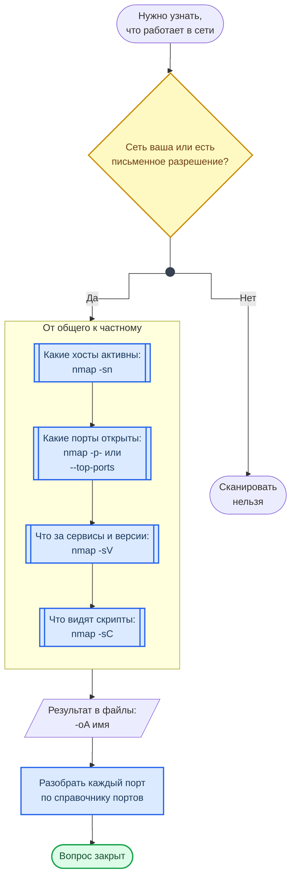

---
hide:
  - toc
title: "CheatSheet: Nmap — сканирование своей сети | Курс AppSec"
description: "Шпаргалка по Nmap: что можно сканировать, порядок от хостов к сервисам, состояния портов, типы сканирования, версии, скрипты NSE, форматы вывода."
keywords: "Nmap, сканирование сети, порты, NSE, -sV, -sS, -sn, open, filtered, форматы вывода, cheatsheet, шпаргалка, сетевая безопасность, AppSec, Шмаков Илья, Elijah Shmakov, geminishkv, AppSecTA"
---

<div class="hero-section hero-section--compact">
  <div class="hero-content">
    <h1 class="hero-title">Nmap</h1>
    <p class="hero-sub">Сканирование своей сети: вопросы, команды и чтение результата</p>
  </div>
</div>

Шпаргалка к [Лаб. 03](../../labs/basic/lab03.md). Nmap отвечает на вопрос «что на самом деле работает в сети» — защитник задаёт его, чтобы найти забытые сервисы раньше, чем их найдёт кто-то другой.

!!! warning "Правило"
    Сканировать можно только свои системы, стенды лабораторных и то, на что есть письменное разрешение владельца. Сканирование чужих адресов — основание для блокировки провайдером и для уголовной ответственности, даже если «ничего не сломано». В лабораторных цель — `localhost`, своя виртуальная машина и контейнеры стенда.

## От вопроса к команде

Схема показывает порядок: от проверки права на сканирование к всё более узким вопросам о сети.



**Как читать схему:**

- Ромб стоит первым: при ответе «Нет» никакая команда не запускается.
- Вопросы идут от общего к частному, и каждый следующий шаг работает с результатом предыдущего: версии определяют только на открытых портах, скрипты запускают только по найденным сервисам. Так сканирование получается быстрым и не создаёт лишней нагрузки.
- Результат сохраняется в файлы сразу, а не копируется с экрана: повторять сканирование ради потерянного вывода незачем.
- Последний шаг — разбор: что за сервис, нужен ли он, как защищён. Для этого есть справочник [Порты и протоколы](../ports.md).

Обозначения — в материале [Как читать схемы курса](../diagrams_legend.md).

## Цели

```bash
nmap 192.168.56.10                            # Один хост
nmap 192.168.56.10-20                         # Диапазон
nmap 192.168.56.0/24                          # Подсеть
nmap -iL targets.txt                          # Список из файла
nmap 192.168.56.0/24 --exclude 192.168.56.1   # Подсеть без одного адреса
```

## Какие хосты активны

Первый шаг в незнакомой подсети стенда. Свой адрес и подсеть показывает `ip addr`.

```bash
nmap -sn 192.168.56.0/24                      # Только обнаружение хостов, порты не сканируются
nmap -Pn 192.168.56.10                        # Считать хост живым, даже если он не отвечает на ping
```

## Какие порты открыты

Без указания портов Nmap проверяет тысячу самых частых. Сервис на нестандартном порту так не найти — для этого есть `-p-`.

```bash
nmap 192.168.56.10                            # 1000 самых частых TCP-портов
nmap -F 192.168.56.10                         # 100 самых частых: быстро
nmap --top-ports 200 192.168.56.10            # Свои N самых частых
nmap -p 22,80,443 192.168.56.10               # Конкретные порты
nmap -p 1-1024 192.168.56.10                  # Диапазон
nmap -p- 192.168.56.10                        # Все 65535: долго, зато без пропусков
```

Состояние порта — не «да или нет», а три разных ответа.

<div class="lab-grid" style="grid-template-columns: repeat(auto-fill, minmax(min(15rem, 100%), 1fr));">

  <div class="lab-card" style="flex-direction: column; align-items: flex-start; gap: 0.5rem;">
  <div style="display:flex; align-items:baseline; gap:0.6rem; width:100%; flex-wrap:wrap;">
    <span class="lab-card-num" style="font-size:0.9rem; width:auto;">open</span>
    <span style="font-size:0.65rem; color:#888; font-family:var(--font-code);">порт открыт</span>
  </div>
  <dl class="lab-card-facts">
    <dt>Что значит</dt><dd>На порту слушает сервис и отвечает на соединение.</dd>
    <dt>Что делать</dt><dd>Определить сервис и версию (<code>-sV</code>) и разобрать его по справочнику портов.</dd>
  </dl>
  </div>

  <div class="lab-card" style="flex-direction: column; align-items: flex-start; gap: 0.5rem;">
  <div style="display:flex; align-items:baseline; gap:0.6rem; width:100%; flex-wrap:wrap;">
    <span class="lab-card-num" style="font-size:0.9rem; width:auto;">closed</span>
    <span style="font-size:0.65rem; color:#888; font-family:var(--font-code);">порт закрыт</span>
  </div>
  <dl class="lab-card-facts">
    <dt>Что значит</dt><dd>Хост ответил, но на порту никто не слушает.</dd>
    <dt>Что делать</dt><dd>Ничего; полезно лишь как подтверждение, что хост жив и пакеты до него доходят.</dd>
  </dl>
  </div>

  <div class="lab-card" style="flex-direction: column; align-items: flex-start; gap: 0.5rem;">
  <div style="display:flex; align-items:baseline; gap:0.6rem; width:100%; flex-wrap:wrap;">
    <span class="lab-card-num" style="font-size:0.9rem; width:auto;">filtered</span>
    <span style="font-size:0.65rem; color:#888; font-family:var(--font-code);">нет ответа</span>
  </div>
  <dl class="lab-card-facts">
    <dt>Что значит</dt><dd>Ответа нет: пакеты отбрасывает межсетевой экран, и Nmap не знает, открыт ли порт.</dd>
    <dt>Что делать</dt><dd>Не считать порт закрытым. Проверить правила фильтрации на своём стенде.</dd>
  </dl>
  </div>

</div>

## Типы сканирования

<div class="lab-grid" style="grid-template-columns: repeat(auto-fill, minmax(min(19rem, 100%), 1fr));">

  <div class="lab-card" style="flex-direction: column; align-items: flex-start; gap: 0.5rem;">
  <div style="display:flex; align-items:baseline; gap:0.6rem; width:100%; flex-wrap:wrap;">
    <span class="lab-card-num" style="font-size:0.9rem; width:auto;">-sT</span>
    <span style="font-size:0.65rem; color:#888; font-family:var(--font-code);">TCP connect</span>
  </div>
  <dl class="lab-card-facts">
    <dt>Как работает</dt><dd>Полное TCP-соединение средствами ОС.</dd>
    <dt>Права</dt><dd>Не нужны. Используется по умолчанию без sudo.</dd>
    <dt>Когда</dt><dd>Нет прав root; результат тот же, но медленнее, и соединения видны в логах сервиса.</dd>
  </dl>
  </div>

  <div class="lab-card" style="flex-direction: column; align-items: flex-start; gap: 0.5rem;">
  <div style="display:flex; align-items:baseline; gap:0.6rem; width:100%; flex-wrap:wrap;">
    <span class="lab-card-num" style="font-size:0.9rem; width:auto;">-sS</span>
    <span style="font-size:0.65rem; color:#888; font-family:var(--font-code);">TCP SYN</span>
  </div>
  <dl class="lab-card-facts">
    <dt>Как работает</dt><dd>Отправляет SYN и по ответу судит о порте, не завершая рукопожатие — см. схему TCP в руководстве по сетям.</dd>
    <dt>Права</dt><dd>Нужен sudo: сырые пакеты. С sudo это тип по умолчанию.</dd>
    <dt>Когда</dt><dd>Основной режим для TCP: быстрее и меньше нагружает сервис.</dd>
  </dl>
  </div>

  <div class="lab-card" style="flex-direction: column; align-items: flex-start; gap: 0.5rem;">
  <div style="display:flex; align-items:baseline; gap:0.6rem; width:100%; flex-wrap:wrap;">
    <span class="lab-card-num" style="font-size:0.9rem; width:auto;">-sU</span>
    <span style="font-size:0.65rem; color:#888; font-family:var(--font-code);">UDP</span>
  </div>
  <dl class="lab-card-facts">
    <dt>Как работает</dt><dd>Отправляет UDP-пакет и ждёт ответа или ICMP-ошибки.</dd>
    <dt>Права</dt><dd>Нужен sudo.</dd>
    <dt>Когда</dt><dd>DNS, SNMP, syslog. Очень медленно: ограничивайте список портов, например <code>-p 53,161,514</code>.</dd>
  </dl>
  </div>

</div>

```bash
nmap -sT 192.168.56.10                        # Без sudo
sudo nmap -sS 192.168.56.10                   # SYN-сканирование
sudo nmap -sU -p 53,161,514 192.168.56.10     # UDP по списку портов
```

## Сервисы, ОС и скрипты

Номер порта ничего не гарантирует: на 8080 может оказаться что угодно. Сервис и версию определяет `-sV`, и только после этого имеет смысл сверяться с базами уязвимостей.

```bash
nmap -sV 192.168.56.10                        # Сервис и версия на каждом открытом порту
sudo nmap -O 192.168.56.10                    # Предположение об ОС
nmap -sC 192.168.56.10                        # Скрипты категории default
nmap -sV -sC 192.168.56.10                    # Обычное сочетание для стенда
nmap --script ssl-enum-ciphers -p 443 <host>  # Один конкретный скрипт
nmap --script-help ssl-enum-ciphers           # Что делает скрипт, прежде чем его запускать
```

!!! warning "Правило"
    Скрипты NSE разбиты на категории. `default` и `safe` рассчитаны на то, чтобы не мешать сервису. Категории `intrusive` и `dos` могут нарушить его работу — их запускают только на собственном стенде и только понимая, что делает конкретный скрипт: сначала `--script-help`.

## Скорость

```bash
nmap -T3 <host>                               # По умолчанию
nmap -T4 <host>                               # Быстрее: для своей локальной сети и стенда
```

Чем агрессивнее тайминг, тем больше пропущенных портов на медленной сети. Если результаты двух прогонов различаются — снижайте скорость, а не повторяйте.

## Сохранить результат

```bash
nmap -oN result.txt <host>                    # Обычный текст
nmap -oX result.xml <host>                    # XML для обработки
nmap -oA scan <host>                          # Все форматы сразу: scan.nmap, scan.xml, scan.gnmap
xsltproc result.xml -o result.html            # XML в HTML-отчёт
```

## Как читать результат

```text
PORT     STATE    SERVICE  VERSION
22/tcp   open     ssh      OpenSSH 9.6p1 Ubuntu
80/tcp   open     http     nginx 1.24.0
3306/tcp filtered mysql
```

- `22/tcp open ssh OpenSSH 9.6p1` — сервис и версия определены; дальше вопрос, нужен ли он в этой сети и как настроен.
- `3306/tcp filtered` — ответа нет. Это не «закрыт»: между вами и портом фильтр, и за ним порт может быть открыт.
- Версия из столбца VERSION — то, что сервис сообщил о себе сам. Дистрибутивы исправляют уязвимости без смены номера версии, поэтому совпадение с CVE по номеру — повод проверить, а не вывод.

Каждую строку удобно разбирать по схеме «Открытый порт: что дальше» из справочника [Порты и протоколы](../ports.md).

## Защитить результаты

Файл с результатами — готовая карта слабых мест стенда. Его закрывают правами и не кладут в репозиторий.

```bash
chmod 600 nmapres.txt                         # Только владелец
echo "nmapres*.txt" >> .gitignore             # Не коммитить результаты
echo "*.xml" >> .gitignore
```

## Смотри также

- [Лаб. 03 · Nmap: сканирование сети и NSE](../../labs/basic/lab03.md)
- [Порты и протоколы](../ports.md) — что значит каждый найденный порт
- [Введение в сети и TCP/IP](../guides/networking_basics.md) — TCP-рукопожатие и инкапсуляция
- [CheatSheet: Linux](CHEATSHEET_LINUX.md) — права на файл с результатами
