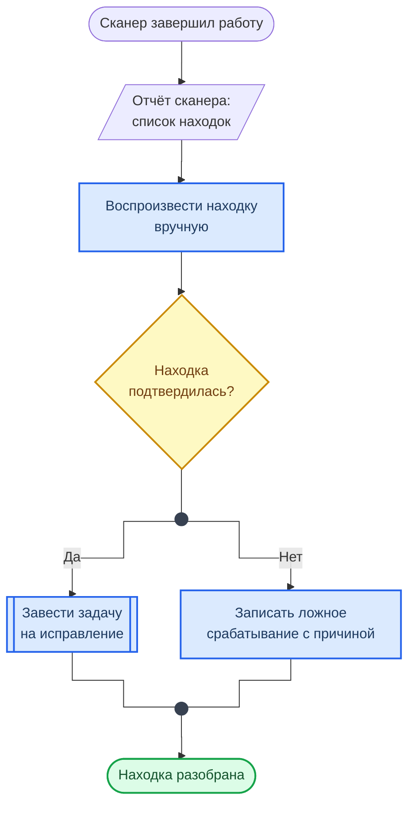

  

    <h1 class="hero-title">Как читать схемы курса</h1>
    
Обозначения, развилки, циклы и цвета

  

Схемы в курсе нарисованы в одной нотации — по ГОСТ 19.701-90 (ISO 5807). Форма блока говорит, что это: действие, данные или вопрос. Достаточно один раз запомнить семь обозначений, и любая схема курса читается без пояснений.

## Символы

  

  

    Терминатор
    ([текст])
  

  
Начало и конец: событие, которое запускает процесс, и результат, которым он заканчивается. Вход в процесс один, концов может быть несколько.

  

  

  

    Процесс
    [текст]
  

  
Действие. Названо глаголом: «Собрать проект», «Оценить уровень». Один блок — один шаг, который можно выполнить и проверить.

  

  

  

    Готовый блок
    [[текст]]
  

  
Предопределённый процесс: то, что вызывают целиком и не расписывают по шагам — команда, job конвейера, reusable workflow (<code>docker build</code>, <code>lint: ruff</code>).

  

  

  

    Данные
    [/текст/]
  

  
То, что подаётся на вход или получается на выходе: файл, отчёт сканера, слой образа, артефакт сборки, выход транзакции.

  

  

  

    Решение
    {текст?}
  

  
Вопрос, на который отвечают «Да» или «Нет». В ромб входит одна линия, выходы подписаны. Каждый ромб в лабораторной — место, где нужно остановиться и проверить результат.

  

  

  

    Точка
    ((&nbsp;))
  

  
Развилка или слияние линий. После ромба линия сначала приходит в точку, и уже из неё расходятся «Да» и «Нет». В точку же возвращаются циклы и сходятся параллельные ветки.

  

  

  

    Группа
    subgraph
  

  
Рамка с заголовком: этап или зона ответственности — «CI», «Образ», «Параллельно после lint». Линия, которая входит в рамку, относится ко всей группе, а не к одному блоку.

  

## Схема-образец

В образце встречаются все семь обозначений. Сюжет — разбор находки сканера, которым заканчиваются Лаб. 06–09.

**Как читать схему:**

- Сверху вниз. Стрелка означает «затем» или «передаётся дальше»; линия без стрелки ведёт в точку.
- Терминатор сверху — событие, с которого всё начинается; параллелограмм под ним — данные, с которыми работают дальше.
- Ромб — единственное место, где путь раздваивается. Подписи «Да» и «Нет» стоят на линиях после точки, а не на самом ромбе.
- Обе ветки сходятся во второй точке: процесс заканчивается одинаково, каким бы ни был ответ.
- Линия, уходящая вверх, — возврат на предыдущий шаг, то есть цикл. В образце его нет, в схеме анализа рисков (Лаб. 04) он есть: остаточный риск возвращается на оценку.

## Цвета

Цвет повторяет форму и не несёт смысла сам по себе: схема читается и в чёрно-белой печати.

  

  

    Синий
    stage
  

  
Действие: процесс или готовый блок.

  

  

  

    Жёлтый
    gate
  

  
Решение: развилка, на которой процесс может пойти по другому пути.

  

  

  

    Зелёный
    done
  

  
Результат: чем заканчивается успешный путь, либо то, что остаётся после процесса (непотраченный выход, записываемый слой).

  

  

  

    Серый или без заливки
    data
  

  
Данные и терминаторы. В структурных схемах — служебный слой (гипервизор, Docker Engine).

  

## Другие типы схем

**Диаграмма последовательности** — кто кому и в каком порядке что отправляет. Участники стоят сверху, время идёт вниз, стрелка — одно сообщение, плашка поперёк — примечание к этапу. Так нарисовано TCP-рукопожатие.

**Диаграмма состояний** — в каких состояниях бывает объект и что переводит его из одного в другое. Скруглённый блок — состояние, стрелка — переход, подпись на стрелке — команда. Чёрный кружок — начало, кружок в кольце — конец. Так нарисован жизненный цикл контейнера.

## Где схемы в курсе

- [Введение в CI/CD](guides/cicd_basics.md) — конвейер от push до релиза и порядок jobs в DevSecOps-пайплайне
- [Введение в сети и TCP/IP](guides/networking_basics.md) — установка и закрытие TCP-соединения
- [Основы Docker](guides/docker_basics.md) — виртуальные машины и контейнеры, слои образа, жизненный цикл контейнера
- [Лаб. 04 · Анализ и снижение рисков ИБ](../labs/basic/lab04.md) — цепочка анализа риска
- [MultiSig](examples/Multisignature.md) — транзакции Bitcoin в модели UTXO
- [Порты и протоколы](ports.md) — разбор открытого порта
- [CheatSheet: Git](cheatsheet/CHEATSHEET_GIT.md) — где живут изменения в Git
- [CheatSheet: GitHub CLI](cheatsheet/CHEATSHEET_GH_CLI.md) — цикл сдачи работы через pull request
- [OWASP — CI/CD Risks](OWASPTOP10/OWASP_Top_10_CICD_Risks.md) — риски по этапам конвейера
