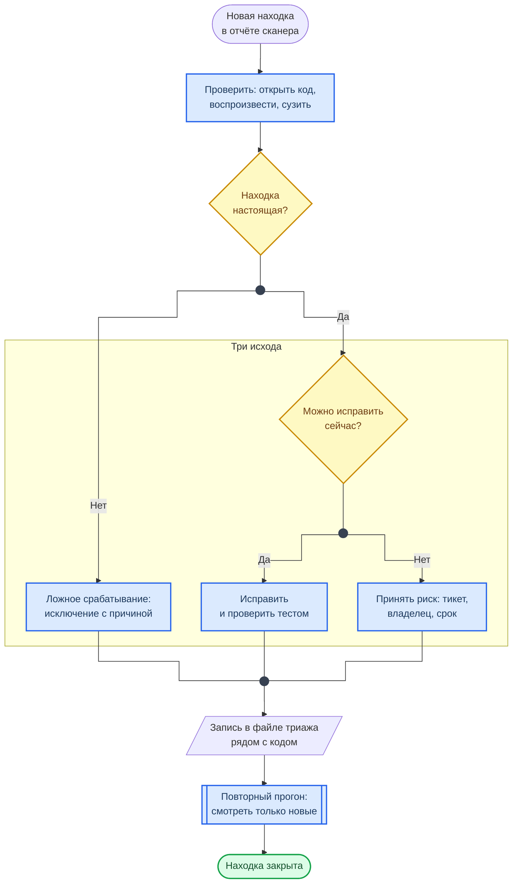

<div class="hero-section hero-section--compact">
  <div class="hero-content">
    <h1 class="hero-title">Разбор находок сканеров</h1>
    <p class="hero-sub">От строки отчёта к решению</p>
  </div>
</div>

Отчёт сканера — не список уязвимостей, а список гипотез. Сканер не знает, достижим ли код, откуда приходят данные и что для вас ценно. Разбор находок (триаж) превращает гипотезы в решения: исправить, обоснованно исключить или осознанно принять. Справочник нужен в [Лаб. 06](../labs/basic/lab06.md)–[Лаб. 09](../labs/basic/lab09.md).

## Путь одной находки

Схема показывает, что происходит с находкой от строки в отчёте до закрытия.



**Как читать схему:**

- Проверка идёт первой: открыть указанное место в коде, понять, откуда приходят данные, по возможности воспроизвести. Без этого дальнейшие решения — угадывание.
- Рамка — три исхода, и других нет. «Посмотрим потом» в неё не входит: такая находка остаётся новой и будет всплывать в каждом прогоне.
- Все исходы сходятся в запись: решение хранится в файле рядом с кодом, а не в голове и не в переписке.
- Повторный прогон делит находки на новые и уже разобранные. Смотреть нужно новые — иначе через месяц отчёт перестают читать вовсе.

Обозначения — в материале [Как читать схемы курса](diagrams_legend.md).

## Три исхода

<div class="lab-grid" style="grid-template-columns: repeat(auto-fill, minmax(min(19rem, 100%), 1fr));">

  <div class="lab-card" style="flex-direction: column; align-items: flex-start; gap: 0.5rem;">
  <div style="display:flex; align-items:baseline; gap:0.6rem; width:100%; flex-wrap:wrap;">
    <span class="lab-card-num" style="font-size:0.9rem; width:auto;">Ложное срабатывание</span>
    <span style="font-size:0.65rem; color:#888; font-family:var(--font-code);">false positive</span>
  </div>
  <dl class="lab-card-facts">
    <dt>Когда</dt><dd>Сканер ошибся: код недостижим, данные не приходят извне, это тестовая фикстура.</dd>
    <dt>Что записать</dt><dd>Исключение для конкретного правила и конкретного места — с причиной в той же строке.</dd>
    <dt>Ошибка</dt><dd>Отключить правило целиком или исключить каталог: вместе с шумом исчезнут будущие настоящие находки.</dd>
  </dl>
  </div>

  <div class="lab-card" style="flex-direction: column; align-items: flex-start; gap: 0.5rem;">
  <div style="display:flex; align-items:baseline; gap:0.6rem; width:100%; flex-wrap:wrap;">
    <span class="lab-card-num" style="font-size:0.9rem; width:auto;">Исправить</span>
    <span style="font-size:0.65rem; color:#888; font-family:var(--font-code);">to fix</span>
  </div>
  <dl class="lab-card-facts">
    <dt>Когда</dt><dd>Находка настоящая и правка посильна сейчас.</dd>
    <dt>Что записать</dt><dd>Коммит с исправлением и повторный прогон, который это подтвердил.</dd>
    <dt>Ошибка</dt><dd>Считать исправлением изменение кода без повторного сканирования.</dd>
  </dl>
  </div>

  <div class="lab-card" style="flex-direction: column; align-items: flex-start; gap: 0.5rem;">
  <div style="display:flex; align-items:baseline; gap:0.6rem; width:100%; flex-wrap:wrap;">
    <span class="lab-card-num" style="font-size:0.9rem; width:auto;">Принятый риск</span>
    <span style="font-size:0.65rem; color:#888; font-family:var(--font-code);">accepted risk</span>
  </div>
  <dl class="lab-card-facts">
    <dt>Когда</dt><dd>Находка настоящая, но исправить сейчас нельзя: нет версии с исправлением, нужна большая переделка.</dd>
    <dt>Что записать</dt><dd>Тикет, владелец, срок пересмотра — и запись в реестре рисков.</dd>
    <dt>Ошибка</dt><dd>Принять «навсегда». Просроченное принятие возвращается в список новых находок.</dd>
  </dl>
  </div>

</div>

## С чего начинать

Находок всегда больше, чем времени. Порядок разбора:

1. Секреты. Утёкший секрет опасен прямо сейчас, и лечится он ротацией, а не правкой кода.
2. Находки в том, что доступно снаружи: публичные эндпоинты, образы, которые уходят в production.
3. Уязвимости, которые уже эксплуатируются (каталог KEV), — независимо от числа CVSS.
4. Остальное — по уровню риска, а не по severity сканера: как перейти от одного к другому, показано в справочнике [CVSS и реестр рисков](risk_scoring.md).

## Как читать отчёт каждого сканера

### Semgrep

В находке важны три поля: идентификатор правила, путь со строкой и сообщение. Проверяется, действительно ли в эту строку приходят данные извне.

```bash
semgrep scan --config sast/semgrep-rules.yml --json -o semgrep-report.json .
```

```python
query = f"SELECT * FROM users WHERE id = {user_id}"  # nosemgrep: python-sql-injection -- user_id приводится к int строкой выше
```

Исключение ставится на конкретную строку, с идентификатором правила и причиной. Голый `# nosemgrep` без идентификатора выключает на строке все правила сразу.

### Checkov

У каждой проверки идентификатор вида `CKV_DOCKER_2` и статус `PASSED` или `FAILED`. Идентификатор ведёт к описанию: что проверяется и как исправить.

```dockerfile
#checkov:skip=CKV_DOCKER_2:проверка живости выполняется оркестратором
FROM python:3.12-slim
```

### OWASP Dependency-Check

Главный источник ложных срабатываний — неверно определённый компонент: библиотека с похожим именем сопоставляется с чужой уязвимостью. Проверяется, совпадают ли продукт и версия из описания CVE с тем, что подключено на самом деле.

```xml
<suppress>
  <notes>CVE относится к серверной части продукта, в проекте используется только клиентская библиотека</notes>
  <packageUrl regex="true">^pkg:maven/org\.example/client@.*$</packageUrl>
  <cve>CVE-2020-0000</cve>
</suppress>
```

### Trivy

Ключевые поля — установленная версия и версия с исправлением. Если версия с исправлением есть, находка лечится обновлением; если нет — это кандидат в принятый риск со сроком пересмотра.

```bash
trivy image --severity HIGH,CRITICAL --ignore-unfixed app:latest
```

```text
# .trivyignore: одна строка — одна уязвимость, причина и срок рядом
# уязвимая функция библиотеки в приложении не вызывается; пересмотреть после выхода исправления
CVE-2024-0000 exp:2026-12-31
```

### OWASP ZAP

У находки две оси: риск и уверенность сканера. Высокий риск с низкой уверенностью проверяется вручную в первую очередь — это либо серьёзная проблема, либо ложное срабатывание. Пороги для конвейера задаются в файле правил: идентификатор правила, действие и пояснение, разделённые табуляцией.

```text
10020	WARN	(Anti-clickjacking Header)
10038	FAIL	(Content Security Policy Header Not Set)
10096	IGNORE	(Timestamp Disclosure - Unix)
```

### Gitleaks

Находка — это строка, похожая на секрет, в файле или в истории. Порядок жёсткий: сначала выяснить, настоящий ли секрет; если да — сначала ротация, потом всё остальное.

```text
# .gitleaksignore: отпечаток конкретной находки, а не путь к файлу
labs/basic/lab07/README.md:generic-api-key:304
```

!!! warning "Правило"
    Исключение для секретов делается по отпечатку конкретной находки, а не по маске пути. Исключённый каталог перестаёт проверяться целиком — и для будущих коммитов, и для того, что уже лежит в истории. Подавление находки без подтверждённой ротации — это маскировка инцидента.

## Сканер обязан доказать, что сканировал

«Ноль находок» и «сканер не дошёл до кода» выглядят одинаково. Прежде чем радоваться чистому отчёту, проверяют покрытие:

- Semgrep — строка `Ran N rules on M files`: ноль файлов означает неверный путь или слишком широкий `.semgrepignore`.
- Trivy — число проверенных целей и наличие базы уязвимостей; без базы отчёт пуст всегда.
- Dependency-Check — число проанализированных зависимостей.
- Gitleaks — число просканированных коммитов.
- ZAP — число пройденных адресов: если краулер не ушёл дальше главной страницы, сканировать было нечего.

Отчёт в пару сотен байт — пустой каркас. Смотрят в файл, а не на факт его существования.

## Файл триажа

Решения хранятся в репозитории рядом с кодом: так они проходят ревью, видны в истории и не теряются.

```yaml
- id: semgrep:python-sql-injection:app.py:42
  decision: false-positive
  reason: user_id приводится к int строкой выше
  by: alice
  date: 2026-09-18
- id: trivy:CVE-2024-0000:app:latest
  decision: accepted
  reason: версии с исправлением нет, уязвимая функция не вызывается
  ticket: SEC-128
  owner: команда платформы
  review: 2026-12-31
```

## Смотри также

- [CVSS и реестр рисков](risk_scoring.md) — как принятая находка становится строкой реестра
- [Классификация инструментов](appsec_tt.md) — чего не видит каждый класс сканеров
- [OWASP — CI/CD Risks](OWASPTOP10/OWASP_Top_10_CICD_Risks.md)
- [Лаб. 07 · SAST, SCA и поиск секретов](../labs/basic/lab07.md), [Лаб. 09 · DevSecOps CI/CD](../labs/basic/lab09.md)
