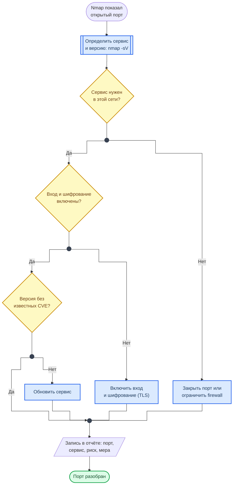

  

    <h1 class="hero-title">Порты и протоколы</h1>
    
Справочник для AppSec-задач

  

Открытый порт — это не уязвимость, а вопрос: что за сервис его слушает, должен ли он быть доступен отсюда и как он настроен. Каждая карточка отвечает на четыре вопроса: **какой сервис** стоит за портом, **в чём риск**, **как проверить** его в лабораторной сети и **как защитить**.

> Сканировать можно только свои системы и стенды лабораторных. Сканирование чужих адресов без письменного разрешения владельца — основание для блокировки провайдером и для уголовной ответственности. Подробнее — во вводной части [Лаб. 03](../labs/basic/lab03.md).

## Открытый порт: что дальше

Схема показывает, какие вопросы задать по каждому порту из вывода Nmap и чем заканчивается каждый ответ.

**Как читать схему:**

- Сначала сервис и версия: номер порта ничего не гарантирует, на 8080 может оказаться что угодно.
- Три ромба — три вопроса по порядку. Если сервис в этой сети не нужен, остальные вопросы теряют смысл: порт закрывают.
- Любое «Нет» даёт меру, все меры сходятся в одну точку: в отчёт попадает каждый порт, в том числе тот, с которым всё в порядке.
- Строка отчёта собирается из карточки порта: сервис, риск, проверка, защита.

Обозначения — в материале [Как читать схемы курса](diagrams_legend.md).

## Веб-сервисы

  

  

    80
    TCP · HTTP
  

  <dl class="lab-card-facts">
    <dt>Сервис</dt><dd>Веб-сервер без шифрования: сайты, API, редирект на HTTPS.</dd>
    <dt>Риск</dt><dd>Трафик идёт открытым текстом: в одной сети с жертвой перехватываются cookie и пароли, ответ сервера можно подменить (MitM).</dd>
    <dt>Проверка</dt><dd><code>nmap -p 80 --script http-title,http-headers &lt;target&gt;</code></dd>
    <dt>Защита</dt><dd>Оставить на 80 только редирект на 443 и включить HSTS.</dd>
  </dl>
  

  

  

    443
    TCP · HTTPS
  

  <dl class="lab-card-facts">
    <dt>Сервис</dt><dd>Веб-сервер с TLS.</dd>
    <dt>Риск</dt><dd>Шифрование есть, но бывает слабым: устаревшие TLS 1.0 и 1.1, слабые шифры, просроченный или самоподписанный сертификат.</dd>
    <dt>Проверка</dt><dd><code>nmap -p 443 --script ssl-enum-ciphers,ssl-cert &lt;target&gt;</code></dd>
    <dt>Защита</dt><dd>TLS 1.2 и выше, современные шифры, автопродление сертификата, HSTS.</dd>
  </dl>
  

  

  

    8080
    TCP · HTTP alt
  

  <dl class="lab-card-facts">
    <dt>Сервис</dt><dd>Запасной HTTP-порт: Tomcat, Jenkins, прокси, dev-серверы.</dd>
    <dt>Риск</dt><dd>Сюда выставляют админки и отладочные интерфейсы без входа. Открытая панель Jenkins или Tomcat Manager — это уже выполнение кода на сервере.</dd>
    <dt>Проверка</dt><dd><code>nmap -sV -p 8080 --script http-title &lt;target&gt;</code></dd>
    <dt>Защита</dt><dd>Не публиковать наружу: доступ через VPN или reverse proxy с аутентификацией.</dd>
  </dl>
  

  

  

    8443
    TCP · HTTPS alt
  

  <dl class="lab-card-facts">
    <dt>Сервис</dt><dd>Запасной HTTPS-порт: Tomcat, панели управления, API.</dd>
    <dt>Риск</dt><dd>Те же, что у 443, плюс самоподписанные сертификаты: пользователи привыкают нажимать «Продолжить» и перестают замечать подмену.</dd>
    <dt>Проверка</dt><dd><code>nmap -p 8443 --script ssl-cert,http-title &lt;target&gt;</code></dd>
    <dt>Защита</dt><dd>Сертификат от доверенного центра, панели управления — только из внутренней сети.</dd>
  </dl>
  

  

  

    3000
    TCP · Dev server
  

  <dl class="lab-card-facts">
    <dt>Сервис</dt><dd>Порт по умолчанию у Node.js-приложений в режиме разработки, Gitea, Grafana.</dd>
    <dt>Риск</dt><dd>Dev-режим на боевом сервере: подробные ошибки со стеком вызовов, отладочные маршруты, отключённые проверки.</dd>
    <dt>Проверка</dt><dd><code>curl -si http://&lt;target&gt;:3000/ | head -20</code></dd>
    <dt>Защита</dt><dd>В production — сборка без dev-режима за reverse proxy, сам порт наружу не открывать.</dd>
  </dl>
  

  

  

    9090
    TCP · Prometheus
  

  <dl class="lab-card-facts">
    <dt>Сервис</dt><dd>Сервер метрик Prometheus с веб-интерфейсом и API.</dd>
    <dt>Риск</dt><dd>Аутентификации по умолчанию нет. Список целей и метки раскрывают внутренние адреса, имена сервисов и их версии.</dd>
    <dt>Проверка</dt><dd><code>curl -s http://&lt;target&gt;:9090/api/v1/targets | head -c 400</code></dd>
    <dt>Защита</dt><dd>Закрыть от внешней сети, включить basic auth или поставить за прокси с входом.</dd>
  </dl>
  

## Базы данных

SQL-инъекция к этим портам отношения не имеет: она идёт через приложение, которое само ходит в базу. Риск открытого порта СУБД другой — к базе можно подключиться напрямую, минуя приложение и его проверки.

  

  

    3306
    TCP · MySQL / MariaDB
  

  <dl class="lab-card-facts">
    <dt>Сервис</dt><dd>СУБД MySQL или MariaDB.</dd>
    <dt>Риск</dt><dd>База, доступная из интернета, — цель перебора паролей. Слабый пароль root отдаёт все данные сразу.</dd>
    <dt>Проверка</dt><dd><code>nmap -sV -p 3306 --script mysql-info &lt;target&gt;</code></dd>
    <dt>Защита</dt><dd><code>bind-address</code> на 127.0.0.1 или внутренний адрес, отдельные учётные записи с минимумом прав.</dd>
  </dl>
  

  

  

    5432
    TCP · PostgreSQL
  

  <dl class="lab-card-facts">
    <dt>Сервис</dt><dd>СУБД PostgreSQL.</dd>
    <dt>Риск</dt><dd>Кто и откуда подключается, решает <code>pg_hba.conf</code>. Строка <code>host all all 0.0.0.0/0 trust</code> пускает любого без пароля.</dd>
    <dt>Проверка</dt><dd><code>nmap -sV -p 5432 &lt;target&gt;</code></dd>
    <dt>Защита</dt><dd><code>listen_addresses</code> только на нужный интерфейс, в <code>pg_hba.conf</code> — <code>scram-sha-256</code> и конкретные подсети.</dd>
  </dl>
  

  

  

    27017
    TCP · MongoDB
  

  <dl class="lab-card-facts">
    <dt>Сервис</dt><dd>Документная СУБД MongoDB.</dd>
    <dt>Риск</dt><dd>Небрежные конфигурации запускаются без аутентификации: любой подключившийся читает и удаляет базы. Так утекали тысячи баз, найденных поисковиками по открытым портам.</dd>
    <dt>Проверка</dt><dd><code>nmap -p 27017 --script mongodb-info &lt;target&gt;</code></dd>
    <dt>Защита</dt><dd><code>authorization: enabled</code>, <code>bindIp</code> на внутренний адрес.</dd>
  </dl>
  

  

  

    6379
    TCP · Redis
  

  <dl class="lab-card-facts">
    <dt>Сервис</dt><dd>Хранилище «ключ-значение» и кэш Redis.</dd>
    <dt>Риск</dt><dd>Пароля по умолчанию нет. Через запись на диск (<code>CONFIG SET dir</code> и <code>SAVE</code>) атакующий кладёт на сервер свой SSH-ключ или cron-задачу — это выполнение кода.</dd>
    <dt>Проверка</dt><dd><code>nmap -p 6379 --script redis-info &lt;target&gt;</code></dd>
    <dt>Защита</dt><dd><code>requirepass</code> или ACL, <code>bind 127.0.0.1</code>, protected-mode не выключать.</dd>
  </dl>
  

  

  

    1433
    TCP · MSSQL
  

  <dl class="lab-card-facts">
    <dt>Сервис</dt><dd>Microsoft SQL Server.</dd>
    <dt>Риск</dt><dd>Перебор пароля учётной записи <code>sa</code>. С правами sysadmin процедура <code>xp_cmdshell</code> выполняет команды операционной системы.</dd>
    <dt>Проверка</dt><dd><code>nmap -p 1433 --script ms-sql-info &lt;target&gt;</code></dd>
    <dt>Защита</dt><dd>Отключить <code>sa</code> и <code>xp_cmdshell</code>, Windows-аутентификация, доступ только с серверов приложений.</dd>
  </dl>
  

  

  

    9200
    TCP · Elasticsearch
  

  <dl class="lab-card-facts">
    <dt>Сервис</dt><dd>Поисковый движок Elasticsearch, REST API.</dd>
    <dt>Риск</dt><dd>Без включённой защиты API отдаёт и удаляет любые индексы без пароля — частая причина утечек логов и персональных данных.</dd>
    <dt>Проверка</dt><dd><code>curl -s http://&lt;target&gt;:9200/_cat/indices?v</code></dd>
    <dt>Защита</dt><dd>Включить security (TLS и пользователи), порт наружу не публиковать.</dd>
  </dl>
  

## SSH и удалённый доступ

  

  

    22
    TCP · SSH
  

  <dl class="lab-card-facts">
    <dt>Сервис</dt><dd>Удалённый доступ к серверу по SSH.</dd>
    <dt>Риск</dt><dd>Пароли постоянно перебирают боты. Вход root по паролю и устаревшие алгоритмы упрощают взлом.</dd>
    <dt>Проверка</dt><dd><code>nmap -p 22 --script ssh2-enum-algos,ssh-auth-methods &lt;target&gt;</code></dd>
    <dt>Защита</dt><dd>Только ключи (<code>PasswordAuthentication no</code>), <code>PermitRootLogin no</code>, fail2ban или доступ через VPN.</dd>
  </dl>
  

  

  

    3389
    TCP · RDP
  

  <dl class="lab-card-facts">
    <dt>Сервис</dt><dd>Удалённый рабочий стол Windows.</dd>
    <dt>Риск</dt><dd>Перебор паролей и уязвимости самого сервиса: BlueKeep (CVE-2019-0708) давал выполнение кода без входа. Открытый RDP — типичная точка входа шифровальщиков.</dd>
    <dt>Проверка</dt><dd><code>nmap -p 3389 --script rdp-enum-encryption,rdp-ntlm-info &lt;target&gt;</code></dd>
    <dt>Защита</dt><dd>В интернет не публиковать: VPN или RD Gateway, NLA, MFA, обновления.</dd>
  </dl>
  

  

  

    23
    TCP · Telnet
  

  <dl class="lab-card-facts">
    <dt>Сервис</dt><dd>Удалённый терминал без шифрования; встречается на старом сетевом оборудовании и IoT.</dd>
    <dt>Риск</dt><dd>Логин и пароль идут открытым текстом и перехватываются обычным сниффером.</dd>
    <dt>Проверка</dt><dd><code>nmap -sV -p 23 &lt;target&gt;</code></dd>
    <dt>Защита</dt><dd>Отключить и заменить на SSH.</dd>
  </dl>
  

  

  

    5900
    TCP · VNC
  

  <dl class="lab-card-facts">
    <dt>Сервис</dt><dd>Удалённый рабочий стол VNC.</dd>
    <dt>Риск</dt><dd>Бывает вообще без пароля, а классическая аутентификация VNC учитывает только первые 8 символов пароля; трафик не шифруется.</dd>
    <dt>Проверка</dt><dd><code>nmap -p 5900 --script vnc-info &lt;target&gt;</code></dd>
    <dt>Защита</dt><dd>Только через SSH-туннель или VPN.</dd>
  </dl>
  

## CI/CD и DevOps

  

  

    2375
    TCP · Docker API
  

  <dl class="lab-card-facts">
    <dt>Сервис</dt><dd>API Docker-демона по TCP без TLS (2376 — с TLS).</dd>
    <dt>Риск</dt><dd>Доступ к API равен root на хосте: можно запустить привилегированный контейнер с примонтированным корнем и выйти в систему.</dd>
    <dt>Проверка</dt><dd><code>curl -s http://&lt;target&gt;:2375/version</code></dd>
    <dt>Защита</dt><dd>TCP-сокет не включать; если он нужен — только 2376 со взаимным TLS.</dd>
  </dl>
  

  

  

    6443
    TCP · Kubernetes API
  

  <dl class="lab-card-facts">
    <dt>Сервис</dt><dd>API-сервер Kubernetes — точка управления кластером.</dd>
    <dt>Риск</dt><dd>Анонимный доступ или слишком широкие роли RBAC дают чтение секретов и запуск подов.</dd>
    <dt>Проверка</dt><dd><code>curl -sk https://&lt;target&gt;:6443/version</code></dd>
    <dt>Защита</dt><dd><code>--anonymous-auth=false</code>, RBAC по принципу минимальных прав, доступ к API из ограниченных сетей.</dd>
  </dl>
  

  

  

    10250
    TCP · Kubelet
  

  <dl class="lab-card-facts">
    <dt>Сервис</dt><dd>Агент Kubernetes на каждой ноде.</dd>
    <dt>Риск</dt><dd>При разрешённом анонимном доступе API kubelet позволяет выполнять команды в любом поде этой ноды.</dd>
    <dt>Проверка</dt><dd><code>curl -sk https://&lt;target&gt;:10250/pods | head -c 300</code></dd>
    <dt>Защита</dt><dd><code>--anonymous-auth=false</code>, <code>--authorization-mode=Webhook</code>, порт закрыт снаружи.</dd>
  </dl>
  

  

  

    5000
    TCP · Docker Registry
  

  <dl class="lab-card-facts">
    <dt>Сервис</dt><dd>Частный реестр образов Docker.</dd>
    <dt>Риск</dt><dd>Без аутентификации любой скачивает образы (в них бывают секреты) и заливает свой образ под тем же тегом — подмена образа в конвейере.</dd>
    <dt>Проверка</dt><dd><code>curl -s http://&lt;target&gt;:5000/v2/_catalog</code></dd>
    <dt>Защита</dt><dd>Аутентификация и TLS, подпись образов, деплой по digest, а не по тегу.</dd>
  </dl>
  

  

  

    9000
    TCP · SonarQube
  

  <dl class="lab-card-facts">
    <dt>Сервис</dt><dd>Сервер анализа качества кода SonarQube.</dd>
    <dt>Риск</dt><dd>Учётная запись по умолчанию <code>admin:admin</code> и публичные проекты раскрывают исходный код вместе с найденными в нём уязвимостями.</dd>
    <dt>Проверка</dt><dd><code>curl -s http://&lt;target&gt;:9000/api/system/status</code></dd>
    <dt>Защита</dt><dd>Сменить пароль admin, включить Force user authentication, наружу не публиковать.</dd>
  </dl>
  

  

  

    2379
    TCP · etcd
  

  <dl class="lab-card-facts">
    <dt>Сервис</dt><dd>Хранилище состояния кластера Kubernetes.</dd>
    <dt>Риск</dt><dd>В etcd лежат все секреты кластера. Доступ без клиентского сертификата — это доступ ко всему кластеру.</dd>
    <dt>Проверка</dt><dd><code>curl -s http://&lt;target&gt;:2379/version</code></dd>
    <dt>Защита</dt><dd>Взаимный TLS, доступ только с control plane, шифрование секретов на диске.</dd>
  </dl>
  

## DNS и сетевые сервисы

  

  

    53
    TCP/UDP · DNS
  

  <dl class="lab-card-facts">
    <dt>Сервис</dt><dd>Сервер имён: UDP для запросов, TCP для больших ответов и передачи зон.</dd>
    <dt>Риск</dt><dd>Разрешённая всем передача зоны (AXFR) отдаёт полный список хостов. Открытый рекурсивный резолвер используют для усиления DDoS-атак.</dd>
    <dt>Проверка</dt><dd><code>dig axfr &lt;zone&gt; @&lt;target&gt;</code></dd>
    <dt>Защита</dt><dd>AXFR только для вторичных серверов, рекурсия только для своих сетей.</dd>
  </dl>
  

  

  

    389
    TCP · LDAP
  

  <dl class="lab-card-facts">
    <dt>Сервис</dt><dd>Служба каталогов: пользователи и группы (Active Directory, OpenLDAP).</dd>
    <dt>Риск</dt><dd>Анонимный bind позволяет перечислить пользователей. Без TLS пароль при простом bind идёт открытым текстом.</dd>
    <dt>Проверка</dt><dd><code>nmap -p 389 --script ldap-rootdse &lt;target&gt;</code></dd>
    <dt>Защита</dt><dd>Запретить анонимный bind, LDAPS (636) или StartTLS.</dd>
  </dl>
  

  

  

    445
    TCP · SMB
  

  <dl class="lab-card-facts">
    <dt>Сервис</dt><dd>Общие папки и принтеры Windows.</dd>
    <dt>Риск</dt><dd>Уязвимость SMBv1 EternalBlue (MS17-010) — основа эпидемии WannaCry. Нулевые сессии раскрывают пользователей и общие ресурсы.</dd>
    <dt>Проверка</dt><dd><code>nmap -p 445 --script smb-protocols,smb-vuln-ms17-010 &lt;target&gt;</code></dd>
    <dt>Защита</dt><dd>Отключить SMBv1, не выпускать 445 за периметр, включить подпись SMB.</dd>
  </dl>
  

  

  

    161
    UDP · SNMP
  

  <dl class="lab-card-facts">
    <dt>Сервис</dt><dd>Мониторинг и управление сетевым оборудованием.</dd>
    <dt>Риск</dt><dd>SNMP v1 и v2c защищены только строкой community. Значение <code>public</code> отдаёт конфигурацию устройства, <code>private</code> позволяет её менять.</dd>
    <dt>Проверка</dt><dd><code>nmap -sU -p 161 --script snmp-info &lt;target&gt;</code></dd>
    <dt>Защита</dt><dd>SNMPv3 с аутентификацией и шифрованием, ACL на адреса мониторинга.</dd>
  </dl>
  

## Мониторинг и логирование

  

  

    3000
    TCP · Grafana
  

  <dl class="lab-card-facts">
    <dt>Сервис</dt><dd>Дашборды Grafana.</dd>
    <dt>Риск</dt><dd>Пароль <code>admin:admin</code> по умолчанию. Источники данных позволяют делать запросы во внутреннюю сеть от имени сервера (SSRF).</dd>
    <dt>Проверка</dt><dd><code>curl -s http://&lt;target&gt;:3000/api/health</code></dd>
    <dt>Защита</dt><dd>Сменить пароль admin, отключить анонимный доступ, вход через SSO.</dd>
  </dl>
  

  

  

    5601
    TCP · Kibana
  

  <dl class="lab-card-facts">
    <dt>Сервис</dt><dd>Веб-интерфейс к Elasticsearch.</dd>
    <dt>Риск</dt><dd>Без аутентификации открывает все логи, а в логах — токены, внутренние адреса, персональные данные.</dd>
    <dt>Проверка</dt><dd><code>curl -s http://&lt;target&gt;:5601/api/status | head -c 300</code></dd>
    <dt>Защита</dt><dd>Включить security в Elastic Stack, доступ через прокси с входом.</dd>
  </dl>
  

  

  

    514
    UDP · Syslog
  

  <dl class="lab-card-facts">
    <dt>Сервис</dt><dd>Приём системных журналов по UDP.</dd>
    <dt>Риск</dt><dd>Нет ни шифрования, ни проверки отправителя: журналы читаются в сети, а поддельные записи искажают расследование инцидента.</dd>
    <dt>Проверка</dt><dd><code>nmap -sU -p 514 &lt;target&gt;</code></dd>
    <dt>Защита</dt><dd>Syslog поверх TLS (порт 6514), приём только с известных адресов.</dd>
  </dl>
  

  

  

    5044
    TCP · Logstash
  

  <dl class="lab-card-facts">
    <dt>Сервис</dt><dd>Приём логов от агентов Beats.</dd>
    <dt>Риск</dt><dd>Без TLS и проверки клиента любой может слать поддельные события в конвейер логов.</dd>
    <dt>Проверка</dt><dd><code>nmap -sV -p 5044 &lt;target&gt;</code></dd>
    <dt>Защита</dt><dd>TLS с клиентскими сертификатами, порт доступен только агентам.</dd>
  </dl>
  

## Nmap — быстрые команды

  

  
Quick scan

  top-1000
  
<code>nmap -sV -sC -T4 &lt;target&gt;</code>

  
Тысяча самых частых TCP-портов. <code>-sV</code> определяет сервис и версию, <code>-sC</code> запускает безопасные скрипты по умолчанию, <code>-T4</code> ускоряет тайминги — для своей лабораторной сети, не для чужой.

  

  

  
Full TCP + NSE

  all ports
  
<code>nmap -sV -sC -p- &lt;target&gt;</code>

  
Все 65535 TCP-портов. Долго, зато находит сервисы на нестандартных портах — именно там прячут админки.

  

  

  
DevOps порты

  CI/CD + K8s
  
<code>nmap -sV -p 2375,2376,5000,6443,8080,9000,9090,10250 &lt;target&gt;</code>

  
Docker API, реестр, Kubernetes API и kubelet, Jenkins, SonarQube, Prometheus — то, что даёт доступ к конвейеру и кластеру.

  

  

  
БД порты

  databases
  
<code>nmap -sV -p 1433,1521,3306,5432,6379,9200,27017 &lt;target&gt;</code>

  
MSSQL, Oracle, MySQL, PostgreSQL, Redis, Elasticsearch, MongoDB — всё, к чему можно подключиться в обход приложения.

  

