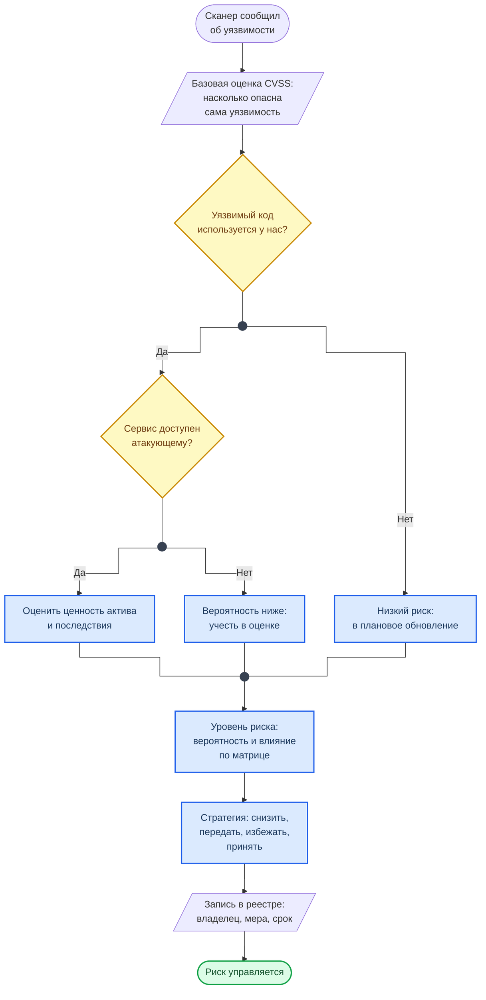

<div class="hero-section hero-section--compact">
  <div class="hero-content">
    <h1 class="hero-title">CVSS и реестр рисков</h1>
    <p class="hero-sub">От оценки уязвимости к решению</p>
  </div>
</div>

Сканеры в Лаб. 06–09 выдают находки с оценкой CVSS. Эта оценка говорит, насколько опасна уязвимость сама по себе, — и ничего не говорит о том, насколько она опасна для вас. Справочник показывает, как прочитать оценку, какие вопросы задать сверх неё и как записать результат, чтобы по нему можно было принять решение. Нужен в [Лаб. 04](../labs/basic/lab04.md) и [Лаб. 10](../labs/basic/lab10.md).

## Как читать вектор CVSS

Оценка — не только число. Рядом с ней всегда есть вектор, например:

```text
CVSS:3.1/AV:N/AC:L/PR:N/UI:N/S:U/C:H/I:H/A:H    →  9.8 Critical
```

Он читается как фраза: атака по сети, без особых условий, без прав и без участия пользователя; ущерб не выходит за компонент, но полностью затрагивает конфиденциальность, целостность и доступность. Число — следствие этих восьми ответов, поэтому спорить нужно не с числом, а с конкретной метрикой.

<div class="lab-grid" style="grid-template-columns: repeat(auto-fill, minmax(min(19rem, 100%), 1fr));">

  <div class="lab-card" style="flex-direction: column; align-items: flex-start; gap: 0.5rem;">
  <div style="display:flex; align-items:baseline; gap:0.6rem; width:100%; flex-wrap:wrap;">
    <span class="lab-card-num" style="font-size:0.9rem; width:auto;">AV</span>
    <span style="font-size:0.65rem; color:#888; font-family:var(--font-code);">Attack Vector</span>
  </div>
  <dl class="lab-card-facts">
    <dt>Вопрос</dt><dd>Откуда можно атаковать.</dd>
    <dt>Значения</dt><dd><code>N</code> по сети, <code>A</code> из соседней сети, <code>L</code> локально, <code>P</code> нужен физический доступ.</dd>
  </dl>
  </div>

  <div class="lab-card" style="flex-direction: column; align-items: flex-start; gap: 0.5rem;">
  <div style="display:flex; align-items:baseline; gap:0.6rem; width:100%; flex-wrap:wrap;">
    <span class="lab-card-num" style="font-size:0.9rem; width:auto;">AC</span>
    <span style="font-size:0.65rem; color:#888; font-family:var(--font-code);">Attack Complexity</span>
  </div>
  <dl class="lab-card-facts">
    <dt>Вопрос</dt><dd>Нужны ли особые условия, не зависящие от атакующего.</dd>
    <dt>Значения</dt><dd><code>L</code> срабатывает всегда, <code>H</code> нужно стечение обстоятельств.</dd>
  </dl>
  </div>

  <div class="lab-card" style="flex-direction: column; align-items: flex-start; gap: 0.5rem;">
  <div style="display:flex; align-items:baseline; gap:0.6rem; width:100%; flex-wrap:wrap;">
    <span class="lab-card-num" style="font-size:0.9rem; width:auto;">PR</span>
    <span style="font-size:0.65rem; color:#888; font-family:var(--font-code);">Privileges Required</span>
  </div>
  <dl class="lab-card-facts">
    <dt>Вопрос</dt><dd>Какие права нужны заранее.</dd>
    <dt>Значения</dt><dd><code>N</code> никаких, <code>L</code> обычный пользователь, <code>H</code> администратор.</dd>
  </dl>
  </div>

  <div class="lab-card" style="flex-direction: column; align-items: flex-start; gap: 0.5rem;">
  <div style="display:flex; align-items:baseline; gap:0.6rem; width:100%; flex-wrap:wrap;">
    <span class="lab-card-num" style="font-size:0.9rem; width:auto;">UI</span>
    <span style="font-size:0.65rem; color:#888; font-family:var(--font-code);">User Interaction</span>
  </div>
  <dl class="lab-card-facts">
    <dt>Вопрос</dt><dd>Должен ли что-то сделать пользователь.</dd>
    <dt>Значения</dt><dd><code>N</code> нет, <code>R</code> да: открыть ссылку, файл, страницу.</dd>
  </dl>
  </div>

  <div class="lab-card" style="flex-direction: column; align-items: flex-start; gap: 0.5rem;">
  <div style="display:flex; align-items:baseline; gap:0.6rem; width:100%; flex-wrap:wrap;">
    <span class="lab-card-num" style="font-size:0.9rem; width:auto;">S</span>
    <span style="font-size:0.65rem; color:#888; font-family:var(--font-code);">Scope</span>
  </div>
  <dl class="lab-card-facts">
    <dt>Вопрос</dt><dd>Выходит ли ущерб за пределы уязвимого компонента.</dd>
    <dt>Значения</dt><dd><code>U</code> остаётся внутри, <code>C</code> затрагивает другие компоненты — например, выход из контейнера на хост.</dd>
  </dl>
  </div>

  <div class="lab-card" style="flex-direction: column; align-items: flex-start; gap: 0.5rem;">
  <div style="display:flex; align-items:baseline; gap:0.6rem; width:100%; flex-wrap:wrap;">
    <span class="lab-card-num" style="font-size:0.9rem; width:auto;">C / I / A</span>
    <span style="font-size:0.65rem; color:#888; font-family:var(--font-code);">Confidentiality, Integrity, Availability</span>
  </div>
  <dl class="lab-card-facts">
    <dt>Вопрос</dt><dd>Что страдает: тайна данных, их целостность, доступность сервиса.</dd>
    <dt>Значения</dt><dd>Для каждого отдельно: <code>N</code> нет, <code>L</code> частично, <code>H</code> полностью.</dd>
  </dl>
  </div>

</div>

Число переводится в слово по шкале.

<div class="lab-grid" style="grid-template-columns: repeat(auto-fill, minmax(min(14rem, 100%), 1fr));">

  <div class="lab-card" style="flex-direction: column; align-items: flex-start; gap: 0.5rem;">
  <div style="display:flex; align-items:baseline; gap:0.6rem; width:100%; flex-wrap:wrap;">
    <span class="lab-card-num" style="font-size:0.9rem; width:auto;">0.1 – 3.9</span>
    <span style="font-size:0.65rem; color:#888; font-family:var(--font-code);">Low</span>
  </div>
  <dl class="lab-card-facts">
    <dt>Обычно значит</dt><dd>Нужны локальный доступ, высокие права или действие пользователя, а ущерб ограничен.</dd>
  </dl>
  </div>

  <div class="lab-card" style="flex-direction: column; align-items: flex-start; gap: 0.5rem;">
  <div style="display:flex; align-items:baseline; gap:0.6rem; width:100%; flex-wrap:wrap;">
    <span class="lab-card-num" style="font-size:0.9rem; width:auto;">4.0 – 6.9</span>
    <span style="font-size:0.65rem; color:#888; font-family:var(--font-code);">Medium</span>
  </div>
  <dl class="lab-card-facts">
    <dt>Обычно значит</dt><dd>Есть серьёзное условие для атаки или ущерб частичный.</dd>
  </dl>
  </div>

  <div class="lab-card" style="flex-direction: column; align-items: flex-start; gap: 0.5rem;">
  <div style="display:flex; align-items:baseline; gap:0.6rem; width:100%; flex-wrap:wrap;">
    <span class="lab-card-num" style="font-size:0.9rem; width:auto;">7.0 – 8.9</span>
    <span style="font-size:0.65rem; color:#888; font-family:var(--font-code);">High</span>
  </div>
  <dl class="lab-card-facts">
    <dt>Обычно значит</dt><dd>Атака по сети с ощутимым ущербом, но с одним ограничением — правами или действием пользователя.</dd>
  </dl>
  </div>

  <div class="lab-card" style="flex-direction: column; align-items: flex-start; gap: 0.5rem;">
  <div style="display:flex; align-items:baseline; gap:0.6rem; width:100%; flex-wrap:wrap;">
    <span class="lab-card-num" style="font-size:0.9rem; width:auto;">9.0 – 10.0</span>
    <span style="font-size:0.65rem; color:#888; font-family:var(--font-code);">Critical</span>
  </div>
  <dl class="lab-card-facts">
    <dt>Обычно значит</dt><dd>По сети, без прав, без участия пользователя, с полным ущербом.</dd>
  </dl>
  </div>

</div>

Большинство сканеров курса отдают оценки версии 3.1. В CVSS 4.0 метрики сгруппированы иначе и добавлены уточняющие группы, но принцип тот же: вектор важнее числа.

## От находки к риску

Схема показывает, какие вопросы нужно задать после того, как сканер назвал оценку, и чем заканчивается каждый ответ.



**Как читать схему:**

- Базовая оценка — вход, а не вывод. Она одинакова для всех, у кого есть эта уязвимость, а риск у каждого свой.
- Первый вопрос — про достижимость: сканер зависимостей сообщает, что уязвимая библиотека подключена, но не знает, вызывается ли уязвимая функция.
- Второй вопрос — про доступность: одна и та же уязвимость в сервисе, открытом в интернет, и в сервисе внутренней сети даёт разную вероятность.
- Все три ветки сходятся: даже низкий риск оценивается и записывается. Решение «ничего не делать» тоже должно быть чьим-то и с датой.

Обозначения — в материале [Как читать схемы курса](diagrams_legend.md).

Вероятность уточняют два открытых источника: EPSS — оценка вероятности эксплуатации уязвимости в ближайшие 30 дней — и каталог KEV, список уязвимостей, которые уже эксплуатируются. Уязвимость из KEV обрабатывают в первую очередь независимо от числа CVSS.

## Шкалы и уровень риска

Уровень риска — произведение вероятности на влияние. Шкалы ниже — рабочий пример; в организации они задаются один раз и для всех, иначе оценки разных людей нельзя сравнивать.

<div class="lab-grid" style="grid-template-columns: repeat(auto-fill, minmax(min(19rem, 100%), 1fr));">

  <div class="lab-card" style="flex-direction: column; align-items: flex-start; gap: 0.5rem;">
  <div style="display:flex; align-items:baseline; gap:0.6rem; width:100%; flex-wrap:wrap;">
    <span class="lab-card-num" style="font-size:0.9rem; width:auto;">Вероятность</span>
    <span style="font-size:0.65rem; color:#888; font-family:var(--font-code);">1 – 5</span>
  </div>
  <dl class="lab-card-facts">
    <dt>1</dt><dd>Нужны редкие условия, случаев не известно.</dd>
    <dt>3</dt><dd>Возможно при обычных условиях, случаи в отрасли были.</dd>
    <dt>5</dt><dd>Сервис доступен из интернета, способ атаки опубликован и применяется.</dd>
  </dl>
  </div>

  <div class="lab-card" style="flex-direction: column; align-items: flex-start; gap: 0.5rem;">
  <div style="display:flex; align-items:baseline; gap:0.6rem; width:100%; flex-wrap:wrap;">
    <span class="lab-card-num" style="font-size:0.9rem; width:auto;">Влияние</span>
    <span style="font-size:0.65rem; color:#888; font-family:var(--font-code);">1 – 5</span>
  </div>
  <dl class="lab-card-facts">
    <dt>1</dt><dd>Неудобство без потери данных и денег.</dd>
    <dt>3</dt><dd>Простой сервиса на часы или утечка внутренних данных.</dd>
    <dt>5</dt><dd>Утечка персональных или платёжных данных, остановка бизнеса, штрафы регулятора.</dd>
  </dl>
  </div>

  <div class="lab-card" style="flex-direction: column; align-items: flex-start; gap: 0.5rem;">
  <div style="display:flex; align-items:baseline; gap:0.6rem; width:100%; flex-wrap:wrap;">
    <span class="lab-card-num" style="font-size:0.9rem; width:auto;">Уровень</span>
    <span style="font-size:0.65rem; color:#888; font-family:var(--font-code);">вероятность × влияние</span>
  </div>
  <dl class="lab-card-facts">
    <dt>1 – 4</dt><dd>Низкий: в плановые работы.</dd>
    <dt>5 – 9</dt><dd>Средний: мера и срок в ближайшем цикле.</dd>
    <dt>10 – 16</dt><dd>Высокий: мера в приоритете, владелец — руководитель направления.</dd>
    <dt>17 – 25</dt><dd>Критичный: работа останавливается до снижения риска.</dd>
  </dl>
  </div>

</div>

## Реестр рисков: что записывать

Реестр — таблица, где каждая строка отвечает на вопросы «что может случиться, насколько это плохо, что мы с этим делаем, кто и к какому сроку».

<div class="lab-grid" style="grid-template-columns: repeat(auto-fill, minmax(min(19rem, 100%), 1fr));">

  <div class="lab-card" style="flex-direction: column; align-items: flex-start; gap: 0.5rem;">
  <div style="display:flex; align-items:baseline; gap:0.6rem; width:100%; flex-wrap:wrap;">
    <span class="lab-card-num" style="font-size:0.9rem; width:auto;">ID</span>
    <span style="font-size:0.65rem; color:#888; font-family:var(--font-code);">R-001</span>
  </div>
  <dl class="lab-card-facts">
    <dt>Зачем</dt><dd>На риск ссылаются по идентификатору, а не пересказом: пересказ расходится с оригиналом при первой правке.</dd>
  </dl>
  </div>

  <div class="lab-card" style="flex-direction: column; align-items: flex-start; gap: 0.5rem;">
  <div style="display:flex; align-items:baseline; gap:0.6rem; width:100%; flex-wrap:wrap;">
    <span class="lab-card-num" style="font-size:0.9rem; width:auto;">Актив</span>
    <span style="font-size:0.65rem; color:#888; font-family:var(--font-code);">что защищаем</span>
  </div>
  <dl class="lab-card-facts">
    <dt>Зачем</dt><dd>Без актива нет риска. Формулируется предметно: «база клиентов с телефонами», а не «сервер».</dd>
  </dl>
  </div>

  <div class="lab-card" style="flex-direction: column; align-items: flex-start; gap: 0.5rem;">
  <div style="display:flex; align-items:baseline; gap:0.6rem; width:100%; flex-wrap:wrap;">
    <span class="lab-card-num" style="font-size:0.9rem; width:auto;">Сценарий</span>
    <span style="font-size:0.65rem; color:#888; font-family:var(--font-code);">угроза + уязвимость</span>
  </div>
  <dl class="lab-card-facts">
    <dt>Зачем</dt><dd>Одно предложение: кто, через что и что получит. По нему проверяют, закрывает ли мера именно этот путь.</dd>
  </dl>
  </div>

  <div class="lab-card" style="flex-direction: column; align-items: flex-start; gap: 0.5rem;">
  <div style="display:flex; align-items:baseline; gap:0.6rem; width:100%; flex-wrap:wrap;">
    <span class="lab-card-num" style="font-size:0.9rem; width:auto;">Оценка</span>
    <span style="font-size:0.65rem; color:#888; font-family:var(--font-code);">вероятность, влияние, уровень</span>
  </div>
  <dl class="lab-card-facts">
    <dt>Зачем</dt><dd>Числа по шкалам выше. Рядом — основание: откуда взята вероятность (CVSS, доступность сервиса, данные об эксплуатации).</dd>
  </dl>
  </div>

  <div class="lab-card" style="flex-direction: column; align-items: flex-start; gap: 0.5rem;">
  <div style="display:flex; align-items:baseline; gap:0.6rem; width:100%; flex-wrap:wrap;">
    <span class="lab-card-num" style="font-size:0.9rem; width:auto;">Стратегия и мера</span>
    <span style="font-size:0.65rem; color:#888; font-family:var(--font-code);">снизить / передать / избежать / принять</span>
  </div>
  <dl class="lab-card-facts">
    <dt>Зачем</dt><dd>Конкретное действие, а не намерение: «включить аутентификацию в Redis», а не «усилить защиту».</dd>
  </dl>
  </div>

  <div class="lab-card" style="flex-direction: column; align-items: flex-start; gap: 0.5rem;">
  <div style="display:flex; align-items:baseline; gap:0.6rem; width:100%; flex-wrap:wrap;">
    <span class="lab-card-num" style="font-size:0.9rem; width:auto;">Владелец и срок</span>
    <span style="font-size:0.65rem; color:#888; font-family:var(--font-code);">кто и когда</span>
  </div>
  <dl class="lab-card-facts">
    <dt>Зачем</dt><dd>Риск без владельца и даты не управляется. Принятый риск без срока пересмотра остаётся принятым навсегда.</dd>
  </dl>
  </div>

  <div class="lab-card" style="flex-direction: column; align-items: flex-start; gap: 0.5rem;">
  <div style="display:flex; align-items:baseline; gap:0.6rem; width:100%; flex-wrap:wrap;">
    <span class="lab-card-num" style="font-size:0.9rem; width:auto;">Остаточный риск</span>
    <span style="font-size:0.65rem; color:#888; font-family:var(--font-code);">после меры</span>
  </div>
  <dl class="lab-card-facts">
    <dt>Зачем</dt><dd>Уровень, который останется. Если он всё ещё выше приемлемого — нужна ещё одна мера.</dd>
  </dl>
  </div>

  <div class="lab-card" style="flex-direction: column; align-items: flex-start; gap: 0.5rem;">
  <div style="display:flex; align-items:baseline; gap:0.6rem; width:100%; flex-wrap:wrap;">
    <span class="lab-card-num" style="font-size:0.9rem; width:auto;">Статус</span>
    <span style="font-size:0.65rem; color:#888; font-family:var(--font-code);">открыт / в работе / закрыт / принят</span>
  </div>
  <dl class="lab-card-facts">
    <dt>Зачем</dt><dd>Реестр — рабочий документ: по статусам видно, что сделано, а что только записано.</dd>
  </dl>
  </div>

</div>

Пример записи по находке из справочника портов:

```yaml
id: R-007
asset: кэш сессий пользователей (Redis)
scenario: Redis слушает 6379 на внешнем интерфейсе без пароля; любой из сети читает сессии и может записать файл на сервер
probability: 4        # сервис доступен из сети стенда, способ общеизвестен
impact: 4             # захват чужих сессий, выполнение кода на сервере
level: 16             # высокий
strategy: снизить
measure: bind 127.0.0.1, requirepass, порт закрыт на межсетевом экране
owner: команда платформы
due: 2026-10-01
residual: 4           # доступ только с самого сервера, нужен пароль
status: в работе
```

## Стратегии обработки

Снизить, передать, избежать, принять — разобраны в материале [Лаб. 04](../labs/basic/lab04.md) вместе со схемой цепочки анализа риска. Принятие — тоже решение: у него есть обоснование, владелец и дата пересмотра.

## Смотри также

- [Risk Analysis — пример](examples/RA.md)
- [Разбор находок сканеров](findings_triage.md) — что делать с находкой до того, как она станет строкой реестра
- [Порты и протоколы](ports.md) — риск и защита для каждого сервиса
- [Лаб. 10 · Итоговая оценка рисков ИБ](../labs/basic/lab10.md)
