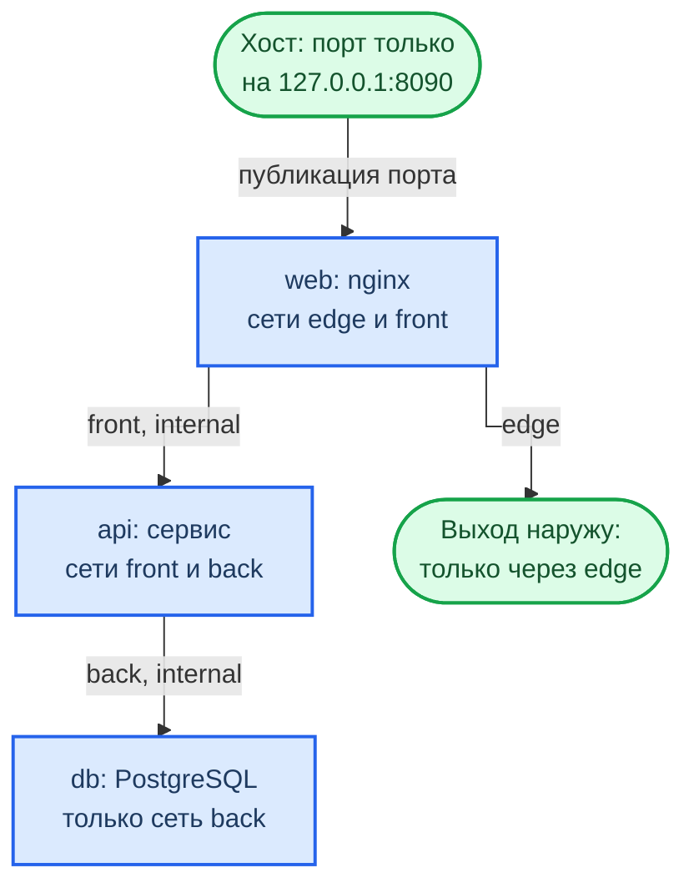
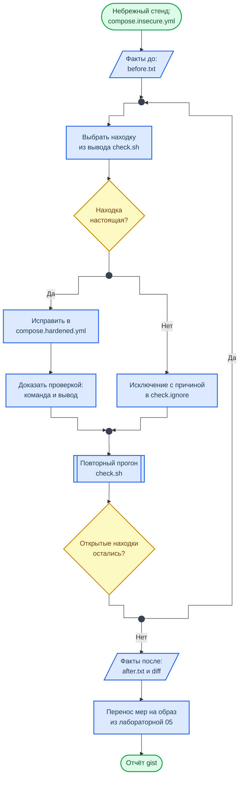

<div align="center">
<h1><a id="intro">Docker 01 · Рантайм: hardening и сегментация</a><br></h1>
<a href="https://docs.github.com/en"></a>
<a href="https://daringfireball.net/projects/markdown"></a>
<a href="https://shields.io"></a>


</div>

***

Салют :wave:,<br>
Это первая работа углублённого трека по `Docker`. В лабораторных 05 и 06 вы собирали образ и искали в нём проблемы. Здесь вопрос другой: образ уже есть, как его **безопасно запустить**. Вы возьмёте небрежно описанный стенд из трёх сервисов и закроете его по шагам, доказывая каждую меру проверкой.

Работа состоит из двух частей: hardening рантайма одного контейнера и сегментация сети между контейнерами. В конце вы разберёте находки проверяющего скрипта, отделите настоящие от ложных срабатываний и перенесёте меры на свой образ из лабораторной 05.

Для сдачи данной работы также будет требоваться ответить на дополнительные вопросы по описанным темам.

> Стенд намеренно небезопасен: привилегированный контейнер с проброшенным сокетом Docker. Запускайте его **только в ВМ курса** и гасите командой `docker compose -f compose.insecure.yml down -v`, когда сняли исходное состояние.

***

## Структура репозитория лабораторной работы

```bash
docker01
├── check.ignore.example
├── check.sh
├── compose.insecure.yml
├── config
│   └── nginx.conf
├── docker01_report.md
├── README.md
├── seccomp
├── secrets
└── source
    └── api
        ├── app.py
        └── Dockerfile
```

Каталоги `seccomp` и `secrets` пустые: профиль и файл секрета вы создадите сами. Файл `compose.insecure.yml` не правится, рабочая копия называется `compose.hardened.yml`.

***

## Материал

### Что решается при запуске

Образ описывает, **что** лежит в контейнере. Параметры запуска описывают, **что контейнеру разрешено**. Один и тот же образ может работать как обычный процесс без прав и как процесс с полным доступом к хосту: разница целиком в compose-файле или флагах `docker run`. Поэтому чистый отчёт `Trivy` по образу ничего не говорит о безопасности запуска.

<div class="lab-grid" style="grid-template-columns: repeat(auto-fill, minmax(min(19rem, 100%), 1fr));">

  <div class="lab-card" style="flex-direction: column; align-items: flex-start; gap: 0.5rem;">
  <div style="display:flex; align-items:baseline; gap:0.6rem; width:100%;">
    <span class="lab-card-num" style="font-size:0.9rem; width:auto;">Пользователь</span>
    <span style="font-size:0.65rem; color:#888; font-family:var(--font-code);">user</span>
  </div>
  <dl class="lab-card-facts">
    <dt>Суть</dt><dd>От какого uid работает процесс PID 1. Root в контейнере остаётся root для ядра хоста, пока не включены user namespaces.</dd>
    <dt>Проверка</dt><dd><code>grep Uid /proc/1/status</code></dd>
    <dt>Мера</dt><dd><code>USER</code> с числовым uid в образе, без <code>user: root</code> в compose.</dd>
  </dl>
  </div>

  <div class="lab-card" style="flex-direction: column; align-items: flex-start; gap: 0.5rem;">
  <div style="display:flex; align-items:baseline; gap:0.6rem; width:100%;">
    <span class="lab-card-num" style="font-size:0.9rem; width:auto;">Capabilities</span>
    <span style="font-size:0.65rem; color:#888; font-family:var(--font-code);">cap_drop · cap_add</span>
  </div>
  <dl class="lab-card-facts">
    <dt>Суть</dt><dd>Права root разбиты на отдельные привилегии. Docker по умолчанию оставляет 14 из них, <code>privileged</code> возвращает все.</dd>
    <dt>Проверка</dt><dd><code>grep CapBnd /proc/1/status</code></dd>
    <dt>Мера</dt><dd><code>cap_drop: [ALL]</code> и возврат только нужных через <code>cap_add</code>.</dd>
  </dl>
  </div>

  <div class="lab-card" style="flex-direction: column; align-items: flex-start; gap: 0.5rem;">
  <div style="display:flex; align-items:baseline; gap:0.6rem; width:100%;">
    <span class="lab-card-num" style="font-size:0.9rem; width:auto;">no-new-privileges</span>
    <span style="font-size:0.65rem; color:#888; font-family:var(--font-code);">security_opt</span>
  </div>
  <dl class="lab-card-facts">
    <dt>Суть</dt><dd>Запрет получать новые привилегии через setuid-файлы и file capabilities после старта процесса.</dd>
    <dt>Проверка</dt><dd><code>grep NoNewPrivs /proc/1/status</code></dd>
    <dt>Мера</dt><dd><code>security_opt: [no-new-privileges:true]</code></dd>
  </dl>
  </div>

  <div class="lab-card" style="flex-direction: column; align-items: flex-start; gap: 0.5rem;">
  <div style="display:flex; align-items:baseline; gap:0.6rem; width:100%;">
    <span class="lab-card-num" style="font-size:0.9rem; width:auto;">Seccomp</span>
    <span style="font-size:0.65rem; color:#888; font-family:var(--font-code);">security_opt</span>
  </div>
  <dl class="lab-card-facts">
    <dt>Суть</dt><dd>Фильтр системных вызовов. Профиль Docker по умолчанию запрещает всё, кроме списка разрешённых вызовов. <code>privileged</code> и <code>seccomp=unconfined</code> фильтр выключают.</dd>
    <dt>Проверка</dt><dd><code>grep Seccomp /proc/1/status</code>: 2 значит фильтр включён, 0 значит выключен.</dd>
    <dt>Мера</dt><dd>Не выключать профиль по умолчанию, при необходимости сужать его своим.</dd>
  </dl>
  </div>

  <div class="lab-card" style="flex-direction: column; align-items: flex-start; gap: 0.5rem;">
  <div style="display:flex; align-items:baseline; gap:0.6rem; width:100%;">
    <span class="lab-card-num" style="font-size:0.9rem; width:auto;">Файловая система</span>
    <span style="font-size:0.65rem; color:#888; font-family:var(--font-code);">read_only · tmpfs</span>
  </div>
  <dl class="lab-card-facts">
    <dt>Суть</dt><dd>Корень на запись позволяет подменить файлы приложения и оставить в контейнере свои.</dd>
    <dt>Проверка</dt><dd><code>docker inspect -f '{{.HostConfig.ReadonlyRootfs}}'</code></dd>
    <dt>Мера</dt><dd><code>read_only: true</code> и <code>tmpfs</code> с <code>noexec</code> только для тех каталогов, куда сервис пишет.</dd>
  </dl>
  </div>

  <div class="lab-card" style="flex-direction: column; align-items: flex-start; gap: 0.5rem;">
  <div style="display:flex; align-items:baseline; gap:0.6rem; width:100%;">
    <span class="lab-card-num" style="font-size:0.9rem; width:auto;">Ресурсы</span>
    <span style="font-size:0.65rem; color:#888; font-family:var(--font-code);">pids_limit · mem_limit</span>
  </div>
  <dl class="lab-card-facts">
    <dt>Суть</dt><dd>Без лимитов один контейнер исчерпывает процессы или память хоста и роняет соседей.</dd>
    <dt>Проверка</dt><dd><code>cat /sys/fs/cgroup/pids.max /sys/fs/cgroup/memory.max</code></dd>
    <dt>Мера</dt><dd><code>pids_limit</code>, <code>mem_limit</code>, <code>cpus</code>.</dd>
  </dl>
  </div>

  <div class="lab-card" style="flex-direction: column; align-items: flex-start; gap: 0.5rem;">
  <div style="display:flex; align-items:baseline; gap:0.6rem; width:100%;">
    <span class="lab-card-num" style="font-size:0.9rem; width:auto;">Сокет Docker</span>
    <span style="font-size:0.65rem; color:#888; font-family:var(--font-code);">/var/run/docker.sock</span>
  </div>
  <dl class="lab-card-facts">
    <dt>Суть</dt><dd>Сокет даёт управление демоном: тот, кто до него дотянулся, распоряжается всеми контейнерами хоста. Это равно правам root на хосте.</dd>
    <dt>Проверка</dt><dd><code>docker inspect -f '{{range .Mounts}}{{.Source}} {{end}}'</code></dd>
    <dt>Мера</dt><dd>Не пробрасывать сокет в прикладные контейнеры.</dd>
  </dl>
  </div>

  <div class="lab-card" style="flex-direction: column; align-items: flex-start; gap: 0.5rem;">
  <div style="display:flex; align-items:baseline; gap:0.6rem; width:100%;">
    <span class="lab-card-num" style="font-size:0.9rem; width:auto;">Секреты</span>
    <span style="font-size:0.65rem; color:#888; font-family:var(--font-code);">secrets</span>
  </div>
  <dl class="lab-card-facts">
    <dt>Суть</dt><dd>Переменная окружения видна в <code>docker inspect</code>, в <code>/proc/&lt;pid&gt;/environ</code> и часто попадает в логи.</dd>
    <dt>Проверка</dt><dd><code>docker inspect -f '{{range .Config.Env}}{{println .}}{{end}}'</code></dd>
    <dt>Мера</dt><dd>Секрет файлом в <code>/run/secrets</code>, в переменной только путь к нему.</dd>
  </dl>
  </div>

</div>

### Сети compose

Без раздела `networks` все сервисы файла попадают в одну сеть и видят друг друга по имени. Публикация порта в виде `"5434:5432"` открывает его на **всех** интерфейсах хоста, а не только на `localhost`. Две меры решают обе проблемы:

- порт публикуется только у входного сервиса и с явным адресом: `"127.0.0.1:8090:80"`;
- сервисы разносятся по сетям так, чтобы общая сеть была только у тех, кто обязан общаться. Сеть с `internal: true` не имеет выхода наружу.

Контейнер, подключённый только к внутренним сетям, порт наружу опубликовать не может. Поэтому входному сервису нужна отдельная обычная сеть. В стенде получается три сети.



**Как читать схему**

- Стрелка значит «есть общая сеть». Между `web` и `db` стрелки нет: общей сети у них нет, имя `db` из `web` даже не разрешается.
- `front` и `back` помечены `internal`: у `api` и `db` нет выхода наружу. Выход есть только у `web`.

### Находки, ложные срабатывания и исключения

Скрипт `check.sh` снимает факты по каждому сервису и превращает отклонения в находки. Он устроен как настоящий сканер: часть проверок работает по простому признаку, например ищет секреты по **имени** переменной. Поэтому среди находок есть ложные срабатывания, и отличить их от настоящих — ваша задача.

Находка закрывается одним из двух способов:

- **исправлением** в `compose.hardened.yml`;
- **исключением** в файле `check.ignore` с причиной. Исключение привязано к одному значению одной проверки одного сервиса. Причина обязательна: строку без внятной причины скрипт отвергает с кодом 2. Исключение, которое ничего не закрыло, скрипт тоже считает ошибкой и просит удалить.

Исключением оформляется и ложное срабатывание, и настоящая находка, которую вы осознанно оставляете. В причине должно быть видно, какой из двух случаев перед вами. Подробнее о разборе находок рассказывает справочник [Разбор находок сканеров](https://course.geminishkv.tech/materials/findings_triage/).

### Схема работы



**Как читать схему**

- Первый ромб — разбор находки. Ложное срабатывание не удаляют молча: его оформляют исключением с причиной, иначе оно вернётся при следующем прогоне.
- Второй ромб — условие выхода. Работа закончена, когда `check.sh` печатает «открыто 0» и возвращает код 0.
- Обозначения фигур описаны в справочнике [Схемы курса](https://course.geminishkv.tech/materials/diagrams_legend/).

***

## Задание

### Часть 0. Исходное состояние

- [ ] 1. Проверьте окружение и поставьте утилиты, которые понадобятся в шагах

```bash
$ docker version --format '{{.Server.Version}}'
$ docker compose version
$ sudo apt-get update && sudo apt-get install -y jq curl netcat-openbsd
```

- [ ] 2. Перейдите в каталог работы, поднимите небрежный стенд и проверьте три адреса сервиса

```bash
$ cd labs/advanced/docker01
$ docker compose -f compose.insecure.yml up -d --build
$ docker compose -f compose.insecure.yml ps
$ curl -s http://127.0.0.1:8090/        # от кого работает сервис и счётчик запросов
$ curl -s http://127.0.0.1:8090/db      # достижима ли база данных
$ curl -s http://127.0.0.1:8090/secret  # откуда сервис взял пароль; само значение не выводится
```

- [ ] 3. Снимите факты «до» и изучите вывод. Код возврата 1 здесь не ошибка: он значит, что открытые находки есть

```bash
$ chmod +x check.sh
$ ./check.sh compose.insecure.yml > before.txt; echo "код возврата: $?"
$ cat before.txt
```

Запишите в отчёт число открытых находок и три из них, которые считаете самыми опасными, с обоснованием.

- [ ] 4. Создайте рабочую копию и погасите небрежный стенд. Оба файла описывают один проект `docker01`, поэтому стенды сменяют друг друга, а не работают рядом

```bash
$ cp compose.insecure.yml compose.hardened.yml
$ docker compose -f compose.insecure.yml down -v
```

Дальше правится только `compose.hardened.yml`. После каждой правки стенд перезапускается командой `docker compose -f compose.hardened.yml up -d`.

### Часть 1. Hardening рантайма

Шаги 5–13 выполняются для сервиса `api`.

- [ ] 5. **Пользователь.** Удалите строку `user: root`. Перезапустите стенд и проверьте uid

```bash
$ docker compose -f compose.hardened.yml up -d
$ curl -s http://127.0.0.1:8090/
$ docker compose -f compose.hardened.yml exec api grep Uid /proc/1/status
```

Откройте `source/api/Dockerfile` и ответьте: почему пользователь в `USER` задан числом, а не именем.

- [ ] 6. **privileged.** Сначала зафиксируйте состояние, затем удалите строку `privileged: true`, перезапустите стенд и повторите команду. Сравните три значения

```bash
$ docker compose -f compose.hardened.yml exec api sh -c 'grep -E "CapBnd|Seccomp" /proc/1/status; ls /dev | wc -l'
```

Объясните в отчёте, что именно вернулось под контроль после удаления одной строки.

- [ ] 7. **Сокет Docker.** В `before.txt` найдите строку `docker.sock` у сервиса `api`: скрипт показал, сколько контейнеров хоста видно изнутри. Удалите проброс сокета из `volumes`, перезапустите стенд и докажите, что сокета в контейнере нет

```bash
$ docker compose -f compose.hardened.yml exec api ls -l /var/run/docker.sock
```

Ответьте: почему флаг `:ro` при пробросе сокета не снимает риск.

- [ ] 8. **Capabilities.** Добавьте сервису `cap_drop: [ALL]` и проверьте границу привилегий

```bash
$ docker compose -f compose.hardened.yml exec api grep CapBnd /proc/1/status
```

Сервис слушает порт 5050 и продолжает работать без единой capability. Ответьте: какая capability понадобилась бы для порта 80 и почему для 5050 она не нужна.

- [ ] 9. **no-new-privileges.** Добавьте `security_opt` со значением `no-new-privileges:true` и проверьте

```bash
$ docker compose -f compose.hardened.yml exec api grep NoNewPrivs /proc/1/status
```

- [ ] 10. **Корень только на чтение.** Добавьте `read_only: true`, перезапустите стенд и откройте главный адрес сервиса

```bash
$ curl -s -i http://127.0.0.1:8090/
```

Сервис ответит ошибкой 500 и назовёт путь, куда не смог записать. Дайте ему `tmpfs` ровно на этот каталог:

```yaml
    tmpfs:
      - /var/lib/api:rw,noexec,nosuid,size=16m
```

Повторите запрос. Ошибка сменится на `Permission denied`. Выясните причину и исправьте её параметрами монтирования

```bash
$ docker compose -f compose.hardened.yml exec api sh -c 'stat -c "%u:%g %a" /var/lib/api; grep " /var/lib/api " /proc/mounts'
```

После исправления сервис должен отвечать кодом 200. Докажите, что из `tmpfs` нельзя запускать файлы

```bash
$ docker compose -f compose.hardened.yml exec api sh -c 'cp /bin/true /var/lib/api/t && /var/lib/api/t; echo "код: $?"'
```

- [ ] 11. **Лимиты.** Задайте сервису `pids_limit: 100`, `mem_limit: 256m` и `cpus: 0.5`. Проверьте, что лимиты дошли до cgroup

```bash
$ docker compose -f compose.hardened.yml exec api sh -c 'cat /sys/fs/cgroup/pids.max /sys/fs/cgroup/memory.max /sys/fs/cgroup/cpu.max'
```

- [ ] 12. **Seccomp.** Убедитесь, что фильтр по умолчанию включён: `Seccomp` в `/proc/1/status` равен 2. Затем сузьте профиль. Скачайте профиль Docker по умолчанию из закреплённого тега и сверьте контрольную сумму

```bash
$ curl -fsSL -o seccomp/default.json https://raw.githubusercontent.com/moby/profiles/seccomp/v0.2.3/seccomp/default.json
$ echo "536529b665dd0972c37bfb569f5d4ac8a53592e7b00752bc39ff063ca9864c74  seccomp/default.json" | sha256sum -c -
```

Получите производный профиль, из которого убрано семейство вызовов `chmod`. Сервису оно не нужно

```bash
$ jq '(.syscalls[] | select(.names) | .names) -= ["chmod","fchmod","fchmodat","fchmodat2"]' seccomp/default.json > seccomp/no-chmod.json
```

Подключите профиль вторым значением в `security_opt`: `seccomp=./seccomp/no-chmod.json`. Перезапустите стенд и докажите, что сервис работает, а вызов заблокирован. Порядок важен: файл счётчика появляется после первого запроса

```bash
$ curl -s http://127.0.0.1:8090/
$ docker compose -f compose.hardened.yml exec api chmod 600 /var/lib/api/hits
```

Ответьте: чем опасен профиль, в котором `defaultAction` равен `SCMP_ACT_ALLOW` и перечислены только запрещённые вызовы.

- [ ] 13. **Секреты.** Посмотрите, что видно про пароль снаружи контейнера

```bash
$ docker inspect docker01-db-1 -f '{{range .Config.Env}}{{println .}}{{end}}' | grep -i password
$ docker inspect docker01-api-1 -f '{{range .Config.Env}}{{println .}}{{end}}' | grep -i password
```

Перенесите пароль в файл. Каталог закрыт для остальных пользователей хоста, а сам файл читается: внутри контейнера его открывает непривилегированный uid, которого на хосте нет

```bash
$ printf '%s\n' 'придумайте-свой-пароль' > secrets/db_password.txt
$ chmod 700 secrets && chmod 644 secrets/db_password.txt
$ git check-ignore -v secrets/db_password.txt   # файл не должен попасть в репозиторий
```

В `compose.hardened.yml` опишите секрет на верхнем уровне и подключите его сервисам `api` и `db`:

```yaml
secrets:
  db_password:
    file: ./secrets/db_password.txt
```

У `db` замените `POSTGRES_PASSWORD` на `POSTGRES_PASSWORD_FILE: /run/secrets/db_password`. У `api` удалите `DB_PASSWORD`. База данных запоминает пароль при первой инициализации, поэтому пересоздайте стенд вместе с томами и проверьте результат

```bash
$ docker compose -f compose.hardened.yml down -v
$ docker compose -f compose.hardened.yml up -d
$ curl -s http://127.0.0.1:8090/secret
$ docker inspect docker01-db-1 docker01-api-1 -f '{{range .Config.Env}}{{println .}}{{end}}' | grep -ci 'password='
```

- [ ] 14. **Сервисы web и db.** Примените к ним те же меры. У каждой находки два честных исхода: исправить или оставить с обоснованием. Подсказки:

    - `nginx` из официального образа стартует от root и держит несколько capabilities. Образ `nginxinc/nginx-unprivileged` работает без них, слушает порт 8080 и пишет только в `/tmp`;
    - `postgres` умеет работать от собственного пользователя `70:70`. При корне только на чтение ему нужны `tmpfs` для `/var/run/postgresql` и `/tmp` и именованный том для `/var/lib/postgresql/data`.

- [ ] 15. **Дополнительно: rootless и user namespaces.** Запишите в отчёт вывод команды и по документации Docker объясните, что меняется для root внутри контейнера при работе демона в режиме rootless или с `userns-remap`

```bash
$ docker info --format '{{.SecurityOptions}}'
```

### Часть 2. Сеть и сегментация

- [ ] 16. **Карта «до».** По `before.txt` и выводу хоста выпишите, какие порты стенда слушали на всех интерфейсах. Ответьте: кому из соседей по сети была доступна база данных

```bash
$ ss -tln | grep -E ':(8090|5050|5434)\b'
```

- [ ] 17. **Публикация портов.** Уберите `ports` у `api` и `db`. У `web` оставьте публикацию только на loopback: `"127.0.0.1:8090:80"`. Перезапустите стенд и проверьте с хоста

```bash
$ docker compose -f compose.hardened.yml ps
$ nc -z -w 2 127.0.0.1 5050; echo "api: $?"
$ nc -z -w 2 127.0.0.1 5434; echo "db: $?"
$ curl -s http://127.0.0.1:8090/
```

- [ ] 18. **Три сети.** Опишите сети `edge`, `front` и `back`, две последние с `internal: true`. Подключите `web` к `edge` и `front`, `api` к `front` и `back`, `db` только к `back`. Докажите, что `web` не видит базу, а `api` видит

```bash
$ docker compose -f compose.hardened.yml exec web sh -c 'nc -z -w 2 db 5432 && echo reachable || echo unreachable'
$ curl -s http://127.0.0.1:8090/db
```

- [ ] 19. **Выход наружу.** Проверьте, у кого из сервисов он остался. Ответьте: нужен ли выход наружу сервису `web` и чем рискует стенд, если оставить его у `api`

```bash
$ docker compose -f compose.hardened.yml exec db sh -c 'wget -T 3 -qO- http://example.com >/dev/null 2>&1 && echo open || echo blocked'
$ docker compose -f compose.hardened.yml exec api python -c "
import socket
try:
    socket.create_connection(('1.1.1.1', 443), timeout=3); print('open')
except OSError as err:
    print('blocked:', err)"
$ docker compose -f compose.hardened.yml exec web sh -c 'wget -T 4 -qO- http://example.com >/dev/null 2>&1 && echo open || echo blocked'
```

### Часть 3. Находки и итог

- [ ] 20. **Разбор находок.** Запустите проверку по исправленному стенду. Для каждой открытой находки решите: настоящая она или ложное срабатывание. Среди находок есть ложные: найдите их все и обоснуйте, почему сканер ошибся

```bash
$ ./check.sh compose.hardened.yml
$ cp check.ignore.example check.ignore
```

Оформите исключения в `check.ignore` и добейтесь вывода «открыто 0» с кодом возврата 0. Затем проверьте сам механизм: добавьте исключение с причиной из одного слова и убедитесь, что скрипт его отверг; добавьте исключение на несуществующую находку и убедитесь, что скрипт его заметил. Обе проверочные строки после этого удалите.

- [ ] 21. **Итог.** Снимите факты «после», сравните со снимком «до» и повторите аудит `Docker Bench` из лабораторной 06 при запущенном стенде. Сравните раздел 5 `Container Runtime` для небрежного и исправленного стендов

```bash
$ ./check.sh compose.hardened.yml > after.txt; echo "код возврата: $?"
$ diff before.txt after.txt
```

- [ ] 22. **Перенос на свой образ.** Примените меры к своему `docker-compose.yml` из лабораторной 05. Снимите факты до и после своим списком исключений

```bash
$ CHECK_IGNORE=../../basic/lab05/check.ignore ./check.sh ../../basic/lab05/docker-compose.yml
```

Опишите в отчёте, какие меры применить не удалось и почему.

- [ ] 23. Сделайте `commit` с файлами `compose.hardened.yml`, `check.ignore`, `before.txt`, `after.txt` и профилями из `seccomp`. Залейте изменения в свой удалённый репозиторий и подготовьте отчёт `gist` по шаблону `docker01_report.md`. Значение пароля в отчёт не вставляется.

***

## Troubleshooting

- Порт 8090, 5050 или 5434 занят другим процессом: `ss -tlnp | grep 8090`. Остановите процесс или поменяйте левую часть публикации порта в compose-файле.

- `Permission denied` при записи в `tmpfs`. Без параметров `tmpfs` монтируется как `root:root` с режимом 755, и непривилегированный процесс писать в него не может. Добавьте владельца и режим:

```yaml
    tmpfs:
      - /var/lib/api:rw,noexec,nosuid,size=16m,uid=10001,gid=10001,mode=0700
```

- `Permission denied` при чтении `/run/secrets/db_password`. Файл секрета монтируется с правами хоста, а процесс в контейнере работает от uid, которого на хосте нет. Закройте каталог и откройте файл на чтение: `chmod 700 secrets && chmod 644 secrets/db_password.txt`.

- Пароль базы данных не изменился после перевода на файл. `PostgreSQL` читает пароль только при первой инициализации тома: пересоздайте стенд командой `docker compose -f compose.hardened.yml down -v`.

- Контейнер не стартует с производным профилем seccomp на старой версии `Docker Engine`. Возьмите профиль из тега своей версии движка, например `https://raw.githubusercontent.com/moby/moby/v27.5.1/profiles/seccomp/default.json`, и получите производный профиль той же командой `jq`.

- На macOS `Docker Desktop` сообщает, что путь не открыт для монтирования. Добавьте каталог репозитория в `Settings → Resources → File Sharing` или работайте в ВМ курса.

- `check.sh` завершился с кодом 1. Это не сбой: код 1 значит, что остались открытые находки или лишние исключения. Код 2 значит ошибку запуска или неверно оформленное исключение.

***

## Смотри также

- [Лаб. 05 — Docker](https://course.geminishkv.tech/labs/basic/lab05/) — образы, контейнеры, namespaces и cgroups
- [Лаб. 06 — Docker CIS Benchmark и Trivy](https://course.geminishkv.tech/labs/basic/lab06/) — аудит конфигурации и скан образов
- [Docker 02 — Поставка образа](https://course.geminishkv.tech/labs/advanced/docker02/) — вторая работа трека: почему образу можно доверять
- [Разбор находок сканеров](https://course.geminishkv.tech/materials/findings_triage/) — как проверять находку и оформлять исключения
- [Dockerfile: как писать правильно](https://course.geminishkv.tech/materials/guides/dockerfile_guide/) — сборка образа, на который переносятся меры
- [CheatSheet: Docker](https://course.geminishkv.tech/materials/cheatsheet/CHEATSHEET_DOCKER/) — справочник по командам Docker

***

## Links

<div class="lab-grid" style="grid-template-columns: repeat(auto-fill, minmax(min(14rem, 100%), 1fr));">
<a class="lab-card" href="https://docs.docker.com/engine/security/" target="_blank"><div class="lab-card-body"><div class="lab-card-title">Docker Engine security</div><div class="lab-card-tags"><span class="lab-tag">docs.docker.com</span></div></div><div class="lab-card-arrow">→</div></a>
<a class="lab-card" href="https://docs.docker.com/engine/security/seccomp/" target="_blank"><div class="lab-card-body"><div class="lab-card-title">Seccomp security profiles</div><div class="lab-card-tags"><span class="lab-tag">docs.docker.com</span></div></div><div class="lab-card-arrow">→</div></a>
<a class="lab-card" href="https://docs.docker.com/engine/security/rootless/" target="_blank"><div class="lab-card-body"><div class="lab-card-title">Rootless mode</div><div class="lab-card-tags"><span class="lab-tag">docs.docker.com</span></div></div><div class="lab-card-arrow">→</div></a>
<a class="lab-card" href="https://docs.docker.com/engine/security/userns-remap/" target="_blank"><div class="lab-card-body"><div class="lab-card-title">User namespace remap</div><div class="lab-card-tags"><span class="lab-tag">docs.docker.com</span></div></div><div class="lab-card-arrow">→</div></a>
<a class="lab-card" href="https://docs.docker.com/compose/how-tos/use-secrets/" target="_blank"><div class="lab-card-body"><div class="lab-card-title">Secrets in Compose</div><div class="lab-card-tags"><span class="lab-tag">docs.docker.com</span></div></div><div class="lab-card-arrow">→</div></a>
<a class="lab-card" href="https://docs.docker.com/reference/compose-file/networks/" target="_blank"><div class="lab-card-body"><div class="lab-card-title">Compose: networks</div><div class="lab-card-tags"><span class="lab-tag">docs.docker.com</span></div></div><div class="lab-card-arrow">→</div></a>
<a class="lab-card" href="https://github.com/moby/profiles" target="_blank"><div class="lab-card-body"><div class="lab-card-title">Moby: профили seccomp и AppArmor</div><div class="lab-card-tags"><span class="lab-tag">github.com</span></div></div><div class="lab-card-arrow">→</div></a>
<a class="lab-card" href="https://man7.org/linux/man-pages/man7/capabilities.7.html" target="_blank"><div class="lab-card-body"><div class="lab-card-title">capabilities(7)</div><div class="lab-card-tags"><span class="lab-tag">man7.org</span></div></div><div class="lab-card-arrow">→</div></a>
<a class="lab-card" href="https://cheatsheetseries.owasp.org/cheatsheets/Docker_Security_Cheat_Sheet.html" target="_blank"><div class="lab-card-body"><div class="lab-card-title">OWASP Docker Security Cheat Sheet</div><div class="lab-card-tags"><span class="lab-tag">owasp.org</span></div></div><div class="lab-card-arrow">→</div></a>
<a class="lab-card" href="https://www.cisecurity.org/benchmark/docker" target="_blank"><div class="lab-card-body"><div class="lab-card-title">CIS Docker Benchmark</div><div class="lab-card-tags"><span class="lab-tag">cisecurity.org</span></div></div><div class="lab-card-arrow">→</div></a>
<a class="lab-card" href="https://gist.github.com" target="_blank"><div class="lab-card-body"><div class="lab-card-title">Gist</div><div class="lab-card-tags"><span class="lab-tag">gist.github.com</span></div></div><div class="lab-card-arrow">→</div></a>
</div>
