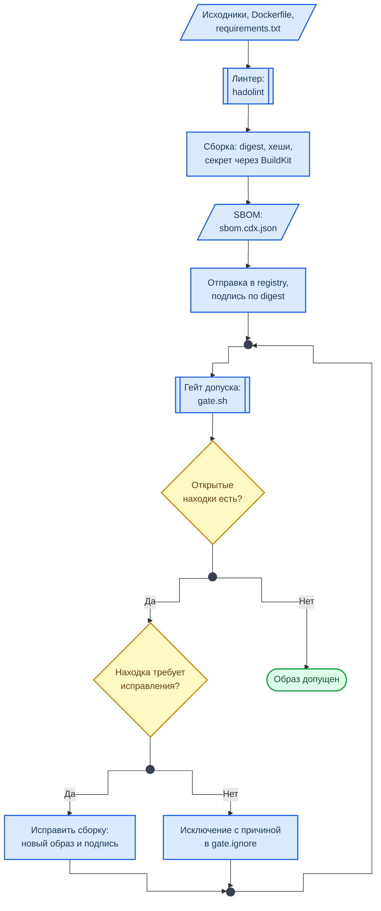

<div align="center">
<h1><a id="intro">Docker 02 · Поставка: сборка, SBOM, подпись</a><br></h1>
<a href="https://docs.github.com/en"></a>
<a href="https://daringfireball.net/projects/markdown"></a>
<a href="https://shields.io"></a>


</div>

***

Салют :wave:,<br>
Это вторая работа углублённого трека по `Docker`. В первой вы отвечали на вопрос, как образ безопасно запустить. Здесь вопрос стоит раньше: **почему этому образу можно доверять**. Из чего он собран, не осталось ли в нём секретов, тот ли это образ, который собрали вы, и кто решает, допускать ли его к запуску.

Работа состоит из двух частей: цепочка поставки образа и сборка в CI. Вы возьмёте небрежный `Dockerfile`, найдёте в собранном образе три утечки, исправите сборку, получите SBOM, подпишете образ и проведёте его через гейт допуска. Среди находок гейта есть ложные срабатывания: отделить их от настоящих — часть задания.

Для сдачи данной работы также будет требоваться ответить на дополнительные вопросы по описанным темам.

> Токен в этой работе выдуманный. Настоящие токены и пароли в сборку лабораторной не подставляются и в отчёт не попадают.

***

## Структура репозитория лабораторной работы

```bash
docker02
├── ci
│   ├── build.sh
│   └── image.yml
├── docker02_report.md
├── gate.ignore.example
├── gate.sh
├── README.md
└── source
    └── app
        ├── app.py
        ├── Dockerfile.insecure
        ├── .env.example
        └── requirements.in
```

Файл `Dockerfile.insecure` не правится. Исправленная сборка пишется в новый файл `source/app/Dockerfile`.

***

## Материал

### Из чего складывается доверие к образу

<div class="lab-grid" style="grid-template-columns: repeat(auto-fill, minmax(min(19rem, 100%), 1fr));">

  <div class="lab-card" style="flex-direction: column; align-items: flex-start; gap: 0.5rem;">
  <div style="display:flex; align-items:baseline; gap:0.6rem; width:100%;">
    <span class="lab-card-num" style="font-size:0.9rem; width:auto;">Базовый образ</span>
    <span style="font-size:0.65rem; color:#888; font-family:var(--font-code);">FROM · digest</span>
  </div>
  <dl class="lab-card-facts">
    <dt>Суть</dt><dd>Тег — это указатель, его можно перезаписать. Сегодня <code>python:slim</code> означает одну версию, завтра другую. Digest — контрольная сумма содержимого, он не меняется.</dd>
    <dt>Проверка</dt><dd><code>docker buildx imagetools inspect &lt;образ&gt;</code></dd>
    <dt>Мера</dt><dd><code>FROM образ:тег@sha256:…</code>: тег для человека, digest для сборки.</dd>
  </dl>
  </div>

  <div class="lab-card" style="flex-direction: column; align-items: flex-start; gap: 0.5rem;">
  <div style="display:flex; align-items:baseline; gap:0.6rem; width:100%;">
    <span class="lab-card-num" style="font-size:0.9rem; width:auto;">Зависимости</span>
    <span style="font-size:0.65rem; color:#888; font-family:var(--font-code);">--require-hashes</span>
  </div>
  <dl class="lab-card-facts">
    <dt>Суть</dt><dd><code>pip install пакет</code> ставит то, что лежит в индексе в момент сборки. Версия без хеша не защищает от подмены файла в индексе.</dd>
    <dt>Проверка</dt><dd>В <code>requirements.txt</code> у каждой строки есть <code>--hash=sha256:…</code></dd>
    <dt>Мера</dt><dd>Файл с хешами и установка с <code>--require-hashes</code>.</dd>
  </dl>
  </div>

  <div class="lab-card" style="flex-direction: column; align-items: flex-start; gap: 0.5rem;">
  <div style="display:flex; align-items:baseline; gap:0.6rem; width:100%;">
    <span class="lab-card-num" style="font-size:0.9rem; width:auto;">Секреты сборки</span>
    <span style="font-size:0.65rem; color:#888; font-family:var(--font-code);">--mount=type=secret</span>
  </div>
  <dl class="lab-card-facts">
    <dt>Суть</dt><dd><code>ARG</code> и <code>ENV</code> сохраняются в истории слоёв, в окружении контейнера и в аттестации provenance. Удалить секрет следующим слоем нельзя: прежний слой остаётся в образе.</dd>
    <dt>Проверка</dt><dd><code>docker history --no-trunc &lt;образ&gt;</code></dd>
    <dt>Мера</dt><dd>Секрет монтируется на время одной команды <code>RUN</code> и в слой не попадает.</dd>
  </dl>
  </div>

  <div class="lab-card" style="flex-direction: column; align-items: flex-start; gap: 0.5rem;">
  <div style="display:flex; align-items:baseline; gap:0.6rem; width:100%;">
    <span class="lab-card-num" style="font-size:0.9rem; width:auto;">Контекст сборки</span>
    <span style="font-size:0.65rem; color:#888; font-family:var(--font-code);">.dockerignore</span>
  </div>
  <dl class="lab-card-facts">
    <dt>Суть</dt><dd><code>COPY . .</code> кладёт в образ всё, что лежит в каталоге: <code>.env</code>, <code>.git</code>, ключи.</dd>
    <dt>Проверка</dt><dd><code>docker run --rm &lt;образ&gt; ls -A /app</code></dd>
    <dt>Мера</dt><dd><code>.dockerignore</code> и копирование только нужных файлов.</dd>
  </dl>
  </div>

  <div class="lab-card" style="flex-direction: column; align-items: flex-start; gap: 0.5rem;">
  <div style="display:flex; align-items:baseline; gap:0.6rem; width:100%;">
    <span class="lab-card-num" style="font-size:0.9rem; width:auto;">SBOM</span>
    <span style="font-size:0.65rem; color:#888; font-family:var(--font-code);">CycloneDX</span>
  </div>
  <dl class="lab-card-facts">
    <dt>Суть</dt><dd>Опись состава образа: пакеты ОС и библиотеки с версиями. По описи образ проверяют на новые уязвимости без доступа к самому образу.</dd>
    <dt>Проверка</dt><dd><code>jq '.components | length' sbom.cdx.json</code></dd>
    <dt>Мера</dt><dd>SBOM выпускается при каждой сборке и хранится рядом с образом.</dd>
  </dl>
  </div>

  <div class="lab-card" style="flex-direction: column; align-items: flex-start; gap: 0.5rem;">
  <div style="display:flex; align-items:baseline; gap:0.6rem; width:100%;">
    <span class="lab-card-num" style="font-size:0.9rem; width:auto;">Подпись</span>
    <span style="font-size:0.65rem; color:#888; font-family:var(--font-code);">cosign</span>
  </div>
  <dl class="lab-card-facts">
    <dt>Суть</dt><dd>Подпись связывает digest образа с ключом проекта. Подписывается digest, а не тег: тег можно перевесить на другой образ.</dd>
    <dt>Проверка</dt><dd><code>cosign verify --key cosign.pub &lt;образ&gt;</code></dd>
    <dt>Мера</dt><dd>Неподписанный образ не допускается к запуску.</dd>
  </dl>
  </div>

</div>

### Сборка в CI

Конвейеру нужно где-то выполнять `docker build`. Два привычных способа опасны тем же, что вы закрывали в первой работе трека:

- проброс `/var/run/docker.sock` в контейнер сборки отдаёт ему управление демоном, то есть хостом раннера;
- `Docker-in-Docker` требует привилегированного контейнера.

Безопаснее одноразовая виртуальная машина раннера, как у `GitHub Actions`, или сборщик `BuildKit` в режиме rootless, которому демон Docker не нужен вовсе. В этой работе вы попробуете оба варианта.

Проверочный конвейер не подписывает образ. Ключ подписи — самый ценный секрет поставки, и в job, который запускается на каждый pull request, он попадать не должен. Подпись выполняется отдельно, после слияния. Поэтому гейт умеет работать без проверки подписи, но **всегда пишет об этом в выводе**: зелёный результат не должен означать «не проверяли».

### Находки, ложные срабатывания и исключения

Скрипт `gate.sh` отвечает на вопрос «можно ли этот образ запускать». Как и настоящие сканеры, часть проверок он выполняет по простому признаку: ищет похожие на секрет слова в истории слоёв и файлы с подозрительными именами. Отсюда ложные срабатывания.

Находка закрывается **исправлением** сборки или **исключением** в файле `gate.ignore`. У исключения три поля: проверка, значение, причина. Правила те же, что в первой работе: причина обязательна, исключение закрывает ровно одну находку, лишнее исключение считается ошибкой.

Исключение оформляется в двух разных случаях, и в причине должно быть видно, какой из них перед вами:

- **ложное срабатывание**: сканер ошибся, риска нет. В причине сказано, почему он ошибся;
- **принятый риск**: находка настоящая, но исправить её сейчас нельзя. В причине указаны владелец и срок пересмотра.

Порядок разбора описан в справочнике [Разбор находок сканеров](https://course.geminishkv.tech/materials/findings_triage/).

### Схема работы



**Как читать схему**

- Исправление сборки — это всегда новый образ: у него новый digest, и прежняя подпись к нему не относится. Поэтому в шаге исправления стоят пересборка и новая подпись. После исключения образ не меняется, повторяется только гейт.
- Подпись стоит до гейта: гейт проверяет её наравне с остальным. В CI порядок другой, и проверка подписи там отключена явно.
- Обозначения фигур описаны в справочнике [Схемы курса](https://course.geminishkv.tech/materials/diagrams_legend/).

***

## Задание

### Часть 0. Небрежная сборка

- [ ] 1. Проверьте окружение и поставьте `cosign` из закреплённого релиза с проверкой контрольной суммы. `Trivy` и `hadolint` у вас стоят с лабораторных 06 и 07

```bash
$ docker buildx version && trivy --version && hadolint --version && jq --version
$ curl -fsSLO https://github.com/sigstore/cosign/releases/download/v3.1.3/cosign-linux-amd64
$ echo "4629c757b7618056f8ddd7e2625ae9fdd94c0372a65049520bc7d9df9efc7f71  cosign-linux-amd64" | sha256sum -c -
$ sudo install -m 0755 cosign-linux-amd64 /usr/local/bin/cosign && cosign version
```

- [ ] 2. Поднимите локальный registry. Он слушает только loopback: наружу стенд не публикуется

```bash
$ docker run -d --name docker02-registry -p 127.0.0.1:5005:5000 registry:2
$ curl -s http://127.0.0.1:5005/v2/
```

- [ ] 3. Соберите небрежный образ так, как это часто делают: токен передаётся аргументом сборки, рабочий файл настроек лежит рядом с кодом

```bash
$ cd labs/advanced/docker02/source/app
$ printf 'API_TOKEN=lab-demo-token-0001\n' > .env
$ docker build -f Dockerfile.insecure --build-arg API_TOKEN=lab-demo-token-0001 -t docker02/app:insecure .
$ docker run --rm docker02/app:insecure
```

- [ ] 4. Найдите в собранном образе три утечки. Для каждой запишите в отчёт команду, вывод и объяснение, откуда она взялась

```bash
$ docker history --no-trunc docker02/app:insecure | grep -c 'lab-demo-token'
$ docker run --rm docker02/app:insecure env | grep API_TOKEN
$ docker run --rm docker02/app:insecure ls -A /app
```

Выясните, какую версию `Python` сегодня означает тег `python:slim`, и ответьте: что изменится в вашем образе, когда тег перевесят

```bash
$ docker run --rm python:slim python --version
```

- [ ] 5. Отправьте образ в registry и снимите состояние «до». Код возврата 1 здесь не ошибка: он значит, что образ не допущен

```bash
$ cd ../..
$ chmod +x gate.sh ci/build.sh
$ docker tag docker02/app:insecure localhost:5005/docker02/app:0.0.1
$ docker push localhost:5005/docker02/app:0.0.1
$ DOCKERFILE=source/app/Dockerfile.insecure ./gate.sh localhost:5005/docker02/app:0.0.1 > gate_before.txt; echo "код возврата: $?"
$ cat gate_before.txt
```

### Часть 1. Цепочка поставки

Шаги 6–9 выполняются в каталоге `source/app`. Результат — новый файл `Dockerfile`.

- [ ] 6. **Контекст сборки.** Перейдите в `source/app` и создайте `.dockerignore`: в контекст не должны попадать `.env`, каталог `.git` и сами файлы сборки. Шаблон `.env.example` секретов не содержит, решите сами, нужен ли он в образе.

- [ ] 7. **Базовый образ.** Узнайте digest образа `python:3.13-slim` и закрепите его в первой строке нового `Dockerfile` в виде `тег@digest`

```bash
$ docker buildx imagetools inspect python:3.13-slim --format '{{json .Manifest.Digest}}'
```

Ответьте: зачем оставлять тег, если сборка всё равно идёт по digest, и кто в проекте должен обновлять digest.

- [ ] 8. **Зависимости с хешами.** Получите `requirements.txt` с хешами из `requirements.in`. Утилита запускается в одноразовом контейнере, на хост ничего не ставится

```bash
$ docker run --rm -v "$PWD":/w -w /w python:3.13-slim sh -c \
    'pip install -q --root-user-action=ignore pip-tools && pip-compile -q --generate-hashes -o requirements.txt requirements.in'
$ grep -c -- '--hash=' requirements.txt
```

- [ ] 9. **Секрет сборки и пользователь.** Допишите `Dockerfile`: первая строка `# syntax=docker/dockerfile:1`, непривилегированный пользователь с числовым uid, копирование только `requirements.txt` и `app.py`. Зависимости ставятся командой, которой секрет смонтирован на время её выполнения:

```dockerfile
RUN --mount=type=secret,id=api_token,required=true \
    test -s /run/secrets/api_token \
    && pip install --no-cache-dir --no-compile --require-hashes -r requirements.txt
```

Проверьте линтером, соберите образ и докажите, что всех трёх утечек больше нет

```bash
$ hadolint Dockerfile
$ API_TOKEN=lab-demo-token-0001 docker buildx build --secret id=api_token,env=API_TOKEN -t docker02/app:fixed --load .
$ docker run --rm docker02/app:fixed
$ docker history --no-trunc docker02/app:fixed | grep -c 'lab-demo-token'
$ docker run --rm docker02/app:fixed env | grep -c API_TOKEN
$ docker run --rm docker02/app:fixed ls -A /app
```

Убедитесь, что без секрета сборка падает, а не молча проходит

```bash
$ docker buildx build --no-cache -t docker02/app:nosecret --load .
```

- [ ] 10. **Минимальная база.** Сравните два варианта базового образа по размеру и числу находок уровня HIGH и CRITICAL. Выберите базу для своего образа и обоснуйте выбор: учтите не только цифры, но и совместимость библиотек с `musl`

```bash
$ for b in python:3.13-slim python:3.13-alpine; do
    docker pull -q "$b" > /dev/null
    n=$(trivy image --quiet --scanners vuln --severity HIGH,CRITICAL --format json "$b" | jq '[.Results[]?.Vulnerabilities[]?] | length')
    echo "$b: находок $n, размер $(docker image inspect -f '{{.Size}}' "$b") байт"
  done
```

- [ ] 11. **SBOM.** Выпустите опись состава образа, найдите в ней свою зависимость и проверьте образ на уязвимости по описи, без доступа к самому образу

```bash
$ cd ../..
$ trivy image --quiet --format cyclonedx -o sbom.cdx.json docker02/app:fixed
$ jq '.components | length' sbom.cdx.json
$ jq -r '.components[] | select(.name == "idna") | "\(.name) \(.version) \(.purl)"' sbom.cdx.json
$ trivy sbom --severity CRITICAL sbom.cdx.json
```

Ответьте: чем скан по SBOM удобнее прямого скана образа и в каком случае он даст устаревший ответ.

- [ ] 12. **Ключи.** Создайте пару ключей проекта. Закрытый ключ в репозиторий не попадает, публичный в него кладётся

```bash
$ cosign generate-key-pair
$ git check-ignore -v cosign.key
```

- [ ] 13. **Подпись.** Отправьте исправленный образ в registry и подпишите его **по digest**. Registry лабораторной локальный, поэтому запись в публичный журнал прозрачности Sigstore отключена. В настоящем проекте журнал остаётся включённым

```bash
$ docker tag docker02/app:fixed localhost:5005/docker02/app:1.0.0
$ docker push localhost:5005/docker02/app:1.0.0
$ REF=$(docker image inspect -f '{{range .RepoDigests}}{{println .}}{{end}}' localhost:5005/docker02/app:1.0.0 | grep '^localhost:5005/' | head -1)
$ echo "$REF"
$ cosign sign --yes --key cosign.key --use-signing-config=false --tlog-upload=false --allow-insecure-registry "$REF"
$ cosign verify --key cosign.pub --insecure-ignore-tlog=true --allow-insecure-registry "$REF"
```

Создайте вторую пару ключей в другом каталоге и убедитесь, что чужим ключом подпись не проверяется.

- [ ] 14. **Подмена тега.** Отправьте исправленный образ под тегом `demo`, подпишите его по digest и проверьте подпись по тегу

```bash
$ docker tag docker02/app:fixed localhost:5005/docker02/app:demo && docker push localhost:5005/docker02/app:demo
$ DEMO_REF=$(docker image inspect -f '{{range .RepoDigests}}{{println .}}{{end}}' localhost:5005/docker02/app:demo | grep '^localhost:5005/' | head -1)
$ cosign sign --yes --key cosign.key --use-signing-config=false --tlog-upload=false --allow-insecure-registry "$DEMO_REF"
$ cosign verify --key cosign.pub --insecure-ignore-tlog=true --allow-insecure-registry localhost:5005/docker02/app:demo > /dev/null; echo "по тегу до подмены: $?"
```

Теперь перевесьте тег `demo` на небрежный образ и повторите проверку по тегу и по сохранённому digest

```bash
$ docker tag docker02/app:insecure localhost:5005/docker02/app:demo && docker push localhost:5005/docker02/app:demo
$ cosign verify --key cosign.pub --insecure-ignore-tlog=true --allow-insecure-registry localhost:5005/docker02/app:demo > /dev/null; echo "по тегу после подмены: $?"
$ cosign verify --key cosign.pub --insecure-ignore-tlog=true --allow-insecure-registry "$DEMO_REF" > /dev/null; echo "по digest: $?"
```

Объясните в отчёте результат и ответьте: почему в манифестах развёртывания указывают digest.

- [ ] 15. **Гейт и разбор находок.** Проведите подписанный образ через гейт

```bash
$ ./gate.sh localhost:5005/docker02/app:1.0.0
$ cp gate.ignore.example gate.ignore
```

Для каждой открытой находки решите: исправление, ложное срабатывание или принятый риск. Среди находок есть ложные срабатывания: найдите их все и объясните, почему сканер ошибся. Уязвимости из базового образа ложными не являются: их закрывают сменой базы или принимают с владельцем и сроком пересмотра. Добейтесь вывода «образ допущен» с кодом возврата 0 и сохраните его

```bash
$ ./gate.sh localhost:5005/docker02/app:1.0.0 > gate_after.txt; echo "код возврата: $?"
$ diff gate_before.txt gate_after.txt
```

### Часть 2. Сборка в CI

- [ ] 16. **Аргумент сборки в provenance.** Соберите небрежный `Dockerfile` сборщиком `BuildKit` с аттестацией provenance и найдите токен в результате. Сборщик работает в контейнере без доступа к демону Docker

```bash
$ cd source/app
$ OUT="$(cd ../.. && pwd)/out" && mkdir -p "$OUT"
$ docker run --rm --security-opt seccomp=unconfined --security-opt apparmor=unconfined \
    -e BUILDKITD_FLAGS=--oci-worker-no-process-sandbox \
    -v "$PWD":/work:ro -v "$OUT":/out \
    --entrypoint buildctl-daemonless.sh moby/buildkit:rootless build \
    --frontend dockerfile.v0 --local context=/work --local dockerfile=/work \
    --opt filename=Dockerfile.insecure --opt build-arg:API_TOKEN=lab-demo-token-0001 \
    --opt attest:provenance=mode=max --output type=oci,dest=/out/insecure.oci.tar
$ mkdir -p "$OUT/insecure" && tar -xf "$OUT/insecure.oci.tar" -C "$OUT/insecure"
$ grep -rl 'lab-demo-token-0001' "$OUT/insecure/blobs" | wc -l
```

Ответьте: кому доступна аттестация provenance опубликованного образа и что из этого следует для аргументов сборки.

- [ ] 17. **Сборка без демона.** Тем же сборщиком соберите исправленный `Dockerfile`, передав секрет файлом, и убедитесь, что токена в результате нет

```bash
$ printf 'lab-demo-token-0001' > "$OUT/token.txt"
$ docker run --rm --security-opt seccomp=unconfined --security-opt apparmor=unconfined \
    -e BUILDKITD_FLAGS=--oci-worker-no-process-sandbox \
    -v "$PWD":/work:ro -v "$OUT/token.txt":/run/token:ro -v "$OUT":/out \
    --entrypoint buildctl-daemonless.sh moby/buildkit:rootless build \
    --frontend dockerfile.v0 --local context=/work --local dockerfile=/work \
    --secret id=api_token,src=/run/token \
    --opt attest:provenance=mode=max --output type=oci,dest=/out/fixed.oci.tar
$ mkdir -p "$OUT/fixed" && tar -xf "$OUT/fixed.oci.tar" -C "$OUT/fixed"
$ grep -rl 'lab-demo-token-0001' "$OUT/fixed/blobs" | wc -l
```

Сборщику не понадобились ни сокет Docker, ни привилегированный режим. Объясните, зачем ему `seccomp=unconfined`, и сравните этот риск с пробросом сокета, опираясь на первую работу трека.

- [ ] 18. **Конвейер скриптом.** Откройте `ci/build.sh` и запустите его локально. Это те же команды, которые выполнит CI

```bash
$ cd ../..
$ IMAGE=localhost:5005/docker02/app:1.0.0 API_TOKEN=lab-demo-token-0001 ./ci/build.sh
```

Найдите в выводе строку о пропущенной проверке и ответьте: почему гейт пишет о пропуске, а не молчит.

- [ ] 19. **Workflow.** Перенесите шаблон `ci/image.yml` в `.github/workflows/image.yml` своего репозитория, поправьте `LAB_DIR`, заведите в настройках репозитория секрет `API_TOKEN` с выдуманным значением и откройте pull request. Приложите к отчёту ссылку на прогон. Ответьте по тексту workflow:

    - почему actions закреплены по SHA коммита, а не по тегу версии;
    - зачем у установки `hadolint` и `Trivy` проверка контрольной суммы;
    - почему `permissions` на уровне файла пустые;
    - что произойдёт с конвейером на pull request из форка.

- [ ] 20. **Гейт обязан краснеть.** В отдельной ветке замените в `Dockerfile` закрепление по digest на обычный тег и откройте pull request. Убедитесь, что конвейер стал красным именно на шаге гейта. Верните закрепление.

- [ ] 21. **Перенос на свой образ.** Примените меры к образу из лабораторной 05: digest базы, зависимости с хешами, непривилегированный пользователь, SBOM, подпись. Проведите его через гейт со своим списком исключений

```bash
$ docker tag <ваш образ из лабораторной 05> localhost:5005/lab05/app:1.0.0
$ docker push localhost:5005/lab05/app:1.0.0
$ DOCKERFILE=../../basic/lab05/server/Dockerfile GATE_IGNORE=../../basic/lab05/gate.ignore ./gate.sh localhost:5005/lab05/app:1.0.0
```

- [ ] 22. Погасите стенд, сделайте `commit` с файлами `Dockerfile`, `.dockerignore`, `requirements.txt`, `cosign.pub`, `gate.ignore`, `gate_before.txt`, `gate_after.txt`, `sbom.cdx.json` и подготовьте отчёт `gist` по шаблону `docker02_report.md`. Файлы `.env` и `cosign.key` в репозиторий не попадают: проверьте это командой `git status`

```bash
$ docker rm -f docker02-registry
$ rm -rf out
```

***

## Troubleshooting

- `cosign sign` завершается ошибкой `--tlog-upload=false is not supported with --signing-config or --use-signing-config`. В `cosign` третьей версии отключение журнала требует второго флага: добавьте `--use-signing-config=false`.

- `cosign verify` обращается к `index.docker.io` и падает по таймауту. В команду попал digest локального имени образа, а не registry. Берите ссылку из `RepoDigests`, которая начинается с `localhost:5005/`, как на шаге 13.

- Сборка падает с `secret api_token: not found`. Секрет не передан: добавьте `--secret id=api_token,env=API_TOKEN` и задайте переменную `API_TOKEN` в той же команде. Это ожидаемое поведение `required=true`.

- `pip install` падает с `THESE PACKAGES DO NOT MATCH THE HASHES`. Файл `requirements.txt` получен для другой версии пакета: пересоздайте его командой шага 8.

- `buildctl` не может записать результат в `/out`. Сборщик rootless работает от uid 1000: если ваш uid на хосте другой, на время шага откройте каталог командой `chmod o+w "$OUT"`.

- `gate.sh` пишет, что образ не найден локально. Гейт читает историю и файлы локального образа: выполните `docker pull` для той же ссылки.

- `gate.sh` завершился с кодом 1. Это не сбой: остались открытые находки или лишние исключения. Код 2 значит ошибку запуска или неверно оформленное исключение.

- Порт 5005 занят: `ss -tlnp | grep 5005`. Поменяйте левую часть публикации порта registry и адрес образа во всех командах.

- На macOS `Docker Desktop` сообщает, что путь не открыт для монтирования. Добавьте каталог репозитория в `Settings → Resources → File Sharing` или работайте в ВМ курса.

***

## Смотри также

- [Docker 01 — Рантайм](https://course.geminishkv.tech/labs/advanced/docker01/) — первая работа трека: как образ безопасно запустить
- [Лаб. 06 — Docker CIS Benchmark и Trivy](https://course.geminishkv.tech/labs/basic/lab06/) — скан образов и происхождение уязвимостей по слоям
- [Лаб. 07 — SAST, SCA и поиск секретов](https://course.geminishkv.tech/labs/basic/lab07/) — ложные срабатывания и исключения у сканеров кода
- [Лаб. 09 — DevSecOps CI/CD](https://course.geminishkv.tech/labs/basic/lab09/) — конвейер, в который встраивается workflow образа
- [Dockerfile: как писать правильно](https://course.geminishkv.tech/materials/guides/dockerfile_guide/) — порядок инструкций, слои и кэш
- [OWASP Top 10 CI/CD Security Risks](https://course.geminishkv.tech/materials/OWASPTOP10/OWASP_Top_10_CICD_Risks/) — риски конвейера, включая закрепление зависимостей
- [Разбор находок сканеров](https://course.geminishkv.tech/materials/findings_triage/) — ложное срабатывание, принятый риск, исключение

***

## Links

<div class="lab-grid" style="grid-template-columns: repeat(auto-fill, minmax(min(14rem, 100%), 1fr));">
<a class="lab-card" href="https://docs.docker.com/build/building/secrets/" target="_blank"><div class="lab-card-body"><div class="lab-card-title">Build secrets</div><div class="lab-card-tags"><span class="lab-tag">docs.docker.com</span></div></div><div class="lab-card-arrow">→</div></a>
<a class="lab-card" href="https://docs.docker.com/build/metadata/attestations/" target="_blank"><div class="lab-card-body"><div class="lab-card-title">Build attestations: SBOM и provenance</div><div class="lab-card-tags"><span class="lab-tag">docs.docker.com</span></div></div><div class="lab-card-arrow">→</div></a>
<a class="lab-card" href="https://docs.docker.com/build/building/best-practices/" target="_blank"><div class="lab-card-body"><div class="lab-card-title">Dockerfile best practices</div><div class="lab-card-tags"><span class="lab-tag">docs.docker.com</span></div></div><div class="lab-card-arrow">→</div></a>
<a class="lab-card" href="https://github.com/moby/buildkit/blob/master/docs/rootless.md" target="_blank"><div class="lab-card-body"><div class="lab-card-title">BuildKit rootless mode</div><div class="lab-card-tags"><span class="lab-tag">github.com</span></div></div><div class="lab-card-arrow">→</div></a>
<a class="lab-card" href="https://docs.sigstore.dev/cosign/signing/signing_with_containers/" target="_blank"><div class="lab-card-body"><div class="lab-card-title">Cosign: signing containers</div><div class="lab-card-tags"><span class="lab-tag">docs.sigstore.dev</span></div></div><div class="lab-card-arrow">→</div></a>
<a class="lab-card" href="https://pip.pypa.io/en/stable/topics/secure-installs/" target="_blank"><div class="lab-card-body"><div class="lab-card-title">pip: secure installs</div><div class="lab-card-tags"><span class="lab-tag">pip.pypa.io</span></div></div><div class="lab-card-arrow">→</div></a>
<a class="lab-card" href="https://cyclonedx.org/specification/overview/" target="_blank"><div class="lab-card-body"><div class="lab-card-title">CycloneDX</div><div class="lab-card-tags"><span class="lab-tag">cyclonedx.org</span></div></div><div class="lab-card-arrow">→</div></a>
<a class="lab-card" href="https://trivy.dev/latest/docs/target/sbom/" target="_blank"><div class="lab-card-body"><div class="lab-card-title">Trivy: SBOM scanning</div><div class="lab-card-tags"><span class="lab-tag">trivy.dev</span></div></div><div class="lab-card-arrow">→</div></a>
<a class="lab-card" href="https://slsa.dev/spec/v1.0/provenance" target="_blank"><div class="lab-card-body"><div class="lab-card-title">SLSA provenance</div><div class="lab-card-tags"><span class="lab-tag">slsa.dev</span></div></div><div class="lab-card-arrow">→</div></a>
<a class="lab-card" href="https://docs.github.com/en/actions/security-for-github-actions/security-guides/security-hardening-for-github-actions" target="_blank"><div class="lab-card-body"><div class="lab-card-title">Security hardening for GitHub Actions</div><div class="lab-card-tags"><span class="lab-tag">docs.github.com</span></div></div><div class="lab-card-arrow">→</div></a>
<a class="lab-card" href="https://gist.github.com" target="_blank"><div class="lab-card-body"><div class="lab-card-title">Gist</div><div class="lab-card-tags"><span class="lab-tag">gist.github.com</span></div></div><div class="lab-card-arrow">→</div></a>
</div>
