<div align="center">
<h1><a id="intro">Лаб. 01 · Git: окружение и первый коммит</a><br></h1>
<a href="https://docs.github.com/en"></a>
<a href="https://daringfireball.net/projects/markdown"></a>
<a href="https://shields.io"></a>


</div>

***

Салют :wave:,<br>
Данная лабораторная работа посвящена изучению систем контроля версий. Работа позволит освоить базовые навыки: фиксацию изменений (`commit`), публикацию в удалённый репозиторий, получение обновлений, работу с ветками, `pull request` и `fork`.

Для сдачи данной работы также будет требоваться ответить на дополнительные вопросы по описанным темам.

***

## Структура репозитория лабораторной работы

```bash
lab01
├── README.md
├── hello.py
└── typersteel.py
```

***

## Материал

Git — распределённая система контроля версий. Ключевые концепции:

- **Working tree** — файлы на диске, с которыми вы работаете
- **Staging area (index)** — промежуточная область: `git add` переносит изменения сюда
- **Commit** — снимок состояния, сохранённый в локальном репозитории
- **Remote** — удалённый репозиторий (GitHub), синхронизация через `push` / `pull`

> Поток: `edit` → `git add` → `git commit` → `git push` — это базовый цикл, который вы будете повторять в каждой лабораторной

- **Ветки (branches)** — параллельные линии разработки. `master` / `main` — основная ветка, `develop` — рабочая, `patch*` — для исправлений
- **Pull Request** — запрос на слияние ветки в основную. Используется для code review и согласования изменений
- **Rebase** — перенос коммитов на другую базу. Создаёт линейную историю, но переписывает SHA-хеши
- **GPG-подпись** — криптографическое подтверждение авторства коммита. GitHub показывает зелёный бейдж `Verified`

### typersteel.py

Файл `typersteel.py` — эталон, к которому приходит ваш `hello.py` в шаге 7 tutorial: CLI на библиотеке `typer` с аргументом и опциями. Файл `hello.py` в каталоге — пример промежуточного состояния. Свой `hello.py` вы пишете с нуля: от простого «Hello World» до CLI с аргументами и опциями.

### Схема работы

Схема показывает, как в лабораторной чередуются ветки и что происходит в каждой из них.

```mermaid
%%{init: {"flowchart": {"curve": "step"}}}%%
flowchart TB
    accTitle: Ход лабораторной 01 по веткам
    accDescr: Работа начинается в ветке master с подписанного коммита, затем исправления делаются в ветке patch1 и попадают в master через pull request, после синхронизации то же повторяется с веткой patch2; неподписанный коммит возвращает к настройке GPG.

    lab_start(["Ключи и Git настроены<br/>по руководству"])
    start_join((" "))

    subgraph master_stage ["Ветка master"]
        direction TB
        init_repo["Создать репозиторий:<br/>git init, gh repo create"]
        first_commit["Подписанный коммит<br/>и push в master"]
        is_verified{"На GitHub стоит<br/>Verified?"}
        init_repo --> first_commit
        first_commit --> is_verified
    end

    verified_fork((" "))
    fix_signing["Вернуться к настройке<br/>GPG-ключа"]
    hello_commits["hello.py: два варианта,<br/>коммит на каждый"]

    subgraph patch1_stage ["Ветка patch1"]
        direction TB
        fix_code["Исправить код<br/>и опубликовать ветку"]
        open_pr1[["gh pr create:<br/>patch1 в master"]]
        add_comments["Добавить комментарии:<br/>PR обновится сам"]
        merge_pr1[["Слить PR<br/>и удалить ветку"]]
        fix_code --> open_pr1
        open_pr1 --> add_comments
        add_comments --> merge_pr1
    end

    sync_master["git pull в master,<br/>удалить patch1 локально"]

    subgraph patch2_stage ["Ветка patch2"]
        direction TB
        restyle_code["Изменить code style,<br/>подписанный коммит"]
        open_pr2[["gh pr create:<br/>patch2 в master"]]
        restyle_code --> open_pr2
    end

    lab_report[/"README и отчёт gist"/]
    lab_done([Лабораторная сдана])

    lab_start --- start_join
    start_join --> master_stage
    is_verified --- verified_fork
    verified_fork -->|Да| hello_commits
    verified_fork -->|Нет| fix_signing
    fix_signing --> start_join
    hello_commits --> patch1_stage
    patch1_stage --> sync_master
    sync_master --> patch2_stage
    patch2_stage --> lab_report
    lab_report --> lab_done

    classDef junction fill:#374151,stroke:#374151,stroke-width:1px,color:#374151,font-size:1px
    classDef stage fill:#dbeafe,stroke:#2563eb,stroke-width:2px,color:#1e3a5f
    classDef gate fill:#fef9c3,stroke:#ca8a04,stroke-width:2px,color:#713f12
    classDef done fill:#dcfce7,stroke:#16a34a,stroke-width:2px,color:#14532d

    class verified_fork,start_join junction
    class init_repo,first_commit,fix_signing,hello_commits,fix_code,open_pr1,add_comments,merge_pr1,sync_master,restyle_code,open_pr2 stage
    class is_verified gate
    class lab_done done
```



**Как читать схему:**

- Рамки — ветки. В `master` работа только начинается; всё, что меняет уже опубликованный код, делается в отдельной ветке и возвращается через pull request.
- Единственная развилка — проверка отметки Verified после первого же коммита. Если её нет, дальше идти нельзя: все следующие коммиты окажутся неподписанными.
- Комментарии во второй половине ветки `patch1` добавляются в уже открытый pull request: он обновляется сам, новый создавать не нужно.
- После слияния локальный `master` отстаёт от удалённого — отсюда обязательный `git pull` перед созданием `patch2`.

Обозначения — в материале [Как читать схемы курса](https://course.geminishkv.tech/materials/diagrams_legend/).

***

## Задание

- [ ] 1. Зарегистрироваться на почтовом сервисе **Gmail**. В случае наличия аккаунта - не требуется
- [ ] 2. Зарегистрироваться на сервисе совместной разработки **GitHub**. В случае наличия аккаунта требуется произвести дополнительные настройки и обновить данные персонификации
- [ ] 3. Отправить зарегистрированный адрес почтового ящика личным сообщением
- [ ] 4. Отправить зарегистрированный логин личным сообщением
- [ ] 5. Ознакомиться со ссылками учебного материала и формализованными требованиями из основного описания
- [ ] 6. Сгенерировать **SSH** ключ и добавить его в список ключей для сервиса **GitHub**
- [ ] 7. Сгенерировать **Personal Token** с правами **gist** и сохранить его в менеджере паролей: токен показывается один раз и не должен попасть в файлы репозитория или в историю shell
- [ ] 8. Сгенерировать GPG-ключ для подписи коммитов; как альтернатива возможна подпись по X.509 (включить в отчёт описание, что такое `smimesign`)
- [ ] 9. Настроить глобальную конфигурацию Git: `user.name`, `user.email`, `user.signingkey`, `commit.gpgsign`
- [ ] 10. Ознакомиться с материалами `gh` сервиса и использовать их для авторизации, `commit`, `pull request` и тд.
- [ ] 11. Выполнить инструкцию учебного материала
- [ ] 12. Оформить `README.md` по аналогии с этим и добавить shields-бейджи

***

## Tutorial

> Перед началом выполните подготовительные инструкции:
>
> - [Подготовка рабочего окружения](https://course.geminishkv.tech/materials/guides/vmbox_tutorial/) — VirtualBox, установка Linux
> - [Настройка Git, GPG и GitHub CLI](https://course.geminishkv.tech/materials/guides/git_setup/) — git config, SSH, GnuPG, gh

- [ ] 1. Создайте локальный репозиторий на машине и проинициализируйте его
- [ ] 2. Авторизуйтесь и используйте `GitHub CLI` для создания удаленного репозитория
- [ ] 3. Создайте пустой `README.md` и подключите созданный репозиторий как удалённый `origin` (`git remote add origin <URL>`, если `gh` не сделал этого сам)
- [ ] 4. Сделайте подписанный `commit` (`git commit -S`) и опубликуйте ветку `master` в удалённый репозиторий (`git push -u origin master`)
- [ ] 5. Создайте файл `hello.py` и реализуйте **Hello appsec world** на Python в нескольких вариантах, намеренно с «грязным» кодом: его вы приведёте в порядок в шаге 7. Сделайте подписанный `commit`
- [ ] 6. Измените исходный код, чтобы скрипт запрашивал имя пользователя и выводил `Hello appsec world from @name`. Сделайте подписанный `commit` и опубликуйте его. Проверьте историю изменений
- [ ] 7. В локальном репозитории создайте ветку `patch1`, исправьте код и доведите его до рабочего вида ниже. Библиотеку поставьте в виртуальное окружение (`python3 -m venv .venv && . .venv/bin/activate && pip install typer`), а каталог `.venv` добавьте в `.gitignore`. Сделайте подписанный `commit` и опубликуйте ветку `patch1`:

```python
import typer

def main(
    name: str,
    lastname: str = typer.Option("", help="Фамилия пользователя."),
    formal: bool = typer.Option(False, "--formal", "-f", help="Использовать формальное приветствие."),
):
    """
    Говорит "Привет" пользователю, опционально используя фамилию и формальный стиль.
    """
    if formal:
        print(f"Добрый день, {name} {lastname}!")
    else:
        print(f"Привет, {name}!")

if __name__ == "__main__":
    typer.run(main)
```

- [ ] 8. Проверьте, что ветка `patch1` появилась в удалённом репозитории
- [ ] 9. Создайте `pull-request` в виде `patch1 -> master`
- [ ] 10. В ветке `patch1` добавьте в исходный код комментарии, опубликуйте коммит и убедитесь, что изменения появились в `pull-request`
- [ ] 11. В удалённом репозитории выполните слияние `pull-request` для `patch1 -> master` и удалите ветку `patch1`
- [ ] 12. Стяните последние актуальные изменения и просмотрите историю изменений для `master`. Удалите локальную ветку `patch1`
- [ ] 13. Создайте новую локальную ветку `patch2`. Измените *code style* по своему усмотрению
- [ ] 14. Сделайте подписанный `commit`, опубликуйте ветку и создайте `pull-request` `patch2 -> master`
- [ ] 15. В ветке **master** удалённого репозитория измените строку, которую вы правили в `patch2` (например, комментарий). Убедитесь, что в `pull-request` появился конфликт
- [ ] 16. Локально получите изменения (`git fetch origin`), сделайте **rebase** ветки `patch2` на `origin/master` и разрешите **конфликт**
- [ ] 17. Завершите rebase (`git add` и `git rebase --continue`) и опубликуйте ветку `patch2` командой `git push --force-with-lease`: rebase переписал историю, обычный `push` будет отклонён. Убедитесь, что конфликт в `pull-request` пропал
- [ ] 18. Сделайте `merge` для `pull-request` `patch2 -> master`
- [ ] 19. Подготовьте отчёт `gist`. Продемонстрируйте историю коммитов на локальном и удаленном репозитории

## Смотри также

- [Настройка Git, GPG и GitHub CLI](https://course.geminishkv.tech/materials/guides/git_setup/) — подготовка окружения перед лабой: config, SSH, подпись коммитов, gh
- [Оформление отчётов gistup](https://course.geminishkv.tech/materials/guides/gistup_guide/) — формат отчёта, который сдаётся по каждой лабе
- [Лаб. 02 — Linux](https://course.geminishkv.tech/labs/basic/lab02/) — следующий шаг: права доступа, SUID, ACL, процессы
- [CheatSheet: Git](https://course.geminishkv.tech/materials/cheatsheet/CHEATSHEET_GIT/) — шпаргалка по командам Git
- [CheatSheet: GitHub CLI](https://course.geminishkv.tech/materials/cheatsheet/CHEATSHEET_GH_CLI/) — работа с репозиторием и PR из терминала
- [CheatSheet: .gitignore](https://course.geminishkv.tech/materials/cheatsheet/CHEATSHEET_GITIGNORE/) — что не должно попадать в репозиторий
- [Лицензии ПО](https://course.geminishkv.tech/materials/licenses/) — выбор LICENSE и NOTICE для репозитория

***

## Troubleshooting

Если столкнулись с проблемами — смотрите [Troubleshooting](https://course.geminishkv.tech/materials/troubleshooting/).

## Links

<div class="lab-grid" style="grid-template-columns: repeat(auto-fill, minmax(min(14rem, 100%), 1fr));">
<a class="lab-card" href="https://git-scm.com/book/ru/v2" target="_blank"><div class="lab-card-body"><div class="lab-card-title">Pro Git Book</div><div class="lab-card-tags"><span class="lab-tag">git-scm.com</span></div></div><div class="lab-card-arrow">→</div></a>
<a class="lab-card" href="https://docs.github.com/en" target="_blank"><div class="lab-card-body"><div class="lab-card-title">GitHub Docs</div><div class="lab-card-tags"><span class="lab-tag">docs.github.com</span></div></div><div class="lab-card-arrow">→</div></a>
<a class="lab-card" href="https://docs.github.com/en/authentication/connecting-to-github-with-ssh" target="_blank"><div class="lab-card-body"><div class="lab-card-title">GitHub SSH Key</div><div class="lab-card-tags"><span class="lab-tag">docs.github.com</span></div></div><div class="lab-card-arrow">→</div></a>
<a class="lab-card" href="https://cli.github.com" target="_blank"><div class="lab-card-body"><div class="lab-card-title">GitHub CLI</div><div class="lab-card-tags"><span class="lab-tag">cli.github.com</span></div></div><div class="lab-card-arrow">→</div></a>
<a class="lab-card" href="https://github.com/settings/tokens/new" target="_blank"><div class="lab-card-body"><div class="lab-card-title">GitHub Personal Token</div><div class="lab-card-tags"><span class="lab-tag">github.com</span></div></div><div class="lab-card-arrow">→</div></a>
<a class="lab-card" href="https://gnupg.org/" target="_blank"><div class="lab-card-body"><div class="lab-card-title">GnuPG</div><div class="lab-card-tags"><span class="lab-tag">gnupg.org</span></div></div><div class="lab-card-arrow">→</div></a>
<a class="lab-card" href="https://www.markdownguide.org/" target="_blank"><div class="lab-card-body"><div class="lab-card-title">Markdown Guide</div><div class="lab-card-tags"><span class="lab-tag">markdownguide.org</span></div></div><div class="lab-card-arrow">→</div></a>
<a class="lab-card" href="https://gist.github.com" target="_blank"><div class="lab-card-body"><div class="lab-card-title">Gist</div><div class="lab-card-tags"><span class="lab-tag">gist.github.com</span></div></div><div class="lab-card-arrow">→</div></a>
<a class="lab-card" href="https://typer.tiangolo.com/" target="_blank"><div class="lab-card-body"><div class="lab-card-title">Typer Documentation</div><div class="lab-card-tags"><span class="lab-tag">typer.tiangolo.com</span></div></div><div class="lab-card-arrow">→</div></a>
</div>
