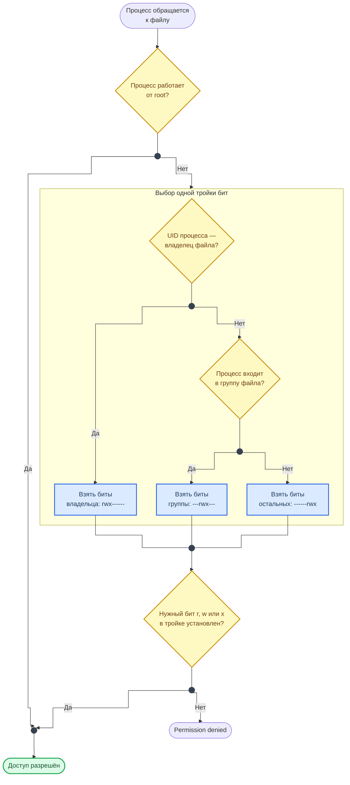

<div align="center">
<h1><a id="intro">Лаб. 02 · Linux: права доступа и процессы</a><br></h1>
<a href="https://docs.github.com/en"></a>
<a href="https://daringfireball.net/projects/markdown"></a>
<a href="https://shields.io"></a>


</div>

***

Салют :wave:,<br>
Данная лабораторная работа посвящена изучению *nix машин и как они работают, позволяет приобрести навыки для работы с терминалом/ консолью и приобрести знания по работе ОС. В лабораторной работе описываются материалы по командам, скриптам и подключаемым приложениям.

Для сдачи данной работы также будет требоваться ответить на дополнительные вопросы по описанным темам.

***

## Структура репозитория лабораторной работы

```bash
lab02
├── exmpl_hello.py
├── pygamesteel.py
├── pygamesteel_fixed.py
└── README.md
```

***

## Материал

Давайте начнем с описания как это работает, но следует подойти к этому вопросу изначально с **терминов** и **основных элементов**, таких как: 

<div class="lab-grid" style="grid-template-columns: repeat(auto-fill, minmax(min(15rem, 100%), 1fr));">
<div class="lab-card" style="flex-direction: column; align-items: flex-start; gap: 0.4rem;"><div style="display:flex; align-items:baseline; gap:0.6rem; width:100%;"><span class="lab-card-num" style="font-size:0.9rem; width:auto;">Терминал</span></div><span style="font-size:0.75rem; color:#555; line-height:1.5;">Устройство ввода/вывода — интерфейс между пользователем и системой.</span></div>
<div class="lab-card" style="flex-direction: column; align-items: flex-start; gap: 0.4rem;"><div style="display:flex; align-items:baseline; gap:0.6rem; width:100%;"><span class="lab-card-num" style="font-size:0.9rem; width:auto;">Оболочка</span><span style="font-size:0.65rem; color:#888; font-family:var(--font-code);">shell (bash, zsh)</span></div><span style="font-size:0.75rem; color:#555; line-height:1.5;">Интерпретатор команд, обеспечивающий интерфейс для взаимодействия пользователя с функциями ОС.</span><div class="lab-card-tags"><span class="lab-tag">env</span><span class="lab-tag">export</span><span class="lab-tag">echo</span><span class="lab-tag">reset</span><span class="lab-tag">logout</span><span class="lab-tag">exit</span></div></div>
<div class="lab-card" style="flex-direction: column; align-items: flex-start; gap: 0.4rem;"><div style="display:flex; align-items:baseline; gap:0.6rem; width:100%;"><span class="lab-card-num" style="font-size:0.9rem; width:auto;">Консоль</span><span style="font-size:0.65rem; color:#888; font-family:var(--font-code);">CLI commands</span></div><span style="font-size:0.75rem; color:#555; line-height:1.5;">Интерфейс командной строки с командами для работы с файлами и каталогами.</span><div class="lab-card-tags"><span class="lab-tag">ls</span><span class="lab-tag">cd</span><span class="lab-tag">touch</span><span class="lab-tag">mkdir</span><span class="lab-tag">rm</span><span class="lab-tag">cp</span><span class="lab-tag">mv</span><span class="lab-tag">ln</span><span class="lab-tag">cat</span><span class="lab-tag">df</span><span class="lab-tag">du</span><span class="lab-tag">wc</span><span class="lab-tag">uniq</span><span class="lab-tag">grep</span></div></div>
<div class="lab-card" style="flex-direction: column; align-items: flex-start; gap: 0.4rem;"><div style="display:flex; align-items:baseline; gap:0.6rem; width:100%;"><span class="lab-card-num" style="font-size:0.9rem; width:auto;">ФС</span><span style="font-size:0.65rem; color:#888; font-family:var(--font-code);">Filesystem Hierarchy</span></div><span style="font-size:0.75rem; color:#555; line-height:1.5;">Иерархия каталогов и файлов с правами доступа пользователей.</span><div class="lab-card-tags"><span class="lab-tag">/bin</span><span class="lab-tag">/sbin</span><span class="lab-tag">/dev</span><span class="lab-tag">/etc</span><span class="lab-tag">/lib</span><span class="lab-tag">/home</span><span class="lab-tag">/root</span><span class="lab-tag">/usr</span><span class="lab-tag">/var</span><span class="lab-tag">/tmp</span><span class="lab-tag">/proc</span><span class="lab-tag">/mnt</span><span class="lab-tag">/boot</span><span class="lab-tag">/sys</span></div></div>
<div class="lab-card" style="flex-direction: column; align-items: flex-start; gap: 0.4rem;"><div style="display:flex; align-items:baseline; gap:0.6rem; width:100%;"><span class="lab-card-num" style="font-size:0.9rem; width:auto;">ENV</span><span style="font-size:0.65rem; color:#888; font-family:var(--font-code);">Environment Variables</span></div><span style="font-size:0.75rem; color:#555; line-height:1.5;">Переменные, задающие контекст работы пользователя и процессов.</span><div class="lab-card-tags"><span class="lab-tag">SHELL</span><span class="lab-tag">USER</span><span class="lab-tag">HOME</span><span class="lab-tag">PATH</span><span class="lab-tag">PWD</span><span class="lab-tag">LANG</span></div></div>
</div>

***

### Права доступа

Неправильно назначенные права — одна из частых причин эскалации привилегий (privilege escalation). Если скрипт запускается от root, а конфиг доступен на запись всем (`777`) — злоумышленник может подменить конфиг и получить root-shell. Именно поэтому контроль прав — базовый навык для AppSec-инженера.

При монтировании образа для каждой *nix ОС задаются права доступа к файлам и путям каталогов, которые позволяют их индивидуально профилировать, а также изменять, но давайте посмотрим на общую картину, советую ознакомиться изначально с Петром Девянином и его описанием `take-grant` [модели](https://academia-moscow.ru/ftp_share/_books/fragments/fragment_20276.pdf). Система безопасности построена на:

> - chmod — изменение прав доступа

```bash
$ chmod [-R] [option] [rules] # пользователь может менять только у принадлежащих ему файлов, а root у всех файлов в системе
```

> - umask — маска, которая снимает биты прав у вновь создаваемых файлов и каталогов
> - chown — изменение владельца

```bash
$ chown [-R] user[:group] file # доступна только для root
         -R # рекурсивная смена
```

> - chgrp — изменение группы

```bash
$ chgrp [-R] group ... file # изменение группы файла для пользователя только там, где он является ее членом
```

У каждого файла или каталога имеются определённые права доступа, такие как:

> - r — право на чтение из файла / просмотр содержимого директории
> - w — право на запись в файл / создание, удаление файлов в директории
> - x — право на исполнение / доступ в директорию и сабдиректории

Базовые права при создании: **777** для каталогов и **666** для файлов, из них `umask` вычитает биты. При типичном `umask 022` новые каталоги получают **755**, а файлы **644**.

### Как ядро проверяет права

Схема показывает порядок, в котором Linux решает, разрешить ли процессу действие с файлом.



**Как читать схему:**

- Для root проверка прав не выполняется вовсе — поэтому процесс от root опасен независимо от того, как выставлены биты.
- Ядро выбирает ровно одну тройку бит и на этом останавливается. Владелец файла с правами `---rwxrwx` доступа не получит, хотя группе и остальным он разрешён.
- Порядок проверки — владелец, группа, остальные. Права не суммируются: применяется первая подошедшая тройка.
- Специальные биты из следующего раздела эту схему не отменяют, а меняют то, от чьего имени работает процесс (SUID, SGID) или кто может удалять файлы в каталоге (sticky).

Обозначения — в материале [Как читать схемы курса](https://course.geminishkv.tech/materials/diagrams_legend/).

### Специальные биты

- **SUID** (Set User ID, `chmod u+s`) — при запуске файла процесс получает права **владельца** файла, а не запустившего пользователя. Пример: `/usr/bin/passwd` имеет SUID, чтобы обычный пользователь мог менять свой пароль (запись в `/etc/shadow` требует root). **Риск:** если SUID-бинарник содержит уязвимость — это прямой путь к privilege escalation
- **SGID** (Set Group ID, `chmod g+s`) — аналогично для группы. На директории: все новые файлы наследуют группу каталога
- **Sticky bit** (`chmod +t` или `1xxx`) — на директории: удалить файл может только его владелец или root, даже если права на директорию `777`. Пример: `/tmp` имеет sticky bit — все могут создавать файлы, но удалять только свои

```bash
$ chmod u+s ./app        # SUID (у скриптов ядро Linux этот бит игнорирует)
$ chmod g+s dir/          # SGID
$ chmod +t dir/           # Sticky bit
$ chmod 4755 ./app       # SUID через octal (4 = SUID)
$ chmod 1777 /tmp        # Sticky bit через octal (1 = sticky)
$ ls -la /tmp            # drwxrwxrwt — буква 't' = sticky bit
```

А теперь давайте посмотрим, как можно поменять права. На сейчас все `*nix` поддерживают `POSIX ACL`, который позволяет указать права доступа для конкретных пользователей и групп.

```bash
$ getfacl [option] file ... # показывает список access list
$ setfacl [option] file ... # устанавливает или удаляет access list
         -m # изменение или установка
         -x # удаление
         
# Пример
$ setfacl -m u:user1:rw file # для пользователя
$ setfacl -m g:users:r file # для группы
$ setfacl -m m::rw file # для маски

```
 
***

### Процессы

А теперь давай посмотрим, что каждому выполняемому процессу присваивается уникальный номер `PID` Process ID, где его ID после завершения процесса высвобождается. У всех процессов в системе кроме самого первого (**PID = 1**: `init` или `systemd`) есть родительские, которые запускают процесс. 

```bash
$ ps [option] # список процессов в системе
    -a        # процессы, привязанные к терминалу (кроме лидеров сессий)
    -e        # все процессы системы
    -f        # полный формат: UID, PID, PPID, время запуска, команда
    -u user   # процессы пользователя
    --forest  # дерево процессов
$ ps x        # BSD-синтаксис: в том числе процессы без управляющего терминала
$ pstree      # дерево процессов

$ kill -l                  # список сигналов
$ kill [-SIGNAL] PID       # отправить сигнал процессу (по умолчанию SIGTERM)
$ killall [-SIGNAL] name   # отправить сигнал всем процессам с этим именем
```

Если родительский процесс завершился раньше дочернего, родителем осиротевшего процесса становится `init` (PID 1). Когда `shell` заканчивает работу, запущенные из него процессы получают сигнал `SIGHUP` и по умолчанию завершаются. Чтобы программа продолжила работать без оболочки, её запускают через `nohup`: он игнорирует `SIGHUP` и перенаправляет вывод в файл. `daemon` устроен похоже: после запуска он сам отключается от терминала и работает в фоне.

***

## Задание

- [ ] 1. Выведите на терминале и проанализируйте следующие команды консоли

```bash
$ who | wc -l
$ id
$ whoami
$ hostnamectl
```

- [ ] 2. Выведите утилитой `tree` список вложенности дерева директорий для каталога своего пользователя. Далее используйте `ls -a` и укажите отличие от `ls -l`.
- [ ] 3. Используйте `df -T` и `sudo file -s` для определения файловой системы на корневом разделе (например, `/dev/sda1`; имя раздела посмотрите в `lsblk`).
- [ ] 4. Выведите на терминале и проанализируйте следующие команды консоли (`locate` ставится пакетом `plocate`)

```bash
$ which vi
$ locate hello.py
$ sudo updatedb
$ locate hello
$ touch screen
$ find ~ -name screen
$ locate screen
$ sudo updatedb
$ locate screen
```

- [ ] 5. Создайте файл `pygamesteel.py` и вставьте в него код ниже. Установите `pygame` в виртуальное окружение (`pip install pygame`): библиотека нужна только для окна.

> **Hint:** в коде ниже три намеренные ошибки: переменная `screen` не присвоена, фон рисуется рамкой в 1 px вместо заливки (`screen.fill`), а `pygame.display.flip()` стоит после бесконечного цикла и никогда не вызывается. Найдите и исправьте их, сохраните исправленную версию как `pygamesteel_fixed.py`.

```py
import pygame
pygame.init()

# Устанавливаем размеры окна
screen_width = 800
screen_height = 600
window_size = (screen_width, screen_height)
pygame.display.set_mode(window_size) # Создаем окно

# Задаем цвет фона
bg_color = (255, 255, 255)
pygame.draw.rect(screen, bg_color, [0, 0, screen_width, screen_height], 1)

# Выводим текст на экран
font = pygame.font.SysFont(None, 75)
text = font.render("Hello appsec world*", True, (0, 255, 0))
text_rect = text.get_rect()
text_rect.center = (400, 300)
screen.blit(text, text_rect)

while True:
    for event in pygame.event.get():
        if event.type == pygame.QUIT:
            pygame.quit()
            quit()
pygame.display.flip() # Обновляем экран
```

- [ ] 6. Сделайте `commit` и `push` в свой репозиторий с изменениями в `master branch`. На следующих лабораторных работах мы вернемся к этому файлу.
- [ ] 7. Выведите на терминале и проанализируйте следующие команды консоли

```bash
$ groups
$ sudo useradd -m smallman
$ sudo userdel -rf smallman
$ sudo useradd -m smallman
$ sudo passwd smallman
$ sudo usermod -c 'Hach Hachov Hacherovich,239,45-67,499-239-45-33' smallman
$ getent passwd smallman
$ id smallman
$ sudo groupadd -g 1500 readgroup
$ sudo usermod -aG readgroup smallman
$ chmod 666 screen
```


- [ ] 8. Выведите группу прав для `screen` и измените, чтобы файл был доступен только для чтения созданному пользователю и выведите права этого пользователя для измененного файла только используя `readgroup`.
- [ ] 9. Используйте `POSIX ACL`. Выведите на терминале и проанализируйте следующие команды консоли

```bash
$ touch nmapres.txt
$ setfacl -m u:smallman:rw nmapres.txt
$ setfacl -m g:readgroup:r nmapres.txt
$ getfacl nmapres.txt
```

- [ ] 10. Сохраните файл внутри локального репозитория: в следующей работе в него записываются результаты nmap.
- [ ] 11. Для закрепления выведите все списки групп пользователей на вашей ОС и права на верхнеуровневые каталоги.
- [ ] 12. Выведите все права для файлов и директорий локального репозитория которые имеют различные пользователи  (без использования длинных путей)
- [ ] 13. Создайте скрипт `test_privesc.sh` с содержимым `echo "Running as $(whoami)"`, сделайте его исполняемым, установите SUID-бит и запустите от другого пользователя. Убедитесь, что скрипт выводит имя запустившего: ядро Linux игнорирует SUID у интерпретируемых скриптов. Для сравнения скопируйте бинарник (`cp /usr/bin/id ./id_suid`), передайте его root (`sudo chown root ./id_suid`), установите SUID (`sudo chmod u+s ./id_suid`) и запустите от `smallman`: в выводе появится `euid=0`. Удалите `id_suid` после проверки. Опишите, почему SUID-бинарники опасны и как это используется для privilege escalation
- [ ] 14. Создайте директорию `shared/` с правами `770` и sticky bit (`chmod 1770`), назначьте ей группу `readgroup` (`sudo chgrp readgroup shared`) и добавьте себя в эту группу (`sudo usermod -aG readgroup $USER`, затем перелогиньтесь). Добавьте файлы от двух пользователей. Убедитесь, что каждый может удалить только свои файлы. Опишите разницу между `770` и `1770`
- [ ] 15. Найдите все SUID-файлы в системе: `find / -perm -4000 2>/dev/null`. Опишите 3 найденных файла — зачем им SUID и какой риск они несут
- [ ] 16. Выведите процессы которые у вас запущены в терминале и вне его.
- [ ] 17. Оформить `README.md` по аналогии с этим и добавить shields-бейджи
- [ ] 18. Составить `gist` отчёт и отправить ссылку личным сообщением

***

## Смотри также

- [CheatSheet: Git](https://course.geminishkv.tech/materials/cheatsheet/CHEATSHEET_GIT/) — шпаргалка по командам Git
- [CheatSheet: Linux — права и процессы](https://course.geminishkv.tech/materials/cheatsheet/CHEATSHEET_LINUX/) — как читать `ls -l`, специальные биты, ACL, состояния процессов и сигналы
- [Лаб. 03 — Nmap](https://course.geminishkv.tech/labs/basic/lab03/) — следующий шаг: используем `nmapres.txt` из этой лабы
- [Подготовка окружения](https://course.geminishkv.tech/materials/guides/vmbox_tutorial/) — если не настроена VM
- [Лаб. 01 — Git](https://course.geminishkv.tech/labs/basic/lab01/) — репозиторий и отчёт, в которые складывается результат
- [Приложение — команды и утилиты](https://course.geminishkv.tech/materials/APPENDIX/) — справочник команд Linux, Git и Docker

***

## Troubleshooting

Если столкнулись с проблемами — смотрите [Troubleshooting](https://course.geminishkv.tech/materials/troubleshooting/).

## Links

<div class="lab-grid" style="grid-template-columns: repeat(auto-fill, minmax(min(14rem, 100%), 1fr));">
<a class="lab-card" href="https://gist.github.com" target="_blank"><div class="lab-card-body"><div class="lab-card-title">Gist</div><div class="lab-card-tags"><span class="lab-tag">gist.github.com</span></div></div><div class="lab-card-arrow">→</div></a>
<a class="lab-card" href="https://cli.github.com" target="_blank"><div class="lab-card-body"><div class="lab-card-title">GitHub CLI</div><div class="lab-card-tags"><span class="lab-tag">cli.github.com</span></div></div><div class="lab-card-arrow">→</div></a>
<a class="lab-card" href="https://en.wikipedia.org/wiki/Cat_(Unix)" target="_blank"><div class="lab-card-body"><div class="lab-card-title">cat</div><div class="lab-card-tags"><span class="lab-tag">en.wikipedia.org</span></div></div><div class="lab-card-arrow">→</div></a>
<a class="lab-card" href="https://en.wikipedia.org/wiki/Cd_(command)" target="_blank"><div class="lab-card-body"><div class="lab-card-title">cd</div><div class="lab-card-tags"><span class="lab-tag">en.wikipedia.org</span></div></div><div class="lab-card-arrow">→</div></a>
<a class="lab-card" href="https://en.wikipedia.org/wiki/Cp_(Unix)" target="_blank"><div class="lab-card-body"><div class="lab-card-title">cp</div><div class="lab-card-tags"><span class="lab-tag">en.wikipedia.org</span></div></div><div class="lab-card-arrow">→</div></a>
<a class="lab-card" href="https://en.wikipedia.org/wiki/Echo_(command)" target="_blank"><div class="lab-card-body"><div class="lab-card-title">echo</div><div class="lab-card-tags"><span class="lab-tag">en.wikipedia.org</span></div></div><div class="lab-card-arrow">→</div></a>
<a class="lab-card" href="https://en.wikipedia.org/wiki/Env_(shell)" target="_blank"><div class="lab-card-body"><div class="lab-card-title">env</div><div class="lab-card-tags"><span class="lab-tag">en.wikipedia.org</span></div></div><div class="lab-card-arrow">→</div></a>
<a class="lab-card" href="https://en.wikipedia.org/wiki/File_(command)" target="_blank"><div class="lab-card-body"><div class="lab-card-title">file</div><div class="lab-card-tags"><span class="lab-tag">en.wikipedia.org</span></div></div><div class="lab-card-arrow">→</div></a>
<a class="lab-card" href="https://en.wikipedia.org/wiki/Ls" target="_blank"><div class="lab-card-body"><div class="lab-card-title">ls</div><div class="lab-card-tags"><span class="lab-tag">en.wikipedia.org</span></div></div><div class="lab-card-arrow">→</div></a>
<a class="lab-card" href="https://en.wikipedia.org/wiki/Mkdir" target="_blank"><div class="lab-card-body"><div class="lab-card-title">mkdir</div><div class="lab-card-tags"><span class="lab-tag">en.wikipedia.org</span></div></div><div class="lab-card-arrow">→</div></a>
<a class="lab-card" href="https://en.wikipedia.org/wiki/Mv" target="_blank"><div class="lab-card-body"><div class="lab-card-title">mv</div><div class="lab-card-tags"><span class="lab-tag">en.wikipedia.org</span></div></div><div class="lab-card-arrow">→</div></a>
<a class="lab-card" href="https://en.wikipedia.org/wiki/Ps_(Unix)" target="_blank"><div class="lab-card-body"><div class="lab-card-title">ps</div><div class="lab-card-tags"><span class="lab-tag">en.wikipedia.org</span></div></div><div class="lab-card-arrow">→</div></a>
<a class="lab-card" href="https://en.wikipedia.org/wiki/Pwd" target="_blank"><div class="lab-card-body"><div class="lab-card-title">pwd</div><div class="lab-card-tags"><span class="lab-tag">en.wikipedia.org</span></div></div><div class="lab-card-arrow">→</div></a>
<a class="lab-card" href="https://en.wikipedia.org/wiki/Rm_(Unix)" target="_blank"><div class="lab-card-body"><div class="lab-card-title">rm</div><div class="lab-card-tags"><span class="lab-tag">en.wikipedia.org</span></div></div><div class="lab-card-arrow">→</div></a>
<a class="lab-card" href="https://en.wikipedia.org/wiki/Touch_(Unix)" target="_blank"><div class="lab-card-body"><div class="lab-card-title">touch</div><div class="lab-card-tags"><span class="lab-tag">en.wikipedia.org</span></div></div><div class="lab-card-arrow">→</div></a>
<a class="lab-card" href="http://help.ubuntu.ru/wiki/apt" target="_blank"><div class="lab-card-body"><div class="lab-card-title">apt</div><div class="lab-card-tags"><span class="lab-tag">help.ubuntu.ru</span></div></div><div class="lab-card-arrow">→</div></a>
<a class="lab-card" href="https://brew.sh" target="_blank"><div class="lab-card-body"><div class="lab-card-title">brew</div><div class="lab-card-tags"><span class="lab-tag">brew.sh</span></div></div><div class="lab-card-arrow">→</div></a>
<a class="lab-card" href="https://docs.npmjs.com" target="_blank"><div class="lab-card-body"><div class="lab-card-title">npm</div><div class="lab-card-tags"><span class="lab-tag">docs.npmjs.com</span></div></div><div class="lab-card-arrow">→</div></a>
</div>
