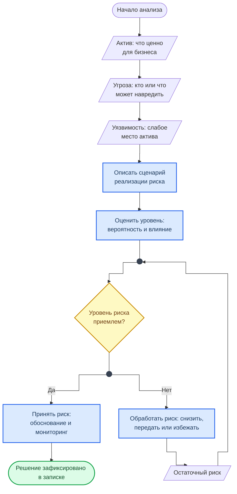

<div align="center">
<h1><a id="intro">Лаб. 04 · Анализ и снижение рисков ИБ</a><br></h1>
<a href="https://docs.github.com/en"></a>
<a href="https://daringfireball.net/projects/markdown"></a>
<a href="https://shields.io"></a>


</div>

***

Салют :wave:,<br>
Данная лабораторная работа посвящена практическому анализу и определению мер снижения рисков ИБ. То есть вам, при развитии компетенций в ИБ, будет требоваться доносить требования ИБ, необходимость их выполнения, критичность и важность до коллег. 

Аналогичным образом, с помощью данного практического задания будет понятно, насколько плотно вы взаимодействовали с ИБ, что знаете из основ по обеспечению защиты информации, а также с какими подобными кейсами вы сталкивались в своей практике.

Вы получите навыки оценки задачи в роли специалиста ИБ, посмотрите на кейсы со стороны ИБ и сможете дать свою оценку, как бы вы подошли к этим вопросам в данной ситуации. 

***

## Структура репозитория лабораторной работы

```bash
lab04
└── README.md
```

***

## Материал

Анализ рисков ИБ — процесс идентификации угроз, оценки вероятности их реализации и потенциального ущерба. Цель — выработать меры снижения рисков до приемлемого уровня.

### Ключевые понятия

<div class="lab-grid" style="grid-template-columns: repeat(auto-fill, minmax(min(14rem, 100%), 1fr));">

  <div class="lab-card" style="flex-direction: column; align-items: flex-start; gap: 0.4rem;">
  <div style="display:flex; align-items:baseline; gap:0.6rem; width:100%;">
    <span class="lab-card-num" style="font-size:0.9rem; width:auto;">Актив</span>
    <span style="font-size:0.65rem; color:#888; font-family:var(--font-code);">Asset</span>
  </div>
  <p style="font-size:0.75rem; margin:0.2rem 0 0; color:#555; line-height:1.5;">Всё, что имеет ценность: данные, системы, репутация, бизнес-процессы</p>
  </div>

  <div class="lab-card" style="flex-direction: column; align-items: flex-start; gap: 0.4rem;">
  <div style="display:flex; align-items:baseline; gap:0.6rem; width:100%;">
    <span class="lab-card-num" style="font-size:0.9rem; width:auto;">Угроза</span>
    <span style="font-size:0.65rem; color:#888; font-family:var(--font-code);">Threat</span>
  </div>
  <p style="font-size:0.75rem; margin:0.2rem 0 0; color:#555; line-height:1.5;">Потенциальное событие, способное нанести ущерб активу</p>
  </div>

  <div class="lab-card" style="flex-direction: column; align-items: flex-start; gap: 0.4rem;">
  <div style="display:flex; align-items:baseline; gap:0.6rem; width:100%;">
    <span class="lab-card-num" style="font-size:0.9rem; width:auto;">Уязвимость</span>
    <span style="font-size:0.65rem; color:#888; font-family:var(--font-code);">Vulnerability</span>
  </div>
  <p style="font-size:0.75rem; margin:0.2rem 0 0; color:#555; line-height:1.5;">Слабость актива или процесса, которая может быть эксплуатирована угрозой</p>
  </div>

  <div class="lab-card" style="flex-direction: column; align-items: flex-start; gap: 0.4rem;">
  <div style="display:flex; align-items:baseline; gap:0.6rem; width:100%;">
    <span class="lab-card-num" style="font-size:0.9rem; width:auto;">Риск</span>
    <span style="font-size:0.65rem; color:#888; font-family:var(--font-code);">Risk = Probability × Impact</span>
  </div>
  <p style="font-size:0.75rem; margin:0.2rem 0 0; color:#555; line-height:1.5;">Вероятность реализации угрозы, умноженная на величину ущерба</p>
  </div>

  <div class="lab-card" style="flex-direction: column; align-items: flex-start; gap: 0.4rem;">
  <div style="display:flex; align-items:baseline; gap:0.6rem; width:100%;">
    <span class="lab-card-num" style="font-size:0.9rem; width:auto;">Мера снижения</span>
    <span style="font-size:0.65rem; color:#888; font-family:var(--font-code);">Mitigation</span>
  </div>
  <p style="font-size:0.75rem; margin:0.2rem 0 0; color:#555; line-height:1.5;">Техническое или организационное решение, снижающее вероятность или ущерб</p>
  </div>

  <div class="lab-card" style="flex-direction: column; align-items: flex-start; gap: 0.4rem;">
  <div style="display:flex; align-items:baseline; gap:0.6rem; width:100%;">
    <span class="lab-card-num" style="font-size:0.9rem; width:auto;">Остаточный риск</span>
    <span style="font-size:0.65rem; color:#888; font-family:var(--font-code);">Residual Risk</span>
  </div>
  <p style="font-size:0.75rem; margin:0.2rem 0 0; color:#555; line-height:1.5;">Риск, остающийся после применения мер снижения</p>
  </div>

</div>

### Стратегии обработки рисков

<div class="lab-grid" style="grid-template-columns: repeat(auto-fill, minmax(min(11rem, 100%), 1fr));">

  <div class="lab-card" style="flex-direction: column; align-items: flex-start; gap: 0.4rem;">
  <div class="lab-card-title" style="font-weight:700;">Избежание</div>
  <div class="lab-card-tags"><span class="lab-tag">Avoidance</span></div>
  <p style="font-size:0.75rem; margin:0.2rem 0 0; color:#555; line-height:1.5;">Отказ от деятельности, порождающей риск</p>
  </div>

  <div class="lab-card" style="flex-direction: column; align-items: flex-start; gap: 0.4rem;">
  <div class="lab-card-title" style="font-weight:700;">Снижение</div>
  <div class="lab-card-tags"><span class="lab-tag">Mitigation</span></div>
  <p style="font-size:0.75rem; margin:0.2rem 0 0; color:#555; line-height:1.5;">Внедрение контролей для уменьшения вероятности или ущерба</p>
  </div>

  <div class="lab-card" style="flex-direction: column; align-items: flex-start; gap: 0.4rem;">
  <div class="lab-card-title" style="font-weight:700;">Передача</div>
  <div class="lab-card-tags"><span class="lab-tag">Transfer</span></div>
  <p style="font-size:0.75rem; margin:0.2rem 0 0; color:#555; line-height:1.5;">Перенос последствий на третью сторону (страхование, аутсорс)</p>
  </div>

  <div class="lab-card" style="flex-direction: column; align-items: flex-start; gap: 0.4rem;">
  <div class="lab-card-title" style="font-weight:700;">Принятие</div>
  <div class="lab-card-tags"><span class="lab-tag">Acceptance</span></div>
  <p style="font-size:0.75rem; margin:0.2rem 0 0; color:#555; line-height:1.5;">Осознанное решение принять риск (с обоснованием и мониторингом)</p>
  </div>

</div>

### Логическая цепочка анализа

Схема показывает порядок рассуждений, по которому в лабораторной разбирается каждый риск.



**Как читать схему:**

- Три параллелограмма — входные данные: актив, угроза и уязвимость. Если нет хотя бы одного из трёх, риска нет.
- Уровень риска складывается из вероятности и влияния; ромб сравнивает его с порогом, который организация готова принять.
- При «Нет» риск обрабатывают: снижают, передают или избегают. Остаточный риск возвращается на оценку — цикл идёт, пока уровень не станет приемлемым.
- При «Да» риск принимают. Это тоже решение: с обоснованием, мониторингом и записью в аналитической записке.

Обозначения — в материале [Как читать схемы курса](https://course.geminishkv.tech/materials/diagrams_legend/).

> Основной критерий отчёта: **проблема → решение → ценность → приоритет**. Описание должно быть понятно и техническому специалисту, и менеджменту.

### Compliance-контекст

В данной лабораторной работе учитываются:

- **GDPR** (General Data Protection Regulation) — регламент ЕС по защите персональных данных
- **152-ФЗ** — Федеральный закон о персональных данных (РФ)
- **ISO 27001/27005** — стандарты управления информационной безопасностью и рисками
- **NIST SP 800-30** — руководство по оценке рисков ИБ

***

## Вводные

Компания зарегистрирована в Евросоюзе и должна соответствовать законодательству ЕС. Вы работаете в этой компании и отвечаете за обеспечение ИБ.

Вы обнаруживаете админскую консоль веб-сайта своей компании, доступную неограниченному кругу лиц в сети Интернет: она опубликована во внешнем сегменте сети.
> - С помощью её интерфейса доступны на просмотр записи с запросами о приобретении продукции компании, которые содержат персональные данные, а также коммерческие предложения (что, в каком объёме, за сколько, специальные условия и т. д.).
> - Также доступны логи, в которых видны IP-адреса администраторов, заходивших в консоль.

***

## Предоставление материалов

> - Ожидается результат в виде аналитической записки на `gist`, которая будет раскрывать уровень, степень критичности рисков, меры, которые могут снизить этот риск, приоритет, подход.
> - Необходимо иметь в наличии проведённый анализ рисков, их описание, меры снижения рисков, техническое решение. Данные материалы должны быть, как минимум, описаны технически, включая пояснения для менеджмента. Основным критерием является логическая цепочка в виде: проблема – решение – ценность – приоритет.

***

## Задание

- [ ] 1. Провести анализ на возможность взлома, утечки, доступности информации и её категории значимости для компании
- [ ] 2. Необходимо подойти к анализу в соответствии с Compliance: данные размещены на инфраструктуре в Евросоюзе, но они включают ПДн, в том числе граждан России, Евросоюза, а также в отношении информации ограниченного доступа, инсайдерской информации и иное
    - [ ] Описать риски, которые возникают из кейса, меры снижения рисков, описать уровень эффективности мер
    - [ ] Предложить техническое решение для снижения рисков ИБ
    - [ ] Привести свое заключение рисков к мерам и их эффективности.
    - [ ] Требуется проанализировать и дать пояснения на следующий перечень вопросов:
        - [ ] Как вы опишете данную ситуацию в части обнаруженных вами недостатков архитектуры приложения, присущих ей рисков (в том числе какие риски вы видите для компании)?
        - [ ] Какие меры по митигации рисков вы предложите в минимально необходимой и достаточной форме?
- [ ] 3. Подготовьте отчёт `gist`.

***

## Смотри также

- [Лаб. 03 — Nmap](https://course.geminishkv.tech/labs/basic/lab03/) — результаты сканирования как входные данные для анализа рисков
- [Лаб. 10 — Итоговый Risk Analysis](https://course.geminishkv.tech/labs/basic/lab10/) — расширенный кейс с бизнес-контекстом
- [Примеры кейсов](https://course.geminishkv.tech/materials/examples/exmpl/) — реальные инциденты ИБ
- [Risk Analysis — пример](https://course.geminishkv.tech/materials/examples/RA/) — пример аналитического отчёта
- [OWASP — Logical Attacks](https://course.geminishkv.tech/materials/OWASPTOP10/logical-attacks/) — атаки на бизнес-логику и оценка рисков
- [Лаб. 05 — Docker](https://course.geminishkv.tech/labs/basic/lab05/) — следующий этап: контейнеризация приложений

***

## Troubleshooting

Если столкнулись с проблемами — смотрите [Troubleshooting](https://course.geminishkv.tech/materials/troubleshooting/).

## Links

<div class="lab-grid" style="grid-template-columns: repeat(auto-fill, minmax(min(14rem, 100%), 1fr));">
<a class="lab-card" href="https://course.geminishkv.tech/materials/examples/RA/" target="_blank"><div class="lab-card-body"><div class="lab-card-title">Пример аналитических отчётов</div><div class="lab-card-tags"><span class="lab-tag">github.com</span></div></div><div class="lab-card-arrow">→</div></a>
<a class="lab-card" href="https://web.archive.org/web/20260905043049/https://owasp.org/www-community/OWASP_Risk_Rating_Methodology" target="_blank"><div class="lab-card-body"><div class="lab-card-title">OWASP Risk Rating Methodology</div><div class="lab-card-tags"><span class="lab-tag">owasp.org</span></div></div><div class="lab-card-arrow">→</div></a>
<a class="lab-card" href="https://csrc.nist.gov/pubs/sp/800/30/r1/final" target="_blank"><div class="lab-card-body"><div class="lab-card-title">NIST SP 800-30 — Risk Assessment</div><div class="lab-card-tags"><span class="lab-tag">csrc.nist.gov</span></div></div><div class="lab-card-arrow">→</div></a>
<a class="lab-card" href="https://gdpr-info.eu/" target="_blank"><div class="lab-card-body"><div class="lab-card-title">GDPR — General Data Protection Regulation</div><div class="lab-card-tags"><span class="lab-tag">gdpr-info.eu</span></div></div><div class="lab-card-arrow">→</div></a>
<a class="lab-card" href="https://www.iso.org/standard/75281.html" target="_blank"><div class="lab-card-body"><div class="lab-card-title">ISO/IEC 27005 — Risk Management</div><div class="lab-card-tags"><span class="lab-tag">iso.org</span></div></div><div class="lab-card-arrow">→</div></a>
<a class="lab-card" href="https://gist.github.com" target="_blank"><div class="lab-card-body"><div class="lab-card-title">Gist</div><div class="lab-card-tags"><span class="lab-tag">gist.github.com</span></div></div><div class="lab-card-arrow">→</div></a>
<a class="lab-card" href="https://cli.github.com" target="_blank"><div class="lab-card-body"><div class="lab-card-title">GitHub CLI</div><div class="lab-card-tags"><span class="lab-tag">cli.github.com</span></div></div><div class="lab-card-arrow">→</div></a>
</div>
