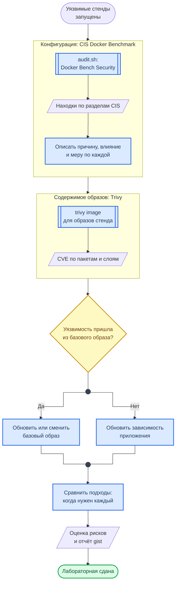

<div align="center">
<h1><a id="intro">Лаб. 06 · Docker CIS Benchmark и Trivy</a><br></h1>
<a href="https://docs.github.com/en"></a>
<a href="https://daringfireball.net/projects/markdown"></a>
<a href="https://shields.io"></a>


</div>

***

Салют :wave:,<br>
Данная лабораторная работа посвящена изучению аудита безопасности `Docker` при использовании `Docker Bench Security`. Мы рассмотрим, как с ним работать: как проверить конфигурации безопасности, выявить их некорректность и провести проверку по `CIS Docker Benchmark v1.6.0`.

Для сдачи данной работы также будет требоваться ответить на дополнительные вопросы по описанным темам.

***

## Структура репозитория лабораторной работы

```bash
lab06
├── audit.sh
├── config
│   └── nginx.conf
├── docker-compose.yml
├── README.md
└── vulnerable-app.yml
```

***

## Материал

### Docker Bench Security

Официальный инструмент аудита безопасности от Docker, который проверяет практики развертывания на соответствие `CIS Docker Benchmark`.

Реальный аудит контейнерной безопасности выполняется на Linux‑хосте / WSL2 с нативным Docker Engine, что соответствует методике CIS и практике промышленного Docker hardening.

### Рассматриваемые вопросы безопасности

- Привилегированные контейнеры
- Захардкоженные данные учёток
- Отключённые профили безопасности (AppArmor, Seccomp)
- Прямое монтирование файловой системы
- Устаревшие образы и явный запуск сервисов от привилегированного пользователя
- Дополнительные сервисы, лишние утилиты
- Расширенные volume‑маунты
- env и SQL‑инициализации
- Примеры анти‑паттернов: privileged, host‑network, docker.sock, secrets-in-env, outdated images

### Контекст безопасности

> Основные принципы безопасности Docker описаны в [Лаб. 05](https://course.geminishkv.tech/labs/basic/lab05/) — здесь фокус на аудите и проверке их выполнения через CIS Benchmark.

### Уровни CIS Docker Benchmark

<div class="lab-grid" style="grid-template-columns: repeat(auto-fill, minmax(min(15rem, 100%), 1fr));">
<div class="lab-card" style="flex-direction: column; align-items: flex-start; gap: 0.3rem;"><span class="lab-card-num" style="font-size:0.85rem; width:auto;">Level 1</span><div class="lab-card-tags"><span class="lab-tag">Базовый</span><span class="lab-tag">Обязательный</span></div><span style="font-size:0.72rem; color:#555; line-height:1.4;">Минимальный набор проверок, не влияющий на производительность. Подходит для всех окружений.</span></div>
<div class="lab-card" style="flex-direction: column; align-items: flex-start; gap: 0.3rem;"><span class="lab-card-num" style="font-size:0.85rem; width:auto;">Level 2</span><div class="lab-card-tags"><span class="lab-tag">Расширенный</span><span class="lab-tag">Продвинутый</span></div><span style="font-size:0.72rem; color:#555; line-height:1.4;">Углублённые проверки, могут ограничивать функциональность. Для production и высокого уровня защиты.</span></div>
</div>

### Категории проверок CIS

<div class="lab-grid" style="grid-template-columns: repeat(auto-fill, minmax(min(14rem, 100%), 1fr));">
<div class="lab-card" style="flex-direction: column; align-items: flex-start; gap: 0.3rem;"><span class="lab-card-num" style="font-size:0.85rem; width:auto;">1. Host Configuration</span><span style="font-size:0.72rem; color:#555; line-height:1.4;">Аудит, файловые разрешения, логирование Docker daemon, настройки ядра хоста</span></div>
<div class="lab-card" style="flex-direction: column; align-items: flex-start; gap: 0.3rem;"><span class="lab-card-num" style="font-size:0.85rem; width:auto;">2. Docker Daemon</span><span style="font-size:0.72rem; color:#555; line-height:1.4;">TLS, авторизация, сетевой режим, логирование, live restore, user namespace</span></div>
<div class="lab-card" style="flex-direction: column; align-items: flex-start; gap: 0.3rem;"><span class="lab-card-num" style="font-size:0.85rem; width:auto;">3. Docker Daemon Files</span><span style="font-size:0.72rem; color:#555; line-height:1.4;">Права на docker.sock, конфиги daemon, TLS-сертификаты, /etc/docker</span></div>
<div class="lab-card" style="flex-direction: column; align-items: flex-start; gap: 0.3rem;"><span class="lab-card-num" style="font-size:0.85rem; width:auto;">4. Container Images</span><span style="font-size:0.72rem; color:#555; line-height:1.4;">Доверенные базовые образы, USER не root, HEALTHCHECK, минимизация пакетов</span></div>
<div class="lab-card" style="flex-direction: column; align-items: flex-start; gap: 0.3rem;"><span class="lab-card-num" style="font-size:0.85rem; width:auto;">5. Container Runtime</span><span style="font-size:0.72rem; color:#555; line-height:1.4;">AppArmor/seccomp, capabilities, privileges, read-only FS, ресурсные лимиты</span></div>
<div class="lab-card" style="flex-direction: column; align-items: flex-start; gap: 0.3rem;"><span class="lab-card-num" style="font-size:0.85rem; width:auto;">6. Docker Security Ops</span><span style="font-size:0.72rem; color:#555; line-height:1.4;">Сканирование образов, Content Trust, мониторинг, incident response</span></div>
</div>

### Схема работы

Схема показывает два независимых взгляда на безопасность контейнеров, которые сравниваются в лабораторной.



**Как читать схему:**

- Первая рамка проверяет, как Docker настроен и запущен: хост, демон, параметры контейнеров. Вторая — что лежит внутри образов. Одно не заменяет другое.
- Ромб после Trivy определяет меру: уязвимость из базового образа лечится его обновлением или заменой, уязвимость из зависимости приложения — обновлением самой зависимости.
- Сравнение подходов — отдельный шаг, а не вывод «для галочки»: от него зависит, какой инструмент ставить в конвейер и на каком этапе.
- Находки обеих рамок идут в оценку рисков по схеме из Лаб. 04.

Обозначения — в материале [Как читать схемы курса](https://course.geminishkv.tech/materials/diagrams_legend/).

***

## Задание

- [ ] 1. Установите `Docker Engine` с плагином compose, `Trivy` и образ `docker-bench-security`. Trivy нужен уже на шаге 4: без него `audit.sh` пропускает сканирование образов и каталог `json/` останется пустым

```bash
$ sudo apt-get update
$ sudo apt-get install -y docker.io docker-compose-v2
$ sudo usermod -aG docker "$USER" && newgrp docker
$ sudo systemctl start docker
$ docker pull docker/docker-bench-security

# Trivy из официального репозитория Aqua: пакет проверяется по подписи
$ sudo apt-get install -y wget gnupg
$ wget -qO - https://aquasecurity.github.io/trivy-repo/deb/public.key | gpg --dearmor | sudo tee /usr/share/keyrings/trivy.gpg > /dev/null
$ echo "deb [signed-by=/usr/share/keyrings/trivy.gpg] https://aquasecurity.github.io/trivy-repo/deb generic main" | sudo tee /etc/apt/sources.list.d/trivy.list
$ sudo apt-get update && sudo apt-get install -y trivy
```

- [ ] 2. Проверьте работу Docker и сделайте скрипт `audit.sh` исполняемым
- [ ] 3. Разверните уязвимое приложение как отдельные стенды

```bash
# основной стенд: web, app, postgres
$ docker compose up -d

# второй стенд отдельным проектом (-p): в обоих файлах есть сервис vulnerable-web,
# и в одном проекте второй запуск пересоздал бы контейнер первого
$ docker compose -p lab06-vuln -f vulnerable-app.yml up -d

# -p имя проекта, -f файл compose, up создаёт и запускает сервисы, -d фоновый режим
```

- [ ] 4. Запустите скрипт из `venv` и проанализируйте то, что вывело на терминале и что вывело при конвертировании

```bash
$ python3 -m venv venv
$ source venv/bin/activate
$ pip install openpyxl odfpy
$ ./audit.sh
$ deactivate # или $ deactivate 2>/dev/null || true
```
 
- [ ] 5. Проведите анализ уязвимостей, опишите их причину возникновения
- [ ] 6. Опишите влияния уязвимостей, их сценарий атаки
- [ ] 7. Оцените риски ИБ и предложите меры для их снижения: 
> - Следует разобрать `.yaml` описав, что в них считается не безопасным и почему
> - Опишите сценарии реализации рисков CR, DL
> - Предложите исправленные `.yaml`
- [ ] 8. Сделайте анализ уязвимостей из сгенерированных файлов .odt, .xlsx и опишите их в отчёте. Файлы конвертируются в эти директории

```text
audit_reports
├── json/          (Trivy JSON outputs)
├── text/          (CIS audit text outputs)
├── xlsx/          (Excel spreadsheets)
└── odt/           (OpenDocument Text files)
```

- [ ] 9. Подготовьте отчёт `gist`.
- [ ] 10. Почистите кэш от `venv`, остановите уязвимое приложение и почистите контейнеры

```bash
$ rm -rf venv
$ docker compose -p lab06-vuln -f vulnerable-app.yml down
$ docker compose down
$ docker system prune -f
```
 
***

## Container Vulnerability Scanning (Trivy)

Помимо аудита конфигурации (CIS Benchmark), важно сканировать сами образы на известные CVE в OS-пакетах и языковых зависимостях.

- [ ] 11. Просканируйте образы из `docker-compose.yml` через Trivy (установлен на шаге 1; на macOS: `brew install trivy`)

```bash
# сканирование образа из compose
$ trivy image --severity HIGH,CRITICAL <image_name>:<tag>

# JSON-отчёт для анализа
$ trivy image --format json --output audit_reports/json/trivy-report.json <image_name>:<tag>
```

- [ ] 12. Проанализируйте результаты Trivy: определите, из каких слоёв приходят уязвимости — из базового образа или из установленных зависимостей. Предложите меры снижения: обновление base image, пиннинг версий, multi-stage build
- [ ] 13. Сравните подходы: CIS Benchmark (конфигурация хоста) vs Trivy (CVE в образах). В каких ситуациях нужен каждый?

***

## Troubleshooting

- Права для исполнения скрипта

```bash
$ chmod +x xxx.sh # разрешение прав при permission denied
```

- На macOS/AArch64 docker-bench-security может не запускаться из‑за ограничений Docker Desktop и это работает для Linux‑VM. На Mac используем Trivy‑скан и разбор конфигурации compose‑файлов.

***

## Смотри также

- [Лаб. 05 — Docker](https://course.geminishkv.tech/labs/basic/lab05/) — основы Docker и контекст безопасности
- [Лаб. 07 — SAST/SCA](https://course.geminishkv.tech/labs/basic/lab07/) — статический анализ кода и зависимостей
- [CheatSheet: Dockerfile Security](https://course.geminishkv.tech/materials/cheatsheet/CHEATSHEET_DOCKERFILE_SECURITY/) — безопасная сборка образов
- [Установка AppSec-инструментов](https://course.geminishkv.tech/materials/guides/appsec_tools_setup/) — установка Trivy, Hadolint, Docker Bench
- [Лаб. 09 — DevSecOps CI/CD](https://course.geminishkv.tech/labs/basic/lab09/) — интеграция Trivy в пайплайн
- [CheatSheet: Docker](https://course.geminishkv.tech/materials/cheatsheet/CHEATSHEET_DOCKER/) — справочник по командам Docker

***

## Links

<div class="lab-grid" style="grid-template-columns: repeat(auto-fill, minmax(min(14rem, 100%), 1fr));">
<a class="lab-card" href="https://docs.docker.com/" target="_blank"><div class="lab-card-body"><div class="lab-card-title">Docker</div><div class="lab-card-tags"><span class="lab-tag">docs.docker.com</span></div></div><div class="lab-card-arrow">→</div></a>
<a class="lab-card" href="https://docs.docker.com/engine/security/" target="_blank"><div class="lab-card-body"><div class="lab-card-title">Docker Engine security</div><div class="lab-card-tags"><span class="lab-tag">docs.docker.com</span></div></div><div class="lab-card-arrow">→</div></a>
<a class="lab-card" href="https://github.com/docker/docker-bench-security" target="_blank"><div class="lab-card-body"><div class="lab-card-title">Docker Bench for Security</div><div class="lab-card-tags"><span class="lab-tag">github.com</span></div></div><div class="lab-card-arrow">→</div></a>
<a class="lab-card" href="https://www.cisecurity.org/benchmark/docker" target="_blank"><div class="lab-card-body"><div class="lab-card-title">CIS Docker Benchmark</div><div class="lab-card-tags"><span class="lab-tag">cisecurity.org</span></div></div><div class="lab-card-arrow">→</div></a>
<a class="lab-card" href="https://aquasecurity.github.io/trivy/" target="_blank"><div class="lab-card-body"><div class="lab-card-title">Trivy: Container Security Scanner</div><div class="lab-card-tags"><span class="lab-tag">aquasecurity.github.io</span></div></div><div class="lab-card-arrow">→</div></a>
<a class="lab-card" href="https://gist.github.com" target="_blank"><div class="lab-card-body"><div class="lab-card-title">Gist</div><div class="lab-card-tags"><span class="lab-tag">gist.github.com</span></div></div><div class="lab-card-arrow">→</div></a>
<a class="lab-card" href="https://cli.github.com" target="_blank"><div class="lab-card-body"><div class="lab-card-title">GitHub CLI</div><div class="lab-card-tags"><span class="lab-tag">cli.github.com</span></div></div><div class="lab-card-arrow">→</div></a>
</div>
