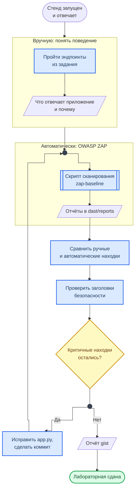

<div align="center">
<h1><a id="intro">Лаб. 08 · DAST: OWASP ZAP</a><br></h1>
<a href="https://docs.github.com/en"></a>
<a href="https://daringfireball.net/projects/markdown"></a>
<a href="https://shields.io"></a>


</div>

***

Салют :wave:,<br>
Данная лабораторная работа посвящена динамическому анализу безопасности web‑приложений DAST с использованием OWASP ZAP. Вы развернёте уязвимое приложение в Docker, проведете ручное тестирование по инструкции для понимания принципа и логики работы, далее выполните автоматическое сканирование, проанализируете отчёт и опишете уязвимости как и каким образом они реализуются. Аналогично вы проанализируете риски ИБ и предложите меры защиты, внесете необходимые исправления.

Для сдачи данной работы также будет требоваться ответить на дополнительные вопросы по описанным темам.

***

## Структура репозитория лабораторной работы

```bash
lab08
├── dast
│   ├── convert_reports.py
│   ├── zap_scan.sh
│   └── zap-baseline.conf
├── docker-compose.yml
├── README.md
├── requirements.txt
└── vulnerable-app
    ├── app.py
    ├── Dockerfile
    ├── files
    │   └── secret.txt
    └── requirements.txt
```

***

## Материал

### DAST

Dynamic Application Security Testing обеспечивает тестирование «чёрного ящика», когда сканер не знает исходного кода и взаимодействует с приложением как внешний клиент:

- отправляет `HTTP`‑запросы;
- анализирует ответы;
- пытается воспроизвести реальные атаки: `XSS`, `SQLi`, уязвимости в заголовках, слабую авторизацию и т. д.

> В отличие от `SAST`/ `SCA`, здесь обязательно нужно живое, запущенное приложение (стенд), к которому есть сетевой доступ и разрешить доступ сканеру
> Инструмент ведёт себя как автоматизированный атакующий: обходит страницы, подставляет полезные нагрузки payloads и фиксирует подозрительные ответы

### OWASP ZAP

Особенности:
- Чёрный ящик: анализ идёт по внешнему интерфейсу `HTTP`/`HTTPS`
- Фокус на эксплуатацию: `SQLi`, `XSS`, `LFI`/ `RFI`, небезопасные заголовки, слабые cookies, открытые админки и т.д. Сканировать как простыми профилями baseline scan, так и агрессивными активными проверками

    > - Автоматически обходить сайт `spider`/ `crawler` и находить новые эндпоинты (входные точки)
    > - Выполнять пассивный анализ - заголовки, `cookies`, версии серверов, утечки данных и активные атаки `XSS`, `SQLi` и др.

- Формировать отчёты в форматах `HTML`, `JSON`, `XML` для дальнейшего анализа и интеграции в `CI/CD`

### Ремарка

Мы используем образ `ghcr.io/zaproxy/zaproxy:stable` (прежний `owasp/zap2docker-stable` снят с поддержки) и CLI‑скрипт `dast/zap_scan.sh` для сканирования по URL `http://localhost:8080/` уязвимого приложения Flask. Скрипт запускает `baseline‑скан`, сохраняет отчёты и передаёт JSON на генерацию `ODT/XLSX`.

### Схема работы

Схема показывает цикл лабораторной: ручное исследование, автоматическое сканирование, исправление и повторная проверка.



**Как читать схему:**

- Ручной этап идёт первым намеренно: сначала вы понимаете, как приложение отвечает и почему, и только потом читаете отчёт сканера — иначе отчёт остаётся списком непонятных названий.
- Сравнение ручных и автоматических находок — ядро работы: сканер видит не всё, что находит человек, и наоборот.
- Ромб замыкает цикл: после правок в `app.py` сканирование запускается заново. Исправление считается сделанным, когда его подтвердил повторный прогон, а не когда изменён код.
- Заголовки безопасности, которые проверяются перед ромбом, разобраны в шпаргалке HTTP Security Headers.

Обозначения — в материале [Как читать схемы курса](https://course.geminishkv.tech/materials/diagrams_legend/).

***

## Задание

- [ ] 1. Разверните и подготовьте окружение для уязвимого приложения

```bash
$ python3 -m venv venv
$ source venv/bin/activate
$ pip install -r requirements.txt -r vulnerable-app/requirements.txt
```

- [ ] 2. Запустите уязвимое приложение

```bash
$ docker compose up -d --build  # http://localhost:8080
```

- [ ] 3. Проверьте доступность приложения

```bash
$ curl -i http://localhost:8080
```

Вывод такой:

```bash
HTTP/1.1 200 OK
Server: xxxxx/xxxxx Python/xxxxx
Date: xxxxx, xxxxx xxxxx 2025 xxxxx GMT
Content-Type: text/html; charset=utf-8
Content-Length: 625
Set-Cookie: session=guest-session-id; Path=/
Connection: close


    <h1>Vulnerable DAST Demo App</h1>
    <p>Пример уязвимого приложения для лабораторной по DAST.</p>
    <ul>
      <li><a href="/echo?msg=Hello">Reflected XSS / echo</a></li>
      <li><a href="/search?username=admin">SQL Injection / search</a></li>
      <li><a href="/login">Небезопасный логин</a></li>
      <li><a href="/profile">Профиль (зависит от cookie)</a></li>
      <li><a href="/admin">«Админка» без нормальной авторизации</a></li>
      <li><a href="/files/">Directory listing</a></li>
    </ul>
```

- [ ] 4. Проведите ручное исследование уязвимостей и опишите почему такое происходит, каким образом реализуются уязвимости и дайте им определение
- [ ] 4.1. `/echo` - проверить отражение параметра  `msg`  в `HTML` и использовать `payload` вида  `<script>alert('XSS')</script>` зафиксировав его поведение

```bash
http://localhost:8080/echo?msg=<script>alert('hack with XSS')</script>
```

- [ ] 4.2. `/search` - проверить обычный запрос  `?username=admin` и использовать строку  `?username=admin' OR '1'='1` зафиксировав его поведение описав признак SQLi

```bash
http://localhost:8080/search?username=admin' OR '1'='1
```

- [ ] 4.3. `/login` - войти под  `admin`  и  `user` проверив логику на открытые пароли и простые SQL‑запросы
- [ ] 4.4. `/profile` - изменить `cookie role` на `admin` через `DevTools` → `Application` → `Cookies` и обновить `/profile` (возможно потребуется создать cookie вручную)
- [ ] 4.5. `/admin` -  проверить, что доступ запрещён без `cookie  role=admin` и далее подделать `cookie`, что «админка» открывается путем изменения через `DevTools`. **Подсказка:** доступ завязан на значение cookie, без подписи/ токена/ серверной проверки.
- [ ] 4.6. `/files/` - просмотрите `directory listing` и откройте один из файлов убедившись, что оно выводится

```bash
http://localhost:8080/files/secret.txt
```

- [ ] 5. Добавьте минимум 1 собственный пример эксплуатации к любому из эндпоинтов п.4 (другой payload XSS, другая SQLi-строка, другой файл в directory listing и т.д.)

- [ ] 6. Воспроизведите эксплуатацию из терминала через `curl` (без браузера):

```bash
# Reflected XSS — отправляем payload и проверяем, вернулся ли он в ответе
$ curl -s "http://localhost:8080/echo?msg=<script>alert(1)</script>" | grep "<script>"

# SQL Injection — boolean-based: условие всегда истинно, возвращаются все строки
$ curl -s "http://localhost:8080/search?username=admin'+OR+'1'='1"

# Подделка cookie — доступ к админке
$ curl -s -b "role=admin" http://localhost:8080/admin

# Чтение файла, найденного через directory listing
$ curl -s http://localhost:8080/files/secret.txt
```

Опишите: какие запросы вернули данные, которые не должны быть доступны? Какой HTTP status code получили?

- [ ] 7. Поставьте `OWASP ZAP` и стяните образ конкретной версии для него

```bash
# Docker-образ ZAP (основной способ, все платформы)
$ docker pull ghcr.io/zaproxy/zaproxy:stable

# GUI-клиент (опционально)
# macOS:
$ brew install --cask zap
# Linux: скачать с https://www.zaproxy.org/download/
```

- [ ] 8. Задайте переменные окружения для работы скриптов

```bash
$ export ZAP_IMAGE=ghcr.io/zaproxy/zaproxy:stable
# скрипт запускает ZAP в сети хоста (--network host), поэтому на Linux цель — localhost
$ export TARGET_URL=http://localhost:8080
# macOS с Docker Desktop: export TARGET_URL=http://host.docker.internal:8080
```

- [ ] 9. Запустите из корня `lab08` скрипт автоматического сканирования DAST `OWASP ZAP`

```bash
$ ./dast/zap_scan.sh
```

- [ ] 10. Изучите сгенерированные отчёты в `dast/reports`. Для каждой находки ZAP опишите в отчёте:

    - Alert name и Risk level (High / Medium / Low / Informational)
    - URL и параметр, на котором сработало
    - CWE-ID (указан в отчёте ZAP)
    - Описание: почему это уязвимость и чем грозит
    - Мера исправления

- [ ] 11. Сравните ручные находки (п.4) с автоматическими (п.9). Заполните в отчёте:

    - Какие уязвимости ZAP нашёл автоматически?
    - Какие уязвимости ZAP **пропустил**, но вы нашли вручную? Почему?
    - Какие находки ZAP являются false positive?

- [ ] 12. Проверьте HTTP-заголовки безопасности приложения:

```bash
$ curl -sI http://localhost:8080 | grep -iE "x-frame|x-content|content-security|strict-transport|set-cookie"
```

Опишите: какие заголовки отсутствуют и какие атаки это позволяет (clickjacking, MIME sniffing, XSS).

- [ ] 13. Внесите исправления в `vulnerable-app/app.py` по находкам DAST. Сделайте `commit`
- [ ] 14. Запустите ZAP повторно после исправлений и убедитесь, что критические находки устранены:

```bash
$ ./dast/zap_scan.sh
```

Сравните отчёты до и после — сколько High/Medium находок осталось?

- [ ] 15. Делайте все необходимые коммиты по шагам и отправляйте изменения в удалённый репозиторий
- [ ] 16. Подготовьте отчёт `gist`
- [ ] 17. Почистите кэш от `venv` и остановите уязвимое приложение

```bash
$ deactivate
$ rm -rf venv
$ docker compose -f docker-compose.yml down
$ docker system prune -f
```

***

## Рекомендации

<div class="lab-grid" style="grid-template-columns: repeat(auto-fill, minmax(min(15rem, 100%), 1fr));">
<div class="lab-card" style="flex-direction: column; align-items: flex-start; gap: 0.3rem;"><span class="lab-card-num" style="font-size:0.85rem; width:auto;">XSS на /echo</span><div class="lab-card-tags"><span class="lab-tag">Reflected XSS</span><span class="lab-tag">CWE-79</span></div><span style="font-size:0.72rem; color:#555; line-height:1.4;">Отражение входных данных без экранирования. Мера: Jinja2 autoescape.</span></div>
<div class="lab-card" style="flex-direction: column; align-items: flex-start; gap: 0.3rem;"><span class="lab-card-num" style="font-size:0.85rem; width:auto;">SQLi на /search</span><div class="lab-card-tags"><span class="lab-tag">SQL Injection</span><span class="lab-tag">CWE-89</span></div><span style="font-size:0.72rem; color:#555; line-height:1.4;">Конкатенация ввода в SQL. Мера: параметризованные запросы.</span></div>
<div class="lab-card" style="flex-direction: column; align-items: flex-start; gap: 0.3rem;"><span class="lab-card-num" style="font-size:0.85rem; width:auto;">Небезопасные cookies</span><div class="lab-card-tags"><span class="lab-tag">HttpOnly</span><span class="lab-tag">Secure</span><span class="lab-tag">SameSite</span></div><span style="font-size:0.72rem; color:#555; line-height:1.4;">session, user, role без защитных флагов. Мера: HttpOnly, Secure, SameSite.</span></div>
<div class="lab-card" style="flex-direction: column; align-items: flex-start; gap: 0.3rem;"><span class="lab-card-num" style="font-size:0.85rem; width:auto;">Security headers</span><div class="lab-card-tags"><span class="lab-tag">X-Frame-Options</span><span class="lab-tag">CSP</span></div><span style="font-size:0.72rem; color:#555; line-height:1.4;">Отсутствуют X-Frame-Options, X-Content-Type-Options, CSP. Мера: middleware.</span></div>
<div class="lab-card" style="flex-direction: column; align-items: flex-start; gap: 0.3rem;"><span class="lab-card-num" style="font-size:0.85rem; width:auto;">Broken Access Control</span><div class="lab-card-tags"><span class="lab-tag">/admin</span><span class="lab-tag">CWE-284</span></div><span style="font-size:0.72rem; color:#555; line-height:1.4;">Доступ по подделанному cookie. Мера: серверная авторизация, подписанные сессии.</span></div>
<div class="lab-card" style="flex-direction: column; align-items: flex-start; gap: 0.3rem;"><span class="lab-card-num" style="font-size:0.85rem; width:auto;">Directory listing</span><div class="lab-card-tags"><span class="lab-tag">/files/</span><span class="lab-tag">CWE-548</span></div><span style="font-size:0.72rem; color:#555; line-height:1.4;">Открытый листинг с конфиденциальными файлами. Мера: отключить listing.</span></div>
</div>

***

## Смотри также

- [Разбор находок сканеров](https://course.geminishkv.tech/materials/findings_triage/) — как проверять находку, оформлять исключения и что считать закрытым
- [Лаб. 07 — SAST/SCA](https://course.geminishkv.tech/labs/basic/lab07/) — статический анализ (предыдущий этап)
- [Лаб. 09 — CI/CD](https://course.geminishkv.tech/labs/basic/lab09/) — автоматизация DAST в пайплайне
- [OWASP Top 10 — Client-side Attacks](https://course.geminishkv.tech/materials/OWASPTOP10/client-side-attacks/) — XSS и атаки на клиента
- [CheatSheet: HTTP Security Headers](https://course.geminishkv.tech/materials/cheatsheet/CHEATSHEET_HTTP_HEADERS/) — заголовки безопасности
- [Установка AppSec-инструментов](https://course.geminishkv.tech/materials/guides/appsec_tools_setup/) — установка OWASP ZAP
- [Лаб. 03 — Nmap](https://course.geminishkv.tech/labs/basic/lab03/) — разведка сервисов перед DAST
- [OWASP — Authentication](https://course.geminishkv.tech/materials/OWASPTOP10/Authentication/) — что проверяет ZAP в первую очередь
- [OWASP — Authorization](https://course.geminishkv.tech/materials/OWASPTOP10/Authorization/) — контроль доступа и IDOR
- [Классификация AppSec-инструментов](https://course.geminishkv.tech/materials/appsec_tt/) — место DAST в AppSec toolchain

***

## Troubleshooting

Если столкнулись с проблемами — смотрите [Troubleshooting](https://course.geminishkv.tech/materials/troubleshooting/).

## Links

<div class="lab-grid" style="grid-template-columns: repeat(auto-fill, minmax(min(14rem, 100%), 1fr));">
<a class="lab-card" href="https://docs.docker.com/" target="_blank"><div class="lab-card-body"><div class="lab-card-title">Docker</div><div class="lab-card-tags"><span class="lab-tag">docs.docker.com</span></div></div><div class="lab-card-arrow">→</div></a>
<a class="lab-card" href="https://flask.palletsprojects.com/" target="_blank"><div class="lab-card-body"><div class="lab-card-title">Flask Documentation</div><div class="lab-card-tags"><span class="lab-tag">flask.palletsprojects.com</span></div></div><div class="lab-card-arrow">→</div></a>
<a class="lab-card" href="https://github.com/eea/odfpy" target="_blank"><div class="lab-card-body"><div class="lab-card-title">odfpy – OpenDocument API for Python</div><div class="lab-card-tags"><span class="lab-tag">github.com</span></div></div><div class="lab-card-arrow">→</div></a>
<a class="lab-card" href="https://openpyxl.readthedocs.io/" target="_blank"><div class="lab-card-body"><div class="lab-card-title">openpyxl – Excel files in Python</div><div class="lab-card-tags"><span class="lab-tag">openpyxl.readthedocs.io</span></div></div><div class="lab-card-arrow">→</div></a>
<a class="lab-card" href="https://stackedit.io" target="_blank"><div class="lab-card-body"><div class="lab-card-title">Markdown</div><div class="lab-card-tags"><span class="lab-tag">stackedit.io</span></div></div><div class="lab-card-arrow">→</div></a>
<a class="lab-card" href="https://gist.github.com" target="_blank"><div class="lab-card-body"><div class="lab-card-title">Gist</div><div class="lab-card-tags"><span class="lab-tag">gist.github.com</span></div></div><div class="lab-card-arrow">→</div></a>
<a class="lab-card" href="https://cli.github.com" target="_blank"><div class="lab-card-body"><div class="lab-card-title">GitHub CLI</div><div class="lab-card-tags"><span class="lab-tag">cli.github.com</span></div></div><div class="lab-card-arrow">→</div></a>
<a class="lab-card" href="https://www.zaproxy.org/" target="_blank"><div class="lab-card-body"><div class="lab-card-title">OWASP ZAP</div><div class="lab-card-tags"><span class="lab-tag">zaproxy.org</span></div></div><div class="lab-card-arrow">→</div></a>
<a class="lab-card" href="https://owasp.org/www-project-web-security-testing-guide/" target="_blank"><div class="lab-card-body"><div class="lab-card-title">OWASP Web Security Testing Guide</div><div class="lab-card-tags"><span class="lab-tag">owasp.org</span></div></div><div class="lab-card-arrow">→</div></a>
<a class="lab-card" href="https://owasp.org/www-project-top-ten/" target="_blank"><div class="lab-card-body"><div class="lab-card-title">OWASP Top 10 Web Application Security Risks</div><div class="lab-card-tags"><span class="lab-tag">owasp.org</span></div></div><div class="lab-card-arrow">→</div></a>
<a class="lab-card" href="https://www.zaproxy.org/docs/docker/" target="_blank"><div class="lab-card-body"><div class="lab-card-title">ZAP Docker images</div><div class="lab-card-tags"><span class="lab-tag">zaproxy.org</span></div></div><div class="lab-card-arrow">→</div></a>
<a class="lab-card" href="https://www.zaproxy.org/docs/docker/baseline-scan/" target="_blank"><div class="lab-card-body"><div class="lab-card-title">ZAP Baseline Scan</div><div class="lab-card-tags"><span class="lab-tag">zaproxy.org</span></div></div><div class="lab-card-arrow">→</div></a>
<a class="lab-card" href="https://www.zaproxy.org/docs/desktop/addons/automation-framework/" target="_blank"><div class="lab-card-body"><div class="lab-card-title">ZAP Automation Framework</div><div class="lab-card-tags"><span class="lab-tag">zaproxy.org</span></div></div><div class="lab-card-arrow">→</div></a>
</div>
