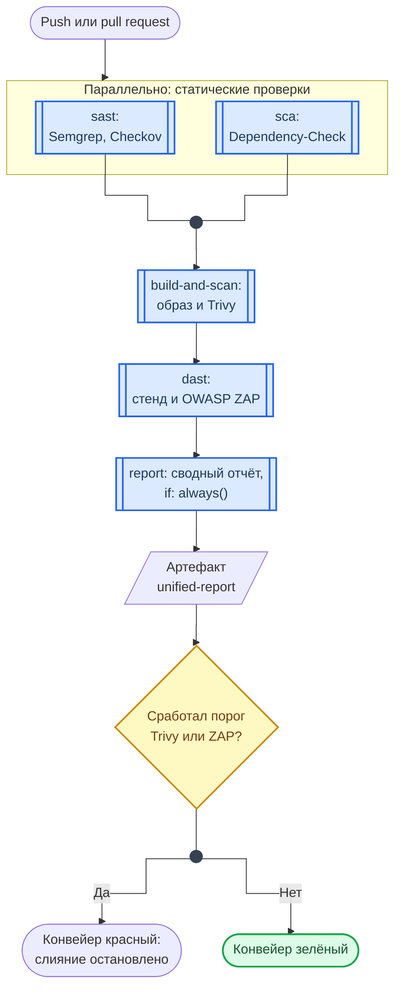

<!-- markdownlint-disable MD013 MD033 -->
<div align="center">
<h1><a id="intro">Лаб. 09 · DevSecOps CI/CD на GitHub Actions</a><br></h1>
<a href="https://docs.github.com/en"></a>
<a href="https://daringfireball.net/projects/markdown"></a>
<a href="https://shields.io"></a>


</div>

***

Салют :wave:,<br>
Данная лабораторная работа посвящена построению полного DevSecOps CI/CD конвейера на базе GitHub Actions и встраиванию в него инструментов безопасности, которые были изучены в предыдущих работах: `Semgrep`, `Checkov`, `OWASP Dependency-Check`, `Trivy` и `OWASP ZAP`. 

Вы спроектируете пайплайн со `Quality Gate` на каждом этапе, пройдёте полный цикл от коммита до DAST‑сканирования развёрнутого приложения и соберёте единый отчёт по всем находкам.

Для сдачи данной работы также будет требоваться ответить на дополнительные вопросы по описанным темам.

***

## Структура репозитория лабораторной работы

```bash
lab09
├── .github
│   └── workflows
│       └── devsecops.yml          # главный пайплайн
├── app
│   ├── app.py                     # уязвимое Flask-приложение
│   ├── Dockerfile
│   └── requirements.txt
├── docker-compose.yml
├── pipeline
│   ├── dast
│   │   ├── zap-baseline.conf      # конфигурация ZAP
│   │   └── zap_scan.sh            # локальный запуск ZAP
│   ├── sast
│   │   ├── checkov-config.yaml
│   │   └── semgrep-rules.yml
│   ├── sca
│   │   └── dependency-check.sh
│   └── merge_reports.py           # скрипт агрегации отчётов
└── README.md
```

***

## Материал

### CI/CD конвейер

CI (Continuous Integration) — автоматическая сборка и проверка кода при каждом коммите. 

CD (Continuous Delivery/Deployment) — автоматическая доставка проверенного кода в среды.

Этапы DevSecOps конвейера в данной работе:

> 1. **SAST** — статический анализ исходного кода и конфигураций (`Semgrep`, `Checkov`) до сборки образа
> 2. **SCA** — анализ зависимостей на известные CVE (`OWASP Dependency-Check`)
> 3. **Build + Scan** — сборка Docker-образа и его сканирование на уязвимости (`Trivy`)
> 4. **DAST** — динамическое тестирование запущенного приложения (`OWASP ZAP`)
> 5. **Report** — агрегация всех JSON-отчётов в единый HTML-артефакт

### GitHub Actions

GitHub Actions — платформа CI/CD, встроенная в GitHub. Конфигурируется через YAML-файлы в директории `.github/workflows/`:

> - **Workflow** — набор jobs, запускаемый по событию (`push`, `pull_request`, `schedule`)
> - **Job** — набор шагов `steps`, выполняемых на одном раннере (`ubuntu-latest`, `macos-latest`)
> - **Step** — отдельная команда или готовое `action` из GitHub Marketplace
> - **needs** — явная зависимость между jobs: следующий job запускается только после успешного завершения указанного
> - **Artifact** — файл или директория, сохранённая после выполнения job для скачивания или передачи между jobs

### Quality Gate

Quality gate — условие, при невыполнении которого pipeline останавливается и последующие этапы не запускаются. В данной работе используются:

- `--severity CRITICAL,HIGH` вместе с `exit-code: "1"` для Trivy — образ не проходит gate при наличии уязвимостей этих уровней; одна фильтрация по severity ничего не блокирует
- `--failOnCVSS 9` для Dependency-Check — SCA-gate по порогу CVSS
- `fail_action: true` для ZAP — DAST-gate: job падает, если сработало правило с уровнем FAIL или WARN из `zap-baseline.conf`

> Параметр `exit-code: "1"` заставляет шаг завершиться с ошибкой — GitHub Actions помечает job как failed и останавливает pipeline. Параметр `exit-code: "0"` или флаг `--soft-fail` позволяет продолжить, но зафиксировать находки в артефактах (режим аудита без блокировки).

### Ремарка

В данной работе `app/` содержит намеренно уязвимое Flask-приложение из лаб 7–8. Задача пайплайна — автоматически найти те же уязвимости, что вы ранее находили вручную, и заблокировать или зафиксировать их до попадания в production.

### Схема работы

Схема показывает граф jobs конвейера, который нужно написать, и то, как включённые пороги влияют на результат.



**Как читать схему:**

- Порядок задают `needs`, а не порядок записи в файле: `sast` и `sca` независимы и идут параллельно, `build-and-scan` ждёт оба, `dast` ждёт сборку.
- `report` помечен `if: always()`: сводный отчёт собирается, даже если какой-то job упал. Иначе именно при красном конвейере отчёта и не будет.
- Ромб — шаги 16 и 17 задания. В режиме аудита конвейер зелёный при любых находках; с включёнными порогами критичная находка делает его красным и останавливает слияние.
- Каждое требование к workflow закрывает один из рисков OWASP CI/CD — см. материал «OWASP — CI/CD Risks».

Обозначения — в материале [Как читать схемы курса](https://course.geminishkv.tech/materials/diagrams_legend/).

***

## Задание

- [ ] 1. Создайте структуру лабораторной работы и скопируйте уязвимое приложение из `lab08`. `lab09` — отдельный репозиторий: GitHub запускает workflow только из `.github/workflows/` в корне репозитория

```bash
# из каталога, где лежат ваши лабы
$ mkdir -p lab09/{app,pipeline/{sast,sca,dast},.github/workflows}
$ cp -r lab08/vulnerable-app/. lab09/app/
$ cp lab08/docker-compose.yml lab09/
$ sed -i 's|context: ./vulnerable-app|context: ./app|' lab09/docker-compose.yml
$ cd lab09 && git init
```

- [ ] 2. Разверните и убедитесь в работоспособности приложения локально перед настройкой пайплайна

```bash
$ docker compose up -d --build
$ curl -i http://localhost:8080
```

- [ ] 3. Напишите файл `.github/workflows/devsecops.yml`. Пайплайн должен содержать пять jobs: `sast`, `sca`, `build-and-scan`, `dast`, `report`

```yaml
name: DevSecOps Pipeline

on:
  push:
    branches: [develop, main]
  pull_request:
    branches: [main]

# токен только на чтение: пайплайну не нужно ничего писать в репозиторий
permissions:
  contents: read

env:
  IMAGE_NAME: lab09-app
  APP_PORT: 8080

jobs:

  sast:
    name: "SAST — Semgrep + Checkov"
    runs-on: ubuntu-latest
    steps:
      # actions закреплены по SHA коммита: тег можно переписать, SHA нельзя
      - uses: actions/checkout@3d3c42e5aac5ba805825da76410c181273ba90b1  # v7.0.1
        with:
          persist-credentials: false

      - name: Set up Python
        uses: actions/setup-python@5fda3b95a4ea91299a34e894583c3862153e4b97  # v7.0.0
        with:
          python-version: "3.11"

      # версии инструментов закреплены так же, как actions
      - name: Install tools
        run: pip install semgrep==1.172.0 checkov==3.3.18

      # без --error находки не роняют шаг, а ошибка конфигурации роняет:
      # так и нужно, поэтому здесь нет `|| true`
      - name: Semgrep scan
        run: |
          semgrep \
            --config pipeline/sast/semgrep-rules.yml \
            --json \
            --output pipeline/sast/semgrep-report.json \
            app/

      - name: Checkov scan
        run: |

# доработайте необходимое
# hint: checkov --framework dockerfile --file <путь> --output json --soft-fail > pipeline/sast/checkov-report.json
# (--output-file-path принимает каталог, а не имя файла)

      - uses: actions/upload-artifact@043fb46d1a93c77aae656e7c1c64a875d1fc6a0a  # v7.0.1
        with:
          name: sast-reports
          path: pipeline/sast/
          if-no-files-found: error

  sca:
    name: "SCA — Dependency-Check"
    runs-on: ubuntu-latest
    steps:
      - uses: actions/checkout@3d3c42e5aac5ba805825da76410c181273ba90b1  # v7.0.1
        with:
          persist-credentials: false

      # релизы этого действия не выходят с 2021 года, поэтому закреплён коммит ветки main
      - name: OWASP Dependency-Check
        uses: dependency-check/Dependency-Check_Action@1e54355a8b4c8abaa8cc7d0b70aa655a3bb15a6c  # main, 2025-12-10
        with:

# доработайте необходимое
# hint: project, path, format (JSON), out (pipeline/sca/),
#       args (--failOnCVSS 9 --enableExperimental --nvdApiKey ${{ secrets.NVD_API_KEY }})

      - uses: actions/upload-artifact@043fb46d1a93c77aae656e7c1c64a875d1fc6a0a  # v7.0.1
        with:
          name: sca-reports
          path: pipeline/sca/
          if-no-files-found: error

  build-and-scan:
    name: "Build + Trivy Image Scan"
    runs-on: ubuntu-latest
    needs: [sast, sca]
    steps:
      - uses: actions/checkout@3d3c42e5aac5ba805825da76410c181273ba90b1  # v7.0.1
        with:
          persist-credentials: false

      # значения берутся из переменных окружения, а не подставляются через ${{ }} в run
      - name: Build Docker image
        run: docker build -t "${IMAGE_NAME}:${GITHUB_SHA}" app/

      - name: Trivy image scan
        uses: aquasecurity/trivy-action@ed142fd0673e97e23eac54620cfb913e5ce36c25  # v0.36.0
        with:

# доработайте необходимое
# hint: image-ref (${{ env.IMAGE_NAME }}:${{ github.sha }}), format (json), output (pipeline/trivy-report.json),
#       severity (HIGH,CRITICAL), exit-code ("0" — audit / "1" — block)

      - uses: actions/upload-artifact@043fb46d1a93c77aae656e7c1c64a875d1fc6a0a  # v7.0.1
        with:
          name: trivy-report
          path: pipeline/trivy-report.json
          if-no-files-found: error

  dast:
    name: "DAST — OWASP ZAP"
    runs-on: ubuntu-latest
    needs: build-and-scan
    steps:
      - uses: actions/checkout@3d3c42e5aac5ba805825da76410c181273ba90b1  # v7.0.1
        with:
          persist-credentials: false

      # на раннерах GitHub есть только Compose v2: команда `docker compose`
      - name: Start application
        run: docker compose up -d --build

      # приложение не поднялось — job падает, а не сканирует пустой порт
      - name: Wait for app readiness
        run: |
          for i in $(seq 1 30); do
            curl -sf "http://localhost:${APP_PORT}" > /dev/null && exit 0
            echo "Waiting... ($i)"
            sleep 2
          done
          echo "Application did not start on port ${APP_PORT}"
          docker compose logs
          exit 1

      - name: ZAP baseline scan
        uses: zaproxy/action-baseline@de8ad967d3548d44ef623df22cf95c3b0baf8b25  # v0.15.0
        with:
          target: "http://localhost:${{ env.APP_PORT }}"
          rules_file_name: "pipeline/dast/zap-baseline.conf"
          cmd_options: "-J pipeline/dast/zap-report.json -r pipeline/dast/zap-report.html"
          allow_issue_writing: false   # иначе действию нужен токен с правом писать issues
          fail_action: false

      - name: Stop application
        if: always()
        run: docker compose down

      - uses: actions/upload-artifact@043fb46d1a93c77aae656e7c1c64a875d1fc6a0a  # v7.0.1
        with:
          name: dast-reports
          path: pipeline/dast/
          if-no-files-found: error

  report:
    name: "Unified Report"
    runs-on: ubuntu-latest
    needs: [sast, sca, build-and-scan, dast]
    if: always()
    steps:
      - uses: actions/checkout@3d3c42e5aac5ba805825da76410c181273ba90b1  # v7.0.1
        with:
          persist-credentials: false

      - name: Download all artifacts
        uses: actions/download-artifact@3e5f45b2cfb9172054b4087a40e8e0b5a5461e7c  # v8.0.1
        with:
          path: pipeline/artifacts/

      - name: Set up Python
        uses: actions/setup-python@5fda3b95a4ea91299a34e894583c3862153e4b97  # v7.0.0
        with:
          python-version: "3.11"

      - name: Install dependencies
        run: pip install jinja2==3.1.6

      - name: Merge reports
        run: python pipeline/merge_reports.py

      - uses: actions/upload-artifact@043fb46d1a93c77aae656e7c1c64a875d1fc6a0a  # v7.0.1
        with:
          name: unified-report
          path: pipeline/unified-report.html
          if-no-files-found: error
```

- [ ] 4. Напишите файл `pipeline/sast/semgrep-rules.yml` — правила для обнаружения уязвимостей в Python. Минимум три правила: SQL-инъекция, жёстко заданный секрет, небезопасный `eval`
- [ ] 5. Напишите файл `pipeline/sast/checkov-config.yaml` — конфигурация Checkov для проверки Dockerfile (docker-compose Checkov не разбирает; пример рабочего конфига — `lab07/sast/checkov-config.yaml`)
- [ ] 6. Напишите скрипт `pipeline/sca/dependency-check.sh` для локального запуска OWASP Dependency-Check CLI
- [ ] 7. Напишите скрипт `pipeline/dast/zap_scan.sh` для локального запуска OWASP ZAP

```bash
#!/usr/bin/env bash
set -euo pipefail

ZAP_IMAGE="${ZAP_IMAGE:-ghcr.io/zaproxy/zaproxy:stable}"
TARGET_URL="${TARGET_URL:-http://host.docker.internal:8080}"
DAST_DIR="pipeline/dast"

mkdir -p "$DAST_DIR/reports"

# в /zap/wrk монтируется pipeline/dast целиком: там лежит zap-baseline.conf,
# а пути -c, -J и -r считаются от /zap/wrk.
# --add-host делает host.docker.internal доступным и на Linux
docker run --rm \
  --add-host=host.docker.internal:host-gateway \
  -v "$(pwd)/$DAST_DIR":/zap/wrk:rw \
  "$ZAP_IMAGE" \
  zap-baseline.py \
  -t "$TARGET_URL" \
  -c zap-baseline.conf \
  -J reports/zap-report.json \
  -r reports/zap-report.html \
  -I

echo "DAST reports saved to $DAST_DIR/reports"
```

- [ ] 8. Напишите файл `pipeline/dast/zap-baseline.conf` — конфигурация порогов ZAP. Укажите правила, которые должны вызывать FAIL (высокий риск), WARN (средний) и IGNORE (информационный)

```bash title="pipeline/dast/zap-baseline.conf"
# ZAP Baseline configuration: поля разделяются ТАБУЛЯЦИЕЙ, с пробелами ZAP правило не прочитает
# Rule format: RULE_ID<TAB>ACTION<TAB>(описание)
# Actions: FAIL, WARN, IGNORE, PASS
# 40012–40019 — правила активного сканирования: baseline их не запускает, они сработают только в full scan

10017	WARN	(Cross-Domain JavaScript Source File Inclusion)
10019	WARN	(Content-Type Header Missing)
10020	FAIL	(X-Frame-Options Header Not Set)
10021	WARN	(X-Content-Type-Options Header Missing)
10023	WARN	(Information Disclosure - Debug Error Messages)
10036	FAIL	(HTTP Server Response Header)
10038	FAIL	(Content Security Policy Header Not Set)
10040	FAIL	(Secure Pages Include Mixed Content)
10098	WARN	(Cross-Domain Misconfiguration)
40012	FAIL	(Cross Site Scripting - Reflected)
40014	FAIL	(Cross Site Scripting - Persistent)
40018	FAIL	(SQL Injection)
40019	FAIL	(SQL Injection - MySQL)
```

- [ ] 9. Напишите скрипт `pipeline/merge_reports.py` для агрегации всех JSON-отчётов в единый HTML
- [ ] 10. Сделайте первый коммит с базовой структурой и убедитесь, что пайплайн запускается в GitHub Actions

```bash
$ git add .github/ app/ pipeline/ docker-compose.yml
$ git commit -S -m "feat(lab09): add DevSecOps pipeline skeleton"
$ git push origin develop
```

Откройте вкладку **Actions** в репозитории GitHub и убедитесь, что workflow `DevSecOps Pipeline` запустился. Изучите логи каждого job.

- [ ] 11. Проанализируйте результаты SAST: откройте артефакт `sast-reports` и изучите `semgrep-report.json` и `checkov-report.json`. Опишите каждую срабатывание — почему правило сработало и что именно уязвимо в коде
- [ ] 12. Проанализируйте результаты SCA: откройте артефакт `sca-reports`. Для каждой найденной CVE опишите: пакет, версия, CVSS-оценка, описание уязвимости, рекомендуемое обновление
- [ ] 13. Проанализируйте результаты Trivy: откройте `trivy-report.json`. Определите, из каких слоёв образа приходит большинство уязвимостей — из базового образа или из установленных зависимостей
- [ ] 14. Проанализируйте результаты DAST: откройте `dast-reports/zap-report.html`. Сопоставьте находки ZAP с уязвимостями, которые вы исправляли в лабораторной работе №8. Объясните, почему автоматический сканер нашёл или не нашёл конкретную уязвимость
- [ ] 15. Внесите исправления в `app/app.py`, `app/Dockerfile` и `docker-compose.yml` для устранения критических находок. Запушьте изменения — пайплайн должен запуститься повторно и показать меньше срабатываний

```bash
$ git add app/
$ git commit -S -m "fix(lab09): remediate SAST and DAST findings"
$ git push origin develop
```

- [ ] 16. Измените `exit-code` Trivy и `fail_action` ZAP на `"1"` / `true` и убедитесь, что pipeline действительно блокируется при нахождении критических уязвимостей. Опишите в отчёте: что произошло, какой job упал, каков был exit code

```yaml
# В devsecops.yml — Trivy
exit-code: "1"

# В devsecops.yml — ZAP
fail_action: true
```

- [ ] 17. Верните пороги в режим аудита (`exit-code: "0"`, `fail_action: false`), запустите полный пайплайн, скачайте артефакт `unified-report` и убедитесь, что HTML-отчёт корректно собирается
- [ ] 18. Делайте все коммиты на соответствующих шагах, отправляйте изменения в удалённый репозиторий
- [ ] 19. Подготовьте отчёт `gist`

***

## Рекомендации

- Quality Gate на уровне CVSS < 7.0 при первом запуске может вызвать сотни блокировок — начинайте с `--soft-fail` и порога CVSS 9, постепенно ужесточая
- Trivy в CI, аналогично Dependency-Check на локальной машине, должен использовать кэшированную базу данных уязвимостей, иначе каждый запуск будет тратить время на скачивание
- ZAP в режиме baseline scan не выполняет активных атак — для полного Active Scan используйте `zaproxy/action-full-scan`
> Baseline scan безопасен для production-like стендов; active scan может сломать данные или перегрузить приложение, используйте только на изолированных тестовых окружениях
- Не храните `secrets` (токены, ключи NVD API для Dependency-Check) в `.yml` файлах напрямую
> Используйте `Settings → Secrets and variables → Actions` в репозитории и обращайтесь к ним через `${{ secrets.NVD_API_KEY }}`

***

## Смотри также

- [Разбор находок сканеров](https://course.geminishkv.tech/materials/findings_triage/) — как проверять находку, оформлять исключения и что считать закрытым
- [Введение в CI/CD](https://course.geminishkv.tech/materials/guides/cicd_basics/) — основы GitHub Actions перед этой лабой
- [Лаб. 07 — SAST/SCA](https://course.geminishkv.tech/labs/basic/lab07/) — инструменты, интегрируемые в пайплайн
- [Лаб. 08 — DAST](https://course.geminishkv.tech/labs/basic/lab08/) — ручной DAST, автоматизируемый здесь
- [CheatSheet: GitHub Actions Security](https://course.geminishkv.tech/materials/cheatsheet/CHEATSHEET_GH_ACTIONS_SECURITY/) — безопасность пайплайнов
- [OWASP CI/CD Top 10](https://course.geminishkv.tech/materials/OWASPTOP10/OWASP_Top_10_CICD_Risks/) — риски CI/CD
- [CheatSheet: YAML](https://course.geminishkv.tech/materials/cheatsheet/CHEATSHEET_YAML/) — синтаксис workflow без сюрпризов
- [CheatSheet: GitHub CLI](https://course.geminishkv.tech/materials/cheatsheet/CHEATSHEET_GH_CLI/) — управление Actions из терминала
- [Классификация AppSec-инструментов](https://course.geminishkv.tech/materials/appsec_tt/) — полная карта инструментов DevSecOps

***

## Troubleshooting

Если столкнулись с проблемами — смотрите [Troubleshooting](https://course.geminishkv.tech/materials/troubleshooting/).

## Links

<div class="lab-grid" style="grid-template-columns: repeat(auto-fill, minmax(min(14rem, 100%), 1fr));">
<a class="lab-card" href="https://docs.github.com/en/actions" target="_blank"><div class="lab-card-body"><div class="lab-card-title">GitHub Actions Documentation</div><div class="lab-card-tags"><span class="lab-tag">docs.github.com</span></div></div><div class="lab-card-arrow">→</div></a>
<a class="lab-card" href="https://docs.github.com/en/actions/writing-workflows/workflow-syntax-for-github-actions" target="_blank"><div class="lab-card-body"><div class="lab-card-title">GitHub Actions — Workflow syntax</div><div class="lab-card-tags"><span class="lab-tag">docs.github.com</span></div></div><div class="lab-card-arrow">→</div></a>
<a class="lab-card" href="https://github.com/aquasecurity/trivy-action" target="_blank"><div class="lab-card-body"><div class="lab-card-title">Trivy — aquasecurity/trivy-action</div><div class="lab-card-tags"><span class="lab-tag">github.com</span></div></div><div class="lab-card-arrow">→</div></a>
<a class="lab-card" href="https://aquasecurity.github.io/trivy/" target="_blank"><div class="lab-card-body"><div class="lab-card-title">Trivy Documentation</div><div class="lab-card-tags"><span class="lab-tag">aquasecurity.github.io</span></div></div><div class="lab-card-arrow">→</div></a>
<a class="lab-card" href="https://github.com/zaproxy/action-baseline" target="_blank"><div class="lab-card-body"><div class="lab-card-title">OWASP ZAP — zaproxy/action-baseline</div><div class="lab-card-tags"><span class="lab-tag">github.com</span></div></div><div class="lab-card-arrow">→</div></a>
<a class="lab-card" href="https://www.zaproxy.org/docs/docker/baseline-scan/" target="_blank"><div class="lab-card-body"><div class="lab-card-title">OWASP ZAP Baseline Scan</div><div class="lab-card-tags"><span class="lab-tag">zaproxy.org</span></div></div><div class="lab-card-arrow">→</div></a>
<a class="lab-card" href="https://github.com/dependency-check/Dependency-Check_Action" target="_blank"><div class="lab-card-body"><div class="lab-card-title">OWASP Dependency-Check Action</div><div class="lab-card-tags"><span class="lab-tag">github.com</span></div></div><div class="lab-card-arrow">→</div></a>
<a class="lab-card" href="https://semgrep.dev/docs/cli-reference/" target="_blank"><div class="lab-card-body"><div class="lab-card-title">Semgrep CLI reference</div><div class="lab-card-tags"><span class="lab-tag">semgrep.dev</span></div></div><div class="lab-card-arrow">→</div></a>
<a class="lab-card" href="https://www.checkov.io/2.Basics/CLI%20Command%20Reference.html" target="_blank"><div class="lab-card-body"><div class="lab-card-title">Checkov CLI Command Reference</div><div class="lab-card-tags"><span class="lab-tag">checkov.io</span></div></div><div class="lab-card-arrow">→</div></a>
<a class="lab-card" href="https://docs.docker.com/" target="_blank"><div class="lab-card-body"><div class="lab-card-title">Docker</div><div class="lab-card-tags"><span class="lab-tag">docs.docker.com</span></div></div><div class="lab-card-arrow">→</div></a>
<a class="lab-card" href="https://stackedit.io" target="_blank"><div class="lab-card-body"><div class="lab-card-title">Markdown</div><div class="lab-card-tags"><span class="lab-tag">stackedit.io</span></div></div><div class="lab-card-arrow">→</div></a>
<a class="lab-card" href="https://gist.github.com" target="_blank"><div class="lab-card-body"><div class="lab-card-title">Gist</div><div class="lab-card-tags"><span class="lab-tag">gist.github.com</span></div></div><div class="lab-card-arrow">→</div></a>
<a class="lab-card" href="https://cli.github.com" target="_blank"><div class="lab-card-body"><div class="lab-card-title">GitHub CLI</div><div class="lab-card-tags"><span class="lab-tag">cli.github.com</span></div></div><div class="lab-card-arrow">→</div></a>
<a class="lab-card" href="https://owasp.org/www-project-devsecops-guideline/" target="_blank"><div class="lab-card-body"><div class="lab-card-title">DevSecOps — OWASP</div><div class="lab-card-tags"><span class="lab-tag">owasp.org</span></div></div><div class="lab-card-arrow">→</div></a>
<a class="lab-card" href="https://csrc.nist.gov/projects/devsecops" target="_blank"><div class="lab-card-body"><div class="lab-card-title">Shift-Left Security — NIST</div><div class="lab-card-tags"><span class="lab-tag">csrc.nist.gov</span></div></div><div class="lab-card-arrow">→</div></a>
</div>
