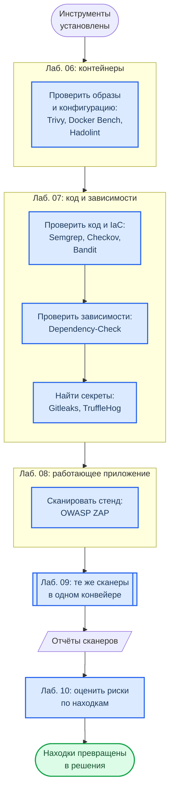

<div align="center">
<h1><a id="intro">Установка AppSec-инструментов</a><br></h1>


</div>

***

Централизованная установка всех инструментов, используемых в лабораторных работах курса. Выполните один раз перед началом Лаб. 06–09.

> Все инструменты open-source и бесплатны для использования.

## Какой инструмент в какой лабораторной

Схема показывает, в какой лабораторной понадобится каждый инструмент и как лабораторные связаны между собой.



**Как читать схему:**

- Три рамки — три взгляда на одно приложение: образ и его конфигурация, исходный код с зависимостями, работающий стенд. Ни один из них не заменяет другие.
- Лаб. 09 новых инструментов не вводит: она собирает уже знакомые сканеры в один конвейер, поэтому установить и проверить их лучше заранее.
- Отчёты сканеров — не конец работы: в Лаб. 10 находки превращаются в оценку рисков и план мер.
- Ставить всё сразу не обязательно: достаточно раздела той лабораторной, к которой вы приступаете.

Обозначения — в материале [Как читать схемы курса](https://course.geminishkv.tech/materials/diagrams_legend/).

***

## Windows

Рекомендуемый путь — Ubuntu в WSL2 (`wsl --install -d Ubuntu`): все инструкции ниже для Ubuntu применимы без изменений, а Semgrep и Docker Bench официально работают на Windows только так. Нативно через `winget` ставятся:

```powershell
PS> winget install --id AquaSecurity.Trivy -e     # Trivy
PS> winget install --id Gitleaks.Gitleaks -e      # Gitleaks
PS> winget install --id hadolint.hadolint -e      # Hadolint
PS> winget install --id ZAP.ZAP -e                # OWASP ZAP (GUI; для сканов из терминала удобнее Docker)
PS> pip install checkov bandit pip-audit pre-commit   # Python 3.12+ с python.org (или pipx install ...)
```

Docker Bench for Security проверяет хост Docker и запускается только в Linux (WSL2 или ВМ).

***

## SAST — статический анализ (Лаб. 07)

<div class="lab-grid" style="grid-template-columns: repeat(auto-fill, minmax(min(15rem, 100%), 1fr));">

  <div class="lab-card" style="flex-direction: column; align-items: flex-start; gap: 0.4rem;">
  <div style="display:flex; align-items:baseline; gap:0.6rem; width:100%;">
    <span class="lab-card-num" style="font-size:0.9rem; width:auto;">Semgrep</span>
    <span style="font-size:0.65rem; color:#888; font-family:var(--font-code);">SAST · AST-анализ</span>
  </div>
  <span class="lab-tag">Лаб. 07 · Лаб. 09</span>
  <p style="font-size:0.75rem; margin:0.2rem 0 0; color:#555; line-height:1.5;">Статический анализатор кода по AST-паттернам. Ищет инъекции, XSS, hardcoded secrets.</p>
  </div>

  <div class="lab-card" style="flex-direction: column; align-items: flex-start; gap: 0.4rem;">
  <div style="display:flex; align-items:baseline; gap:0.6rem; width:100%;">
    <span class="lab-card-num" style="font-size:0.9rem; width:auto;">Checkov</span>
    <span style="font-size:0.65rem; color:#888; font-family:var(--font-code);">IaC Security</span>
  </div>
  <span class="lab-tag">Лаб. 07</span>
  <p style="font-size:0.75rem; margin:0.2rem 0 0; color:#555; line-height:1.5;">Сканер Infrastructure as Code: Dockerfile, docker-compose, Terraform, Kubernetes YAML.</p>
  </div>

  <div class="lab-card" style="flex-direction: column; align-items: flex-start; gap: 0.4rem;">
  <div style="display:flex; align-items:baseline; gap:0.6rem; width:100%;">
    <span class="lab-card-num" style="font-size:0.9rem; width:auto;">Bandit</span>
    <span style="font-size:0.65rem; color:#888; font-family:var(--font-code);">Python SAST</span>
  </div>
  <span class="lab-tag">Лаб. 07</span>
  <p style="font-size:0.75rem; margin:0.2rem 0 0; color:#555; line-height:1.5;">Python-специфичный SAST: eval, pickle, subprocess, hardcoded passwords.</p>
  </div>

</div>

### Установка

```bash
# Python-инструменты ставятся через pipx: на Ubuntu 23.04+ и macOS глобальный
# `pip install` запрещён (ошибка externally-managed-environment)
$ sudo apt install -y pipx && pipx ensurepath     # macOS: brew install pipx
$ pipx install semgrep
$ pipx install checkov
$ pipx install bandit
$ semgrep --version && checkov --version && bandit --version
```

### Проверка

```bash
$ semgrep scan --config auto --dry-run .
$ checkov -d . --framework dockerfile
$ bandit -r . -f json
```

***

## SCA — анализ зависимостей (Лаб. 07)

<div class="lab-grid" style="grid-template-columns: repeat(auto-fill, minmax(min(15rem, 100%), 1fr));">

  <div class="lab-card" style="flex-direction: column; align-items: flex-start; gap: 0.4rem;">
  <div style="display:flex; align-items:baseline; gap:0.6rem; width:100%;">
    <span class="lab-card-num" style="font-size:0.9rem; width:auto;">OWASP DC</span>
    <span style="font-size:0.65rem; color:#888; font-family:var(--font-code);">Dependency-Check</span>
  </div>
  <span class="lab-tag">Лаб. 07</span>
  <p style="font-size:0.75rem; margin:0.2rem 0 0; color:#555; line-height:1.5;">Поиск CVE в зависимостях через NVD. Поддерживает Java, Python, Node.js, .NET.</p>
  </div>

  <div class="lab-card" style="flex-direction: column; align-items: flex-start; gap: 0.4rem;">
  <div style="display:flex; align-items:baseline; gap:0.6rem; width:100%;">
    <span class="lab-card-num" style="font-size:0.9rem; width:auto;">pip-audit</span>
    <span style="font-size:0.65rem; color:#888; font-family:var(--font-code);">Python SCA</span>
  </div>
  <span class="lab-tag">Лаб. 07</span>
  <p style="font-size:0.75rem; margin:0.2rem 0 0; color:#555; line-height:1.5;">Проверка Python-пакетов по базе OSV/PyPI Advisory.</p>
  </div>

</div>

### Установка

```bash
# OWASP Dependency-Check (требует Java 11+)
$ sudo apt install -y default-jdk maven            # Ubuntu
$ sudo dnf install -y java-latest-openjdk maven    # Fedora

# Скачать DC
$ DC_VERSION="11.1.1"
$ wget "https://github.com/dependency-check/DependencyCheck/releases/download/v${DC_VERSION}/dependency-check-${DC_VERSION}-release.zip"
$ unzip "dependency-check-${DC_VERSION}-release.zip"
$ sudo mv dependency-check /opt/dependency-check
# скрипты лаб вызывают команду `dependency-check`: делаем ссылку под этим именем
$ sudo ln -s /opt/dependency-check/bin/dependency-check.sh /usr/local/bin/dependency-check
$ dependency-check --version

# pip-audit
$ pipx install pip-audit
$ pip-audit --version
```

### Проверка

```bash
# без ключа NVD API первое обновление базы идёт часами; ключ бесплатный:
# https://nvd.nist.gov/developers/request-an-api-key  (read -rs NVD_API_KEY && export NVD_API_KEY)
$ dependency-check -s . -o ./reports --format HTML --nvdApiKey "$NVD_API_KEY"
$ pip-audit
```

***

## Container Security (Лаб. 06)

<div class="lab-grid" style="grid-template-columns: repeat(auto-fill, minmax(min(15rem, 100%), 1fr));">

  <div class="lab-card" style="flex-direction: column; align-items: flex-start; gap: 0.4rem;">
  <div style="display:flex; align-items:baseline; gap:0.6rem; width:100%;">
    <span class="lab-card-num" style="font-size:0.9rem; width:auto;">Trivy</span>
    <span style="font-size:0.65rem; color:#888; font-family:var(--font-code);">Container + FS scanner</span>
  </div>
  <span class="lab-tag">Лаб. 06 · Лаб. 09</span>
  <p style="font-size:0.75rem; margin:0.2rem 0 0; color:#555; line-height:1.5;">Универсальный сканер: Docker-образы, файловая система, IaC. Ищет CVE в ОС-пакетах и языковых зависимостях.</p>
  </div>

  <div class="lab-card" style="flex-direction: column; align-items: flex-start; gap: 0.4rem;">
  <div style="display:flex; align-items:baseline; gap:0.6rem; width:100%;">
    <span class="lab-card-num" style="font-size:0.9rem; width:auto;">Docker Bench</span>
    <span style="font-size:0.65rem; color:#888; font-family:var(--font-code);">CIS Benchmark</span>
  </div>
  <span class="lab-tag">Лаб. 06</span>
  <p style="font-size:0.75rem; margin:0.2rem 0 0; color:#555; line-height:1.5;">Автоматическая проверка Docker-окружения по CIS Benchmark: хост, демон, образы, контейнеры.</p>
  </div>

  <div class="lab-card" style="flex-direction: column; align-items: flex-start; gap: 0.4rem;">
  <div style="display:flex; align-items:baseline; gap:0.6rem; width:100%;">
    <span class="lab-card-num" style="font-size:0.9rem; width:auto;">Hadolint</span>
    <span style="font-size:0.65rem; color:#888; font-family:var(--font-code);">Dockerfile linter</span>
  </div>
  <span class="lab-tag">Лаб. 06</span>
  <p style="font-size:0.75rem; margin:0.2rem 0 0; color:#555; line-height:1.5;">Линтер Dockerfile: pin versions, use WORKDIR, quote variables. Правила DL и SC.</p>
  </div>

</div>

### Установка

```bash
# Trivy
# macOS
$ brew install aquasecurity/trivy/trivy

# Ubuntu / Debian
$ sudo apt install -y wget apt-transport-https gnupg
$ wget -qO - https://aquasecurity.github.io/trivy-repo/deb/public.key | gpg --dearmor | sudo tee /usr/share/keyrings/trivy.gpg > /dev/null
$ echo "deb [signed-by=/usr/share/keyrings/trivy.gpg] https://aquasecurity.github.io/trivy-repo/deb generic main" | sudo tee /etc/apt/sources.list.d/trivy.list
$ sudo apt update && sudo apt install trivy -y

# Fedora: официальный RPM-репозиторий Aqua с проверкой подписи
$ cat << 'EOF' | sudo tee /etc/yum.repos.d/trivy.repo
[trivy]
name=Trivy repository
baseurl=https://aquasecurity.github.io/trivy-repo/rpm/releases/$basearch/
gpgcheck=1
enabled=1
gpgkey=https://aquasecurity.github.io/trivy-repo/rpm/public.key
EOF
$ sudo dnf install -y trivy

# Docker Bench Security
$ git clone https://github.com/docker/docker-bench-security.git
$ cd docker-bench-security && sudo sh docker-bench-security.sh

# Hadolint
# macOS
$ brew install hadolint

# Linux (бинарник закреплённой версии; с v2.13 имя файла в нижнем регистре)
$ HADOLINT_VERSION=2.15.1
$ wget -O hadolint "https://github.com/hadolint/hadolint/releases/download/v${HADOLINT_VERSION}/hadolint-linux-x86_64"
$ sudo install -m 0755 hadolint /usr/local/bin/hadolint
```

### Проверка

```bash
$ trivy --version
$ trivy image python:3.11-slim
$ hadolint Dockerfile
```

***

## DAST — динамическое тестирование (Лаб. 08)

<div class="lab-grid" style="grid-template-columns: repeat(auto-fill, minmax(min(15rem, 100%), 1fr));">

  <div class="lab-card" style="flex-direction: column; align-items: flex-start; gap: 0.4rem;">
  <div style="display:flex; align-items:baseline; gap:0.6rem; width:100%;">
    <span class="lab-card-num" style="font-size:0.9rem; width:auto;">OWASP ZAP</span>
    <span style="font-size:0.65rem; color:#888; font-family:var(--font-code);">Dynamic AST</span>
  </div>
  <span class="lab-tag">Лаб. 08 · Лаб. 09</span>
  <p style="font-size:0.75rem; margin:0.2rem 0 0; color:#555; line-height:1.5;">Тестирование запущенного приложения «чёрным ящиком»: SQL Injection, XSS, IDOR, broken auth.</p>
  </div>

</div>

### Установка

OWASP ZAP запускается через Docker — отдельная установка не нужна:

```bash
# Проверка доступности образа
$ docker pull ghcr.io/zaproxy/zaproxy:stable

# Baseline scan (быстрый, ~2 мин)
$ docker run -t ghcr.io/zaproxy/zaproxy:stable zap-baseline.py -t http://target:8080

# Full scan (активные атаки, ~15-30 мин)
$ docker run -t ghcr.io/zaproxy/zaproxy:stable zap-full-scan.py -t http://target:8080 -r report.html
```

> Из контейнера ZAP приложение на хосте доступно как `host.docker.internal`, а не `localhost`. На Linux это имя появляется только с флагом `--add-host=host.docker.internal:host-gateway` в `docker run`.

***

## Secret Detection (Лаб. 07)

<div class="lab-grid" style="grid-template-columns: repeat(auto-fill, minmax(min(15rem, 100%), 1fr));">

  <div class="lab-card" style="flex-direction: column; align-items: flex-start; gap: 0.4rem;">
  <div style="display:flex; align-items:baseline; gap:0.6rem; width:100%;">
    <span class="lab-card-num" style="font-size:0.9rem; width:auto;">Gitleaks</span>
    <span style="font-size:0.65rem; color:#888; font-family:var(--font-code);">Secret scanner</span>
  </div>
  <span class="lab-tag">Лаб. 07 · Лаб. 09</span>
  <p style="font-size:0.75rem; margin:0.2rem 0 0; color:#555; line-height:1.5;">Сканирует git-историю по regex-паттернам: AWS keys, API tokens, passwords, private keys.</p>
  </div>

  <div class="lab-card" style="flex-direction: column; align-items: flex-start; gap: 0.4rem;">
  <div style="display:flex; align-items:baseline; gap:0.6rem; width:100%;">
    <span class="lab-card-num" style="font-size:0.9rem; width:auto;">pre-commit</span>
    <span style="font-size:0.65rem; color:#888; font-family:var(--font-code);">Git hooks</span>
  </div>
  <span class="lab-tag">Лаб. 07</span>
  <p style="font-size:0.75rem; margin:0.2rem 0 0; color:#555; line-height:1.5;">Фреймворк для git pre-commit hooks: автоматическая проверка перед коммитом.</p>
  </div>

</div>

### Установка

```bash
# Gitleaks
# macOS
$ brew install gitleaks

# Linux: архив закреплённой версии и проверка контрольной суммы
$ GITLEAKS_VERSION=8.30.1
$ curl -sSfLO "https://github.com/gitleaks/gitleaks/releases/download/v${GITLEAKS_VERSION}/gitleaks_${GITLEAKS_VERSION}_linux_x64.tar.gz"
$ curl -sSfLO "https://github.com/gitleaks/gitleaks/releases/download/v${GITLEAKS_VERSION}/gitleaks_${GITLEAKS_VERSION}_checksums.txt"
$ sha256sum --check --ignore-missing "gitleaks_${GITLEAKS_VERSION}_checksums.txt"
$ tar -xzf "gitleaks_${GITLEAKS_VERSION}_linux_x64.tar.gz" gitleaks && sudo install -m 0755 gitleaks /usr/local/bin/gitleaks

# pre-commit
$ pipx install pre-commit
$ pre-commit --version
```

### Настройка pre-commit hook

```bash
# В корне репозитория создайте .pre-commit-config.yaml:
$ cat > .pre-commit-config.yaml << 'EOF'
repos:
  - repo: https://github.com/gitleaks/gitleaks
    rev: v8.30.1
    hooks:
      - id: gitleaks
EOF

# Установить hooks
$ pre-commit install

# Проверить все файлы
$ pre-commit run --all-files
```

### Проверка

```bash
$ gitleaks detect -v
$ gitleaks detect --source . --report-path report.json
```

***

## Сводная таблица версий

<div class="lab-grid" style="grid-template-columns: repeat(auto-fill, minmax(min(14rem, 100%), 1fr));">

  <div class="lab-card" style="flex-direction: column; align-items: flex-start; gap: 0.4rem;">
  <div class="lab-card-title" style="font-weight:700;">Все версии одной командой</div>
  <p style="font-size:0.75rem; margin:0.2rem 0 0; color:#555; line-height:1.5;">Скопируйте и выполните для проверки:</p>
  </div>

</div>

```bash
echo "=== AppSec Tools ==="
semgrep --version 2>/dev/null || echo "semgrep: NOT INSTALLED"
checkov --version 2>/dev/null || echo "checkov: NOT INSTALLED"
bandit --version 2>/dev/null || echo "bandit: NOT INSTALLED"
trivy --version 2>/dev/null || echo "trivy: NOT INSTALLED"
hadolint --version 2>/dev/null || echo "hadolint: NOT INSTALLED"
gitleaks version 2>/dev/null || echo "gitleaks: NOT INSTALLED"
pip-audit --version 2>/dev/null || echo "pip-audit: NOT INSTALLED"
pre-commit --version 2>/dev/null || echo "pre-commit: NOT INSTALLED"
docker run --rm ghcr.io/zaproxy/zaproxy:stable zap.sh -version 2>/dev/null || echo "ZAP: NOT INSTALLED"
echo "===================="
```

***

## Troubleshooting

Если столкнулись с проблемами — смотрите [Troubleshooting](https://course.geminishkv.tech/materials/troubleshooting/).

***

## Links

<div class="lab-grid" style="grid-template-columns: repeat(auto-fill, minmax(min(14rem, 100%), 1fr));">
<a class="lab-card" href="https://semgrep.dev/docs/" target="_blank"><div class="lab-card-body"><div class="lab-card-title">Semgrep Documentation</div><div class="lab-card-tags"><span class="lab-tag">semgrep.dev</span></div></div><div class="lab-card-arrow">→</div></a>
<a class="lab-card" href="https://aquasecurity.github.io/trivy/" target="_blank"><div class="lab-card-body"><div class="lab-card-title">Trivy Documentation</div><div class="lab-card-tags"><span class="lab-tag">aquasecurity.github.io</span></div></div><div class="lab-card-arrow">→</div></a>
<a class="lab-card" href="https://www.zaproxy.org/docs/" target="_blank"><div class="lab-card-body"><div class="lab-card-title">OWASP ZAP Documentation</div><div class="lab-card-tags"><span class="lab-tag">zaproxy.org</span></div></div><div class="lab-card-arrow">→</div></a>
<a class="lab-card" href="https://github.com/gitleaks/gitleaks" target="_blank"><div class="lab-card-body"><div class="lab-card-title">Gitleaks</div><div class="lab-card-tags"><span class="lab-tag">github.com</span></div></div><div class="lab-card-arrow">→</div></a>
<a class="lab-card" href="https://www.checkov.io/1.Welcome/Quick%20Start.html" target="_blank"><div class="lab-card-body"><div class="lab-card-title">Checkov Quick Start</div><div class="lab-card-tags"><span class="lab-tag">checkov.io</span></div></div><div class="lab-card-arrow">→</div></a>
<a class="lab-card" href="https://github.com/docker/docker-bench-security" target="_blank"><div class="lab-card-body"><div class="lab-card-title">Docker Bench Security</div><div class="lab-card-tags"><span class="lab-tag">github.com</span></div></div><div class="lab-card-arrow">→</div></a>
<a class="lab-card" href="https://owasp.org/www-project-dependency-check/" target="_blank"><div class="lab-card-body"><div class="lab-card-title">OWASP Dependency-Check</div><div class="lab-card-tags"><span class="lab-tag">owasp.org</span></div></div><div class="lab-card-arrow">→</div></a>
</div>
