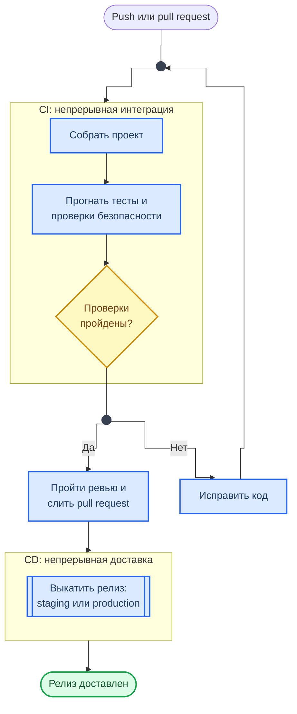
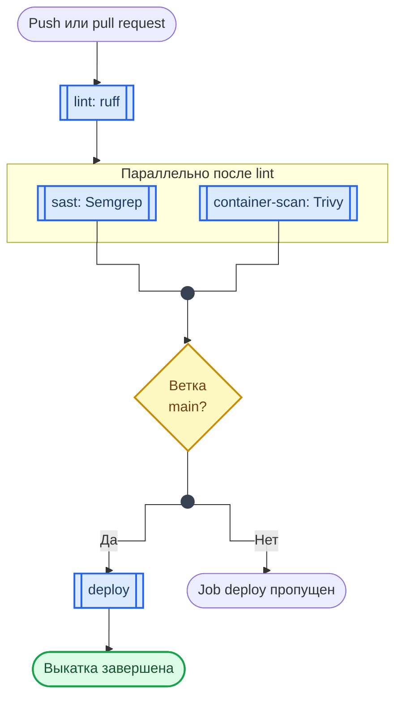

<!-- markdownlint-disable MD033 -->
<div align="center">
<h1><a id="intro">Введение в CI/CD и GitHub Actions</a><br></h1>


</div>

***

Введение в непрерывную интеграцию и доставку перед лабораторной Лаб. 09. Здесь — концепция CI/CD, структура GitHub Actions и минимальный workflow.

> Если вы уже настраивали пайплайны — переходите сразу к Лаб. 09.

***

## Что такое CI/CD

**CI (Continuous Integration)** — автоматическая сборка и тестирование кода при каждом изменении. Каждый push или pull request запускает проверки.

**CD (Continuous Delivery / Deployment)** — автоматическая доставка проверенного кода в staging или production.

Схема показывает путь изменения от `git push` до релиза и место, где конвейер его останавливает.



**Как читать схему:**

- Любой push или pull request запускает блок CI: сборку, затем тесты и проверки безопасности.
- Ромб «Проверки пройдены?» — единственная развилка. При «Нет» изменение дальше не идёт: код исправляют, и цикл начинается заново с нового push.
- При «Да» pull request проходит ревью и сливается — только после этого начинается CD.
- CD выкатывает релиз в staging или production. Вручную подтверждается последний шаг или нет — в этом разница между Continuous Delivery и Continuous Deployment.

Обозначения — в материале [Как читать схемы курса](https://course.geminishkv.tech/materials/diagrams_legend/).

### Зачем это нужно

- **Раннее обнаружение ошибок** — сломанный код не попадёт в основную ветку
- **Автоматизация рутины** — линтинг, тесты, сборка, публикация
- **Единый стандарт качества** — все проверки одинаковые для всех
- **Безопасность** — SAST, SCA, DAST, secret detection в каждом пайплайне

***

## GitHub Actions — основы

GitHub Actions — встроенная CI/CD платформа GitHub. Workflow описывается в YAML-файле.

### Ключевые термины

<div class="lab-grid" style="grid-template-columns: repeat(auto-fill, minmax(min(14rem, 100%), 1fr));">

  <div class="lab-card" style="flex-direction: column; align-items: flex-start; gap: 0.4rem;">
  <div style="display:flex; align-items:baseline; gap:0.6rem; width:100%;">
    <span class="lab-card-num" style="font-size:0.9rem; width:auto;">Workflow</span>
    <span style="font-size:0.65rem; color:#888; font-family:var(--font-code);">.yml</span>
  </div>
  <p style="font-size:0.75rem; margin:0.2rem 0 0; color:#555; line-height:1.5;">Автоматизированный процесс, описанный в YAML-файле</p>
  </div>

  <div class="lab-card" style="flex-direction: column; align-items: flex-start; gap: 0.4rem;">
  <div style="display:flex; align-items:baseline; gap:0.6rem; width:100%;">
    <span class="lab-card-num" style="font-size:0.9rem; width:auto;">Event</span>
    <span style="font-size:0.65rem; color:#888; font-family:var(--font-code);">trigger</span>
  </div>
  <div class="lab-card-tags"><span class="lab-tag">push</span><span class="lab-tag">pull_request</span><span class="lab-tag">schedule</span><span class="lab-tag">workflow_dispatch</span></div>
  </div>

  <div class="lab-card" style="flex-direction: column; align-items: flex-start; gap: 0.4rem;">
  <div style="display:flex; align-items:baseline; gap:0.6rem; width:100%;">
    <span class="lab-card-num" style="font-size:0.9rem; width:auto;">Job</span>
    <span style="font-size:0.65rem; color:#888; font-family:var(--font-code);">задача</span>
  </div>
  <p style="font-size:0.75rem; margin:0.2rem 0 0; color:#555; line-height:1.5;">Набор шагов, выполняемых на одном runner</p>
  </div>

  <div class="lab-card" style="flex-direction: column; align-items: flex-start; gap: 0.4rem;">
  <div style="display:flex; align-items:baseline; gap:0.6rem; width:100%;">
    <span class="lab-card-num" style="font-size:0.9rem; width:auto;">Step</span>
    <span style="font-size:0.65rem; color:#888; font-family:var(--font-code);">шаг</span>
  </div>
  <p style="font-size:0.75rem; margin:0.2rem 0 0; color:#555; line-height:1.5;">Отдельное действие внутри job</p>
  </div>

  <div class="lab-card" style="flex-direction: column; align-items: flex-start; gap: 0.4rem;">
  <div style="display:flex; align-items:baseline; gap:0.6rem; width:100%;">
    <span class="lab-card-num" style="font-size:0.9rem; width:auto;">Action</span>
    <span style="font-size:0.65rem; color:#888; font-family:var(--font-code);">Marketplace</span>
  </div>
  <p style="font-size:0.75rem; margin:0.2rem 0 0; color:#555; line-height:1.5;">Переиспользуемый блок (из Marketplace или свой)</p>
  </div>

  <div class="lab-card" style="flex-direction: column; align-items: flex-start; gap: 0.4rem;">
  <div style="display:flex; align-items:baseline; gap:0.6rem; width:100%;">
    <span class="lab-card-num" style="font-size:0.9rem; width:auto;">Runner</span>
    <span style="font-size:0.65rem; color:#888; font-family:var(--font-code);">VM</span>
  </div>
  <div class="lab-card-tags"><span class="lab-tag">ubuntu-latest</span><span class="lab-tag">macos-latest</span></div>
  </div>

  <div class="lab-card" style="flex-direction: column; align-items: flex-start; gap: 0.4rem;">
  <div style="display:flex; align-items:baseline; gap:0.6rem; width:100%;">
    <span class="lab-card-num" style="font-size:0.9rem; width:auto;">Artifact</span>
    <span style="font-size:0.65rem; color:#888; font-family:var(--font-code);">output</span>
  </div>
  <p style="font-size:0.75rem; margin:0.2rem 0 0; color:#555; line-height:1.5;">Файл-результат job (отчёты, бинарники)</p>
  </div>

</div>

### Структура проекта

```text
.github/
└── workflows/
    ├── ci.yml              ← основной пайплайн
    ├── security.yml        ← SAST/SCA проверки
    └── release.yml         ← публикация релизов
```

***

## Минимальный workflow

Файл: `.github/workflows/ci.yml`

```yaml
name: CI                                    # название workflow

on:                                         # триггеры
  push:
    branches: [main, develop]               # при push в эти ветки
  pull_request:
    branches: [main]                        # при PR в main

jobs:
  build:                                    # имя job
    runs-on: ubuntu-latest                  # runner

    steps:
      - name: Checkout code                 # шаг 1: клонировать репо
        uses: actions/checkout@v7

      - name: Set up Python                 # шаг 2: настроить Python
        uses: actions/setup-python@v7
        with:
          python-version: "3.12"

      - name: Install dependencies          # шаг 3: установить зависимости
        run: pip install -r requirements.txt

      - name: Run tests                      # шаг 4: запустить тесты
        run: pytest tests/
```

> В учебных примерах actions указаны по тегу для читаемости. Тег можно переписать, поэтому в рабочих пайплайнах их закрепляют по SHA коммита с комментарием версии — см. [CheatSheet: GitHub Actions Security](https://course.geminishkv.tech/materials/cheatsheet/CHEATSHEET_GH_ACTIONS_SECURITY/) и Лаб. 09.

### Разбор структуры

```yaml
name: CI                    # Имя — видно во вкладке Actions на GitHub
on:                         # Когда запускать
  push:                     #   при push
    branches: [main]        #     в ветку main
jobs:                       # Список задач
  build:                    # Задача "build"
    runs-on: ubuntu-latest  # На какой машине
    steps:                  # Последовательность шагов
      - uses: action@v4     #   готовое action
      - run: команда        #   shell-команда
```

***

## Триггеры (Events)

```yaml
on:
  # При push
  push:
    branches: [main, develop]
    paths:
      - "src/**"                   # только при изменении src/
    tags:
      - "v*"                       # при создании тега v1.0.0

  # При pull request
  pull_request:
    branches: [main]
    types: [opened, synchronize]   # при открытии и обновлении PR

  # По расписанию (cron)
  schedule:
    - cron: "0 6 * * 1"            # каждый понедельник в 06:00 UTC

  # Ручной запуск
  workflow_dispatch:
    inputs:
      environment:
        description: "Target environment"
        required: true
        default: "staging"
```

***

## Переменные и секреты

### Переменные окружения

```yaml
env:                                       # глобальные для workflow
  PYTHON_VERSION: "3.12"

jobs:
  build:
    env:                                   # для конкретного job
      NODE_ENV: production
    steps:
      - name: Use variable
        run: echo "Python $PYTHON_VERSION"      # переменная окружения, а не подстановка ${{ }} в run
        env:                               # для конкретного шага
          MY_VAR: value
```

### Секреты

Секреты хранятся в настройках репозитория (`Settings → Secrets and variables → Actions`).

```yaml
steps:
  - name: Deploy
    run: ./deploy.sh
    env:
      API_TOKEN: ${{ secrets.API_TOKEN }}  # маскируется в логах
```

!!! warning "Безопасность секретов"
    - Секреты **не передаются** в `pull_request` из форков (защита от кражи). Исключение — `pull_request_target` и `workflow_run`: они работают в контексте основного репозитория с секретами, и запускать в них код из форка опасно
    - Секреты **маскируются** в логах, но производное значение (base64, часть строки) уже не маскируется
    - Контекст `secrets` недоступен в `if:`: передайте секрет в `env` job и проверяйте переменную окружения

***

## Матрица стратегий

Запуск одного job на нескольких конфигурациях:

```yaml
jobs:
  test:
    runs-on: ubuntu-latest
    strategy:
      matrix:
        python-version: ["3.10", "3.11", "3.12"]
        os: [ubuntu-latest, macos-latest]
    steps:
      - uses: actions/checkout@v7
      - uses: actions/setup-python@v7
        with:
          python-version: ${{ matrix.python-version }}
      - run: pytest tests/
```

Создаёт 6 параллельных jobs: 3 версии Python x 2 ОС.

***

## Артефакты

Сохранение результатов job для скачивания или передачи между jobs:

```yaml
steps:
  - name: Run SAST
    run: semgrep scan --json > report.json

  - name: Upload report
    uses: actions/upload-artifact@v7
    with:
      name: sast-report
      path: report.json
      retention-days: 30
```

***

## Пример: DevSecOps пайплайн

Типичная структура для Лаб. 09:

```yaml
name: DevSecOps Pipeline

on:
  push:
    branches: [main, develop]
  pull_request:
    branches: [main]

permissions:
  contents: read                             # токен только на чтение

jobs:
  lint:
    runs-on: ubuntu-latest
    steps:
      - uses: actions/checkout@v7
      - run: pip install ruff && ruff check .

  sast:
    runs-on: ubuntu-latest
    needs: lint                              # запускается после lint
    steps:
      - uses: actions/checkout@v7
      - run: pip install semgrep && semgrep scan --config auto

  container-scan:
    runs-on: ubuntu-latest
    needs: lint
    steps:
      - uses: actions/checkout@v7
      - run: docker build -t myapp .
      - name: Trivy scan
        uses: aquasecurity/trivy-action@ed142fd0673e97e23eac54620cfb913e5ce36c25  # v0.36.0; никогда не @master
        with:
          image-ref: myapp
          severity: HIGH,CRITICAL

  deploy:
    runs-on: ubuntu-latest
    needs: [sast, container-scan]            # после всех проверок
    if: github.ref == 'refs/heads/main'      # только из main
    steps:
      - run: echo "Deploying..."
```

Схема показывает порядок выполнения jobs из примера выше. Его задают `needs` и `if`, а не порядок записи в файле.



**Как читать схему:**

- `lint` идёт первым: у `sast` и `container-scan` указано `needs: lint`.
- `sast` и `container-scan` друг от друга не зависят, поэтому выполняются параллельно.
- `deploy` ждёт обе проверки (`needs: [sast, container-scan]`): если упала хотя бы одна, до ромба дело не дойдёт.
- Ромб — условие `if: github.ref == 'refs/heads/main'`. В остальных ветках job `deploy` помечается пропущенным, а пайплайн остаётся зелёным.

Обозначения — в материале [Как читать схемы курса](https://course.geminishkv.tech/materials/diagrams_legend/).

***

## YAML — краткий справочник

Workflow пишутся на YAML. Основные правила:

```yaml
# Скаляры
string: "hello"
number: 42
boolean: true

# Списки
items:
  - first
  - second
  - third

# Словари
person:
  name: "Alice"
  age: 30

# Многострочные строки
description: |           # сохраняет переносы
  Первая строка
  Вторая строка

command: >               # склеивает в одну строку
  docker build
  --tag myapp
  --file Dockerfile .
```

!!! tip "Валидация YAML"
    Используйте [yamllint](https://github.com/adrienverge/yamllint) для проверки синтаксиса.

> Подробнее: [YAML CheatSheet](https://course.geminishkv.tech/materials/cheatsheet/CHEATSHEET_YAML/) и [GitHub Actions Security CheatSheet](https://course.geminishkv.tech/materials/cheatsheet/CHEATSHEET_GH_ACTIONS_SECURITY/).

***

## Links

<div class="lab-grid" style="grid-template-columns: repeat(auto-fill, minmax(min(14rem, 100%), 1fr));">
<a class="lab-card" href="https://docs.github.com/en/actions" target="_blank"><div class="lab-card-body"><div class="lab-card-title">GitHub Actions Documentation</div><div class="lab-card-tags"><span class="lab-tag">docs.github.com</span></div></div><div class="lab-card-arrow">→</div></a>
<a class="lab-card" href="https://docs.github.com/en/actions/writing-workflows/workflow-syntax-for-github-actions" target="_blank"><div class="lab-card-body"><div class="lab-card-title">Workflow Syntax Reference</div><div class="lab-card-tags"><span class="lab-tag">docs.github.com</span></div></div><div class="lab-card-arrow">→</div></a>
<a class="lab-card" href="https://github.com/marketplace?type=actions" target="_blank"><div class="lab-card-body"><div class="lab-card-title">GitHub Actions Marketplace</div><div class="lab-card-tags"><span class="lab-tag">github.com</span></div></div><div class="lab-card-arrow">→</div></a>
</div>
