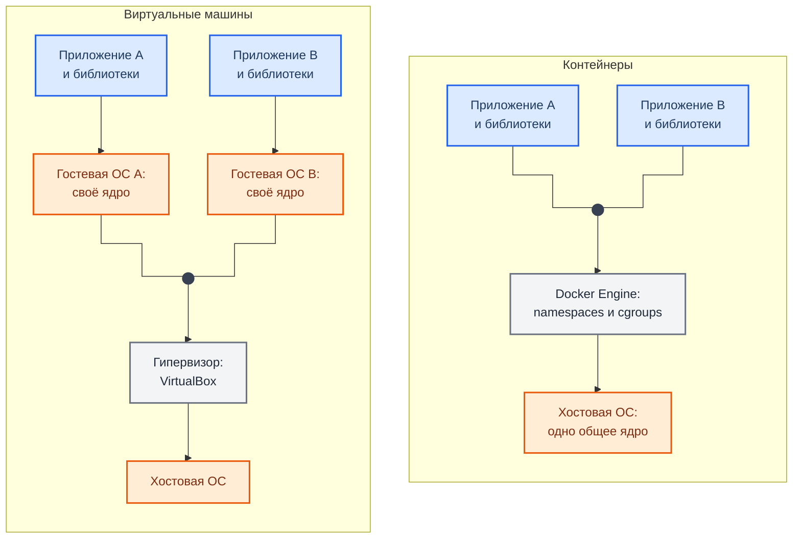
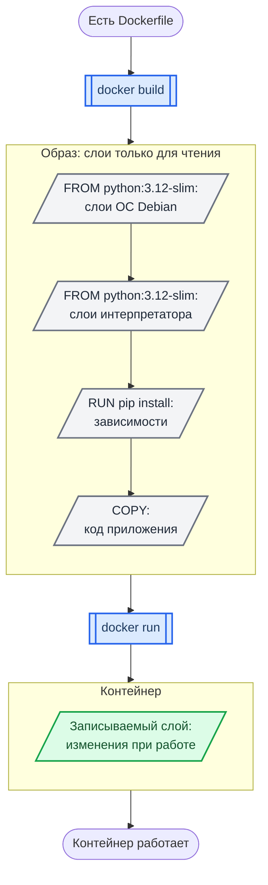

<div align="center">
<h1><a id="intro">Основы Docker и контейнеризации</a><br></h1>


</div>

***

Введение в контейнеризацию перед лабораторными Лаб. 05-06. Здесь — концепция, отличие от VM и базовые команды Docker.

> Если вы уже работали с Docker — переходите сразу к Лаб. 05.

***

## Что такое контейнеризация

Контейнер — изолированная среда для запуска приложения, которая включает код, зависимости и конфигурацию. В отличие от виртуальной машины, контейнер не содержит собственного ядра ОС — он использует ядро хост-системы.

### VM vs Container

Схема сравнивает, что на чём работает в виртуальной машине и в контейнере. Стрелка означает «работает поверх».



**Как читать схему:**

- У каждой виртуальной машины своя гостевая ОС со своим ядром (оранжевые блоки). Изоляция сильнее, но каждая ОС занимает память и диск и загружается как отдельный компьютер.
- Контейнеры делят одно ядро хостовой ОС. Изоляцию дают namespaces (что процесс видит) и cgroups (сколько ресурсов он получает).
- Следствие для безопасности: уязвимость ядра хоста затрагивает сразу все контейнеры. Поэтому в Лаб. 05–06 столько внимания правам процесса и настройкам демона.

Обозначения — в материале [Как читать схемы курса](https://course.geminishkv.tech/materials/diagrams_legend/).

<div class="lab-grid" style="grid-template-columns: repeat(auto-fill, minmax(280px, 1fr));">
<div class="lab-card" style="flex-direction: column; align-items: flex-start; gap: 0.4rem;"><div style="display:flex; align-items:baseline; gap:0.6rem; width:100%;"><span class="lab-card-num" style="font-size:0.9rem; width:auto;">Изоляция</span></div><div class="lab-card-tags"><span class="lab-tag">VM: полная (отдельная ОС)</span></div><div class="lab-card-tags"><span class="lab-tag">Container: уровень процесса</span></div></div>
<div class="lab-card" style="flex-direction: column; align-items: flex-start; gap: 0.4rem;"><div style="display:flex; align-items:baseline; gap:0.6rem; width:100%;"><span class="lab-card-num" style="font-size:0.9rem; width:auto;">Размер</span></div><div class="lab-card-tags"><span class="lab-tag">VM: гигабайты</span></div><div class="lab-card-tags"><span class="lab-tag">Container: мегабайты</span></div></div>
<div class="lab-card" style="flex-direction: column; align-items: flex-start; gap: 0.4rem;"><div style="display:flex; align-items:baseline; gap:0.6rem; width:100%;"><span class="lab-card-num" style="font-size:0.9rem; width:auto;">Запуск</span></div><div class="lab-card-tags"><span class="lab-tag">VM: минуты</span></div><div class="lab-card-tags"><span class="lab-tag">Container: секунды</span></div></div>
<div class="lab-card" style="flex-direction: column; align-items: flex-start; gap: 0.4rem;"><div style="display:flex; align-items:baseline; gap:0.6rem; width:100%;"><span class="lab-card-num" style="font-size:0.9rem; width:auto;">Накладные расходы</span></div><div class="lab-card-tags"><span class="lab-tag">VM: высокие (hypervisor)</span></div><div class="lab-card-tags"><span class="lab-tag">Container: минимальные</span></div></div>
<div class="lab-card" style="flex-direction: column; align-items: flex-start; gap: 0.4rem;"><div style="display:flex; align-items:baseline; gap:0.6rem; width:100%;"><span class="lab-card-num" style="font-size:0.9rem; width:auto;">Безопасность</span></div><div class="lab-card-tags"><span class="lab-tag">VM: сильная изоляция</span></div><div class="lab-card-tags"><span class="lab-tag">Container: слабее (общее ядро)</span></div></div>
<div class="lab-card" style="flex-direction: column; align-items: flex-start; gap: 0.4rem;"><div style="display:flex; align-items:baseline; gap:0.6rem; width:100%;"><span class="lab-card-num" style="font-size:0.9rem; width:auto;">Портируемость</span></div><div class="lab-card-tags"><span class="lab-tag">VM: ограниченная</span></div><div class="lab-card-tags"><span class="lab-tag">Container: высокая (образ = артефакт)</span></div></div>
</div>

***

## Ключевые концепции Docker

### Image (образ)

Неизменяемый шаблон для создания контейнеров. Состоит из слоёв (layers):

Схема показывает, из каких слоёв складывается образ и что добавляет к ним запуск контейнера.



**Как читать схему:**

- Каждая инструкция Dockerfile, которая меняет файловую систему, даёт слой. Слои образа доступны только для чтения и переиспользуются из кэша.
- Порядок инструкций — это порядок слоёв: если слой изменился, пересобираются он и все слои ниже по схеме. Поэтому зависимости ставят раньше, чем копируют код.
- `docker run` добавляет поверх один записываемый слой. Он исчезает вместе с контейнером, поэтому данные, которые нужно сохранить, выносят в volume.
- Секрет, попавший в слой, остаётся в истории образа, даже если следующая инструкция его удаляет.

Обозначения — в материале [Как читать схемы курса](https://course.geminishkv.tech/materials/diagrams_legend/).

### Container (контейнер)

Запущенный экземпляр образа. Можно создать несколько контейнеров из одного образа.

### Dockerfile

Инструкция по сборке образа — текстовый файл с командами:

```dockerfile
FROM python:3.12-slim
WORKDIR /app
COPY requirements.txt .
RUN pip install --no-cache-dir -r requirements.txt
COPY . .
EXPOSE 8080
CMD ["python", "app.py"]
```

### Registry (реестр)

Хранилище образов. По умолчанию — Docker Hub. Альтернативы: GitHub Container Registry (ghcr.io), Amazon ECR, Google Artifact Registry.

***

## Установка Docker

```bash
# Ubuntu / Debian
$ sudo apt update
$ sudo apt install -y docker.io docker-buildx docker-compose-v2    # compose v2: команда `docker compose`
$ sudo systemctl enable --now docker
$ sudo usermod -aG docker $USER
$ newgrp docker

# Fedora
$ sudo dnf install -y docker docker-compose
$ sudo systemctl enable --now docker
$ sudo usermod -aG docker $USER

# macOS
# Скачать Docker Desktop: https://docs.docker.com/desktop/install/mac-install/

# Проверка
$ docker --version
$ docker run hello-world
```

### Windows

```powershell
PS> wsl --install                                   # WSL2 + Ubuntu, нужна перезагрузка
PS> winget install --id Docker.DockerDesktop -e
PS> docker --version; docker run hello-world        # после запуска Docker Desktop
```

- В настройках Docker Desktop должен быть выбран движок WSL2 (`Settings → General → Use the WSL 2 based engine`), а в `Resources → WSL integration` включена ваша Ubuntu — тогда `docker` одинаково работает из PowerShell и из Ubuntu.
- Нужна включённая аппаратная виртуализация (см. [Подготовка рабочего окружения](https://course.geminishkv.tech/labs/intro/vmbox_tutorial/#windows)).
- Без Docker Desktop (лицензия для компаний): Docker Engine ставится внутри Ubuntu в WSL2 по инструкции для Ubuntu выше, `systemctl` в WSL2 включается через `[boot] systemd=true` в `/etc/wsl.conf`.

***

## Базовые команды

### Работа с образами

```bash
# Скачать образ из Docker Hub
$ docker pull nginx:latest

# Список локальных образов
$ docker images

# Удалить образ
$ docker rmi nginx:latest

# Собрать образ из Dockerfile
$ docker build -t myapp:1.0 .

# Посмотреть историю слоёв
$ docker history myapp:1.0
```

### Работа с контейнерами

```bash
# Запустить контейнер
$ docker run nginx                        # foreground
$ docker run -d nginx                     # detached (фоновый)
$ docker run -d -p 8080:80 nginx          # проброс порта: хост:контейнер
$ docker run -d --name web nginx          # с именем

# Список контейнеров
$ docker ps                               # запущенные
$ docker ps -a                            # все (включая остановленные)

# Остановить / запустить / удалить
$ docker stop web
$ docker start web
$ docker rm web

# Войти в контейнер
$ docker exec -it web /bin/bash           # интерактивный shell
$ docker exec web cat /etc/nginx/nginx.conf   # выполнить команду

# Логи контейнера
$ docker logs web
$ docker logs -f web                      # follow (как tail -f)
```

### Volumes (тома)

Контейнеры эфемерны — данные внутри теряются при удалении. Volumes сохраняют данные:

```bash
# Монтирование директории хоста
$ docker run -d -v /host/path:/container/path nginx

# Именованный том
$ docker volume create mydata
$ docker run -d -v mydata:/data nginx

# Список томов
$ docker volume ls
```

### Сети

```bash
# Список сетей
$ docker network ls

# Создать сеть
$ docker network create mynet

# Запустить контейнер в сети
$ docker run -d --network mynet --name api myapp
```

***

## Docker Compose

Docker Compose управляет мульти-контейнерными приложениями через файл `docker-compose.yml`:

```yaml
services:
  web:
    build: .
    ports:
      - "8080:80"
    depends_on:
      - db
  db:
    image: postgres:16
    environment:
      POSTGRES_PASSWORD: secret     # только для учебного стенда: в проектах пароль приходит из secrets
    volumes:
      - pgdata:/var/lib/postgresql/data

volumes:
  pgdata:
```

```bash
# Запустить все сервисы
$ docker compose up -d

# Остановить
$ docker compose down

# Логи
$ docker compose logs -f

# Статус
$ docker compose ps
```

***

## Жизненный цикл контейнера

Схема показывает, в каких состояниях бывает контейнер и какая команда переводит его из одного в другое.

```mermaid
stateDiagram-v2
    accTitle: Жизненный цикл контейнера Docker
    accDescr: Из образа контейнер создаётся и запускается, может быть приостановлен или остановлен и удаляется командой docker rm; docker run объединяет создание и запуск.

    state "Образ" as image_state
    state "Создан (created)" as created_state
    state "Работает (running)" as running_state
    state "Приостановлен (paused)" as paused_state
    state "Остановлен (exited)" as exited_state

    [*] --> image_state : docker build
    image_state --> created_state : docker create
    image_state --> running_state : docker run
    created_state --> running_state : docker start
    running_state --> paused_state : docker pause
    paused_state --> running_state : docker unpause
    running_state --> exited_state : docker stop<br/>или конец процесса
    exited_state --> running_state : docker start
    exited_state --> [*] : docker rm
```



**Как читать схему:**

- Блок — состояние, стрелка — переход, подпись на стрелке — команда.
- `docker run` — это `docker create` и `docker start` одной командой.
- Остановленный контейнер можно запустить снова: его записываемый слой сохраняется до `docker rm`.
- `docker pause` замораживает процессы контейнера, `docker stop` отправляет SIGTERM, а по истечении таймаута — SIGKILL.

Обозначения — в материале [Как читать схемы курса](https://course.geminishkv.tech/materials/diagrams_legend/).

***

## Docker и безопасность (preview)

Подробно рассматривается в Лаб. 05-06, но ключевые принципы:

- **Не запускайте от root** — используйте `USER` в Dockerfile
- **Минимальные образы** — `alpine` или `*-slim` вместо полных
- **Не храните секреты в образе** — передавайте их при запуске через Docker secrets или менеджер секретов; переменные окружения видны в `docker inspect`
- **Сканируйте образы** — Trivy, Docker Scout
- **.dockerignore** — не копируйте `.git`, `.env`, `node_modules` в образ

> Подробнее: [Dockerfile Security CheatSheet](https://course.geminishkv.tech/materials/cheatsheet/CHEATSHEET_DOCKERFILE_SECURITY/) и [Docker CheatSheet](https://course.geminishkv.tech/materials/cheatsheet/CHEATSHEET_DOCKER/).

***

## Links

<div class="lab-grid" style="grid-template-columns: repeat(auto-fill, minmax(280px, 1fr));">
<a class="lab-card" href="https://docs.docker.com/get-started/" target="_blank"><div class="lab-card-body"><div class="lab-card-title">Docker — Get Started</div><div class="lab-card-tags"><span class="lab-tag">docs.docker.com</span></div></div><div class="lab-card-arrow">→</div></a>
<a class="lab-card" href="https://docs.docker.com/reference/dockerfile/" target="_blank"><div class="lab-card-body"><div class="lab-card-title">Dockerfile Reference</div><div class="lab-card-tags"><span class="lab-tag">docs.docker.com</span></div></div><div class="lab-card-arrow">→</div></a>
<a class="lab-card" href="https://docs.docker.com/compose/" target="_blank"><div class="lab-card-body"><div class="lab-card-title">Docker Compose</div><div class="lab-card-tags"><span class="lab-tag">docs.docker.com</span></div></div><div class="lab-card-arrow">→</div></a>
</div>
