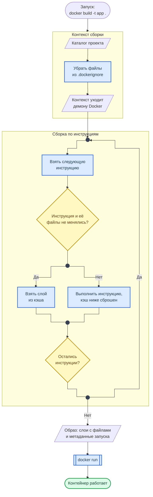
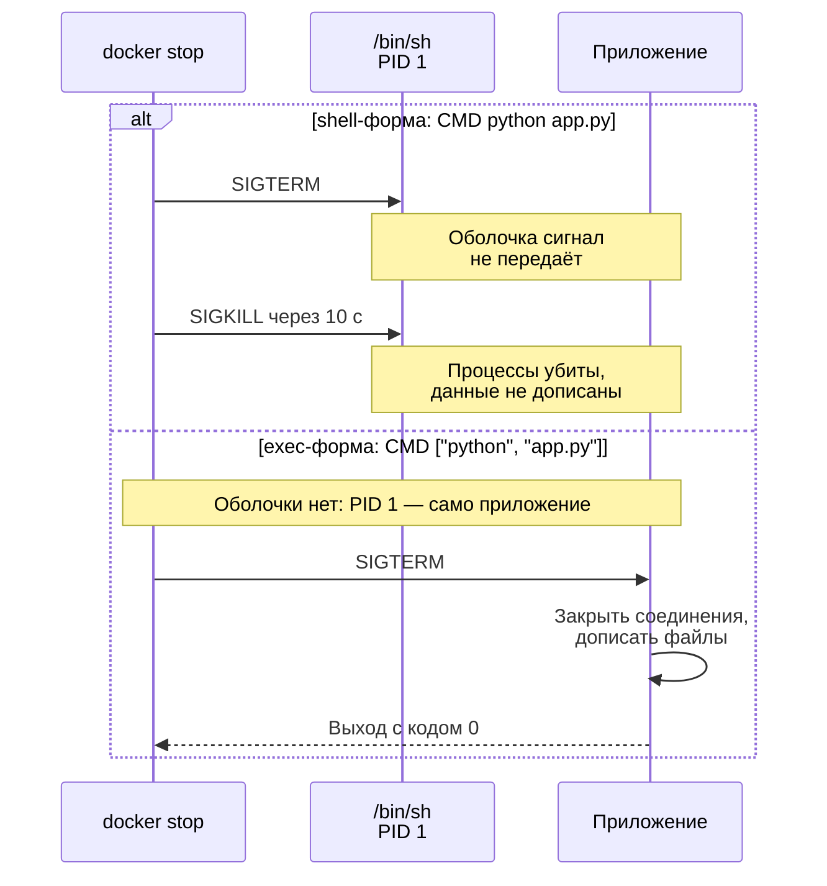

<div align="center">
<h1><a id="intro">Dockerfile: как устроен и как его писать</a><br></h1>


</div>

***

Продолжение [Основ Docker](https://course.geminishkv.tech/materials/guides/docker_basics/) перед Лаб. 05–06: что такое Dockerfile, что делает каждая инструкция, почему порядок строк решает скорость сборки и как из наивного файла получить правильный.

> Если вы уже пишете Dockerfile уверенно — переходите к [Dockerfile Security CheatSheet](https://course.geminishkv.tech/materials/cheatsheet/CHEATSHEET_DOCKERFILE_SECURITY/): там усиление защиты, здесь основа.

***

## Что такое Dockerfile

Dockerfile — текстовый рецепт образа: с чего начать, что скопировать, что установить и что запускать. По нему `docker build` собирает **образ** — неизменяемый набор слоёв с файлами плюс метаданные о запуске (команда, пользователь, переменные, порты). Из одного образа запускается сколько угодно одинаковых контейнеров.

Три вещи определяют результат сборки:

- **Dockerfile** — сами инструкции, сверху вниз.
- **Контекст сборки** — каталог, который вы передали в `docker build` (точка в конце команды). Только из него `COPY` может брать файлы.
- **`.dockerignore`** — что из контекста исключить. Без него в образ уезжают `.git`, `.env` и виртуальные окружения. Шаблон — в [шпаргалке .dockerignore](https://course.geminishkv.tech/materials/cheatsheet/CHEATSHEET_DOCKERIGNORE/).

***

## От Dockerfile до контейнера

Схема показывает, что происходит между командой `docker build` и работающим контейнером, и где именно срабатывает кэш.



**Как читать схему:**

- Первая рамка объясняет, почему `.dockerignore` — это про безопасность, а не только про скорость: то, что не попало в контекст, не может попасть в образ.
- Вторая рамка — цикл по инструкциям. Первый ромб и есть кэш: если инструкция и файлы, которые она использует, не изменились, слой берётся готовым.
- Ветка «Нет» сбрасывает кэш не только для этой инструкции, но и для всех, что ниже по файлу. Отсюда главное правило порядка: редко меняющееся — выше, часто меняющееся — ниже.
- Образ — это слои и метаданные. `docker run` добавляет к ним один записываемый слой, подробнее — в схеме слоёв в «Основах Docker».

Обозначения — в материале [Как читать схемы курса](https://course.geminishkv.tech/materials/diagrams_legend/).

***

## Анатомия: инструкции

Инструкций немного. У каждой — своё назначение, своё поведение со слоями и одна типичная ошибка.

<div class="lab-grid" style="grid-template-columns: repeat(auto-fill, minmax(min(19rem, 100%), 1fr));">

  <div class="lab-card" style="flex-direction: column; align-items: flex-start; gap: 0.5rem;">
  <div style="display:flex; align-items:baseline; gap:0.6rem; width:100%; flex-wrap:wrap;">
    <span class="lab-card-num" style="font-size:0.9rem; width:auto;">FROM</span>
    <span style="font-size:0.65rem; color:#888; font-family:var(--font-code);">базовый образ</span>
  </div>
  <dl class="lab-card-facts">
    <dt>Что делает</dt><dd>Задаёт образ, поверх которого строится ваш. Всегда первая инструкция.</dd>
    <dt>Слой</dt><dd>Приносит все слои базового образа.</dd>
    <dt>Ошибка</dt><dd><code>FROM python</code> без тега — это <code>latest</code>: сегодня одна версия, через месяц другая, сборка перестаёт воспроизводиться.</dd>
  </dl>
  </div>

  <div class="lab-card" style="flex-direction: column; align-items: flex-start; gap: 0.5rem;">
  <div style="display:flex; align-items:baseline; gap:0.6rem; width:100%; flex-wrap:wrap;">
    <span class="lab-card-num" style="font-size:0.9rem; width:auto;">WORKDIR</span>
    <span style="font-size:0.65rem; color:#888; font-family:var(--font-code);">рабочий каталог</span>
  </div>
  <dl class="lab-card-facts">
    <dt>Что делает</dt><dd>Каталог для всех следующих инструкций и для запуска контейнера. Создаёт его, если каталога нет.</dd>
    <dt>Слой</dt><dd>Метаданные; слой появляется, только если каталог пришлось создать.</dd>
    <dt>Ошибка</dt><dd>Вместо него писать <code>RUN cd /app</code>: <code>cd</code> действует до конца одной инструкции и на следующую не переносится.</dd>
  </dl>
  </div>

  <div class="lab-card" style="flex-direction: column; align-items: flex-start; gap: 0.5rem;">
  <div style="display:flex; align-items:baseline; gap:0.6rem; width:100%; flex-wrap:wrap;">
    <span class="lab-card-num" style="font-size:0.9rem; width:auto;">COPY</span>
    <span style="font-size:0.65rem; color:#888; font-family:var(--font-code);">файлы из контекста</span>
  </div>
  <dl class="lab-card-facts">
    <dt>Что делает</dt><dd>Копирует файлы из контекста сборки в образ. <code>--chown</code> сразу задаёт владельца.</dd>
    <dt>Слой</dt><dd>Да. Кэш сбрасывается, когда меняется содержимое копируемых файлов.</dd>
    <dt>Ошибка</dt><dd><code>COPY . .</code> в самом начале: любая правка кода пересобирает всё, включая установку зависимостей.</dd>
  </dl>
  </div>

  <div class="lab-card" style="flex-direction: column; align-items: flex-start; gap: 0.5rem;">
  <div style="display:flex; align-items:baseline; gap:0.6rem; width:100%; flex-wrap:wrap;">
    <span class="lab-card-num" style="font-size:0.9rem; width:auto;">RUN</span>
    <span style="font-size:0.65rem; color:#888; font-family:var(--font-code);">команда при сборке</span>
  </div>
  <dl class="lab-card-facts">
    <dt>Что делает</dt><dd>Выполняет команду во время сборки и сохраняет результат.</dd>
    <dt>Слой</dt><dd>Да. Кэш зависит от текста команды, а не от её результата.</dd>
    <dt>Ошибка</dt><dd><code>RUN apt-get update</code> отдельной инструкцией: слой закэшируется, и следующий <code>install</code> получит устаревший список пакетов. Обновление и установка — одной командой.</dd>
  </dl>
  </div>

  <div class="lab-card" style="flex-direction: column; align-items: flex-start; gap: 0.5rem;">
  <div style="display:flex; align-items:baseline; gap:0.6rem; width:100%; flex-wrap:wrap;">
    <span class="lab-card-num" style="font-size:0.9rem; width:auto;">ENV</span>
    <span style="font-size:0.65rem; color:#888; font-family:var(--font-code);">переменная окружения</span>
  </div>
  <dl class="lab-card-facts">
    <dt>Что делает</dt><dd>Переменная, доступная и при сборке, и в работающем контейнере.</dd>
    <dt>Слой</dt><dd>Метаданные. Значение видно в <code>docker inspect</code>.</dd>
    <dt>Ошибка</dt><dd>Класть сюда пароли и токены: они останутся в образе навсегда и достанутся каждому, кто его скачал.</dd>
  </dl>
  </div>

  <div class="lab-card" style="flex-direction: column; align-items: flex-start; gap: 0.5rem;">
  <div style="display:flex; align-items:baseline; gap:0.6rem; width:100%; flex-wrap:wrap;">
    <span class="lab-card-num" style="font-size:0.9rem; width:auto;">ARG</span>
    <span style="font-size:0.65rem; color:#888; font-family:var(--font-code);">параметр сборки</span>
  </div>
  <dl class="lab-card-facts">
    <dt>Что делает</dt><dd>Переменная только на время сборки, задаётся через <code>--build-arg</code>. В контейнере её нет.</dd>
    <dt>Слой</dt><dd>Метаданные. Значение видно в <code>docker history</code>.</dd>
    <dt>Ошибка</dt><dd>Передавать через неё секреты: «в контейнере её нет» не значит «в образе её не видно».</dd>
  </dl>
  </div>

  <div class="lab-card" style="flex-direction: column; align-items: flex-start; gap: 0.5rem;">
  <div style="display:flex; align-items:baseline; gap:0.6rem; width:100%; flex-wrap:wrap;">
    <span class="lab-card-num" style="font-size:0.9rem; width:auto;">USER</span>
    <span style="font-size:0.65rem; color:#888; font-family:var(--font-code);">от чьего имени</span>
  </div>
  <dl class="lab-card-facts">
    <dt>Что делает</dt><dd>Пользователь для следующих инструкций и для процесса в контейнере.</dd>
    <dt>Слой</dt><dd>Метаданные.</dd>
    <dt>Ошибка</dt><dd>Не указывать вовсе: тогда приложение работает от root, и уязвимость в нём сразу даёт root внутри контейнера.</dd>
  </dl>
  </div>

  <div class="lab-card" style="flex-direction: column; align-items: flex-start; gap: 0.5rem;">
  <div style="display:flex; align-items:baseline; gap:0.6rem; width:100%; flex-wrap:wrap;">
    <span class="lab-card-num" style="font-size:0.9rem; width:auto;">EXPOSE</span>
    <span style="font-size:0.65rem; color:#888; font-family:var(--font-code);">документация порта</span>
  </div>
  <dl class="lab-card-facts">
    <dt>Что делает</dt><dd>Сообщает, какой порт слушает приложение. Сам порт наружу не открывает.</dd>
    <dt>Слой</dt><dd>Метаданные.</dd>
    <dt>Ошибка</dt><dd>Считать, что этого достаточно: публикует порт только <code>docker run -p 8080:8080</code>.</dd>
  </dl>
  </div>

  <div class="lab-card" style="flex-direction: column; align-items: flex-start; gap: 0.5rem;">
  <div style="display:flex; align-items:baseline; gap:0.6rem; width:100%; flex-wrap:wrap;">
    <span class="lab-card-num" style="font-size:0.9rem; width:auto;">HEALTHCHECK</span>
    <span style="font-size:0.65rem; color:#888; font-family:var(--font-code);">проверка живости</span>
  </div>
  <dl class="lab-card-facts">
    <dt>Что делает</dt><dd>Команда, по которой Docker решает, здоров ли контейнер: статус виден в <code>docker ps</code>.</dd>
    <dt>Слой</dt><dd>Метаданные.</dd>
    <dt>Ошибка</dt><dd>Проверять через <code>curl</code>, которого в slim-образе нет: проверка падает, хотя приложение работает.</dd>
  </dl>
  </div>

  <div class="lab-card" style="flex-direction: column; align-items: flex-start; gap: 0.5rem;">
  <div style="display:flex; align-items:baseline; gap:0.6rem; width:100%; flex-wrap:wrap;">
    <span class="lab-card-num" style="font-size:0.9rem; width:auto;">CMD / ENTRYPOINT</span>
    <span style="font-size:0.65rem; color:#888; font-family:var(--font-code);">что запускать</span>
  </div>
  <dl class="lab-card-facts">
    <dt>Что делает</dt><dd><code>ENTRYPOINT</code> — исполняемый файл контейнера, <code>CMD</code> — аргументы по умолчанию или команда, если <code>ENTRYPOINT</code> нет.</dd>
    <dt>Слой</dt><dd>Метаданные. Работает последняя инструкция каждого вида.</dd>
    <dt>Ошибка</dt><dd>Shell-форма без кавычек и скобок: приложение не получает сигнал остановки — разобрано ниже.</dd>
  </dl>
  </div>

</div>

***

## Порядок инструкций и кэш

Один и тот же набор строк в разном порядке даёт сборку за три секунды или за три минуты.

```dockerfile
# Медленно: код меняется при каждой правке, и зависимости ставятся заново
COPY . .
RUN pip install --no-cache-dir -r requirements.txt
```

```dockerfile
# Быстро: слой с зависимостями пересобирается, только когда меняется requirements.txt
COPY requirements.txt .
RUN pip install --no-cache-dir -r requirements.txt
COPY . .
```

То же правило для системных пакетов: обновление списка и установка — одной инструкцией, с очисткой в ней же, иначе удалённые файлы всё равно останутся в предыдущем слое.

```dockerfile
RUN apt-get update \
 && apt-get install -y --no-install-recommends ca-certificates \
 && rm -rf /var/lib/apt/lists/*
```

***

## CMD и ENTRYPOINT: две формы записи

У обеих инструкций две формы. **Exec-форма** — массив в квадратных скобках: `CMD ["python", "app.py"]`. **Shell-форма** — строка: `CMD python app.py`, её Docker запускает через `/bin/sh -c`. Разница проявляется при остановке контейнера.

Схема показывает, кому достаётся сигнал остановки в каждой форме.



**Как читать схему:**

- Время идёт сверху вниз, верхняя половина — shell-форма, нижняя — exec-форма.
- `docker stop` шлёт сигнал SIGTERM первому процессу контейнера (PID 1). В shell-форме это оболочка, и приложению она сигнал не передаёт.
- Через 10 секунд ожидания Docker посылает SIGKILL: процесс убит без возможности закрыть соединения и дописать файлы. Отсюда «контейнер останавливается ровно 10 секунд» и повреждённые данные.
- В exec-форме приложение само становится PID 1, получает SIGTERM и завершается штатно.

Обозначения — в материале [Как читать схемы курса](https://course.geminishkv.tech/materials/diagrams_legend/).

Как сочетаются две инструкции:

```dockerfile
ENTRYPOINT ["python", "app.py"]   # что запускать — всегда
CMD ["--port", "8080"]            # аргументы по умолчанию
```

```bash
$ docker run app                      # python app.py --port 8080
$ docker run app --port 9000          # аргументы после имени образа заменяют CMD
$ docker run --entrypoint sh -it app  # заменить ENTRYPOINT: зайти внутрь для отладки
```

***

## ARG и ENV: где видно значение

`ARG` живёт только во время сборки, `ENV` — и при сборке, и в контейнере. Но «не попадает в контейнер» не значит «не попадает в образ».

```bash
$ docker build --build-arg API_TOKEN=abc123 -t app .
$ docker history --no-trunc app | grep API_TOKEN     # значение ARG видно в истории образа
$ docker inspect app --format '{{.Config.Env}}'      # значения ENV видны в конфигурации образа
```

Ни `ARG`, ни `ENV` для секретов не годятся. Секрет на время сборки передаётся через `RUN --mount=type=secret`, секрет для работы приложения — при запуске контейнера. Оба способа — в разделе «Секреты» [Dockerfile Security CheatSheet](https://course.geminishkv.tech/materials/cheatsheet/CHEATSHEET_DOCKERFILE_SECURITY/).

***

## От наивного к правильному

Так выглядит первый Dockerfile почти у всех:

```dockerfile
FROM python
COPY . .
RUN pip install -r requirements.txt
CMD python app.py
```

Он работает, но в нём шесть проблем:

- [ ] `FROM python` — тег `latest`: сборка не воспроизводится, образ весит около гигабайта
- [ ] нет `WORKDIR` — файлы приложения ложатся в корень файловой системы
- [ ] `COPY . .` раньше установки зависимостей — кэш сбрасывается при каждой правке кода
- [ ] нет `.dockerignore` — в образ попадают `.git`, `.env`, `__pycache__`
- [ ] нет `USER` — приложение работает от root
- [ ] `CMD` в shell-форме — приложение не получает сигнал остановки

Тот же образ после исправления:

```dockerfile
# syntax=docker/dockerfile:1
FROM python:3.12-slim

LABEL org.opencontainers.image.source="https://github.com/<user>/<repo>"

# Не писать .pyc и не буферизовать вывод: логи сразу видны в docker logs
ENV PYTHONDONTWRITEBYTECODE=1 \
    PYTHONUNBUFFERED=1

WORKDIR /app

# Сначала только список зависимостей: слой живёт, пока не изменится requirements.txt
COPY requirements.txt .
RUN pip install --no-cache-dir -r requirements.txt

# Отдельный пользователь без прав root; файлы приложения сразу принадлежат ему
RUN useradd --create-home --uid 10001 app
COPY --chown=app:app . .
USER app

EXPOSE 8080
HEALTHCHECK --interval=30s --timeout=3s --retries=3 \
  CMD python -c "import urllib.request; urllib.request.urlopen('http://127.0.0.1:8080/')"

# exec-форма: приложение получает PID 1 и сигнал остановки
CMD ["python", "app.py"]
```

Следующий шаг — закрепить базовый образ не только тегом, но и дайджестом (`python:3.12-slim@sha256:…`): тег можно переставить на другой образ, дайджест — нет. Узнать его:

```bash
$ docker pull python:3.12-slim
$ docker inspect --format '{{index .RepoDigests 0}}' python:3.12-slim
```

***

## Проверить себя

- [ ] 1. Линтер не находит ошибок уровня error

```bash
$ hadolint Dockerfile
```

- [ ] 2. Образ собирается, а повторная сборка без правок проходит за секунды — значит, кэш работает

```bash
$ docker build -t app .
$ docker build -t app .
```

- [ ] 3. В слоях нет лишнего и нет секретов

```bash
$ docker history --no-trunc app
$ docker run --rm app ls -la /app
```

- [ ] 4. Процесс работает не от root

```bash
$ docker run --rm app id
```

- [ ] 5. Контейнер останавливается сразу, а не через 10 секунд

```bash
$ docker run -d --name app-test app
$ time docker stop app-test
$ docker rm app-test
```

- [ ] 6. В образе нет известных уязвимостей высокой критичности

```bash
$ trivy image --severity HIGH,CRITICAL app
```

> Дальше: усиление защиты — [Dockerfile Security CheatSheet](https://course.geminishkv.tech/materials/cheatsheet/CHEATSHEET_DOCKERFILE_SECURITY/), команды — [Docker CheatSheet](https://course.geminishkv.tech/materials/cheatsheet/CHEATSHEET_DOCKER/), практика — Лаб. 05 и Лаб. 06.

***

## Links

<div class="lab-grid" style="grid-template-columns: repeat(auto-fill, minmax(min(14rem, 100%), 1fr));">
<a class="lab-card" href="https://docs.docker.com/reference/dockerfile/" target="_blank"><div class="lab-card-body"><div class="lab-card-title">Dockerfile Reference</div><div class="lab-card-tags"><span class="lab-tag">docs.docker.com</span></div></div><div class="lab-card-arrow">→</div></a>
<a class="lab-card" href="https://docs.docker.com/build/building/best-practices/" target="_blank"><div class="lab-card-body"><div class="lab-card-title">Building best practices</div><div class="lab-card-tags"><span class="lab-tag">docs.docker.com</span></div></div><div class="lab-card-arrow">→</div></a>
<a class="lab-card" href="https://docs.docker.com/build/cache/" target="_blank"><div class="lab-card-body"><div class="lab-card-title">Build cache</div><div class="lab-card-tags"><span class="lab-tag">docs.docker.com</span></div></div><div class="lab-card-arrow">→</div></a>
<a class="lab-card" href="https://github.com/hadolint/hadolint" target="_blank"><div class="lab-card-body"><div class="lab-card-title">Hadolint</div><div class="lab-card-tags"><span class="lab-tag">github.com</span></div></div><div class="lab-card-arrow">→</div></a>
</div>
