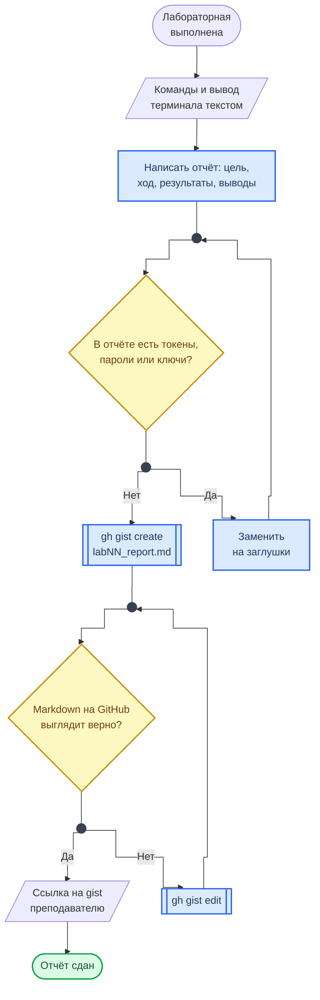

<div align="center">
<h1><a id="intro">Руководство по оформлению отчётов gistup</a><br></h1>


</div>

***

Каждая лабораторная работа сдаётся в виде отчёта `gistup` — GitHub Gist в формате Markdown. Данное руководство описывает формат, структуру и правила оформления.

***

## Что такое Gist

GitHub Gist — сервис для хранения фрагментов кода и заметок. Каждый Gist — мини-репозиторий с версионированием.

- **Public Gist** — виден всем, индексируется поисковиками
- **Secret Gist** — доступен только по прямой ссылке (не приватный, а скрытый)

> Для отчётов используем **Secret Gist** — отправляете ссылку преподавателю. Секретный гист открывается у любого, у кого есть ссылка: не публикуйте в отчёте токены, пароли и результаты сканирования чужих сетей.

## Цикл отчёта

Схема показывает путь отчёта от выполненной лабораторной до ссылки у преподавателя и две проверки, которые нельзя пропускать.



**Как читать схему:**

- Вход — команды и вывод терминала текстом: скриншоты вместо текста не принимаются.
- Первая проверка — на секреты. Секретный gist открывается у любого, у кого есть ссылка, поэтому токены, пароли и ключи заменяются заглушками до публикации, а не после.
- Вторая проверка — на рендер: незакрытый блок кода превращает весь остаток отчёта в один серый блок. Правки вносятся в тот же gist, ссылка при этом не меняется.
- Конец цикла — ссылка у преподавателя; по отчёту он задаёт вопросы, поэтому каждая команда должна быть вам понятна.

Обозначения — в материале [Как читать схемы курса](https://course.geminishkv.tech/materials/diagrams_legend/).

***

## Создание Gist

### Через веб-интерфейс

- [ ] 2.1. Перейдите на [gist.github.com](https://gist.github.com)
- [ ] 2.2. Имя файла: `lab01_report.md` (номер лабораторной)
- [ ] 2.3. Напишите отчёт в формате Markdown
- [ ] 2.4. Нажмите `Create secret gist`

### Через GitHub CLI

На Windows команды те же — в PowerShell или Git Bash после `winget install --id GitHub.cli -e`.

```bash
# Создание из файла
$ gh gist create lab01_report.md --desc "Lab 01: Git SCM"    # без --public гист создаётся секретным

# Создание из stdin
$ cat report.md | gh gist create --filename lab01_report.md --desc "Lab 01"

# Редактирование существующего
$ gh gist edit <GIST_ID>

# Просмотр своих гистов
$ gh gist list
```

***

## Структура отчёта

```markdown
# Лабораторная работа №X — Название

**Автор:** Фамилия Имя
**Группа:** ХХХХ-ХХ-ХХ
**Дата:** ГГГГ-ММ-ДД

***

## Цель работы

Краткое описание цели лабораторной работы (1-2 предложения).

***

## Ход выполнения

### Шаг 1. Название шага

Описание что было сделано и зачем.

Команда: блок кода с указанием языка (` ```bash `)

Вывод: блок кода без языка (` ``` `)

Пояснение: что означает вывод, какие флаги использованы и почему.

### Шаг 2. ...

***

## Результаты

- Что было достигнуто
- Какие инструменты использованы
- Какие проблемы возникли и как решены

***

## Выводы

Краткие выводы по работе (3-5 предложений).
```

***

## Правила оформления

### Команды и вывод

Каждая команда в отчёте должна содержать:

- **Саму команду** в блоке `` ```bash ``
- **Вывод** в блоке `` ``` `` (без подсветки)
- **Пояснение:** что делает команда, что означают флаги, что показывает вывод

```bash
# Пример правильного оформления
$ nmap -sV -p 22,80,443 192.168.1.1
```

```
Starting Nmap 7.94 ( https://nmap.org )
PORT    STATE SERVICE VERSION
22/tcp  open  ssh     OpenSSH 8.9p1
80/tcp  open  http    nginx 1.18.0
443/tcp open  https   nginx 1.18.0
```

> Флаг `-sV` определяет версии сервисов на открытых портах. `-p 22,80,443` сканирует только указанные порты. Результат: на хосте запущены SSH (OpenSSH 8.9) и веб-сервер nginx 1.18.0.

### Что НЕ делать

- Скриншоты вместо текста — **запрещено** (исключение: GUI-инструменты где текст невозможен)
- Команды без пояснений — каждый флаг должен быть описан
- Копипаст без понимания — преподаватель задаёт вопросы по отчёту

### Форматирование

- Используйте `inline code` для команд, путей, имён файлов в тексте
- Используйте **жирный** для ключевых терминов
- Используйте `> цитата` для важных замечаний
- Разделяйте секции через `***`

***

## Пример отчёта

Эталонный пример оформления:

<div class="lab-grid" style="grid-template-columns: repeat(auto-fill, minmax(min(14rem, 100%), 1fr));">
<a class="lab-card" href="https://gist.github.com/MishaBary/21ab63f83292a86268e039d484a86411" target="_blank"><div class="lab-card-body"><div class="lab-card-title">Пример gistup-отчёта</div><div class="lab-card-tags"><span class="lab-tag">gist.github.com</span><span class="lab-tag">Эталон</span></div></div><div class="lab-card-arrow">→</div></a>
</div>

***

## Отправка отчёта

- [ ] 6.1. Убедитесь, что Gist содержит все шаги лабораторной
- [ ] 6.2. Проверьте, что Markdown рендерится корректно (превью на GitHub)
- [ ] 6.3. Скопируйте ссылку на Gist
- [ ] 6.4. Отправьте ссылку преподавателю

***

## Troubleshooting

Если столкнулись с проблемами — смотрите [Troubleshooting](https://course.geminishkv.tech/materials/troubleshooting/).

***

## Links

<div class="lab-grid" style="grid-template-columns: repeat(auto-fill, minmax(min(14rem, 100%), 1fr));">
<a class="lab-card" href="https://gist.github.com" target="_blank"><div class="lab-card-body"><div class="lab-card-title">GitHub Gist</div><div class="lab-card-tags"><span class="lab-tag">gist.github.com</span></div></div><div class="lab-card-arrow">→</div></a>
<a class="lab-card" href="https://docs.github.com/en/get-started/writing-on-github/editing-and-sharing-content-with-gists" target="_blank"><div class="lab-card-body"><div class="lab-card-title">GitHub Gist Documentation</div><div class="lab-card-tags"><span class="lab-tag">docs.github.com</span></div></div><div class="lab-card-arrow">→</div></a>
<a class="lab-card" href="https://www.markdownguide.org/" target="_blank"><div class="lab-card-body"><div class="lab-card-title">Markdown Guide</div><div class="lab-card-tags"><span class="lab-tag">markdownguide.org</span></div></div><div class="lab-card-arrow">→</div></a>
<a class="lab-card" href="https://cli.github.com/manual/gh_gist" target="_blank"><div class="lab-card-body"><div class="lab-card-title">gh gist CLI reference</div><div class="lab-card-tags"><span class="lab-tag">cli.github.com</span></div></div><div class="lab-card-arrow">→</div></a>
</div>
