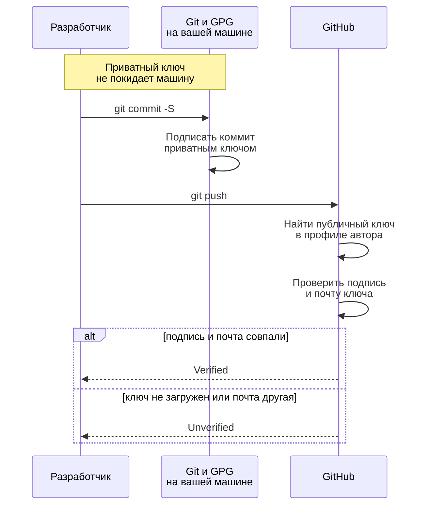

<div align="center">
<h1><a id="intro">Настройка Git, GPG и GitHub CLI</a><br></h1>


</div>

***

Данное руководство описывает настройку Git, SSH-ключей, GnuPG для подписания коммитов и GitHub CLI. Выполняется один раз перед началом лабораторных работ.

***

***

## Порядок настройки

Схема показывает, в каком порядке настраиваются доступ и подпись и чем проверяется каждый этап.

```mermaid
%%{init: {"flowchart": {"curve": "step"}}}%%
flowchart TB
    accTitle: Порядок настройки Git, SSH и GPG
    accDescr: Сначала задаются имя и почта, затем создаётся SSH-ключ и проверяется вход на GitHub, после этого создаётся GPG-ключ, включается автоподпись и проверяется, что тестовый коммит подписан; каждая проверка при неудаче возвращает на шаг назад.

    setup_start(["Git и GitHub CLI<br/>установлены"])
    set_identity["Задать user.name<br/>и user.email"]

    subgraph ssh_stage ["Доступ: SSH-ключ"]
        direction TB
        ssh_join((" "))
        create_ssh["Создать ключ ed25519,<br/>добавить на GitHub"]
        test_ssh[["ssh -T git@github.com"]]
        ssh_ok{"Ответ<br/>Hi username?"}
        ssh_fork((" "))
        ssh_join --> create_ssh
        create_ssh --> test_ssh
        test_ssh --> ssh_ok
        ssh_ok --- ssh_fork
        ssh_fork -->|Нет| ssh_join
    end

    subgraph gpg_stage ["Авторство: GPG-ключ"]
        direction TB
        gpg_join((" "))
        create_gpg["Создать GPG-ключ,<br/>добавить на GitHub"]
        enable_sign["Указать signingkey,<br/>включить gpgsign"]
        test_sign[["git log<br/>--show-signature -1"]]
        sign_ok{"Подпись<br/>корректна?"}
        sign_fork((" "))
        gpg_join --> create_gpg
        create_gpg --> enable_sign
        enable_sign --> test_sign
        test_sign --> sign_ok
        sign_ok --- sign_fork
        sign_fork -->|Нет| gpg_join
    end

    setup_done(["Коммиты подписаны,<br/>push работает"])

    setup_start --> set_identity
    set_identity --> ssh_join
    ssh_fork -->|Да| gpg_join
    sign_fork -->|Да| setup_done

    classDef junction fill:#374151,stroke:#374151,stroke-width:1px,color:#374151,font-size:1px
    classDef stage fill:#dbeafe,stroke:#2563eb,stroke-width:2px,color:#1e3a5f
    classDef gate fill:#fef9c3,stroke:#ca8a04,stroke-width:2px,color:#713f12
    classDef done fill:#dcfce7,stroke:#16a34a,stroke-width:2px,color:#14532d

    class ssh_join,ssh_fork,gpg_join,sign_fork junction
    class set_identity,create_ssh,test_ssh,create_gpg,enable_sign,test_sign stage
    class ssh_ok,sign_ok gate
    class setup_done done
```



**Как читать схему:**

- Две рамки — две разные задачи. SSH-ключ отвечает за доступ: без него не пройдёт `push`. GPG-ключ отвечает за авторство: без него коммит примут, но без отметки Verified.
- У каждой рамки своя проверка: `ssh -T` для доступа и `git log --show-signature` для подписи. При отрицательном ответе этап повторяется, дальше идти бессмысленно.
- Порядок важен: автоподпись включается только после создания GPG-ключа, иначе каждый коммит будет падать с ошибкой подписи.

Обозначения — в материале [Как читать схемы курса](https://course.geminishkv.tech/materials/diagrams_legend/).

## Конфигурация Git

Git config работает на трёх уровнях:

- `--local` — только для текущего репозитория, файл `.git/config`
- `--global` — для пользователя, файл `~/.gitconfig`
- `--system` — для всех пользователей, `/etc/gitconfig`

```bash
$ git config --global user.name "Ваше Имя"
$ git config --global user.email "email@example.com"
$ git config --global core.editor "vim"                    # или nano
$ git config --global alias.co checkout                    # git co вместо git checkout
$ git config --global help.autocorrect prompt              # автозамена при опечатке
$ git config --global core.autocrlf input                  # Linux/macOS; на Windows — true
$ git config --global credential.helper cache              # кэш учётных данных (15 мин)
```

> Автоподпись коммитов (`commit.gpgsign true`) включается в разделе GnuPG, после создания ключа: без ключа каждый коммит будет падать с ошибкой подписи.

Полезные команды:

```bash
$ git config --list --show-origin                          # все настройки и файл, откуда они взяты
$ git config user.name                                     # показать конкретную
$ git config --global --edit                               # открыть конфиг в редакторе
$ git config --global --unset user.email                   # удалить настройку
```

***

## Установка Git и GitHub CLI

```bash
# Ubuntu / Debian
$ sudo apt install -y git
$ curl -fsSL https://cli.github.com/packages/githubcli-archive-keyring.gpg | sudo dd of=/usr/share/keyrings/githubcli-archive-keyring.gpg
$ echo "deb [arch=$(dpkg --print-architecture) signed-by=/usr/share/keyrings/githubcli-archive-keyring.gpg] https://cli.github.com/packages stable main" | sudo tee /etc/apt/sources.list.d/github-cli.list > /dev/null
$ sudo apt update && sudo apt install gh -y

# Fedora
$ sudo dnf install -y git gh

# macOS
$ brew install git gh
```

### Windows

```powershell
PS> winget install --id Git.Git -e         # Git for Windows: git, Git Bash, OpenSSH
PS> winget install --id GitHub.cli -e      # gh
PS> git --version; gh --version
```

- Переводы строк: `git config --global core.autocrlf true` на Windows, `input` внутри WSL2 — иначе каждый файл будет «изменён» из-за CRLF.
- SSH-агент — служба Windows: `Get-Service ssh-agent | Set-Service -StartupType Automatic; Start-Service ssh-agent; ssh-add $HOME\.ssh\id_ed25519`.
- GnuPG: `winget install --id GnuPG.Gpg4win -e`, затем `git config --global gpg.program "C:\Program Files (x86)\GnuPG\bin\gpg.exe"`; ключи создаются так же, как в разделе ниже.
- Работать удобнее из Git Bash или Windows Terminal; в WSL2 применимы инструкции для Ubuntu целиком.

Авторизация:

```bash
$ gh auth login                                            # интерактивная авторизация
$ gh auth status                                           # проверка
```

***

## SSH-ключ для GitHub

```bash
$ ssh-keygen -t ed25519 -C "email@example.com"             # генерация ключа
$ eval "$(ssh-agent -s)"                                   # запуск агента
$ ssh-add ~/.ssh/id_ed25519                                # добавление ключа в агент
$ cat ~/.ssh/id_ed25519.pub                                # скопировать публичный ключ
```

Добавить ключ в GitHub: `Settings → SSH and GPG keys → New SSH key` → вставить содержимое `.pub`

Проверка:

```bash
$ ssh -T git@github.com                                    # ожидается: "Hi username!"
```

***

## GnuPG для подписания коммитов

GPG-подпись подтверждает авторство коммита. GitHub показывает зелёный бейдж `Verified`.

### Откуда берётся Verified

Схема показывает, что происходит с подписью между вашим терминалом и страницей коммита на GitHub.



**Как читать схему:**

- Подписывает коммит ваш компьютер приватным ключом, GitHub только проверяет подпись публичным ключом из вашего профиля. Приватный ключ никуда не отправляется.
- Проверок две: сама подпись и совпадение почты в ключе с подтверждённой почтой аккаунта. Частая причина Unverified — почта в `user.email` не та, что в ключе.
- Имя и почту в `git config` может вписать кто угодно — Git их не проверяет. Подпись — единственное, что связывает коммит с владельцем ключа.

Обозначения — в материале [Как читать схемы курса](https://course.geminishkv.tech/materials/diagrams_legend/).


```bash
$ gpg --full-generate-key                                  # создание ключа (RSA 4096, срок — 1 год)
$ gpg --list-secret-keys --keyid-format=long               # список ключей
```

Вывод покажет строку вида `sec rsa4096/ABCDEF1234567890` — `ABCDEF1234567890` это ваш KEY ID.

```bash
$ gpg --armor --export ABCDEF1234567890                    # экспорт публичного ключа
```

Скопируйте вывод (от `-----BEGIN PGP PUBLIC KEY BLOCK-----` до `-----END`) и добавьте в GitHub: `Settings → SSH and GPG keys → New GPG key`

Настройка Git:

```bash
$ git config --global user.signingkey ABCDEF1234567890     # указать ключ
$ git config --global commit.gpgsign true                  # автоподпись коммитов
$ git config --global tag.gpgSign true                     # автоподпись тегов
```

Коммит с подписью:

```bash
$ git commit -S -m "feat: signed commit"                   # -S для явной подписи
$ git log --show-signature -1                              # проверка подписи
```

> **smimesign** — альтернатива GPG для подписания коммитов через X.509 сертификаты (корпоративные PKI). Используется в организациях с существующей PKI-инфраструктурой вместо GPG.

***

## Установка zsh (опционально)

```bash
# Ubuntu / Debian
$ sudo apt install zsh -y

# macOS
$ brew install zsh

# Проверка
$ zsh --version

# Сделать дефолтным
$ chsh -s $(which zsh)

# Oh My Zsh (опционально)
$ curl -fsSLo install-ohmyzsh.sh https://raw.githubusercontent.com/ohmyzsh/ohmyzsh/master/tools/install.sh
$ less install-ohmyzsh.sh    # скрипт с ветки master: прочитайте его перед запуском
$ sh install-ohmyzsh.sh
```

***

## Personal Access Token

Нужен для работы с Gist и API.

- [ ] Перейдите на [github.com/settings/tokens/new](https://github.com/settings/tokens/new)
- [ ] Выберите scope: `gist` и срок действия (`Expiration`): бессрочный токен не отзовётся сам, если утечёт
- [ ] Сгенерируйте и **сохраните токен в менеджере паролей** — он показывается только один раз. Не кладите его в файлы репозитория и в историю shell

***

## Troubleshooting

Если столкнулись с проблемами — смотрите [Troubleshooting](https://course.geminishkv.tech/materials/troubleshooting/).

***

## Links

<div class="lab-grid" style="grid-template-columns: repeat(auto-fill, minmax(min(14rem, 100%), 1fr));">
<a class="lab-card" href="https://git-scm.com/book/ru/v2" target="_blank"><div class="lab-card-body"><div class="lab-card-title">Pro Git Book</div><div class="lab-card-tags"><span class="lab-tag">git-scm.com</span></div></div><div class="lab-card-arrow">→</div></a>
<a class="lab-card" href="https://docs.github.com/en/authentication/connecting-to-github-with-ssh" target="_blank"><div class="lab-card-body"><div class="lab-card-title">GitHub SSH Key</div><div class="lab-card-tags"><span class="lab-tag">docs.github.com</span></div></div><div class="lab-card-arrow">→</div></a>
<a class="lab-card" href="https://cli.github.com" target="_blank"><div class="lab-card-body"><div class="lab-card-title">GitHub CLI</div><div class="lab-card-tags"><span class="lab-tag">cli.github.com</span></div></div><div class="lab-card-arrow">→</div></a>
<a class="lab-card" href="https://gnupg.org/" target="_blank"><div class="lab-card-body"><div class="lab-card-title">GnuPG</div><div class="lab-card-tags"><span class="lab-tag">gnupg.org</span></div></div><div class="lab-card-arrow">→</div></a>
<a class="lab-card" href="https://github.com/github/smimesign" target="_blank"><div class="lab-card-body"><div class="lab-card-title">smimesign (X.509)</div><div class="lab-card-tags"><span class="lab-tag">github.com</span></div></div><div class="lab-card-arrow">→</div></a>
</div>
