<div align="center">
<h1><a id="intro">Подготовка рабочего окружения</a><br></h1>


</div>

***

Данное руководство описывает установку Oracle VirtualBox и развёртывание Linux-машины для выполнения лабораторных работ по курсу AppSec.

> Если вы используете личное устройство с Linux/macOS — VirtualBox не обязателен. Убедитесь, что доступны: `git`, `docker`, `python3`, `nmap`.

***

***

## Путь к готовому окружению

Схема показывает весь путь руководства: что делается на хосте, что в VirtualBox, что уже внутри Linux и чем путь заканчивается.

```mermaid
%%{init: {"flowchart": {"curve": "step"}}}%%
flowchart TB
    accTitle: Путь к готовому окружению
    accDescr: На Windows сначала включается аппаратная виртуализация, затем ставится VirtualBox, создаётся и настраивается виртуальная машина, устанавливается Linux, внутри него ставятся инструменты курса; проверка версий в конце либо подтверждает готовность, либо отправляет в раздел Troubleshooting и обратно на проверку.

    need_linux(["Нужен Linux<br/>для лабораторных"])
    is_windows{"Хост —<br/>Windows?"}
    windows_fork((" "))
    enable_virt["Включить VT-x / AMD-V<br/>в UEFI"]
    host_join((" "))

    subgraph vm_stage ["Виртуальная машина"]
        direction TB
        install_vbox["Установить VirtualBox<br/>и Extension Pack"]
        iso_image[/"ISO-образ<br/>дистрибутива"/]
        create_vm["Создать и настроить ВМ:<br/>память, CPU, сеть NAT"]
        install_os["Установить ОС<br/>и извлечь ISO"]
        install_vbox --> iso_image
        iso_image --> create_vm
        create_vm --> install_os
    end

    subgraph linux_stage ["Внутри Linux"]
        direction TB
        update_system["Обновить систему,<br/>поставить инструменты"]
        docker_group["Добавить себя<br/>в группу docker"]
        install_gh["Установить<br/>GitHub CLI"]
        guest_additions["Guest Additions:<br/>буфер обмена, экран"]
        update_system --> docker_group
        docker_group --> install_gh
        install_gh --> guest_additions
    end

    check_join((" "))
    run_checks[["Команды проверки<br/>из раздела 8"]]
    all_versions{"Все команды<br/>вернули версии?"}
    versions_fork((" "))
    fix_problem["Найти причину<br/>в Troubleshooting"]
    env_ready([Окружение готово])

    need_linux --> is_windows
    is_windows --- windows_fork
    windows_fork -->|Да| enable_virt
    windows_fork -->|Нет| host_join
    enable_virt --- host_join
    host_join --> vm_stage
    vm_stage --> linux_stage
    linux_stage --- check_join
    check_join --> run_checks
    run_checks --> all_versions
    all_versions --- versions_fork
    versions_fork -->|Да| env_ready
    versions_fork -->|Нет| fix_problem
    fix_problem --> check_join

    classDef junction fill:#374151,stroke:#374151,stroke-width:1px,color:#374151,font-size:1px
    classDef stage fill:#dbeafe,stroke:#2563eb,stroke-width:2px,color:#1e3a5f
    classDef gate fill:#fef9c3,stroke:#ca8a04,stroke-width:2px,color:#713f12
    classDef done fill:#dcfce7,stroke:#16a34a,stroke-width:2px,color:#14532d

    class windows_fork,host_join,check_join,versions_fork junction
    class enable_virt,install_vbox,create_vm,install_os,update_system,docker_group,install_gh,guest_additions,run_checks,fix_problem stage
    class is_windows,all_versions gate
    class env_ready done
```



**Как читать схему:**

- Две рамки — два места работы: сначала настраивается сама виртуальная машина, потом система внутри неё. Номера разделов ниже идут в том же порядке.
- Развилка в начале касается только Windows: без включённой аппаратной виртуализации ВМ либо не запустится, либо будет работать в разы медленнее.
- Конец пути — не «установил», а «проверил»: раздел 8 с командами проверки. Если хоть одна команда не вернула версию, причина ищется в Troubleshooting, и проверка повторяется.
- WSL2 — отдельный короткий путь для Windows, на схеме его нет; ограничения WSL2 для Лаб. 03 описаны в разделе «Windows: что учесть».

Обозначения — в материале [Как читать схемы курса](https://course.geminishkv.tech/materials/diagrams_legend/).

## Скачивание и установка VirtualBox

- [ ] 1.1. Перейдите на [virtualbox.org/wiki/Downloads](https://www.virtualbox.org/wiki/Downloads)
- [ ] 1.2. Скачайте установщик для вашей ОС:
    - **Windows:** `VirtualBox-x.x.x-Win.exe`
    - **macOS (Intel):** `VirtualBox-x.x.x-macOS-amd64.dmg`
    - **macOS (Apple Silicon):** `VirtualBox-x.x.x-macOS-arm64.dmg` (требуется VirtualBox 7.1+; гостевая ОС тоже нужна в сборке arm64, x86-образы не запустятся)
    - **Linux:** пакет `.deb` или `.rpm` для вашего дистрибутива
- [ ] 1.3. Установите VirtualBox, следуя инструкциям установщика
- [ ] 1.4. Скачайте **Extension Pack** с той же страницы и установите его через `VirtualBox → Настройки → Плагины`

> Extension Pack добавляет USB 2.0/3.0, шифрование дисков и доступ по RDP. Для лабораторных курса он не обязателен. Лицензия PUEL разрешает личное и учебное использование, в компании нужна платная лицензия Oracle.

***

## Windows: что учесть

- [ ] Включите аппаратную виртуализацию в UEFI/BIOS (Intel VT-x / AMD-V). Проверка: `Диспетчер задач → Производительность → ЦП → Виртуализация: включено`
- [ ] Установка через `winget` (PowerShell от имени пользователя):

```powershell
PS> winget install --id Oracle.VirtualBox -e
```

- [ ] VirtualBox 7.x работает вместе с Hyper-V и WSL2, но заметно медленнее. Если ВМ тормозит — либо отключите Hyper-V (`bcdedit /set hypervisorlaunchtype off`, перезагрузка), либо используйте вариант ниже
- [ ] Антивирус может блокировать установку драйвера VirtualBox: добавьте исключение для `C:\Program Files\Oracle\VirtualBox`

### Альтернатива: WSL2 вместо виртуальной машины

Для большинства лабораторных достаточно Ubuntu в WSL2 — все команды курса для Linux применимы без изменений:

```powershell
PS> wsl --install -d Ubuntu          # включает WSL2 и ставит Ubuntu, нужна перезагрузка
PS> wsl --status
```

Ограничения, из-за которых для Лаб. 03 (Nmap) всё же удобнее полноценная ВМ:

- сеть WSL2 по умолчанию за NAT: сканировать локальную сеть с хоста не выйдет, нужен режим `networkingMode=mirrored` в `%UserProfile%\.wslconfig` (Windows 11 22H2+);
- SYN-сканирование требует `sudo` внутри WSL, а Guest Additions и снапшоты недоступны.

Docker в WSL2 работает штатно (см. [Основы Docker](https://course.geminishkv.tech/materials/guides/docker_basics/)).

***

## Выбор и скачивание образа ОС

Рекомендуемые дистрибутивы (любой на выбор):

<div class="lab-grid" style="grid-template-columns: repeat(auto-fill, minmax(min(14rem, 100%), 1fr));">
  <a class="lab-card" href="https://ubuntu.com/download/desktop" target="_blank"><div class="lab-card-body"><div class="lab-card-title">Ubuntu 24.04 LTS Desktop</div><div class="lab-card-tags"><span class="lab-tag">Рекомендуется</span><span class="lab-tag">GUI</span><span class="lab-tag">apt</span></div></div><div class="lab-card-arrow">→</div></a>
  <a class="lab-card" href="https://ubuntu.com/download/server" target="_blank"><div class="lab-card-body"><div class="lab-card-title">Ubuntu 24.04 LTS Server</div><div class="lab-card-tags"><span class="lab-tag">Без GUI</span><span class="lab-tag">Минимальный</span><span class="lab-tag">apt</span></div></div><div class="lab-card-arrow">→</div></a>
  <a class="lab-card" href="https://fedoraproject.org/workstation/" target="_blank"><div class="lab-card-body"><div class="lab-card-title">Fedora Workstation 41</div><div class="lab-card-tags"><span class="lab-tag">Актуальные пакеты</span><span class="lab-tag">dnf</span></div></div><div class="lab-card-arrow">→</div></a>
  <a class="lab-card" href="https://www.freebsd.org/where/" target="_blank"><div class="lab-card-body"><div class="lab-card-title">FreeBSD 14</div><div class="lab-card-tags"><span class="lab-tag">Продвинутый</span><span class="lab-tag">pkg</span></div></div><div class="lab-card-arrow">→</div></a>
</div>

- [ ] 2.1. Скачайте ISO-образ выбранного дистрибутива

***

## Создание виртуальной машины

- [ ] 3.1. Откройте VirtualBox → `Создать` (Machine → New)
- [ ] 3.2. Заполните параметры:
    - **Имя:** `appsec-lab` (любое понятное название)
    - **Тип:** `Linux`
    - **Версия:** `Ubuntu (64-bit)` / `Fedora (64-bit)` — в зависимости от выбранного дистрибутива
    - **Оперативная память:** `4096 MB` (минимум 2048, не более 50% RAM хост-машины)
    - **Процессоры:** `2 CPU` (минимум 1, не более 50% ядер хост-машины)
    - **Жёсткий диск:** `25 GB` (минимум 20, динамический VDI — занимает место по мере заполнения)
- [ ] 3.3. Нажмите `Создать`

***

## Настройка виртуальной машины

Перед первым запуском настройте VM:

- [ ] 4.1. **Система → Материнская плата:**
    - Порядок загрузки: `Оптический диск` первым, затем `Жёсткий диск`
    - Включить `EFI` (для Ubuntu 24.04)
- [ ] 4.2. **Система → Процессор:**
    - Включить `PAE/NX`
    - Вложенная виртуализация (`Nested VT-x/AMD-V`) для Docker внутри VM не нужна: контейнеры используют ядро гостевой ОС. Включайте её, только если внутри VM будете запускать другие гипервизоры
- [ ] 4.3. **Дисплей:**
    - Видеопамять: `128 MB`
    - Графический контроллер: `VMSVGA`
- [ ] 4.4. **Носители:**
    - Нажмите на пустой диск → иконка диска справа → `Выбрать файл` → укажите скачанный ISO
- [ ] 4.5. **Сеть:**
    - Адаптер 1: `NAT` (доступ в интернет)
    - Для лабораторной с Nmap (Лаб. 03): добавьте Адаптер 2 → `Внутренняя сеть` или `Виртуальный адаптер хоста`

***

## Установка ОС

- [ ] 5.1. Запустите VM → загрузится с ISO
- [ ] 5.2. Следуйте стандартному установщику:
    - Язык: English (рекомендуется для совместимости с инструментами)
    - Разметка диска: `Erase disk and install` (для VM безопасно)
    - Имя пользователя и пароль — запомните, понадобятся для `sudo`
- [ ] 5.3. После установки — перезагрузите VM
- [ ] 5.4. Извлеките ISO: `Устройства → Оптические диски → Извлечь диск`

***

## Первичная настройка после установки

- [ ] 6.1. Обновите систему:

```bash
# Ubuntu / Debian
$ sudo apt update && sudo apt upgrade -y

# Fedora
$ sudo dnf update -y
```

- [ ] 6.2. Установите базовые инструменты:

```bash
# Ubuntu / Debian
$ sudo apt install -y git curl wget tree vim nano htop net-tools acl plocate \
    python3 python3-pip python3-venv pipx \
    docker.io docker-buildx docker-compose-v2 nmap

# Fedora
$ sudo dnf install -y git curl wget tree vim nano htop net-tools \
    python3 python3-pip \
    docker docker-compose nmap
```

- [ ] 6.3. Добавьте пользователя в группу Docker (без sudo):

```bash
$ sudo usermod -aG docker $USER
$ newgrp docker
$ docker run hello-world  # проверка
```

- [ ] 6.4. Установите GitHub CLI:

```bash
# Ubuntu / Debian
$ curl -fsSL https://cli.github.com/packages/githubcli-archive-keyring.gpg | sudo dd of=/usr/share/keyrings/githubcli-archive-keyring.gpg
$ echo "deb [arch=$(dpkg --print-architecture) signed-by=/usr/share/keyrings/githubcli-archive-keyring.gpg] https://cli.github.com/packages stable main" | sudo tee /etc/apt/sources.list.d/github-cli.list > /dev/null
$ sudo apt update && sudo apt install gh -y

# Fedora
$ sudo dnf install gh -y
```

- [ ] 6.5. (Опционально) Установите `zsh` и `oh-my-zsh`:

```bash
$ sudo apt install zsh -y   # или sudo dnf install zsh
$ chsh -s $(which zsh)
$ curl -fsSLo install-ohmyzsh.sh https://raw.githubusercontent.com/ohmyzsh/ohmyzsh/master/tools/install.sh
$ less install-ohmyzsh.sh    # скрипт с ветки master: прочитайте его перед запуском
$ sh install-ohmyzsh.sh
```

***

## Установка Guest Additions (для удобства)

Guest Additions добавляют: общий буфер обмена, drag & drop, автоматическое масштабирование экрана, общие папки.

- [ ] 7.1. В меню VM: `Устройства → Подключить образ диска Дополнений гостевой ОС`
- [ ] 7.2. Установите:

```bash
$ sudo apt install -y build-essential dkms linux-headers-$(uname -r)  # зависимости
$ sudo mount /dev/cdrom /mnt
$ sudo /mnt/VBoxLinuxAdditions.run
$ sudo reboot
```

- [ ] 7.3. После перезагрузки включите: `Устройства → Общий буфер обмена → Двунаправленный`

***

## Проверка готовности

- [ ] 8.1. Проверьте, что всё установлено:

```bash
$ git --version
$ python3 --version
$ docker --version
$ nmap --version
$ gh --version
```

- [ ] 8.2. Если все команды возвращают версии — окружение готово к лабораторным работам.

***

## Рекомендации по ресурсам

<div class="lab-grid" style="grid-template-columns: repeat(auto-fill, minmax(min(11rem, 100%), 1fr));">
  <div class="lab-card" style="flex-direction: column; align-items: flex-start; gap: 0.4rem;">
  <div class="lab-card-title" style="font-weight:700;">8 GB RAM</div>
  <div class="lab-card-tags"><span class="lab-tag">VM: 2-3 GB</span><span class="lab-tag">2 CPU</span><span class="lab-tag">20 GB диск</span></div>
  </div>
  <div class="lab-card" style="flex-direction: column; align-items: flex-start; gap: 0.4rem;">
  <div class="lab-card-title" style="font-weight:700;">16 GB RAM</div>
  <div class="lab-card-tags"><span class="lab-tag">VM: 4-6 GB</span><span class="lab-tag">2-4 CPU</span><span class="lab-tag">25 GB диск</span></div>
  </div>
  <div class="lab-card" style="flex-direction: column; align-items: flex-start; gap: 0.4rem;">
  <div class="lab-card-title" style="font-weight:700;">32+ GB RAM</div>
  <div class="lab-card-tags"><span class="lab-tag">VM: 8 GB</span><span class="lab-tag">4 CPU</span><span class="lab-tag">40 GB диск</span></div>
  </div>
</div>

> Не выделяйте VM более 50% ресурсов хост-машины — иначе хост будет тормозить.

***

## Troubleshooting

Если столкнулись с проблемами — смотрите [Troubleshooting](https://course.geminishkv.tech/materials/troubleshooting/).

***

## Links

<div class="lab-grid" style="grid-template-columns: repeat(auto-fill, minmax(min(14rem, 100%), 1fr));">
<a class="lab-card" href="https://www.virtualbox.org/manual/" target="_blank"><div class="lab-card-body"><div class="lab-card-title">VirtualBox Documentation</div><div class="lab-card-tags"><span class="lab-tag">virtualbox.org</span></div></div><div class="lab-card-arrow">→</div></a>
<a class="lab-card" href="https://ubuntu.com/tutorials/install-ubuntu-desktop" target="_blank"><div class="lab-card-body"><div class="lab-card-title">Ubuntu Installation Guide</div><div class="lab-card-tags"><span class="lab-tag">ubuntu.com</span></div></div><div class="lab-card-arrow">→</div></a>
<a class="lab-card" href="https://docs.fedoraproject.org/en-US/fedora/latest/install-guide/" target="_blank"><div class="lab-card-body"><div class="lab-card-title">Fedora Installation Guide</div><div class="lab-card-tags"><span class="lab-tag">docs.fedoraproject.org</span></div></div><div class="lab-card-arrow">→</div></a>
<a class="lab-card" href="https://docs.docker.com/engine/install/" target="_blank"><div class="lab-card-body"><div class="lab-card-title">Docker Engine Installation</div><div class="lab-card-tags"><span class="lab-tag">docs.docker.com</span></div></div><div class="lab-card-arrow">→</div></a>
<a class="lab-card" href="https://github.com/cli/cli#installation" target="_blank"><div class="lab-card-body"><div class="lab-card-title">GitHub CLI Installation</div><div class="lab-card-tags"><span class="lab-tag">github.com</span></div></div><div class="lab-card-arrow">→</div></a>
</div>
